# 可变塔

> 原文：<https://www.educba.com/ansible-tower/>

## Ansible Tower 简介

Ansible Tower 是 RedHat 为 Ansible 提供的企业解决方案。它有一个 web 控制台和 REST API 来跨我们的团队、组织和企业操作 Ansible。它还提供基于角色的访问控制、作业调度、集成通知和图形化库存管理。它是我们所有自动化任务的集中枢纽。使用 REST API 和 CLI，它可以很容易地与第三方工具和流程集成。

### 我们为什么需要 Ansible 中的塔？

管理大型基础设施变得非常困难。不同的用户和组需要不同的访问级别来使用 Ansible。此外，我们必须将这些工具与其他第三方工具集成，以根据定义的标准操作 IT 基础架构，如与用于 Ansible playbook 的 SCM 工具集成，与票务工具集成以在任何任务失败时创建票证，或通过邮件或使用消息应用程序通知用户，等等。我们还需要一个审计线索，以便正确跟踪谁在何时运行了什么任务。还有一点更重要的是产品支持。这些功能在 Ansible 中没有，只能通过 Ansible Tower 实现。

<small>网页开发、编程语言、软件测试&其他</small>

### Ansible 塔的特点

以下是一些功能:

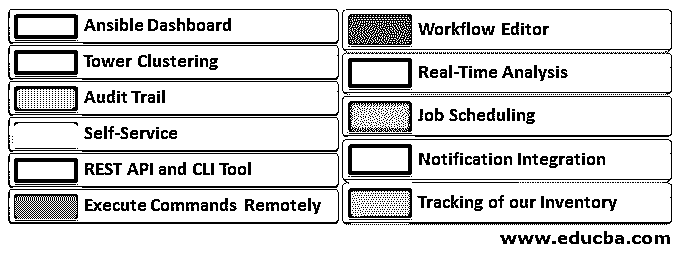

#### 1.可折叠仪表板

我们一登录 Ansible Tower web 控制台，就会看到一个 Ansible Dashboard。Ansible Dashboard 提供了作业状态的图形视图、最近作业运行的简要信息和模板。它还显示主机、故障主机、清单、项目等的数量。我们也可以根据自己的需要调整工作状态设置。

#### 2.工作流编辑器

Ansible Tower 提供了一个工作流编辑器，可以帮助我们连接多个行动手册、更新和工作流，即使它们作为不同的用户运行，或者它们使用不同的清单或使用不同的凭据。我们可以创建依赖性，例如运行一个行动手册取决于其他行动手册的成败。我们可以轻松地将不同团队创建和维护的不同剧本链接起来，以设置基本系统配置和部署应用程序。

#### 3.塔式集群

为了实现高可用性和更好的性能，我们必须有多个可用的塔式服务器。我们可以通过向其中添加多个 Ansible 塔节点来创建一个 Ansible 塔集群。我们可以根据需要轻松扩展我们的 Ansible automation，它还允许我们为团队、工作和远程执行预留容量，以便在整个企业中进行访问。Ansible Automation architecture 支持多达 20 万个节点和 20 个集群节点。

#### 4.实时分析

它提供了关于每个主机的可执行游戏和任务的完成、成功和失败的实时更新。我们可以看到自动化的状态以及接下来要运行的自动化。我们还可以看到源代码管理更新或客户端清单刷新的状态。

#### 5.审查跟踪

在一个组织中，最重要的是跟踪对应用程序所做的更改的日志，以便如果应用程序发生了不好的事情，我们可以检查日志并纠正错误的更改。Ansible Tower 记录对 Ansible 进行的任何更改的所有详细信息，例如谁进行了更改，对作业应用了哪些更改，或者更改是何时发生的。Ansible Tower 会跟踪对 Ansible Tower 本身所做的所有更改，例如工作创建详细信息、库存更改等。我们可以在 Ansible Tower web 控制台的活动流中看到此审计跟踪。它还可以与组织中使用的现有日志记录应用程序集成，以更好地分析自动化和事件相关性，从而在任何 ITSM 工具中生成 ticker。

#### 6.作业调度

我们可以使用 Ansible Tower 安排作业，在特定时间、每天、每周运行剧本、更新云清单以及源代码控制，Ansible 不具备此功能。我们还可以设置计划作业的频率。我们还可以将它与持续的交付管道集成在一起。

#### 7.自助服务

Ansible Tower 还提供自助服务功能，例如，我们可以向 L1 用户授予只读访问权限，以监视 Ansible 仪表板或运行简单的作业，如添加新用户、组、更改密码等。它还允许我们将控制权委托给开发人员和 QA 用户，让他们建立自己的开发和测试环境，并在没有 Ansible 管理员干预的情况下运行他们的工作。

#### 8.通知集成

我们可以将 Ansible Tower 与电子邮件、消息应用程序(如 Slack、HipChat 等)集成。、SMS、PagerDuty 等等来通知用户或团队作业的成功或失败。我们还可以集成 Ansible 工具，向自定义 webhook 发送通知，以触发我们基础架构中的其他工具，例如，如果任何作业失败，它将向任何 ITSM 工具发送通知，以创建作业失败事件。

#### 9.REST API 和 CLI 工具

我们可以使用 REST API 轻松地与 Ansible Tower 进行交互。它有助于将它与其他支持 REST API 的第三方工具轻松集成。如果我们想将其与任何可能使用 Ansible Tower 的 CLI 工具的命令工具集成。

#### 10.管理和跟踪我们的库存

我们可以使用 Ansible Tower 管理我们的整个基础设施库存，无论它托管在任何公共云平台上，如亚马逊网络服务、微软 Azure、GCP 等。或者托管在我们的私有云上，如 OpenStack、VMware 环境。它不断同步我们的云清单，我们也可以按需请求配置。

#### 11.远程执行命令

我们可以在清单中的任何主机或主机组上使用运行命令功能直接从 Ansible Tower 运行任务。这与在 Ansible 中运行临时命令是一样的。

### 让我们快速参观一下安西布尔塔

我们可以使用以下链接下载试用版:

[https://www . red hat . com/en/technologies/management/ansi ble/try-it](https://www.redhat.com/en/technologies/management/ansible/try-it)

下载后，在 Red Hat 或 CentOS 上安装试用版，检查要求，因为它取决于 Ansible Tower 版本。

1.下面是 Ansible Tower 的签到页面。输入您的凭证以登录 Ansible Tower。默认用户名是“admin”。

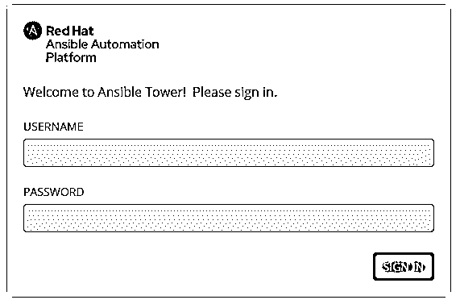

2.成功登录 Ansible Tower 后，您会看到以下仪表板:

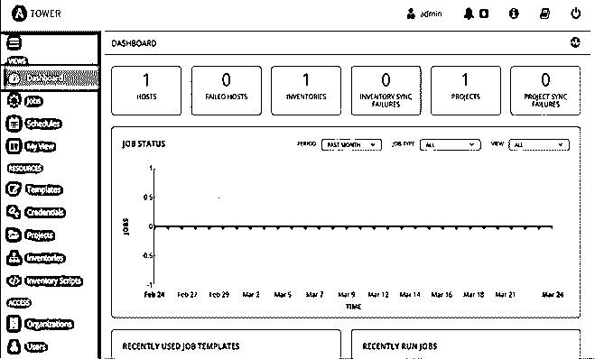

: Click on the bell icon for any notification such as job completion, failure, etc.

– Click on the ‘i’ button to get version information of the Ansible Tower.

– Takes to the online documentation page.

– I believe this is one is self-explanatory. Yes, click to sign out from Ansible Tower.

3.如果我们第一次登录 Ansible Tower，它会将我们带到许可证页面。为了使用该产品，我们需要试用许可证。我们通过邮件或联系 Ansible 支持团队获得它。获得许可文件后，您可以通过单击“浏览”按钮上传它。我们还可以使用 Red Hat 客户凭证登录并获得许可证。

4.上传或登录后，接受 EULA 并点击“提交”按钮。其他两个选项是可选的，取决于个人。

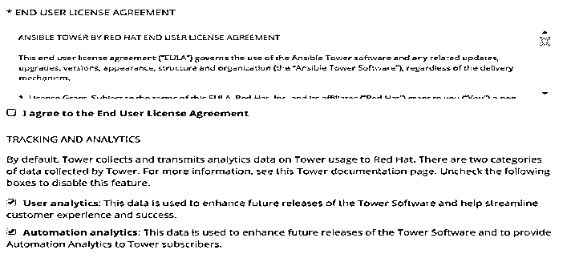

5.单击左侧窗格中的 Users，我们将获得所有用户的详细信息。下面是默认用户“admin”的快照，用户详细信息页面很容易理解，要获得有关用户的更多详细信息，请单击顶部的不同按钮，如“Organization”、“Teams”、“Permissions”和“Tokens”。完成更改后，单击保存按钮。

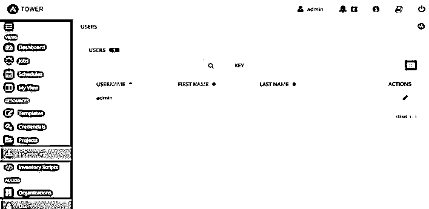

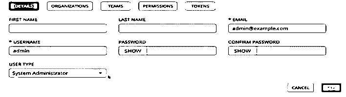

6.单击左侧窗格中的“Organization”选项卡，获取可用的组织并创建新的组织，我们有一个名为“default”的内置组织。

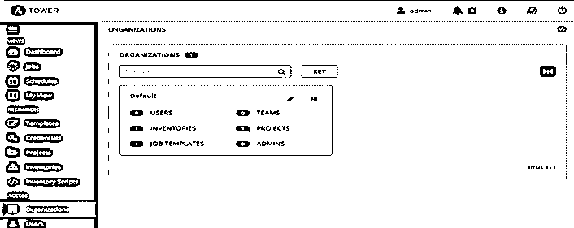

7.单击“默认”以获取有关“默认”组织的更多信息。见下文:–

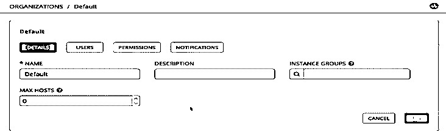

8.我们可以在安西布尔塔创建团队。点击“团队”获取可用团队，点击“+”按钮添加更多团队。

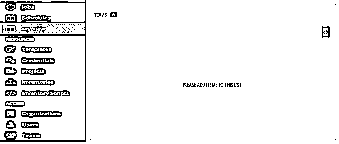

9.单击左侧面板中的“库存”按钮，获取现有库存或创建新库存。

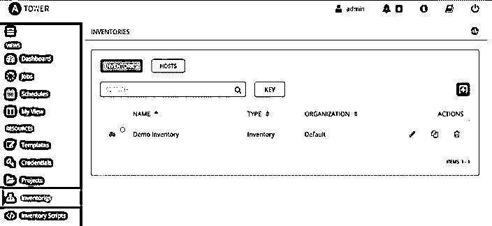

10.我们有默认库存'演示库存',如下所示，但是，我们主要是根据要求创建自己的库存。

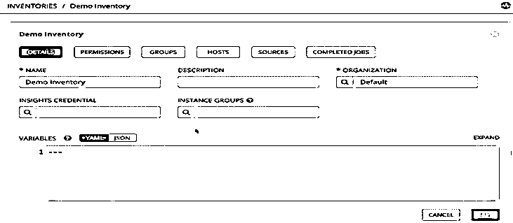

11.要创建新的库存，请单击左侧面板中的“库存”,我们会看到下面的页面，单击“+”按钮，然后选择库存:

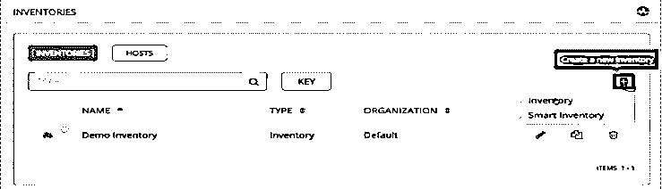

12.我们看到下面的页面，创建新的库存，填写不言自明的表格，然后单击保存:

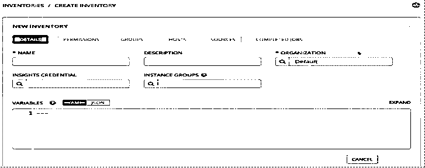

13.创建清单后，单击“主机”按钮创建新主机，并单击“+”图标创建新主机:

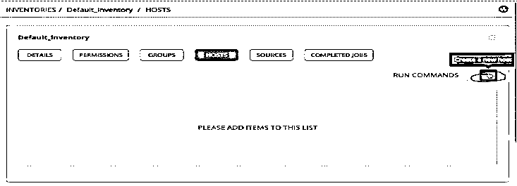

14.我们得到下面的页面，我们必须给出主机的名称和描述，描述是可选的。

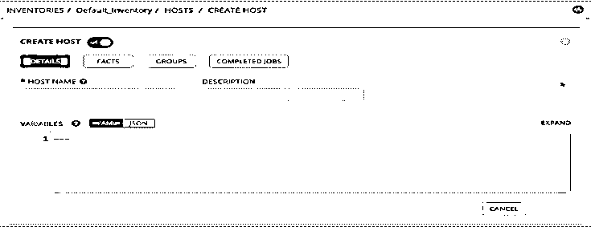

15.创建主机后，我们需要将主机添加到一个组中，因此单击“Groups”按钮，我们进入下面的页面，再次单击“+”按钮创建一个新组:

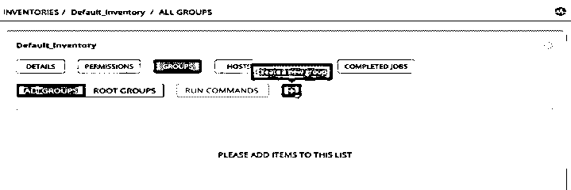

16.我们再次得到一个简单的表单来创建一个组，填写表单，然后单击 save:

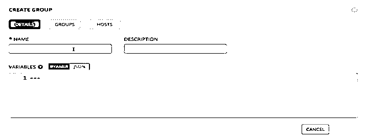

17.创建组后，单击“Hosts”按钮将主机添加到组中。我们只能从这里添加现有主机或创建新主机。我们将添加上面创建的现有主机。

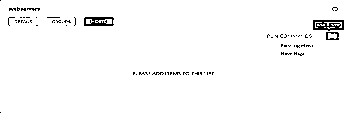

18.现在，我们需要添加主机的凭据来运行作业。单击“Credentials ”,这里我们也有默认凭据“Demo Credential ”,但是，我们可以通过单击“+”按钮创建新凭据:

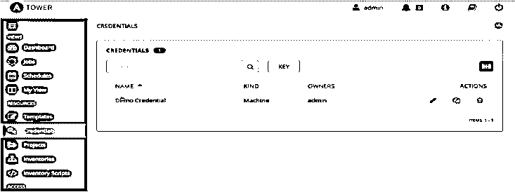

19.我们得到下面的页面来创建一个新的凭证。我们可以选择凭证类型，如“用户和密码”、“ssh 密钥”等。不管我们有什么凭证来连接主机。完成表格后，点击保存。

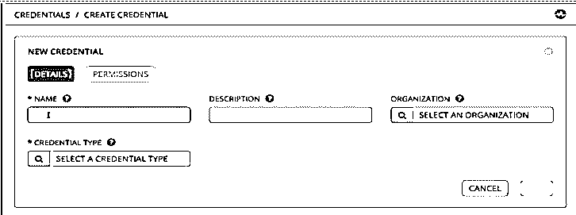

20.现在我们需要建立项目。单击左侧窗格中的“项目”,打开如下所示的项目页面，同样，我们有默认的“演示项目”,要创建一个新项目，请单击绿色的“+”按钮:

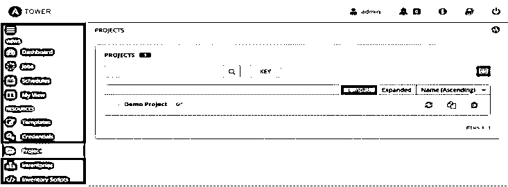

21.我们得到下面的页面来创建一个新项目，在 SCM 类型下，我们需要选择我们的剧本或角色所在的位置:

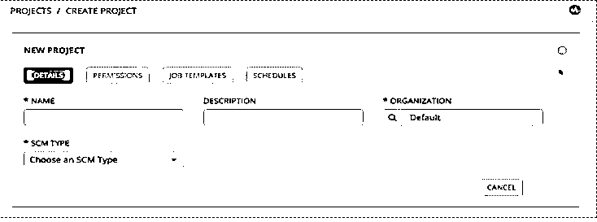

22.最后，创建一个作业模板并启动它，查看 Ansible Tower 的运行情况。点击左侧的“模板”,我们会看到下面的页面，这里有默认模板“演示作业模板”,它是在我们安装 Ansible Tower 时自动创建的。单击“+”按钮创建一个新的。

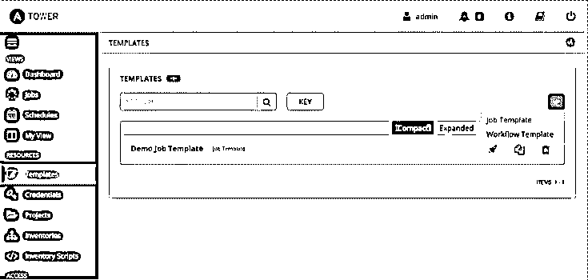

23.填写下表以创建模板，这里我们需要考虑带有“*”符号的必填字段。我们需要提供我们上面创建的细节，如使用哪个库存，选择项目等。填写完所有必填字段后，单击“启动”按钮启动您的模板。

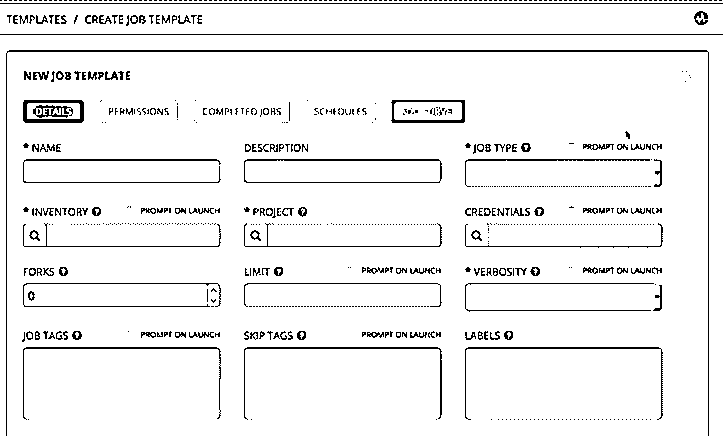

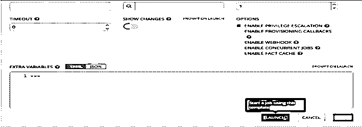

24.我们也可以返回并单击突出显示的启动按钮，如下所示:

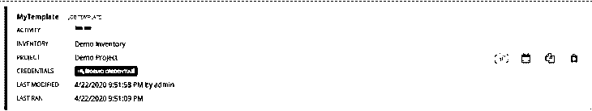

25.启动作业模板后，它向我们显示了作业的状态，如下所示:

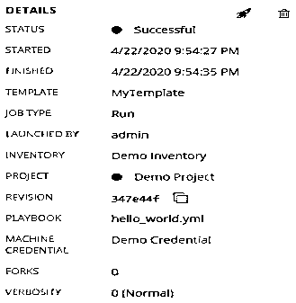

### 结论

Ansible Tower 是大中型组织进行配置管理和自动化的绝佳工具。Ansible Tower 有标准版和高级版。两者几乎相同，唯一的区别是我们在标准版中仅获得 8*5 企业支持，而在高级版中获得 24*7 高级支持。我们也可以免费试用 Ansible Tower，但它只支持 50 个节点。

### 推荐文章

这是安西布尔塔的指南。在这里，我们讨论简介和为什么我们需要塔在 Ansible 及其不同的功能，以及例子。您也可以浏览我们推荐的其他文章，了解更多信息——

1.  [可执行的命令](https://www.educba.com/ansible-commands/)
2.  [可行的架构](https://www.educba.com/ansible-architecture/)
3.  [Ansible 将用户添加到组](https://www.educba.com/ansible-add-user-to-group/)
4.  [可回答的处理程序](https://www.educba.com/ansible-handlers/)

