# 不稳定星系

> 原文：<https://www.educba.com/ansible-galaxy/>

## Ansible Galaxy 简介

Ansible Galaxy 是一个基于 web 的在线开源存储库，用于共享和查找 Ansible 内容，主要是角色和集合。这就好像我们创造了一些新的东西，希望与他人分享，上传到 Ansible Galaxy，或者如果我们有任何与 Ansible automation 相关的问题，或者希望其他人提供一个预打包的解决方案来快速启动我们的自动化项目，我们可以在 Ansible Galaxy 上找到它。它可能是角色、模块、插件或集合。已经有很多社区作者上传了他们的 Ansible 角色、集合等。

我们使用“ansible-galaxy”命令来完成任务，如从 galaxy 或任何 git SCM 安装角色，创建新角色，删除角色，或在 Galaxy 网站上执行任务。这个命令已经与 Ansible 捆绑在一起，所以我们可以在安装 Ansible 后立即使用它。银河项目是一个开源项目，所以我们可以托管我们的内部银河服务器。要使用内部银河服务器，我们需要用银河内部服务器的服务器地址覆盖 ansible.cfg 文件中的默认配置，因为默认情况下，它使用服务器地址[https://galaxy.ansible.com](https://galaxy.ansible.com)。

<small>网页开发、编程语言、软件测试&其他</small>

### 如何在 Ansible Galaxy 中使用角色或集合？

让我们研究一些角色:

#### 1.角色

我们使用“ansible-galaxy”命令从 galaxy 服务器安装角色，如下所示:

**代码:**

`ansible-galaxy install <role_name>`

**输出:**

`ansible-galaxy install singleplatform-eng.users`

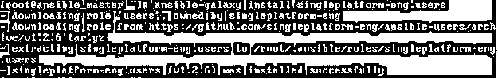

**解释:**在上面的例子中，它下载并安装了单一平台 eng 拥有的“用户”角色。ansible-galaxy '命令将角色安装到默认目录'/etc/ansible/roles '中，但是如果我们想要将角色安装到特定目录中，我们可以使用三种方法之一来完成。

第一种是在安装角色时使用–roles-path 选项，如下所示:

**代码:**

`ansible-galaxy install --roles-path <directory_path><role_name>`

**输出:**

`ansible-galaxy install --roles-path /ansible-roles singleplatform-eng.users`

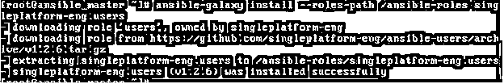

**解释:–**在上面的例子中，它将角色安装在/ansible-roles 目录中。如果目录不存在，那么它将由命令本身创建。我们可以多次安装相同的角色，每次使用不同的路径。

第二个是设置环境变量‘ansi ble _ ROLES _ PATH’。我们可以设置一个单独的目录路径或路径列表，但是它会将角色安装到第一个可写路径中。

**代码:**

`export ANSIBLE_ROLES_PATH=/anisble-roles
ansible-galaxy install singleplatform-eng.users`

**输出:**

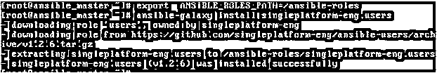

第三个是在 ansible.cfg 配置文件中设置‘roles _ path’。

ansible-galaxy 安装单一平台-工程用户

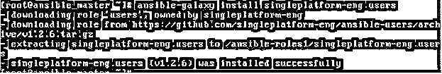

**解释:–**在上面的命令中，它将角色安装到配置文件中定义的目录中，但是，如果还定义了环境变量，那么它将优先。

如果需要安装任何角色的特定版本，我们可以在角色名称后使用逗号，如下所示:

**代码:**

`ansible-galaxy install <role_name>,<role_version>`

**输出:**

`ansible-galaxy install singleplatform-eng.users,v1.2.5`

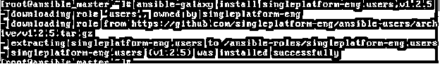

**说明:–**在上面的例子中，它按照命令中的指定下载 v1.2.5。如果不同版本的角色已经存在，请在安装角色的不同版本之前，使用–force 命令更改版本或删除旧角色。

我们可以使用“list”命令列出已安装的角色，如下所示:

**代码:**

`ansible-galaxy list`

**输出:**

**解释:–**在上面的例子中，它显示了在环境变量中定义的目录/ansible-roles 中安装的角色，roles-path 规则将以同样的方式应用于列出角色，我们甚至可以使用–roles-path 选项来显示安装在特定目录中的角色。

我们可以从一个 YAML 文件中安装多个角色。我们可以定义一个或多个属性，如 src、SCM、版本、名称等。

**代码:**

`cat role_file.yaml
#from galaxy
-src: singleplatform-eng.users`

**输出:**

`ansible-galaxy install -r role_file.yaml`

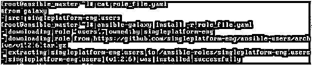

**解释:–**在上面的例子中，我们只定义了 src 并给出了角色的名称，这样它将在 galaxy 中登记并安装可用的角色。我们可以从 GitHub、Bitbucket 等其他来源安装角色。并指定其他属性，如版本、名称等。

**Note**: – We can also, install roles from multiple files using ‘include’ directive in the YAML file. It helps to split a large file into multiple smaller files for better management and reusability of the file.

我们可以使用 init 命令创建我们的角色，如下所示:

**代码:**

`ansible-galaxy init <role_name>`

**输出:**

`ansible-galaxy init my_role`

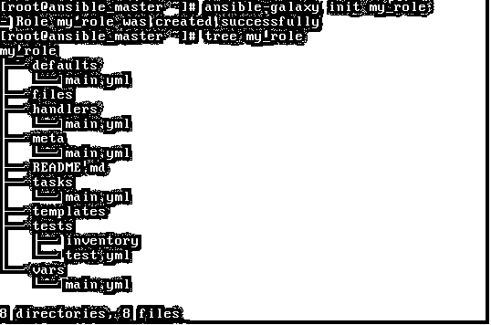

**解释:–**在上面的例子中，它创建了一个名为‘my _ role’的角色。它为我们的角色创建了一个文件夹结构。

我们上面讨论了一些基本命令，但是我们还可以对角色执行其他操作。我们可以使用下面的'–help '命令来了解更多信息:

**代码:**

`ansible-galaxy role --help`

**输出:**

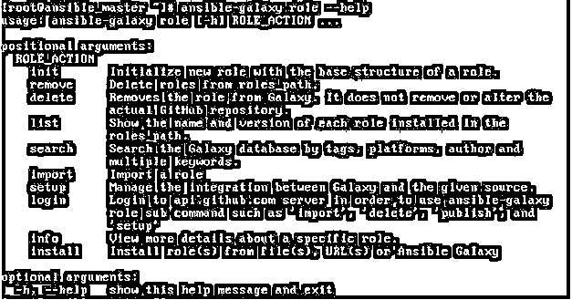

#### 2.收集

如果内部服务器没有在配置文件中定义，我们可以从 Galaxy 安装一个集合，如下所示。

**代码:**

`ansible-galaxy collection install <collection_name>`

**输出:**

`ansible-galaxy collection install newswangerd.collection_demo`

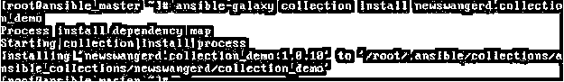

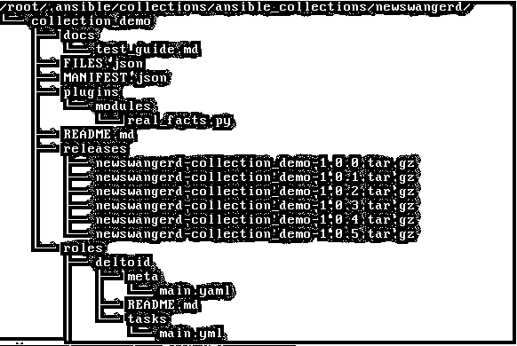

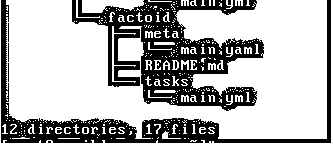

我们还可以使用“:==”安装特定版本的集合，如下所示:

**代码:**

`ansible-galaxy collection install <collection_name>:==<version>`

**输出:**

`ansible-galaxy collection installnewswangerd.collection_demo:==1.0.6`

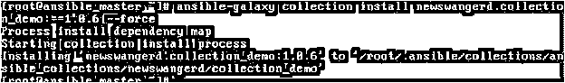

**解释:–**在上面的例子中，它安装了一个名为 newswangerd.collection_demo 的集合的 1.0.6 版本。如果集合已经存在，我们需要指定–force 选项来覆盖它。

我们甚至可以指定一个范围来安装该范围内的最新版本。详情请查阅官方文件。我们也可以使用 YAML 文件安装集合，并指定名称、版本、来源等指令。就像我们为角色做的那样。

**代码:**

`---
collections:
#with collection name and version options
- name: alikins.collection_inspect
version: ‘>0.0.9,<1.0.0’`

**输出:**

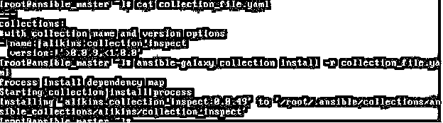

**解释:–**在上面的例子中，它使用一个 YAML 文件来安装集合，我们已经在版本指令中指定了范围。根据我们的产品系列，它将安装高于“0.0.9”且低于“1.0.0”的最新版本。如果我们在 Galaxy 网站上检查，它只有一个版本' 0.0.49 '在我们的范围内，所以它安装了那个版本。

我们可以用与创建角色相同的方式创建集合，如下所示:–

**代码:**

`ansible-galaxy collection init my_namespace.my_collection`

**输出:**

如果我们对任何命令有任何疑问，我们可以使用下面的'–help '或'-h '来了解有关命令的更多信息:

**代码:**

`ansible-galaxy collection -h`

**输出:**

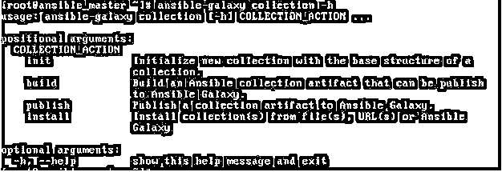

### 如何将角色或集合导入 Ansible Galaxy

1.转到 galaxy.ansible.com，单击下面快照中标记的登录:–

2.我们必须使用我们的 GitHub 帐户登录，所以在登录 Galaxy 之前，我们必须有一个 GitHub 帐户。点击“登录”按钮后，我们会看到下面的页面。

3.一旦我们点击上面的“GitHub”图标，它会将我们重定向到 Github 网站进行登录，然后我们会看到下面的页面:

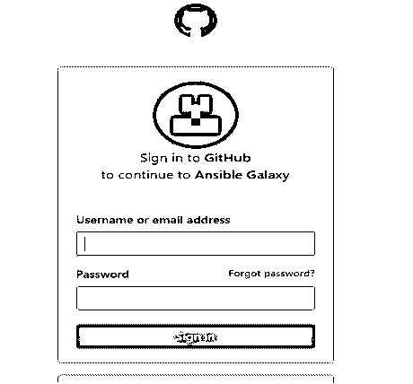

4.输入凭证后，单击“登录”按钮，它会将我们带到授权页面，一旦我们授权了 GitHub 帐户。它让我们登录到“Ansible Galaxy”网站，我们在左侧获得了“我的内容”和“我的导入”的附加选项，如下图所示:

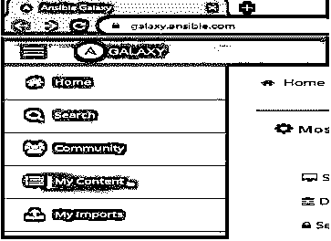

5.单击“我的内容”按钮后，我们进入以下页面，要导入我们的内容，请单击“添加内容”按钮，如下图所示:

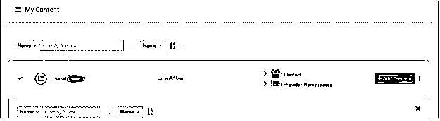

6.点击“添加内容”按钮后，我们会看到下面的页面。我们可以“从 GitHub 导入角色”或从本地计算机“上传新集合”。

7.一旦我们从 GitHub 中选择了角色或从我们的计算机中选择了文件，它将验证文件的约定。如果正确，我们将获得“确定”按钮来导入它，并在“我的导入”选项卡下获得文件，如下所示:

目前，它显示为“没有导入”，因为还没有文件上传。

### 如何在“Ansible Galaxy”上搜索角色或集合

1.一旦我们浏览到“galaxy.ansible.com ”,我们就会看到下面的页面，或者我们可以说下面是“Ansible Galaxy”网站的主页。我们可以点击主页上的任何热门类别，或者点击“搜索”按钮，以获得更多过滤器来进行精细搜索。

2.我们在“搜索…”文本中输入一个相关的关键字，然后按 enter 键，要缩小搜索结果的范围，请单击过滤器按钮，如下图所示:

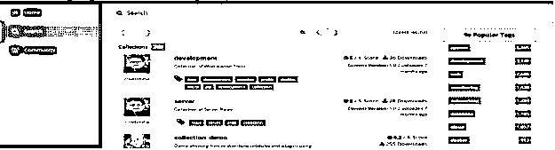

3.我们得到了类型、云平台、贡献者等过滤器。选择类型后，我们有另一个下拉菜单，我们可以在其中选择角色或集合等类型…我们还可以通过“最佳匹配”、“内容名称”、“下载次数”等来增加或减少输出。

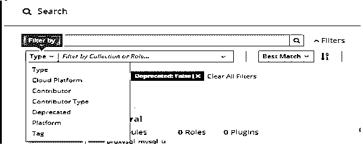

### 结论

Ansible galaxy 上有大约 20K 个社区作者，大约 24K 个角色和 281 个集合可用于快速启动我们的自动化项目。还有开发工作流程的开发人员指南和贡献者指南，介绍了如何为现有的“Ansible Galaxy”代码做出贡献，因为它是一个开源项目。它是一个集中的存储库，用于查找和共享可行的角色和集合。

### 推荐文章

这是一个可行的星系指南。这里我们讨论 Ansible Galaxy 的介绍，如何使用角色和集合，如何导入以及如何搜索。您也可以浏览我们的其他相关文章，了解更多信息——

1.  Ansible 是免费的吗？
2.  什么是 Ansible？
3.  [可执行的命令](https://www.educba.com/ansible-commands/)
4.  [Ansible 将用户添加到组](https://www.educba.com/ansible-add-user-to-group/)

