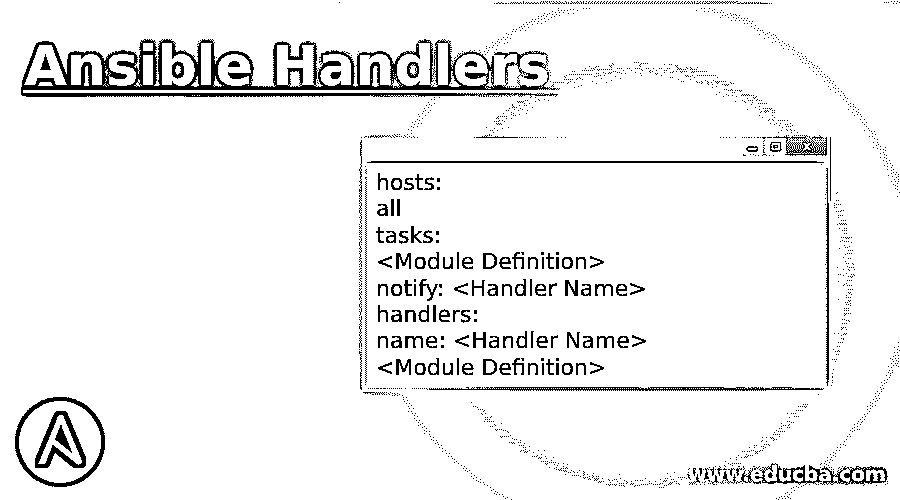
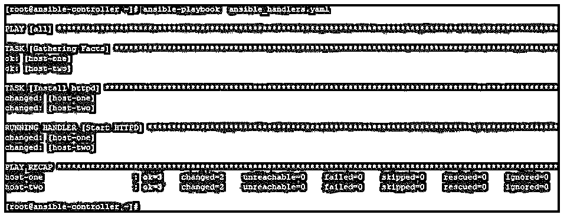
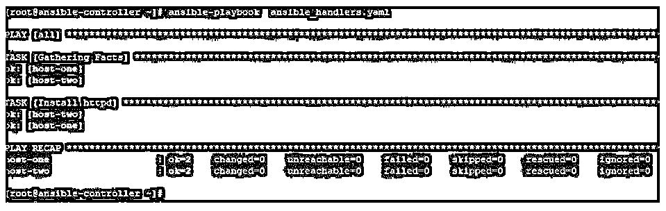
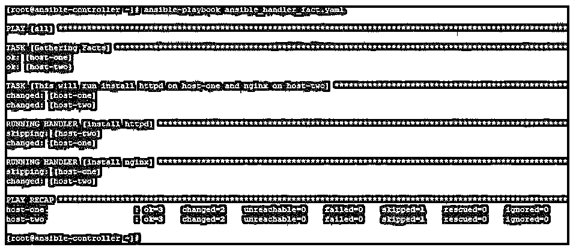

# 可变处理程序

> 原文：<https://www.educba.com/ansible-handlers/>

## Ansible 处理程序简介

Ansible 提供了一个名为 handlers 的特性，它类似于一个任务，但只有在被另一个任务中的通知程序调用时才会运行。此功能非常重要，因为您对运行任务的要求可能取决于服务的状态、文件的存在或状态改变时的后续任务。我们可以在通知和处理程序中使用变量，这使得它更加灵活。Ansible 处理程序在生产和实际环境中被广泛使用，因为您总是依赖其他东西来决定一个任务是否应该运行。

### 什么是可行的处理程序？

Ansible 处理程序具有与任务相同的内容。

<small>网页开发、编程语言、软件测试&其他</small>

但是在使用 notify 和处理程序时，有几点需要注意和记住，否则您可能得不到想要的结果:

*   处理程序的名称应该是唯一的，这是通知程序用来调用它的。
*   默认情况下，在剧本的结尾调用一个处理程序，因此即使多次通知一个处理程序，处理程序下的任务也只会运行一次。此外，只有当其中一个调用任务的状态发生变化时，才会出现这种情况。
*   如果两个处理程序同名，那么只有一个会运行。这将在以后的行动手册中定义。
*   您可以在 handler 的 tasks 部分提到一个变量。但是避免在处理程序的名称中使用变量。因为处理程序名称在早期就被模板化了。
*   当需要通过一个 notify 调用多个处理程序时，我们可以使用 listen 并提及主题。
*   处理程序的名称和监听主题位于全局名称空间中。
*   处理程序将总是按照定义处理程序的相同顺序运行，并且如果其中一个调用任务的状态发生变化，它们只运行一次。处理程序不会按照通知的顺序运行。使用 listen 主题的处理程序也是如此。
*   如果任务的状态没有改变，那么附加的通知将不会调用处理程序。

带有通知和处理程序的示例剧本格式如下所示。这里我们正在运行一个任务，通过在其中使用 notify，我们正在调用 handler。

**代码:**

`hosts:
all
tasks:
<Module Definition>
notify: <Handler Name>
handlers:
name: <Handler Name>
<Module Definition>`

### 事实是如何在处理程序中完成的？

*   Ansible 以预定义变量的形式收集远程节点信息，这些变量被称为事实。
*   这个信息集是以 JSON 格式准备的。当您处理实时数据时，获取这些事实并在剧本中作为变量使用是非常有用的。
*   这些信息可以是主机名、IP 地址、mac 地址、安装的操作系统相关信息、机器的当前状态等。
*   这些事实在使用处理程序时会很有用。
*   正如我们所知，这些变量的值因远程主机而异，因此根据远程节点的实际情况来决定运行任务是有用的。
*   此外，我们使用事实来生成一些其他数据，并在处理程序中使用这些数据。

### 可转换处理程序的示例

下面是提到的例子:

这里我们有一个名为 ansible-controller 的 Ansible 控制服务器和两个名为 host-1 和 host-2 的远程主机。我们将创建剧本，在 ansible-controller 节点上运行 ansible 命令，并管理远程主机。

在本例中，我们将在远程节点上安装 httpd 包，当包安装成功时，处理程序的状态将会改变。我们提到了一个通知器，它会在看到任务的状态变化后调用处理程序重启 httpd 服务。

行动手册如下所示:

**代码:**

`hosts: all tasks:
name: Install httpd
yum: name=httpd state=installed notify:
Start HTTPD
handlers:
name: Start HTTPD
service: name=httpd state=started`

运行本行动手册后，我们将得到如下输出，您可以看到 httpd 包何时安装在远程节点上，任务的状态何时改变，然后通知程序被调用，处理程序任务何时运行。

**代码:**

`ansible-playbook ansible_handlers.yaml`

**输出:**

如果我们再次运行相同的剧本，知道任务的状态不会改变，因为已经安装了包。因此，通知程序这次不会调用处理程序。

**代码:**

`ansible-playbook ansible_handlers.yaml`

**输出:**

我们可以使用 listen topic 调用多个处理程序，如下所示。这里，我们在远程主机上配置 web 服务器。剧本如下所示。通知监听器主题“web 服务器配置”,我们调用了两个处理程序。

**代码:**

`hosts: all tasks:
name: Install httpd yum:
name: httpd state: installed
notify: "web server configuration"
handlers:
name: start httpd service service:
state: started
listen: "web server configuration"
name: copy index.html from control server to remote nodes copy:
src: /var/tmp/index.html
dest: /var/www/html/index.html listen: "web server configuration"`

这里通知侦听器主题“web 服务器配置”，并因此调用两个处理程序，一个用于启动 httpd 服务，另一个用于将 index.html 从本地节点复制到远程节点。

**代码:**

`ansible-playbook ansible_handler_listen.yaml`

**输出:**

现在我们用可预见的事实来决定是否执行一个任务。这里我们使用 ansible_hostname 来检查远程服务器的主机名，并在此基础上安装 web 服务器包。对于主机 1，我们安装了 httpd，对于主机 2，我们安装了 nginx。我们通过条件检查了这一点。

**代码:**

`hosts: all tasks:
name: This will run install httpd on host-one and nginx on host-two command: echo "Web Server Will Be Installed"
notify: "install web server"
handlers:
name: install httpd yum:
state: installed
when: ansible_hostname == "host-one" listen: "install web server"
name: install nginx yum:
name: nginx state: installed
when: ansible_hostname == "host-two" listen: "install web server"`

在下面的输出中，您必须注意 httpd 安装在 host-2 上被跳过，nginx 安装在 host-1 上被跳过。

**代码:**

`ansible-playbook ansible_handler_fact.yaml`

**输出:**

<u>

</u> 

### 结论

Ansible handler 是一个重要的特性和主题，Ansible 从业者应该大量学习和吸收。这使得决策任务变得更加容易。使用具有其他可变特征的处理程序，如条件、事实、角色等。使其对生产环境更有用。

### 推荐文章

这是一个 Ansible 处理程序的指南。在这里，我们讨论简介，事实是如何在处理程序中完成的，以及 ansible 处理程序的例子。您也可以看看以下文章，了解更多信息–

1.  [可承担的角色](https://www.educba.com/ansible-roles/)
2.  [可回答的标签](https://www.educba.com/ansible-tags/)
3.  YAML
4.  [可翻译版本](https://www.educba.com/ansible-versions/)

