# 可旋转拱顶

> 原文：<https://www.educba.com/ansible-vault/>

## Ansible Vault 简介

您可能知道，当我们使用 Ansible 时，我们必须创建像库存文件、剧本、变量文件等文件。这些文件可能包含敏感数据，如用户名、密码和端口号。暴露这些敏感数据会导致基础架构环境中的安全漏洞。在本主题中，我们将学习 Ansible Vault。

因此，我们必须有一些方法来保护数据免受未经授权的访问。为了实现这一点，我们使用 Ansible Vault，这是 Ansible 中的一个内置工具，它基于加密和基于密码的身份验证工作。

<small>网页开发、编程语言、软件测试&其他</small>

### 什么是可旋转拱顶？

为了保存和保护敏感数据，我们基本上有以下两种选择:-

*   使用第三方密钥管理服务，并将敏感信息存储在云上。这种工具就像亚马逊的 AWS 密钥管理服务和微软的 Azure Key Vault。
*   使用 Ansible Vault 保护任何结构化数据文件。

在这篇文章中，我们将讨论不稳定的拱顶。它通过一个名为“ansible-vault”的命令行工具运行。该命令用于加密、解密、重设密钥、查看、编辑和创建文件。

Ansible-vault 是命令行工具，在 Ansible 服务器上用于执行以下任务

*   加密现有的重要文件。
*   解密加密文件。
*   在不破坏加密的情况下查看加密文件。
*   编辑加密文件并维护其加密和密钥/密码。
*   创建新的加密文件。
*   重新键入或重置已加密文件的密码。

### Ansible Vault 是如何工作的？

有几点需要增加你的知识，让你了解 Ansible Vault 是如何工作的:-

*   Ansible Vault 不实现自己的加密功能，而是使用外部 Python 工具包。所以，你的系统里必须有 python。这也是在安全环境下工作的先决条件。
*   文件受到使用 AES256 的对称加密的保护，密码作为密钥。这种加密可能是 Ansible 的旧[版本中的 128 位 AES。](https://www.educba.com/ansible-versions/)

*   将 ansible-vault 与选项 edit 一起使用将总是重写文件，并且当您在相同的文件上有一些版本控制系统时，可能会产生问题。当您只想读取文件时，最好使用选项视图。

*   在某个角色下加密的文件应该有相同的密码。这是一个更好的做法，也更实际，否则将很难管理更多的密码和此类文件。否则，当加密多个文件时，请使用 vault-id 标签，但这取决于您的 ansible 版本。
*   当您在运行剧本或任何其他可行操作时拥有加密文件时，您也可以使用保险库密码文件。您应该使用 ask-vault-pass 和 vault-password-file 参数分别提供密码和密码文件。

### 可旋转拱顶的示例

下面是一些关于这些操作如何工作的示例，这里我们正在处理一个名为“important.yaml”、/etc/ansible/hosts、playbook1.yaml 和 secret_important.yaml 的示例文件(仅作为示例)。下面是这个文件的内容。

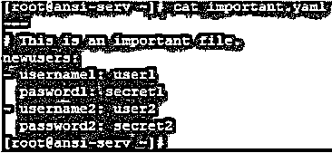

1.加密重要文件。像下面这样使用 ansible-vault 会要求你输入密码并再次确认。您必须记住此密码，否则您将无法恢复此文件。

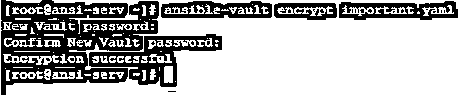

如果你试图读取这个文件。你会发现，文件是加密的，但内容仍然是 ASCII 文本。

2.解密文件。像下面这样使用 ansible-vault 会要求你输入你加密时给出的密码。

现在，同一个文件将以纯文本格式出现。

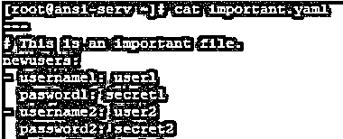

3.查看加密文件。像下面这样使用 ansible-vault 会要求你输入密码，然后你就可以读取文件了。

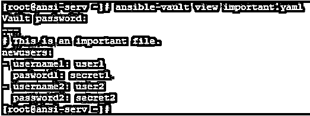

4.编辑已经加密的文件，而不破坏其加密并保持相同的密码。通过使用 ansible-vault 像下面会问你密码，然后打开文件默认编辑器。

打开的默认编辑器是 vim，但是可以通过设置和导出$EDITOR 来更改

环境变量。

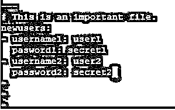

5.创建新的加密文件。在本例中，您将看到，使用如下所示的 ansible-vault 创建一个新的加密文件 secret_important.yaml。

这将打开 secret_important.yamlfile，默认编辑器如下所示。

6.重置一个已经加密的文件，使用下面的 ansible-vault 来重置一个文件的密码或密钥。

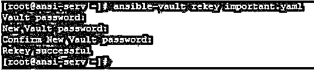

7.使用 ask-vault-pass，同时运行一些可行的操作，比如在提到的清单文件中列出所有主机

在本例中，我们有默认的库存文件 **/** etc/ansible/hosts。如果该文件未加密，我们可以简单地列出其中的所有主机，如下所示:

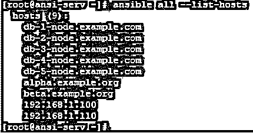

如果你像下面这样加密 **/** etc/ansible/hosts **，**，并尝试运行上面的命令，它会给你一个错误，如下所示，它无法解析文件。

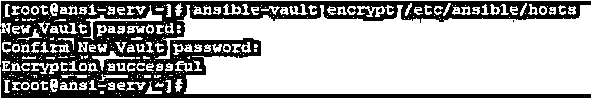

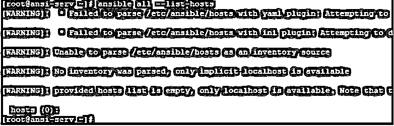

然后，您应该在使用 ask-vault-passin above 命令后出现提示时提供 vault 密码，如下所示:

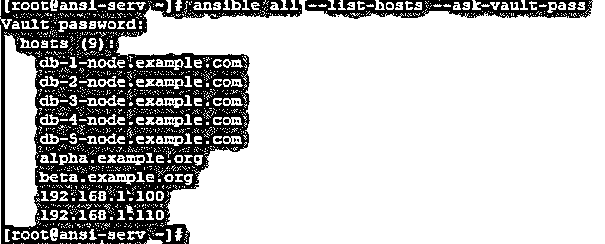

8.使用 vault 文件在 ansible 或 ansible-playbook 命令等命令中传递 vault 密码的值。使用 vault 文件时需要注意几件事:–

*   该文件中的密码应该是明文。
*   密码应该是一个字符串，在该文件中存储为一行。
*   该文件包含密码，这是高度敏感的信息，因此该文件应该受到文件权限和其他系统安全措施的保护。
*   使用 vault 文件时，应使用参数 vault-password-file。

在本例中，我们有一个 vault 文件 secret.yaml，它将在运行上例中的相同命令时使用。以下是 secret.yaml 的内容。

现在运行带有参数的相同命令，vault-password-file 将成功执行，因为它从 secret.yaml 中获取密码。

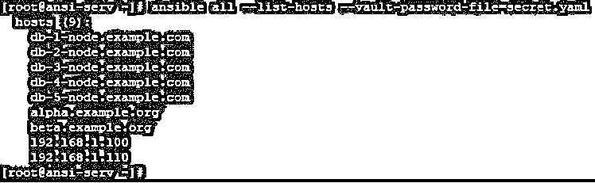

密码文件的默认位置也可以通过使用

`$ANSIBLE_VAULT_PASSWORD_FILE`

环境变量。

现在，如果设置了这个环境变量，ansible 命令既不会要求您输入 vault 密码，也不会要求您提供 ask-vault-pass 和 vault-pass-file 等参数。

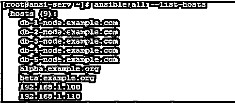

9.从 Ansible 版本开始，我们增加了一个非常有用的特性，那就是 vault-id **。**假设您有多个加密的文件，并且有不同的保险库密码。在这种情况下，处理这样的文件真的会很痛苦。vault-id **的用处来了。**在这种情况下，当您加密一个文件时，您应该为它的密码分配一个标签和源名称。

**在本例中:**

我们有一个名为 playbook1.yaml 的剧本和 inventory /etc/ansible/hosts。这些标签和密码设置如下。在这里，标签被翻转和播放。源保存在提示中，意味着从提示中获取输入，这也可以是 vault 文件位置。

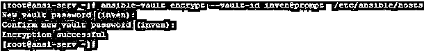

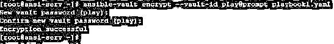

现在，由于库存和行动手册文件的密码不同，我们不能简单地通过提供 ask-vault- pass 标志来运行行动手册，因为我们必须多次提供密码，而它将要求一个密码。因此，我们将如下运行它，并在询问时多次给出 label@source 格式的 vault-id 和密码。

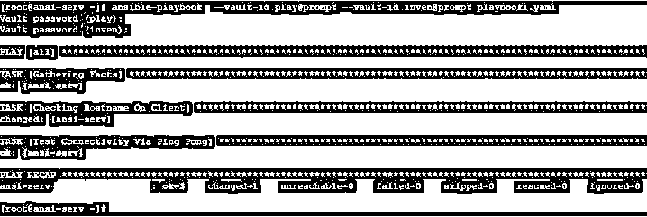

### 结论

在当今世界，我们的技术在数量和质量方面都在快速发展，在不妨碍运营任务顺利进行的情况下维护基础架构环境的安全性是一项具有挑战性的任务。要做到这一点，一个人的技能组合中必须有许多工具。

在配置管理自动化领域，Ansible 覆盖了大部分市场。Ansible Vault 发挥着非常重要的作用，您可以在其中存储您的用户名、密码、密钥、访问密钥、IP 地址、主机名、端口号、通信方法、API 令牌、重要的网站位置和任何敏感信息。

以有效的方式使用 Ansible Vault 可以导致安全和受保护的操作任务执行。其中，您拥有一个安全级别的安全层，它可以补充您的基础架构中可能拥有的其他安全工具。

### 推荐文章

这是一个可行的金库指南。在这里，我们将详细讨论 Ansible Vault 的工作原理和示例。您也可以看看以下文章，了解更多信息–

1.  [可执行的命令](https://www.educba.com/ansible-commands/)
2.  [可回答的标签](https://www.educba.com/ansible-tags/)
3.  [可承担的角色](https://www.educba.com/ansible-roles/)
4.  [可变服务模块](https://www.educba.com/ansible-service-module/)

