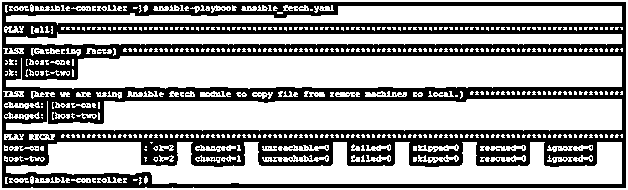
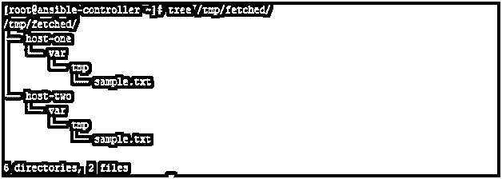
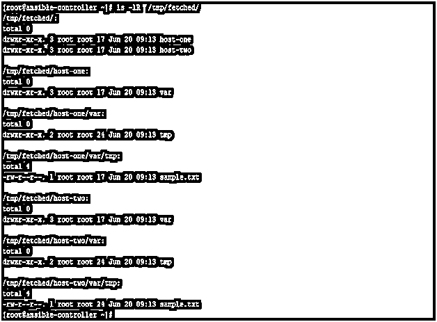
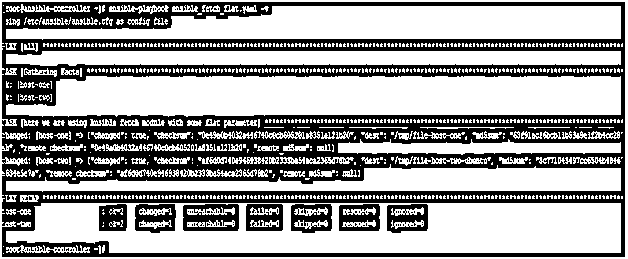

# 可变提取

> 原文：<https://www.educba.com/ansible-fetch/>

## Ansible Fetch 简介

Ansible fetch 模块是一个基于文件的模块，用于处理文件。这个模块类似于 Ansible copy 模块，但是在默认情况下，在源和目标方面以相反的顺序工作。当您在远程目标机器上执行管理或变更管理任务时，它是您日常可能需要的模块之一。还有许多其他模块，如副本、模板等。其工作方式或多或少类似，可用性完全取决于可用的特征参数。在本文中，我们将通过使用一些例子和参数细节来了解 Ansible Fetch 模块。

### 什么是可行的获取？

Ansible fetch 模块用于从远程主机获取文件，并以文件树结构将它们存储在本地 Ansible controller 机器上。这是一个简单易用的模块。但是在使用 Ansible fetch 模块时，应该知道以下几点

<small>网页开发、编程语言、软件测试&其他</small>

*   本模块将远程机器视为文件源，本地控制器机器视为目标。
*   获取的文件按主机名组织在文件树结构中。
*   内容不同但名称相同的文件会在目标上被覆盖。
*   这个模块按原样工作，也适用于 Microsoft Windows 机器。
*   建议不要将此模块与 Ansible 一起用作参数，因为这将导致传输文件的大小加倍。因为校验和也将被计算。这将导致消耗远程或本地主机上的所有可用内存，从而导致内存错误。
*   当无法读取远程文件时，我们将使用 fail _ whenor 或 ignore _ errorsor 或 fail_on_missing 来避免剧本失败。

### Ansible Fetch 是如何工作的？

为了有效地使用 Ansible fetch 模块，必须了解所有可用参数及其可接受值。此外，有些参数始终设置有默认值，即使您没有在行动手册中提及相关参数，这些默认值也会在您的行动手册中体现出来。因此，了解这些变得更加重要。以下是所有可用参数和相关可接受值或默认值的列表。

*   **dest:** 这是设置将保存提取文件的目录。请注意，在此目录下，将创建另一个目录，该目录以目标远程系统的主机名命名，但基于清单条目。在这个目录下，作为源的整个目录结构将被创建，然后文件将被复制到其中。
*   **fail_on_missing:** 默认值为 yes。当 Ansible 无法读取源系统上的文件时，这将导致剧本失败，原因可能是许可、不存在等。可用值为“是”和“否”
*   **flat:** Default 为 no。可接受的值为 yes 和 no。这是为了设置覆盖获取模块的默认行为。从而以这样的方式运行，其中文件将被直接复制到目标位置，而不创建基于主机名的目录结构。
*   **src:** 给出要获取的远程系统上的文件名。这必须是文件名，而不是任何目录名，因为还不支持提取目录。
*   **validate_checksum:** 默认值为 yes。可接受的值为“是”和“否”。在提取后验证文件的源和目标校验和。

### 实现可解析提取的示例

在本节中，我们将通过查看一些示例来学习如何测试 Ansible reboot 模块的功能。但是，在继续这一部分之前，我们应该先了解我们的实验室环境。

这里我们有一个名为 ansible-controller 的 Ansible 控制器节点。作为目标节点，我们有两台远程机器。第一台机器是名为 host-one 的 Red Hat Enterprise Linux 机器，第二台机器是名为 host-two 的 Ubuntu 机器。我们将在 Ansible 控制器机器上运行我们的剧本，并在远程目标机器上进行修改。

#### 示例#1

在这个例子中，我们有一个剧本，用于从远程目标节点获取一个文件，并存储在本地 Ansible 控制器机器上。然后，我们将在本地 Ansible 控制器机器上检查文件是如何存储的，以及为此创建了什么目录树结构。

**代码:**

`---
- hosts: all
tasks:
- name: here we are using Ansible fetch module to copy file from remote machines to local.
fetch:
src: /var/tmp/sample.txt
dest: /tmp/fetched`

然后像下面这样运行这个剧本:

`# ansible-playbook ansible_fetch.yaml`

现在，在输出中，我们可以看到文件被获取并存储在一个目录结构中的本地机器上。

**输出:**

在检查目录结构时，我们发现在本地机器上已经创建了一个完整的目录结构。

此外，检查文件和目录的时间戳。

正如我们在上面看到的，创建了名为 fetched、 <hostname>based(主机一和主机二)、var 和 tmp 的目录。那么文件就存放在这下面。这符合该模块的默认行为。</hostname>

#### 实施例 2

在这个例子中，我们有一个剧本，用于从远程目标节点获取一个文件，并存储在本地的 Ansible 控制器机器上。这里我们使用了一个名为 flat=yes 的参数。这用于覆盖 Ansible fetch 模块的默认行为，并按照 dest 参数中提到的名称和路径复制文件。然后，我们将在本地 Ansible 控制器机器上检查文件是如何存储的，以及为此创建了什么目录树结构。

**代码:**

`---
- hosts: all
tasks:
- name: here we are using Ansible fetch module with some flat parameter
fetch:
src: /var/tmp/sample.txt
dest: /tmp/file-{{ ansible_hostname }}
flat: yes`

然后像下面这样运行这个剧本:-

`# ansible-playbook ansible_fetch_flat.yaml -v`

**输出:**

然后以新的名称存储在 Ansible 本地机器的相同目录中，并且不创建新的目录结构。

### 结论

正如我们在这篇文章中看到的，Ansible fetch 模块很容易使用，虽然它是一个非常有用的模块，在您的 Ansible 技能集中肯定需要它。此外，了解其所有可用的功能和可能性将使您能够充分利用它。所以先学了再用。

### 推荐文章

这是一个可转换获取的指南。在这里，我们讨论什么是 Ansible Fetch 及其语法，以及示例和代码实现。您也可以浏览我们推荐的其他文章，了解更多信息——

1.  [ansi ble 命令简介](https://www.educba.com/ansible-commands/)
2.  [Terraform 与 ansi ble–主要差异](https://www.educba.com/terraform-vs-ansible/)
3.  [十大可回答的面试问题](https://www.educba.com/ansible-interview-questions/)
4.  可变滤镜|如何工作？

