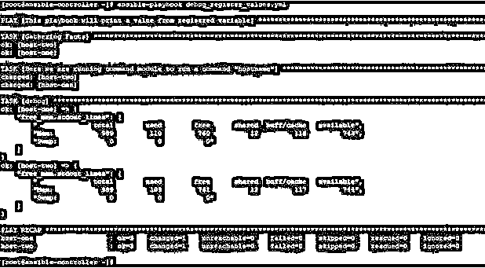

# 可行调试

> 原文：<https://www.educba.com/ansible-debug/>

## Ansible 调试简介

在 Ansible 中，当我们创建和运行行动手册时，由于我们的行动手册存在一些问题，我们经常会遇到错误。这可能是语法错误、逻辑错误或某些强制参数丢失。因此，这是非常重要的，我们应该始终以这样一种方式编写我们的剧本，它总是打印足够的信息，无论是成功还是失败。在 Ansible 中，当您需要调试以及在剧本执行输出中需要更多信息时，需要一个名为 debug 的模块。

在这篇文章中，我们将尝试学习一些概念，并看到可行的调试例子。这是 Ansible 包附带的默认模块。该模块在执行剧本时打印语句和变量值。这在某些情况下非常有用，你可以跳过剧本中一些不稳定的任务，不想完全停止。在所有不稳定的任务中使用 debug，将为您提供关于这些任务中的数据执行以及这些任务中使用的所有变量的足够信息。这将有助于故障排除，如果您将它与注册变量一起使用，这将非常有用。我们将在示例部分探讨这种情况。

<small>网页开发、编程语言、软件测试&其他</small>

### Ansible Debug 是如何工作的？

在 Ansible 中，调试模块带有一些参数，这些参数接受一些选项。这在下面给出:

*   **msg**:–该参数接受字符串作为输入。这用于打印定制的消息。如果没有给定消息，则显示一条通用消息，如“Hello World！”是
*   **var:–**它接受字符串作为输入，这是由 Ansible facts 或 playbook 设置的变量。此外，这里写的值将具有隐式双插值，因为该选项在 jinja2 上下文中运行。所以，你不需要使用 jinja2 分隔符，除非你也想打印双插值。控件中打印变量时，可以使用双重插值
*   **详细度:–**默认为 0。此参数用于控制调试何时运行。例如，如果给定了值 3，那么只有在运行剧本时给定了-v 或更高的值，调试才会运行。

对于 Ansible debug，我们还应该注意这也适用于 Microsoft Windows 支持的模块。

### 实现 Ansible 调试的示例

现在我们将举一些例子，但在此之前，我们首先要了解我们用于测试的实验室。这里我们有一个名为 ansible-controller 的 Ansible 控制服务器和两个名为 host-1 和 host-2 的远程主机。我们将创建剧本，在 ansible-controller 节点上运行 Ansible 命令，并在远程主机上管理用户。

#### 示例#1

要在通过 ansible-playbook 运行剧本的输出上打印默认消息，我们可以创建一个简单的剧本，如下所示:

**代码:**

`---
name: This will print a default hosts: host-one
tasks:
name: Here we use Ansible debug debug:`

**输出:**

`ansible-playbook debug_dafault_msg.yml`

#### 实施例 2

打印在同一行动手册中定义的变量的值。我们可以创建一个简单的行动手册，如下所示:

**代码:**

`---
name: This will print the defined varible. hosts: all
vars:
fruit: apple tasks:
name: Here we use Ansible debug module to print defined Variable.
debug:
var: fruit`

**输出:**

`ansible-playbook debug_print_var.yml`

#### 实施例 3

要打印远程主机的一个可回答的事实，我们可以创建一个简单的剧本，如下所示

**代码:**

`---
name: This will print one of Ansible facts from remote hosts: all
tasks:
name: Here we use Ansible debug module the ipv4 of remote debug:
var: ansible_default_ipv4.address`

**输出:**

`ansible-playbook debug_ansible_fact.yml`

#### 实施例 4

要在屏幕上打印定制消息，请编写如下剧本:

**代码:**

`---
name: This will print customized message hosts: all
tasks:
name: Here we use Ansible debug module to print some customized message debug:
msg: "This is machine is {{ ansible_hostname }} with IP {{ ansible_default_ipv4.address }}"`

**输出:**

`ansible-playbook debug_with_customized_msg.yml`

#### 实施例 5

您可以将任务的输出注册到一个变量中，正如我们所知，这些变量的值将以 JSON 格式存储。因此，您可以稍后在同一个剧本中调用该变量。为了测试这一点，或者测试当我们调用注册变量时，将使用哪个值。我们可以像下面这样使用 debug，创建一个剧本。

**代码:**

`---
name: This playbook will print a value from registred variable hosts: all
tasks:
name: Here we are running command module to run a command "hostname" command: free -m
register: free_mem
debug:
var: free_mem.stdout_lines`

**输出:**

`ansible-playbook debug_register_values.yml`

#### 实施例 6

通过给定参数 Verbosity 的值，然后在运行剧本时提及相同或更多的–**v**来控制详细度。就像之前的剧本一样。其中我们没有定义任何详细度，那么默认情况下，它以 0 详细度级别运行。但是如果像下面这样定义详细级别:

**代码:**

`---
name: This playbook will print a value from registred variable hosts: all
tasks:
name: Here we are running command module to run a command "hostname" command: free -m
register: free_mem
debug:
var: free_mem.stdout_lines verbosity: 1`

**输出:**

`ansible-playbook debug_register_values.yml -v`

### 结论

Ansible debug module 对于剧本开发人员和管理员来说是一个非常有用的工具，他们需要根据需要经常更新剧本。此外，在团队中工作时，其他人也和你有同样的利害关系，使用调试模块添加更多信息总是有益的，可以避免混淆和依赖性。

### 推荐文章

这是一个 Ansible 调试指南。这里我们讨论一个 Ansible Debug 的介绍，它是如何工作的例子。您也可以浏览我们的其他相关文章，了解更多信息——

1.  [可翻译版本](https://www.educba.com/ansible-versions/)
2.  [可行的架构](https://www.educba.com/ansible-architecture/)
3.  [可旋转拱顶](https://www.educba.com/ansible-vault/)
4.  [可变滤波器](https://www.educba.com/ansible-filters/)

