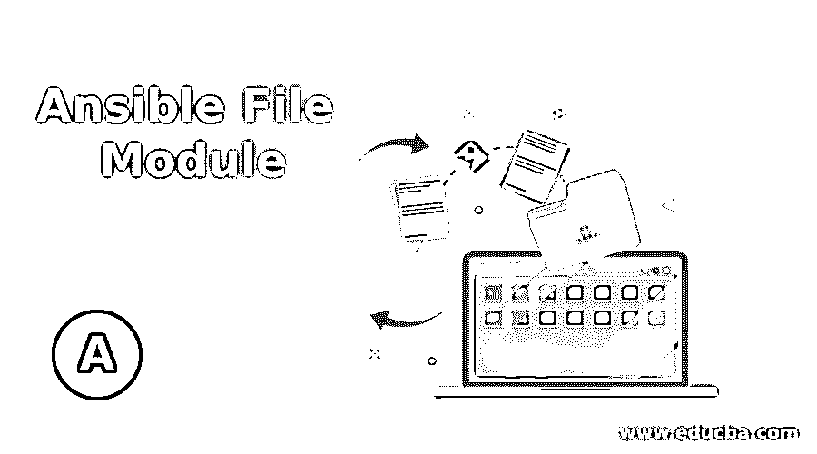
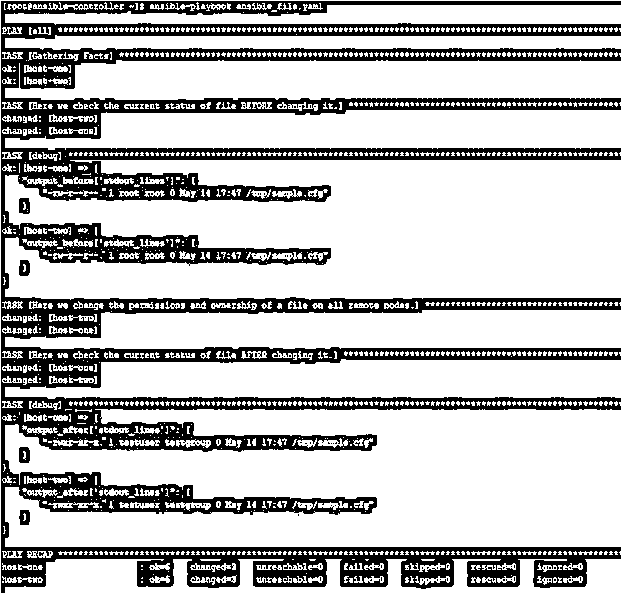
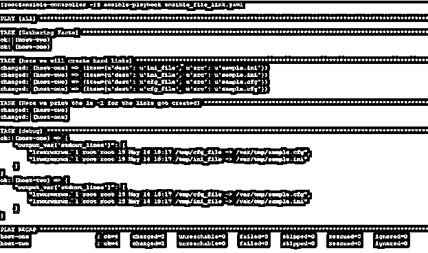

# 可转换文件模块

> 原文：<https://www.educba.com/ansible-file-module/>

## Ansible 文件模块简介

在 Ansible 中，我们有许多模块来处理远程目标节点上的文件、目录和链接，如**副本、模板、获取、文件等。**各有特色。在本文中，我们将学习**文件**模块，它主要用于处理文件、目录和符号链接。此模块用于管理属性以及设置或删除文件、目录和符号链接的属性。对于 windows 系统，Ansible 提供了一个类似的模块，名为 **win_file。**它们的工作方式基本相同，但有 Window 操作系统的限制。

### 解释 Ansible 文件模块

Ansible 文件模块采用您在行动手册中提到的参数和选项。然后，这些任务被发送到目标远程节点，在那里任务被解析成命令集并相应地执行。

<small>网页开发、编程语言、软件测试&其他</small>

在这个模块的参数中，你必须注意到所有的执行都将在远程目标节点上完成，所以当改变文件、目录的所有权时；那么相关的用户和组必须存在于远程目标节点上，否则剧本执行将失败。因此，在这种情况下，最好首先在远程目标节点上检查用户或组的存在，然后尝试为这些用户或组设置所有权。

### Ansible 文件模块是如何工作的？

Ansible **文件**模块有一组预定义的参数和相关的可接受/默认值。使用这些参数的组合，您可以完成几乎所有的文件、目录或 sysmlinks 管理。下面我们提到了一些重要的参数，如果不是全部的话。

*   **access_time:** 该参数用于设置文件的访问默认为“**preserve”**表示文件、目录、软链接、硬链接都不需要修改。同样对于状态为**的新文件，触摸**，则默认为**。**
*   **access_time_format:** 该参数在我们同时使用 **access_time** 时使用，该参数用于设置文件访问时间的时间格式。默认格式基于远程机器上的默认 python 格式。但主要是 **"%Y%m%d%H%M.%S "。**
*   **属性:**设置结果目录或可接受标志的属性同 **chattr** 。这可以通过使用 **lsattr 看到。**
*   **跟随:**这是设置是否应该跟随文件系统链接。默认是**是的。**可接受的值为是和否
*   **force:** 这是强制创建 syslinks。可接受的值为“是”和“否”。默认值为“是”。
*   **组:–**用于设置文件或目录的组所有权。
*   **模式:–**设置目标文件或目录的权限。更好的做法是在单引号中使用 4 个八进制数字来表示权限，如“0777”或“0644”。
*   **修改时间:–**设置文件的修改时间。默认为“**保留”**表示不需要修改文件、目录、软链接和硬链接。同样对于状态为**的新文件，触摸**，则默认为**。**
*   **modification _ time _ format:–**该参数在我们同时使用 **modification_time** 时使用，该参数用于设置文件修改时间的格式。默认格式基于远程机器上的默认 python 格式。但主要是 **"%Y%m%d%H%M.%S "。**
*   **所有者:–**设置文件或目录的所有者。
*   **路径:–**文件的路径，这是我们任务的目标。
*   **recurse:–**当**状态**参数将**目录**作为值，并且我们想要根据文件属性更新目录的内容时，使用此选项。
*   **selevel，serole，setype，seuser:–**这些用于更新 selinux 文件上下文。
*   **src:–**这是给出要链接的文件的路径。
*   **状态:–**可接受的值有**接触、缺席、目录、文件、硬连接和链接。**默认值是文件。

我们将在下一节通过一些例子来探讨这些参数。

### 例子

现在，通过使用示例，我们将尝试了解 Ansible **file** 模块，您可能需要在日常操作中使用它。我们将举一些例子，但在去那里之前，我们首先了解我们的实验室，我们用于测试目的。这里我们有一个名为 ansible-controller 的 Ansible 控制服务器和两个名为 host-1 和 host-2 的远程主机。我们将创建剧本，在 ansible-controller 节点上运行 Ansible 命令，并在远程主机上查看结果。

*   在本例中，我们有一个如下所示的剧本，使用它我们尝试在远程目标节点上更改文件的权限和所有权。

**主机:所有任务:**

*   **名称:这里我们在更改命令之前检查文件的当前状态:ls -l /tmp/sample.cfg**

**寄存器:输出 _ 之前**

*   **调试:**

**var:output _ before[' stdout _ lines ']**

*   **名称:在这里我们改变一个文件在所有远程文件上的权限和所有权:**

**路径:/tmp/sample.cfg 所有者:testuser**

**组:测试组模式:“0755”**

*   **名称:这里我们检查更改命令后文件的当前状态:ls -l /tmp/sample.cfg**

**寄存器:输出 _ 之后**

*   **调试:**

**var:output _ after[' stdout _ lines ']**

然后像下面这样运行行动手册:-

`ansible-playbook ansible_file.yaml`

我们得到如下输出，在这里我们可以看到文件的所有权在使用 **file** 模块改变之前是什么，改变之后是什么。

*   在这个例子中，我们有一个如下的剧本，使用它我们试图为两个文件分别创建一个链接

—

**主机:所有任务:**

*   ***名称:这里我们将创建硬链接文件:***

**src:/var/tmp/{ { item . src } } path:/tmp/{ { item . dest } } state:link**

**循环:**

*   **{ src: sample.ini，dest: ini_file }**
*   **{ src: sample.cfg，dest: cfg_file }**

*   **name:这里我们打印了创建的链接的 ls-l shell:ls-l/tmp/* _ file**

**寄存器:输出变量**

*   **调试:**

**var:output _ var[' stdout _ lines ']**

我们得到如下输出:-

`ansible-playbook ansible_file_link.yaml`

### 结论

正如我们在本文中看到的，文件模块易于使用，能够管理远程目标节点上的文件、目录和符号链接。该模块基于相关文件或目录的状态工作。另请注意，与 copy，template 具有相同文件类型的许多其他模块使用与 file module 相同的选项。所以先学了再用。

### 推荐文章

这是一个可转换文件模块的指南。这里我们讨论一下简介，Ansible 文件模块是如何工作的？还有例子。您也可以看看以下文章，了解更多信息–

1.  [可行的架构](https://www.educba.com/ansible-architecture/)
2.  [可翻译版本](https://www.educba.com/ansible-vault/)
3.  YAML
4.  [可执行的命令](https://www.educba.com/ansible-commands/)

