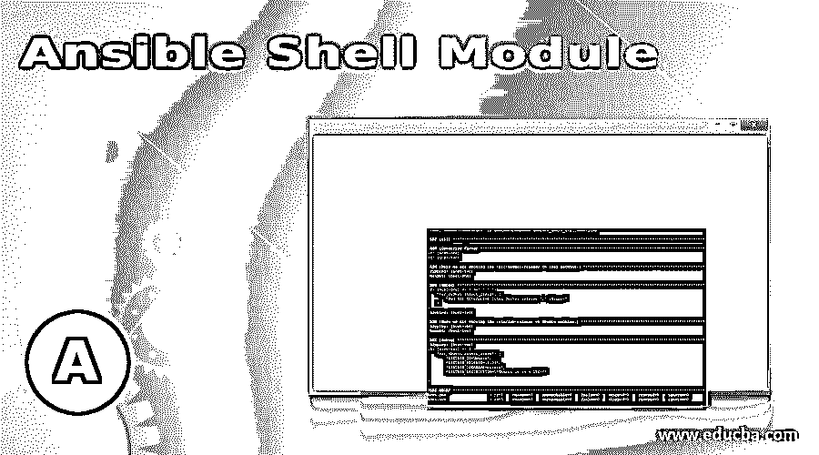
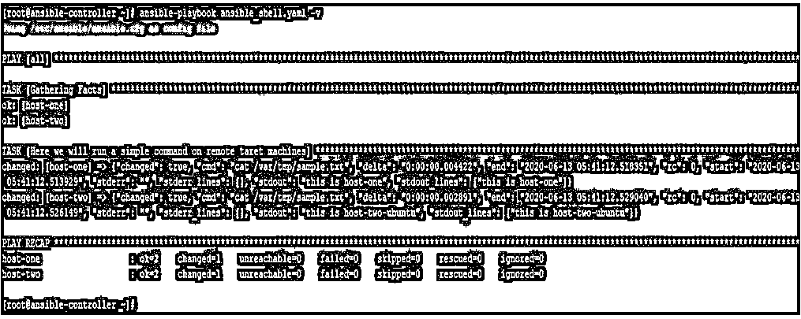
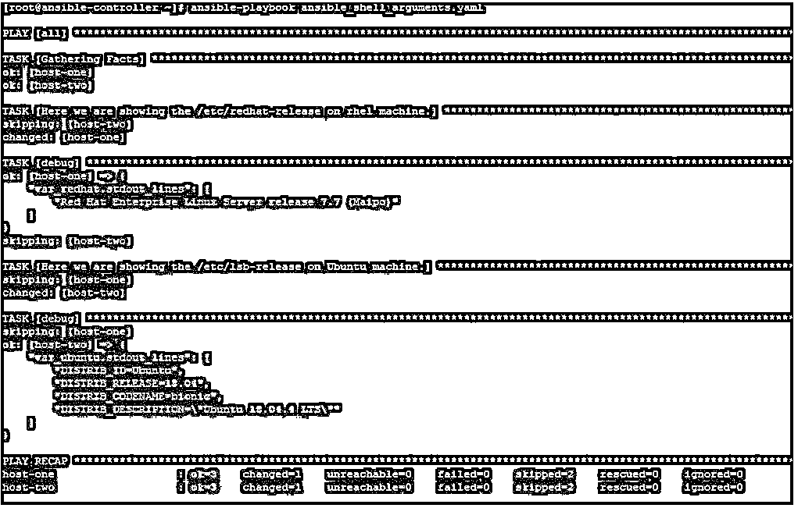

# 可变外壳模块

> 原文：<https://www.educba.com/ansible-shell-module/>

## Ansible Shell 模块简介

Ansible 有很多这样的模块，它们可以直接替换目标系统上的命令或命令集。尽管我们已经在 Ansible 中涵盖了几乎所有的内容，但有时我们仍然需要在远程目标主机上直接执行命令，就像我们在 Bash 或 Shell 脚本中使用的一样。这使我们能够在可用的 shell 中保持执行模式的独创性。对于这种需求，我们对基于 Linux 的操作系统使用 Ansible shell 模块，对基于 Microsoft Windows 的操作系统使用 win_shell。在本文中，我们将了解它以及如何使用它。

### 什么是 Ansible Shell 模块？

在 Ansible 中，我们有一个 shell 模块，用于在目标远程机器的/bin/shell 上运行命令。该模块将命令和一组参数作为输入。在使用 Ansible shell 模块时，有一些注意事项必须记住:

<small>网页开发、编程语言、软件测试&其他</small>

*   接受自由格式命令或分号分隔的命令，它们可以在 cmd 参数下提供，我们可以在示例部分中看到。
*   这个模块类似于命令模块，不同之处在于命令将在远程目标机器上的 shell
    (/bin/sh)上运行。
*   如果你想安全和可预测地运行一个命令，那么使用
    命令模块代替这个模块。
*   要正确使用变量并实现，请使用{{ var|quote }}，而不要只使用{{ var }}。这将确保不会出现像分号这样的特殊字符。
*   当您需要运行脚本时，如果需要的话，可以使用 Ansible 脚本模块和模板模块。
*   对于重新启动要求，请使用行动手册中的 reboot 或 win_reboot 模块。

### Ansible Shell 模块是如何工作的？

对于 Ansible shell 模块，像任何其他模块一样，我们有一组可接受的参数和相应的可接受值。对于某些参数，有一个默认值。下面我们将讨论其中的大部分，如果不是全部的话。

*   **–cmd:**在这下面，我们给出要执行的命令。
*   **–chdir:**在这种情况下，在运行命令之前，我们给出要更改到的目录的路径。
*   **–创建:**如果文件名存在，则不运行该命令。
*   **–executables:**给出可执行文件的绝对路径，该可执行文件是一个 shell，命令将在该 shell 下运行。
*   **–删除:**给出文件名，如果不存在，则不运行该命令。
*   **–标准输入:**设置命令的标准输入。
*   **–stdin _ add _ newline:**默认为 yes。这是为向标准输入数据添加新行而设置的。
*   **–警告:**默认为是。这将启用任务警告。

现在，我们必须根据提供给 Ansible shell 模块的参数和自变量来理解它所能提供的返回值。这是一个重要的方面，因为我们在剧本中的下一个任务可能依赖于 shell 模块提供的返回值。下面是该模块返回值的列表和简短描述。

*   **cmd:** 任务执行的命令。
*   **增量:**运行命令所用的时间。
*   **消息:**如果更改了或没有更改，将提供 True 和 False。
*   **nd:** 命令执行结束时间。
*   **rc:** 返回命令代码，零(0)表示成功，除零以外的任何值都表示有问题。
*   **开始:**命令的开始时间。
*   **stderr:** 命令执行输出中的错误，如果有的话。
*   **stdout:** 命令的标准输出。
*   **stdout_lines:** 命令的标准输出，拆分成行。

### Ansible Shell 模块示例

在这一节中，我们将通过看一些例子来学习如何测试 Ansible shell 模块的功能。但是，在继续这一部分之前，我们应该了解我们的实验室环境。

这里我们有一个名为 ansible-controller 的 Ansible 控制器节点。作为目标节点，我们有两台远程机器。第一台机器是名为 host-one 的 Red Hat Enterprise Linux 机器，第二台机器是名为 host-two 的 Ubuntu 机器。我们将在 Ansible 控制器机器上运行我们的剧本，并在远程目标机器上进行修改。

#### 示例#1

在本例中，我们有一个如下所示的剧本，使用它我们将在远程目标机器上运行一些简单的命令。

`---
- hosts: all tasks:
- name: Here we will run a simple command on remote taret machines shell: cat /var/tmp/sample.txt`

运行如下命令后，我们得到如下输出。在这里我们可以看到命令执行的标准输出的 stdout 或 stdout_lines 部分。此外，由于我们在运行 ansible-playbook 命令时使用了详细模式，我们还可以看到其他返回值，如命令执行开始、增量、结束时间和 rc 等。

`ansible-playbook ansible_shell.yaml -v`

#### 实施例 2

在这个例子中，我们有一个剧本，其中我们使用了可转换的事实、条件和另一种使用 cmd 参数给出命令的方式。

`---
hosts: all tasks:
name: Here we are checking & showing the /etc/redhat-release on rhel machine based on condition block:
name: Here we are showing the /etc/redhat-release on rhel shell: cat /etc/redhat-release
register: var_redhat
debug:
var: var_redhat.stdout_lines
when: ansible_distribution == "RedHat"
name: Here we are checking & showing the /etc/lsb-release on Ubuntu machine based on condition block:
name: Here we are showing the /etc/lsb-release on Ubuntu shell:
cmd: cat /etc/lsb-release register: var_ubuntu
debug:
var: var_ubuntu.stdout_lines
when: ansible_distribution == "Ubuntu"`

现在像下面这样运行这个剧本，并得到下面的输出，我们可以看到当 linux 发行版是 RedHat 时，它将使用 Linux 的 cat 命令打印/etc/redhat-release 文件。另外，在 Ubuntu system /etc/lsb-release 文件中的内容是可以打印出来的。我们在远程机器上使用不同的可变块上的条件集来检查操作系统。

`ansible-playbook ansible_shell_arguments.yaml`

### 推荐文章

这是一个关于 Ansible Shell 模块的指南。在这里，我们还将讨论 ansible shell 模块的介绍和工作原理，以及不同的示例和代码实现。您也可以看看以下文章，了解更多信息–

1.  [可转换的文件模块](https://www.educba.com/ansible-file-module/)
2.  [可翻译的剧本](https://www.educba.com/ansible-playbooks/)
3.  [可转换的 lineinfile](https://www.educba.com/ansible-lineinfile/)
4.  [可变寄存器](https://www.educba.com/ansible-register/)

