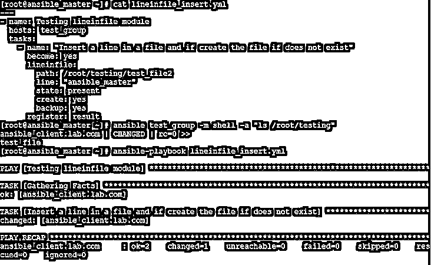
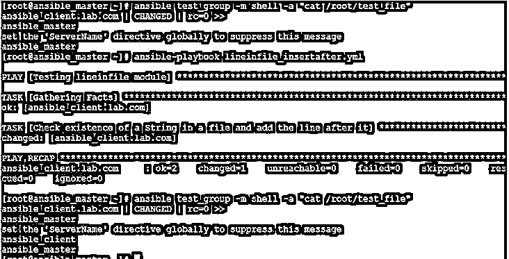
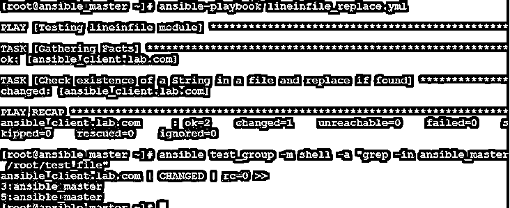
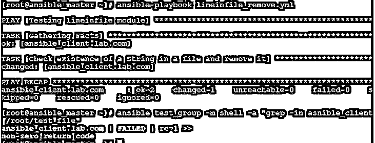
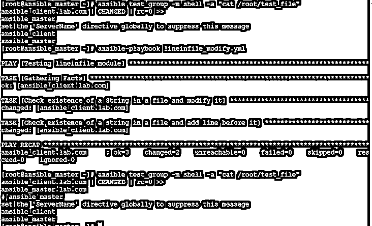

# 可变线性文件

> 原文：<https://www.educba.com/ansible-lineinfile/>

## Ansible lineinfile 简介

Ansible Lineinfile 是 Ansible 的一个模块，用于修改文件中的特定行。如果在文件中找到特定的文本，则添加新行、修改行、替换行和删除现有行是很有用的。在使用 Lineinfile 模块时，我们可以使用正则表达式来应用搜索条件。它有很酷的选项，使我们的工作更容易。例如，如果我们必须在多个主机上的文件中插入一行，并且我们不确定该文件是否存在于主机上，我们可以使用“create”选项并将其设置为“yes ”,以避免在目标上不存在该文件时我们将会遇到的错误。

### lineinfile 在 Ansible 中是如何工作的？

基本上，Lineinfile 模块使用“path”参数获取文件名，因为它是该模块的必需选项，并根据其他给定的参数对文件进行更改，如我们希望对该文件执行什么操作。如果我们将“备份”选项指定为“是”(因为它是一个可选参数),模块可以在进行任何更改之前进行备份，但是，建议使用“备份”对文件进行备份，这样，如果对文件所做的更改不正确，我们就可以恢复原始文件。

<small>网页开发、编程语言、软件测试&其他</small>

让我们了解一下使用“Lineinfile”模块可以执行的各种操作，以及如何执行:

#### 1.插入 lineinfile

我们可以使用“lineinfile”模块在文件中插入一行。默认情况下，如果不存在，它会在文件末尾添加一行。这里有一个相同的剧本:

**代码:**

`---
- name: Testing lineinfile module
hosts: test_group
tasks:
- name: "Insert a line in a file and if create the file if does not exist"
become: yes
lineinfile:
path: /root/testing/test_file2
line: "ansible_master"
state: present
backup: yes`

`ansible test_group -m shell -a “ls /root/testing”`

**解释:**在上面的例子中，我们得到了一个错误，因为文件在目的地不存在，并且我们没有指定“创建”选项。让我们添加“创建”选项，并将其设置为“是”。

**代码:**

`---
- name: Testing lineinfile module
hosts: test_group
tasks:
- name: "Insert a line in a file and if create the file if does not exist"
become: yes
lineinfile:
path: /root/testing/test_file2
line: "ansible_master"
state: present
create: yes
backup: yes`

`cat lineinfile_insert.yml`

**输出:**

**解释:**在上面的示例中，我们添加了“创建”选项，并重新运行了行动手册，它运行时没有出现任何错误。以下命令用于在运行行动手册之前验证不存在名为“test_file2”的文件:

`ansible test_group -m shell -a "ls /root/testing"`

如上所述，默认情况下,' lineinfile '模块只在文件末尾添加行，但是，我们可以分别使用' insertafter '和' insertbefore '选项在特定行的前后添加行。这是我们将要编辑的文件测试文件的快照。

`cat test_file`

**输出:**

下面是在特定行后插入行的剧本:–

**代码:**

`---
- name: Testing lineinfile module
hosts: test_group
tasks:
- name: "Check existence of a String in a file and add the line after it"
become: yes
lineinfile:
path: /root/test_file
insertafter: "ServerName"
line: "ansible_client"
firstmatch: yes
state: present
backup: yes`

`ansible test_group -m shell -a "cat /root/testing"`

**输出:**

**解释:**在上面的例子中，我们在匹配“ServerName”的行之后添加了“ansible_client”行。同样，如果找到匹配项，我们可以使用“insertbefore”选项代替“insertafter”选项在特定行之前添加行。当我们修改文件中的行时，将显示示例。

#### 2.更换管线文件

我们可以使用“lineinfile”模块替换一行，但是如果有多行匹配指定的正则表达式，它将只替换文件中的一行。“lineinfile”模块使用“regexp”选项来匹配条件。默认情况下，它会替换与条件匹配的最后一行。我们可以使用“firstmatch”选项来替换第一个匹配标准的行。Ansible 有“replace”模块来替换文件中出现的所有内容。我们将使用上面提到的同一个测试文件来查看它的运行情况，如果您还记得的话，我们已经在包含“ServerName”文本的行后面添加了“ansible_client”。

下面是替换文件中该行的剧本:

**代码:**

`---
- name: Testing lineinfile module
hosts: test_group
tasks:
- name: "Check existence of a String in a file and replace if it finds the match"
become: yes
lineinfile:
path: /root/test_file
regexp: "ansible_client"
line: "ansible_master"
state: present
backup: yes`

`ansible-playbook lineinfile_replace.yml`

**输出:**

**解释:**在上面的例子中，我们已经用‘ansi ble _ master’替换了其中匹配‘ansi ble _ client’文本的行。如果我们将上面的快照与上一个快照进行比较，就可以看出不同之处。在上一个快照中，第三行是“ansible_client ”,它被替换为“ansible_master ”,正如我们在上面的快照中看到的那样。

以下命令用于在“测试文件”中搜索“ansible_master”:

`ansibletest_group -m shell -a "grep -in ansible_master /root/test_file"`

#### 3.从文件中删除所有符合条件的行

我们可以使用' regexp '选项搜索符合特定标准的行，并通过将' state '选项更改为 absent 来删除这些行。这是同样的剧本:

**代码:**

`---
- name: Testing lineinfile module
hosts: test_group
tasks:
- name: "Check existence of a String in a file and remove it"
become: yes
lineinfile:
path: /root/test_file
regexp: "ansible_client"
state: absent
backup: yes`

`ansible-playbook lineinfile_remove.yml`

**输出:**

**解释:**在上面的例子中，剧本搜索了‘ansi ble _ client’并删除了那些行，所以当我们运行下面的命令来检查文件中的‘ansi ble _ client’文本时，我们得到了非零的返回代码，因为它在文件中没有找到任何文本‘ansi ble _ client’。

**ansi ble test _ group-m shell-a " grep-in asni ble _ client/root/test _ file "**

#### 4.修改 lineinfile

我们可以使用' regexp '选项搜索一行，并使用' backrefs '选项将这些行保存在默认占位符' \1 '中，并在模块' line '选项中使用该变量来修改现有行。一个用例是在配置文件中注释一行。这里是同样的剧本，我们使用“insertbefore”选项在修改的行之前插入一行。我们希望在包含“ansible_master”的行前添加“#”，并在该行前添加“ansible_master.lab.com”。这是同样的剧本:

**代码:**

`---
- name: Testing lineinfile module
hosts: test_group
tasks:
- name: "Check existence of a String in a file and modify it"
become: yes
lineinfile:
path: /root/test_file
regexp: '(ansible_master)'
line: '# \1'
backrefs: yes
firstmatch: yes
state: present
backup: yes
- name: "Check existence of a string in a file and add line before it"
become: yes
lineinfile:
path: /root/test_file
insertbefore: '# ansible_master'
line: "ansible_master.lab.com"
state: present
backup: yes`

`ansible test_group -m shell -a "cat /root/test_file"`

**输出:**

**解释:**在上面的例子中，我们已经搜索了包含‘ansi ble _ master’的行。我们使用“backrefs”选项将该行保留在“\1”占位符中，并使用“line”选项将“#”添加到该行的前面。在行动手册的第二个任务中，task 在我们刚刚修改的行之前添加了一个新行“ansible_master.lab.com”。在上面的快照中，我们可以看到文件修改前和文件修改后的区别。

### 结论

如果我们必须对多台主机上的配置文件进行更改,“lineinfile”模块非常有用。当我们需要在不同机器上插入、修改、替换或删除文件中的一行时，它可以节省我们的时间。它有一个限制，因为它只能在一行上工作。

### 推荐文章

这是一个 Ansible lineinfile 的指南。在这里，我们讨论了简介和 lineinfile 如何在 Ansible 中工作，以及它的不同例子和代码实现。您也可以浏览我们推荐的其他文章，了解更多信息——

1.  [可执行的命令](https://www.educba.com/ansible-commands/)
2.  [可撤销的取消归档](https://www.educba.com/ansible-unarchive/)
3.  [可行的架构](https://www.educba.com/ansible-architecture/)
4.  [可回答的面试问题](https://www.educba.com/ansible-interview-questions/)

