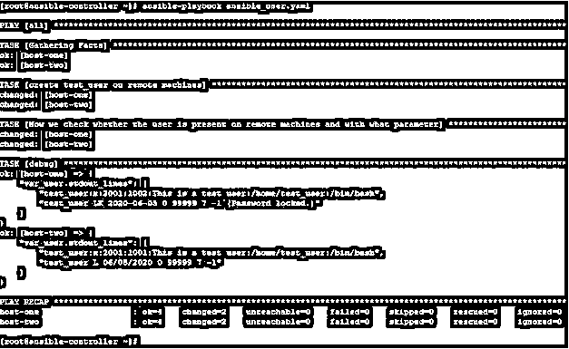
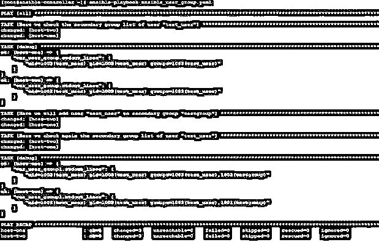
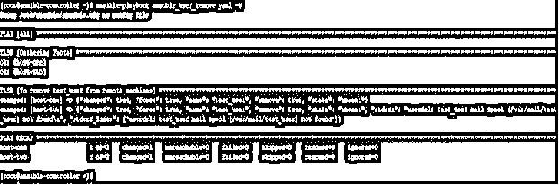

# 可变用户模块

> 原文：<https://www.educba.com/ansible-user-module/>

## Ansible 用户模块简介

Ansible 提供了许多有用的模块，可以帮助我们减轻 IT 工作的负担。对于几乎每一个操作，我们在 Ansible 中都有一个或多个模块可以执行类似的操作，这些操作本来可以通过命令或脚本来完成。

其中一个模块是用户模块，用于在远程主机上创建、删除和更新用户。这适用于远程主机上基于 Linux/Unix 的操作系统。对于基于 Microsoft Windows 的目标机器，还有另一个类似的模块，名为 win_user。在本文中，我们将了解用户模块及其可接受选项的参数。

<small>网页开发、编程语言、软件测试&其他</small>

### 什么是 Ansible 用户模块？

Ansible 用户模块是使用 Ansible 在目标远程机器上进行用户管理的一种方式。在任何操作系统中，如 Linux 或微软视窗系统；用户、组和角色管理是一个重要的部分。这使得用户基于他们被分配的特权、需求和工作范围而被隔离。

在使用 Ansible 用户模块时，我们基本上是在做与在 Linux/Unix 环境中使用用户管理相关命令相同的操作。

因此，在使用本模块时，我们需要记住以下几点:-

*   远程系统上的此模块需要一些基本要求，如果这些要求不存在，则运行此模块将会失败。这些要求因系统而异，因为从 Linux 到 Sun Solaris 各不相同
*   在远程系统的影子文件中进行更改时，文件由系统的操作系统备份，或者此行为使用的底层工具取决于目标计算机上的操作系统。
*   对于 macOS，此模块使用基于 dscl 的命令来创建、删除和修改帐户和组成员。
*   对于 FreeBSD 平台，该模块使用 pw useradd 和 chpass 命令来创建用户。

类似地，其他命令执行其他任务。

*   在所有其他基于 Linux/Unix 的操作系统上，该模块将调用 useradd、userdel、usermod 命令。

### 它是如何工作的？

在 Ansible 中，对于用户模块，我们有一组带有相关默认和可接受选项的参数。我们可以通过适当的组合来使用它们，在远程目标机器上执行与用户管理相关的必要任务。

*   **名称:**要创建/修改/删除的用户帐户的名称。
*   **密码:**设置用户的密码。
*   **注释:**设置用户的 GECOS/注释
*   **append:** 将用户分配到组列表中。默认值为“否”，这意味着新组的列表将覆盖分配给用户的当前组列表。
*   **到期时间**以纪元格式表示的到期时间。在不受支持的平台中，这将被忽略。
*   **force** :强制删除用户，与 state = exist 一起使用。
*   **home:** 设置用户的主目录
*   **组:**可以设置用户的主组。
*   **分组:**二级分组可由此设定。如果提到类似(“”)的空字符串，则所有次要组都将被删除，
*   **remove:** 与 state=absent 一起使用时删除用户关联的目录。
*   **shell:** 设置用户的工作默认 shell。
*   **状态:**指定用户是否应该在场。
*   **系统:**设置为是且状态=存在时。这使用户成为系统用户。
*   **uid:** 设置用户的 uid。

### Ansible 用户模块示例

现在，通过使用示例，我们将尝试了解 Ansible 用户模块，您可能需要在日常操作中使用它。首先，让我向您介绍我们的实验室环境。我们有一个名为 ansible-controller 的 Ansible 控制器节点。此外，作为目标远程机器，我们有两个基于 Linux 的节点，名为 host-1 和 host-2。我们将在 Ansible 控制节点 ansible- controller 上运行 Ansible 命令和剧本，并尝试在目标远程机器上进行更改。

#### 示例#1

在这个例子中，我们在远程机器上创建了一个用户，为此，我们有一个如下的剧本。

**代码:**

`hosts: all tasks:
name: create test_user on remote machines user:
name: test_user state: present uid: 2001
shell: /bin/bash
comment: This is a test user group: testgroup
name: Now we check whether the user is present on remote machines and with what parameter
shell: "getent passwd test_user;passwd -S test_user" register: var_user
debug:
var: var_user.stdout_lines`

现在像下面这样运行本行动手册，我们在远程主机上创建用户，并检查该用户的可用性和创建日期。

**代码:**

`ansible-playbook ansible_user.yaml`

**输出:**

#### 实施例 2

在本例中，我们将首先检查用户的次要组，然后向用户添加一个次要组，然后再次检查。为此，我们将使用 Ansible 模块 debug、shell 和

**代码:**

`hosts: all gather_facts: no tasks:
name: Here we check the secondary group list of user "test_user" shell: id test_user
register: var_user_group
debug:
var: var_user_group.stdout_lines
name: Here we will add user "test_user" to secondary group "testgroup" user:
name: test_user groups: testgroup append: yes
name: Here we check again the secondary group list of user "test_user" shell: id test_user
register: var_user_group1
debug:
var: var_user_group1.stdout_lines`

现在使用 ansible-playbook 命令执行这个剧本，如下所示。

**代码:**

`ansible-playbook ansible_user_group.yaml`

**输出:**

输出如下所示，您可以看到用户“test_user”没有被分配到任何次要组。然后，我们将一个组“测试组”作为次要组分配给它。现在再次检查，我们可以看到该组被列为次要组。

#### 实施例 3

要从远程机器上删除用户，请创建如下行动手册:–

**代码:**

`hosts: all tasks:
name: To remove test_user from remote machines user:
name: test_user state: absent remove: yes force: yes`

现在，运行此行动手册将产生如下输出，您可以看到用户已被删除。

**代码:**

`ansible-playbook ansible_user_remove.yaml -v`

**输出:**

### 结论

正如我们在本文中看到的，这个模块足够强大，可以让您远程进行用户管理。通过这种方式，我们可以轻松地进行用户配置，尤其是当我们有许多机器要接触时。所以先学了再用。

### 推荐文章

这是一个 Ansible 用户模块的指南。这里我们讨论一个 Ansible 用户模块的介绍，它是如何用例子来实现的。您也可以浏览我们的其他相关文章，了解更多信息——

1.  [不可变集合事实](https://www.educba.com/ansible-set-fact/)
2.  [可变模板](https://www.educba.com/ansible-template/)
3.  [可转换的 lineinfile](https://www.educba.com/ansible-lineinfile/)
4.  [可变寄存器](https://www.educba.com/ansible-register/)

