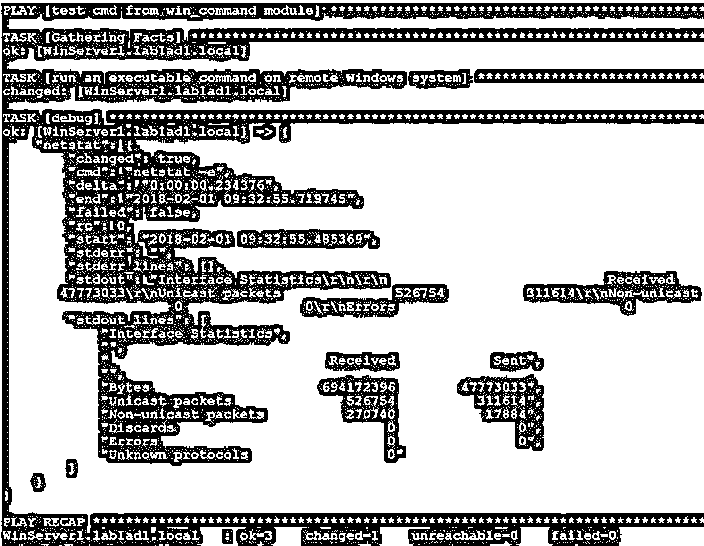

# 可转换的 Windows 模块

> 原文：<https://www.educba.com/ansible-windows-modules/>

## 可转换窗口模块的定义

可转换的 windows 模块是那些用于在 Microsoft Windows 机器上进行更改的可转换模块。这些模块的语法和行为与其他基于 Linux 的模块相同，只是特定于操作系统的任务和路径分隔符不同。可转换的 windows 模块用于在 Microsoft Windows 机器上编排任务。这些模块大部分是在 PowerShell 上开发的，而不是 Python。此外，像 WinRM 或类似的 Microsoft Windows 支持的连接方法在这种情况下使用，而不是 SSH。

### 语法和参数

Ansible Windows 模块有一组参数和可接受的值。此外，对于一些参数有默认值。因此，学习和理解各种可能性变得更加重要。这些模块与任何其他模块具有相似的语法。只有我们需要注意在剧本中传递的参数，以实现我们的任务需求。

<small>网页开发、编程语言、软件测试&其他</small>

下面是一些重要的可回答的窗口模块的列表和简短的描述。请注意，此列表仅适用于 Microsoft Windows 环境，并非详尽无遗，因为 Ansible 社区仍在开发更多模块:

*   **win_chocolatey** :用于管理包。
*   **win_chocolatey_facts** :创建用于 chocolatey 的事实集合。
*   **win_chocolatey_source** :做巧克力资源的管理。
*   **win_chocolatey_feature** :做 chocolatey 特性的管理。
*   **win_acl:** 为系统组或用户设置文件、目录或注册表的权限。
*   **win_command** :在 Windows PowerShel 上运行命令
*   **win_copy** :将文件复制到 windows 主机。
*   **win_disk_facts** :显示 windows 目标上附加的磁盘及相关信息。
*   **win_dns_record** :进行 dns 记录管理。
*   **win_domain** :确保 Windows 域存在。
*   **win_domain_controller** :管理一个域控制器。
*   **win_domain_computer** :管理活动目录计算机。
*   **win_domain_user** :管理活动目录用户。
*   **win_environment** :修改环境变量。
*   **win_eventlog** :管理 Windows 事件。
*   **win_feature** :在 Windows 上卸载和安装任何 Windows 功能。
*   **win_file** :管理文件。
*   **win_find** :查找文件。
*   **win_firewall** :管理 Windows。
*   **win_format** :进行格式化。
*   **win_get_url** :通过 HTTP/HTTPS/FTP 下载文件。
*   **win_hostname** :管理电脑名称。
*   **win_mapped_drive** :映射网络驱动器。
*   **win_package** :进行软件包安装或卸载。
*   **win_ping** :测试 windows 的工作设置
*   **win_reboot** :重启机器。
*   **win_regedit** :做注册表管理。
*   **win_service** :管理服务
*   **win_updates** :做一个 windows 更新。
*   **win_wait_for** :等待条件满足后再继续剧本
*   **win_user** :管理本地 windows 用户。
*   **win_wait_for_process** :等待一个流程不存在或存在，然后在剧本中继续。
*   **win_webpicmd** :使用 Web 平台安装程序 CLI 在目标机器上安装软件包。
*   **win_whoami** :获取当前用户的详细信息。
*   **win_iis_virtualdirectory** :在 iis 上配置一个虚拟目录。
*   **win_iis_website** :在 iis 上配置网站。
*   **win _ Li infile**:将一行放入文件中。

每个模块都有一组独立的参数和选项。你可以参考下面的链接来获得最新的 Ansible Windows 模块，在这个页面上你可以点击一个模块链接来获得那个模块的详细图片。

### 可转换窗口模块的工作

在 Ansible 中，剧本以 YAML 格式编写，剧本中的每个模块都必须遵循缩进和间距。可转换的窗口模块工作方式类似。但是在开始使用或试图开始使用 Ansible Windows 模块之前，有几点必须记住。

*   PowerShell 3.0 和。目标 Windows 上必须至少安装. NET 4.0
*   如果不存在 WinRM 侦听器，则应创建它，并且
*   在 Ansible 的最新版本中，提供了对 Win32-openSSH 的支持，但目前这还处于试验阶段。在你的情况下，它可能有效也可能无效。所以先在实验室试一下
*   除了 WinRM，还有其他连接方法，
*   由于 Windows 不是 POSIX 操作系统，所以有许多限制，因此最好在实验室中尝试每个设置
*   对于定制的新模块，您可以在 PowerShell 中创建模块代码，然后在 Python 中创建具有相同文件名的文档

### 可转换的窗口模块示例

在这一节，我们将做一些实际的例子。我们将在名为 Ansible1 的 Ansible 控制器节点上创建剧本。此外，我们将目标 windows 计算机作为 Windows 和 WinServer1.lablad1.local。使用行动手册，我们尝试从远程目标 Windows 计算机进行更改或获取数据。

#### 示例#1

在本例中，我们将简单地使用 Ansible win_ping 模块来检查从 Ansible 控制器节点到目标 windows 机器的连接和身份验证是否成功。同样，我们使用下面的命令。

`ansible window -m win_ping`

在输出中，您可以看到连接检查成功。

#### 实施例 2

在本例中，我们有一个名为 WinServer1.lablad1.local 的远程主机，我们将在其上使用名为 win_command 的可转换 windows 模块运行命令。然后在名为 netstat 的变量中注册输出。为了打印变量 netstat 中包含的输出，我们将使用 Ansible 模块 debug。对于这项任务，我们有一个如下的行动手册:

`---
-name: test cmd from win_command module hosts: lablad1.local
tasks:
-name: run an executable command on remote Windows system win_command: netstat -e
register: netstat
-debug: var=netstat`

现在按如下方式运行该行动手册:

`ansible-playbook ansible_win_command.yaml`

输出如下所示，您可以在上面的 stdout_lines 中看到运行 netstat 的所有输出

目标机上的命令:

### 结论

正如我们在本文中看到的，Ansible Windows 模块非常有用，但在 it 基础设施环境中使用起来有点棘手。但是，当我们对这些类型的模块有了很好的了解后，我们就可以轻松地对 Microsoft Windows 进行管理和操作更改。所以先学它们，再用它们。

### 推荐文章

这是一个可转换窗口模块的指南。在这里，我们还讨论了可转换窗口模块的定义和工作，以及不同的例子和代码实现。您也可以看看以下文章，了解更多信息–

1.  [可转换的文件模块](https://www.educba.com/ansible-file-module/)
2.  [可变模板](https://www.educba.com/ansible-template/)
3.  [Ansible 将用户添加到组](https://www.educba.com/ansible-add-user-to-group/)
4.  [不可变集合事实](https://www.educba.com/ansible-set-fact/)

