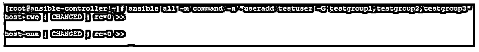
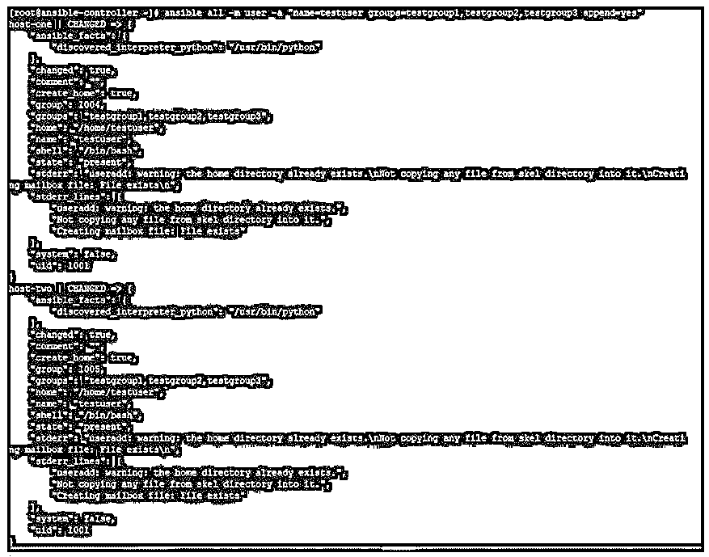
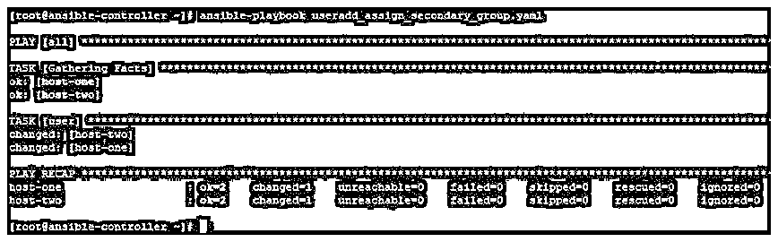
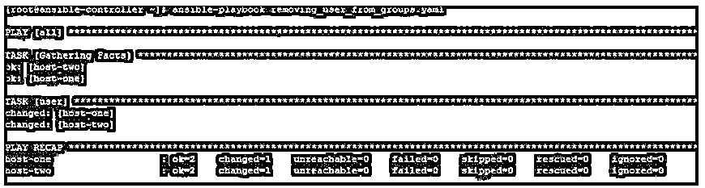

# 可将用户添加到组中

> 原文：<https://www.educba.com/ansible-add-user-to-group/>

## Ansible 向组中添加用户简介

以下文章提供了 Ansible 将用户添加到组的概述。在 Ansible 中，你有多个默认的模块，这些模块随包提供，你也可以使用 Python 这样的脚本语言创建定制的模块。这些模块的使用取决于要求和可用参数以及选项。一些模块是基本的，并且是日常任务所需要的，例如用户模块，用于在远程主机上创建、删除和更新用户。这适用于远程主机上基于 Linux 的操作系统。对于基于 Microsoft Windows 的远程主机，有另一个名为 win_user 的类似模块。在这里，我们将看到用户模块及其替代方案，用于将用户添加到远程主机上的组中。

### 可将用户添加到组中

在操作系统中，创建用户和组是为了组织特权层次结构。此外，为了按照角色管理用户，需要创建组并将其分配给这些用户。这是所有支持多用户环境和登录支持的操作系统的通用实践。使用像 Ansible 这样的配置管理自动化工具，当您有几十台目标主机时，可以轻松顺利地执行这样的操作任务。

<small>网页开发、编程语言、软件测试&其他</small>

**将用户添加到组时，参数很少。**

下面给出了几个参数:

**1。append:** 当您想要将一个用户附加到一个组或一个组列表时，这个参数很有用。

这接受两个值:

*   **是:**将“组”字段中列出的所有组添加到用户的映射组列表中，或者您可以说，将用户添加到“组”中指定的组中。
*   **否:**仅用“组”字段下提到的组覆盖用户的分配组列表，这意味着从除“组”中提到的组之外的所有组中删除用户。如果未提及任何内容，这是默认选项。

**2。组:**设置用户的主组。可接受的选项是有效的组名。

**3。groups:** 给出次要组的列表，用户将被添加到这些组中。当给定空字符串(“”)时，用户将从除其主要组之外的所有组中删除。

### 如何将用户添加到组中？

要将用户添加到组中，我们可以有两个与用户存在相关的场景:

*   用户是新用户，需要添加到现有组中。
*   用户已存在，需要添加到现有组中。

在这两种情况下，我们都可以使用 Ansible 中的命令模块或用户模块将用户添加到组中。对于命令模块，我们可以直接将 Linux 命令以纯文本形式传递到远程主机上运行。对于使用用户模块，我们可以使用 ansible 通过在命令行上传递所有参数和选项来实现这一点，或者使用 ansible-playbook 通过在 playbook 中提到所有参数和选项并执行它来实现这一点。

### 如何从组中删除用户？

*   要从组或组列表中删除用户，我们可以使用命令模块并以纯文本形式传递 Linux 命令，或者通过 ansible 或在剧本中使用用户模块并通过 ansi ble-剧本执行。
*   需要注意的一点是，在使用用户模块时，没有直接的方法从一个组或一系列组中远程控制一个用户。
*   我们应该使用追加字段，并在行动手册的“组”部分提供组列表。

### Ansible 将用户添加到组的示例

下面是提到的例子:

这里我们有一个名为 ansible-controller 的 Ansible 控制服务器和两个名为 host-1 和 host-2 的远程主机。我们将创建剧本，在 ansible-controller 节点上运行 ansible 命令，并在远程主机上管理用户。

#### 示例#1

在创建次要组时，将新用户添加到次要组列表中。

这可以通过以下不同方式实现:

形容词（adjective 的缩写）使用命令模块并传递 Linux 命令，以用户身份添加，并将一个组列表作为次要组分配给它。

**代码:**

`ansible all -m command -a "useradd testuser -G testgroup1,testgroup2,testgroup3"`

**输出:**

您可以检查用户是在远程主机中创建的，并分配如下组:

**代码:**

`id testuser`

**输出:**

**代码:**

`id testuser`

**输出:**

b.使用 ansible 并在命令行上传递所有参数，如下所示:

**代码:**

`ansible all -m user -a "name=testuser groups=testgroup1,testgroup2,testgroup3 append=yes"`

**输出:**

在检查目标系统时，您将发现用户已创建并作为次要组分配给列出的组。

**代码:**

`id testuser`

**输出:**

**代码:**

`id testuser`

**输出:**

碳（carbon 的缩写）使用 ansible-playbook，将您的所有需求写在一个名为 playbook 的 YAML 文件中，该文件以密钥对的形式包含所有值。

行动手册的内容如下所示:

**代码:**

`hosts:
all
tasks:
user:
name: testuser
groups:
testgroup1,testgroup2,testgroup3
append: yes`

当执行时，如下所示:

**代码:**

`ansible-playbook useradd_assign_secondary_group.yaml`

**输出:**

在远程主机上，您可以进行如下检查:

**代码:**

`id testuser`

**输出:**

**代码:**

`id testuser`

**输出:**

#### 实施例 2

用于向组中添加现有用户。你可以像上面一样使用命令模块或用户。但是我们最好练习写剧本，因为这样更有条理。此外，输出易于阅读。

我们可以写一个如下的剧本:

**代码:**

`hosts:
all
tasks:
user:
name: testuser
groups:
testgroup4
append: yes`

然后像下面这样执行:

**代码:**

`ansible-playbook adding_user_to_group.yaml`

**输出:**

此外，在检查远程主机时，我们可以看到一个新组被添加到次要组列表中。

**代码:**

`id testuser`

**输出:**

**代码:**

`id testuser`

**输出:**

#### 实施例 3

为了从组中删除用户，我们使用了 append with value。

为此，我们可以创建如下行动手册:

**代码:**

`hosts:
all
tasks:
user:
name: testuser
groups:
testgroup4
append: no`

然后如下执行它:

**代码:**

`ansible-playbook removing_user_from_groups.yaml`

**输出:**

On remote hosts, if you check you will find that, the user testuser have only testuser4 as secondary group and it has been removed from rest of all secondary groups,

**代码:**

`id testuser`

**输出:**

**代码:**

`id testuser`

**输出:**

### 结论

从组或组列表中添加和删除用户是一项重复的任务。这很重要，但在命令行上手动执行时有时会令人困惑。因此，更好的做法是为这样的任务维护一个剧本，并在执行过程中实时传递实际值。

### 推荐文章

这是一个向群组添加用户的指南。这里我们讨论 Ansible 将用户添加到组的介绍以及如何将用户添加到组？如何从组中删除用户？还有例子。您也可以看看以下文章，了解更多信息–

1.  [可变循环](https://www.educba.com/ansible-loop/)
2.  YAML
3.  [可翻译版本](https://www.educba.com/ansible-versions/)
4.  [可旋转拱顶](https://www.educba.com/ansible-vault/)

