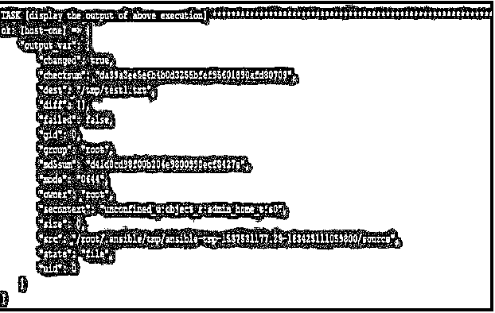
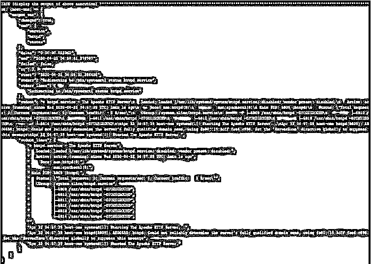
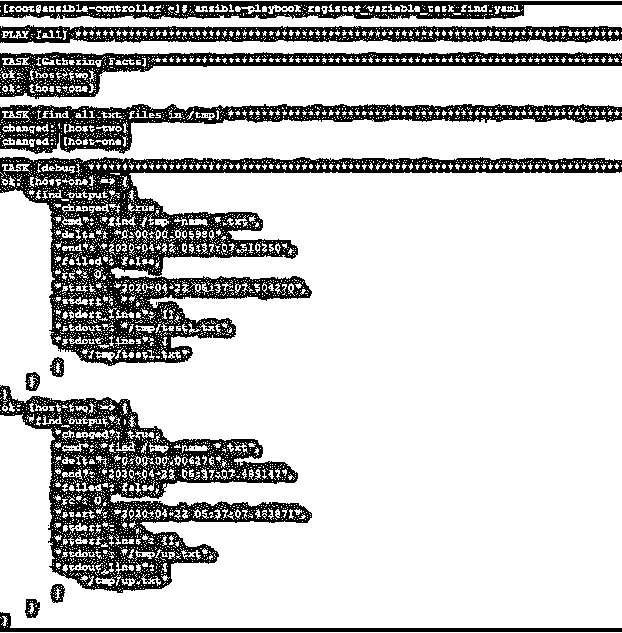
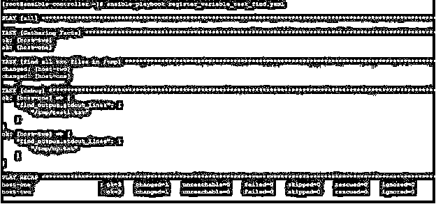

# 可变寄存器

> 原文：<https://www.educba.com/ansible-register/>

## Ansible 寄存器介绍

Ansible 寄存器是一种从任务执行中捕获输出并将其存储在变量中的方法。这是一个重要的特性，因为每个远程主机的输出都是不同的，在此基础上，我们可以使用条件循环来执行一些其他任务。此外，每个寄存器值在整个剧本执行过程中都有效。因此，我们可以利用 set_fact 来操作数据，并相应地为其他任务提供输入。在本文中，我们将学习并看到在不同场景中使用 register 的例子。我们还将看到如何只使用注册变量中的一条信息。

### 可变寄存器

对于我们在变量中注册的任何任务输出，它都以 JSON 中预定义的格式存储。对于不同的任务，我们将得到不同的输出，它以 ansible 文档中定义的方式存储。当我们看到输出时，我们将看到根据 ansible 文档的值和一些字段，这些字段将在每个输出中显示，如已更改。

<small>网页开发、编程语言、软件测试&其他</small>

下面是我们尝试将文件从控制节点复制到远程节点的任务的输出。我们注册了它，并显示了如下注册变量:

### Ansible 寄存器是如何工作的？

这些是变量，任务的输出将存储在 Ansible Control 服务器上。简而言之，当您想要在远程计算机上运行一个命令，然后将输出存储在一个变量中，并在以后的游戏中使用输出中的一条信息时。这种用法可以通过注册变量来实现。这有点像由设置模块发现和获取的系统事实。在这里，无论您运行什么命令，其输出都将以 JSON 格式保存，然后您可以像使用 facts 一样使用这些信息。

有关内容如下的行动手册的另一个参考:

*   hosts:host-one tasks:name:check HTTP status 命令:service httpd status 寄存器:output_var

*   名称:显示上面执行调试的输出:var: output_var

其中我们检查了名为 host-one 的远程服务器上 httpd 服务的状态。你会看到；在下面的输出中，我们得到了在远程主机上执行的命令的每个细节。类似地，当我们运行任何其他模块并在变量中注册其输出时。我们将注意到关于任务执行的所有细节，相关信息将在 JSON 字段中看到。

您将在输出中看到大多数字段，我们将尝试探究其中的一些字段。

*   **changed—**根据远程主机的状态，这将为真或假。如果状态已更改，则它将包含真，否则它将包含
*   **cmd–这个**是在远程主机上运行的命令
*   **增量–**执行命令所花费的时间
*   **结束–**任务完成的结束日期和时间
*   **失败–**如果任务失败与否，它会有 true 或 false 值
*   **RC—**返回代码
*   **开始—**任务的开始日期和时间
*   **stderr–**单行中的标准错误消息
*   **stderr _ lines–**标准错误消息在单独的行中
*   **stdout**–单行输出
*   **stdout _ lines—**输出在单独的行中

### 实现可变寄存器的示例

现在，通过使用示例，我们将尝试了解 ansible 寄存器，您可能需要在日常操作中使用它。我们将举一些例子，但是在去那里之前，我们首先了解我们用于测试目的的实验室。

这里我们有一个名为 ansible-controller 的 Ansible 控制服务器和两个名为 host-1 和 host-2 的远程主机。我们将创建剧本，在 ansible-controller 节点上运行 Ansible 命令，并管理来自远程主机的已执行任务的信息

#### 示例#1

在下面的例子中，我们试图找到。txt 文件并在一个变量中捕获输出，然后将显示那个变量 find_output。首先看看行动手册的内容，比如

**代码:**

`- hosts: all tasks:
name: find all txt files in /tmp shell: "find /tmp -name *.txt" register: find_output
debug:
var: find_output`

执行之后，我们将看到下面的输出，在这个输出中，在 stdout_lines 下面，我们将看到找到的文件的名称。

**输出:**

`ansible-playbook register_variable_task_find.yaml`

#### 实施例 2

如果您只想查看文件，那么请更新行动手册并执行如下调试任务:

**代码:**

`- debug:
var: find_output.stdout_lines`

**输出:**

`ansible-playbook register_variable_task_find.yaml`

#### 实施例 3

在本例中，我们正在检查远程主机上的空闲内存和正常运行时间。我们创建了一个如下的剧本。这里我们使用 stdout_lines 只显示

**代码:**

`---
hosts: host-two tasks:
name: To check the uptime of remote host command: uptime
register: uptime_var
name: To check free memory on remote host shell: free -m
register: free_var
debug:
var: "{{ item }}" loop:
stdout_lines
stdout_lines`

**输出:**

`ansible-playbook register_multiple_variable.yaml`

#### 实施例 4

在下面的示例中，我们使用了 when 条件，并检查文件是否存在于远程主机上，如果文件不存在，则创建它，否则跳过创建。我们简单地通过 ls 检查文件的存在，并检查返回代码。在 Linux 中，如果任何命令成功，则返回代码为零，否则为非零。我们创建了一个示例行动手册，如下所示:

**代码:**

`---
hosts: all tasks:
name: check whether /tmp/test1.txt exists or not command: ls /tmp/test1.txt
register: check_rc_var ignore_errors: yes
debug:
var: check_rc_var.rc
name: create file /tmp/test1.txt when it doesn't exists already file:
path: /tmp/test1.txt state: touch
when: check_rc_var.rc != 0`

部署此行动手册时，我们将看到如下输出。在这里，您可以看到，在文件不存在的远程主机上，行动手册显示了一条错误消息，返回代码将为非零值；在文件存在的远程主机上，它显示任务状态随着 ls 命令成功运行而更改，在这种情况下，返回代码也将为零。因此，在此基础上，该文件在主机 2 上创建，在主机 1 上跳过。

**输出:**

`ansible-playbook register_condition.yaml`

### 结论

在 Ansible 中，使用 register 非常有用，尤其是在生产环境中。为不同的远程节点捕获不同输出的可行性非常有用。此外，由于输出存储在 JSON 中，其他工具很容易将其作为输入进行读取和解析。所以学习它并明智地使用它。

### 推荐文章

这是一本语域指南。在这里，我们讨论一个关于可转换寄存器的介绍，它是如何与相应的例子一起工作的。您也可以浏览我们的其他相关文章，了解更多信息——

1.  YAML
2.  [可承担的角色](https://www.educba.com/ansible-roles/)
3.  [可回答的标签](https://www.educba.com/ansible-tags/)
4.  [可翻译版本](https://www.educba.com/ansible-versions/)

