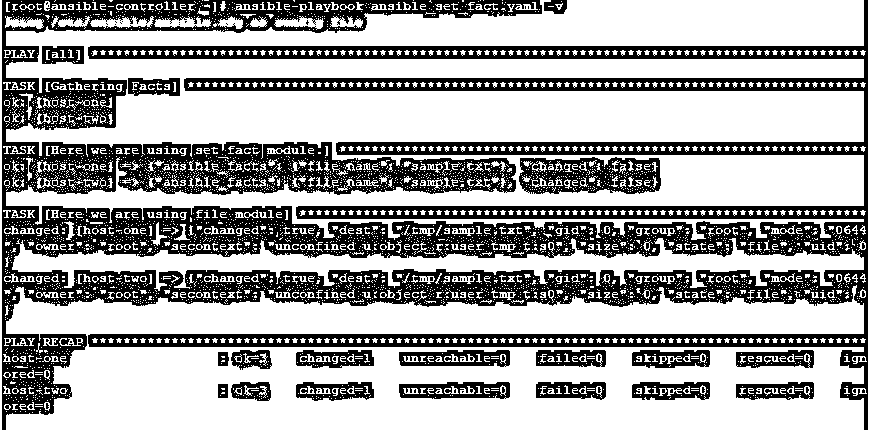
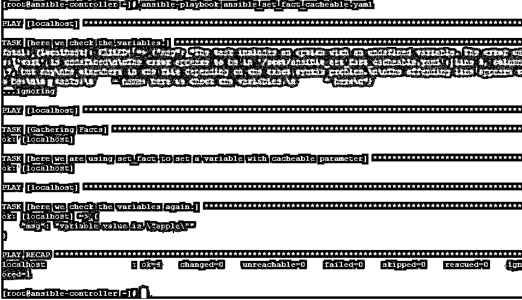

# 可变集合事实

> 原文：<https://www.educba.com/ansible-set-fact/>

## 集合事实简介

在 Ansible 中，我们有各种处理变量的模块，用于获取或设置变量值。set_fact 就是这样一个重要的模块。该模块用于设置新变量。这些变量是在逐个主机的基础上设置的，就像由设置模块发现的 ansible 事实一样。这些变量可用于剧本中的后续行动。

这些变量设置了优先级，但是根据标准的 ansible 优先级，许多其他类型的变量具有更高的优先级。因此该值可能会被覆盖。在 Microsoft Windows 中使用此模块时，可以获得相同的行为和功能。

<small>网页开发、编程语言、软件测试&其他</small>

### 什么是 Ansible Set_Fact？

Ansible set_fact 不同于 vars、vars_file 或 include_var，其中您事先知道变量值，而当使用 set_fact 时，我们可以在使用某些任务(如使用过滤器或获取另一个变量的子部分)准备值后存储该值。当与参数 cacheable 等于 yes 一起使用时，可以使用事实缓存跨执行使用该变量。

set_fact 下的变量赋值是通过使用键对值来完成的，其中键是变量名，值是对它的赋值。下面是一个简单的例子:-

`- set_fact:
one_fact: value1
second_fact:
value2`

### Ansible Set_Fact 是如何工作的？

Ansible set_fact 的工作行为与 Ansible vars 相同。但是使它更适合动态环境的是在处理后存储数据的灵活性。我们有以下可用参数和可接受值。

*   **可缓存:**它接受值“是”或“否”。当设置为 yes 时，变量及其值存储在事实缓存中，并且该变量可以跨执行使用。如果启用了事实缓存，此参数设置为“yes”时，会将变量转换为将添加到事实缓存中的实际“事实”。默认情况下，该选项设置为“否”
*   **key-value:** 该模块以 key=value 对为变量，在剧本中设置。

下面也是一些我们在实际例子中使用 set_fact 之前应该注意的点。

*   key=value 对只创建布尔值或字符串。如果你想创建列表/数组或字典，我们将使用如下。

`Var: [var1, var2]`

*   我们可以使用可变过滤器为。
*   我们可以根据何时设置变量来使用可变条件。

### 不确定集合事实的例子

现在，通过使用示例，我们将尝试了解 Ansible set_fact，您可能需要在日常操作中使用它。我们将举一些例子，但在去那里之前，我们首先了解我们的实验室，我们用于测试目的。

这里我们有一个名为 ansible-controller 的 Ansible 控制服务器和两个名为 host-1 和 host-2 的远程主机。我们将创建剧本，在 ansible-controller 节点上运行 Ansible 命令，并在远程主机上查看结果。

#### 示例#1

在本例中，我们将创建一个如下所示的剧本，其中我们使用 set_fact 为变量赋值。然后使用相同的变量在目标上创建一个文件。

`---
- hosts:
all tasks:
- name: Here we are using set_fact
module. set_fact:
file_name: sample.txt
- name: Here we are using file
module file:
path: /tmp/{{ file_name
}} state: touch`

在如下所示的详细执行之后:

`ansible-playbook ansible_set_fact.yaml -v`

我们得到下面的输出，我们可以看到文件是用目标节点上的变量值创建的。

#### 实施例 2

在本例中，我们将创建一个如下所示的剧本，其中我们使用 set_fact 为变量赋值。然后使用相同的变量在目标节点上创建文件。

`---
- hosts: all tasks:
- name: Here we are using set_fact to set variables set_fact:
file1: test1.txt file2: test2.ini file3: test3.txt
- name: Here we use file module to create files with variable values as names file:
path: /tmp/{{ item }} state: touch with_items:
- "{{ file1 }}"
- "{{ file2 }}"
- "{{ file3 }}"`

如下所示执行后:

`ansible-playbook ansible_set_facts.yaml -v`

我们得到下面的输出，我们可以看到创建了多个文件，文件名与我们在 set_fact 模块下设置的变量值相同。

#### 实施例 3

在这个例子中，我们想要过滤一个列表，所以我们使用了一个选择过滤器，它与一个关键字匹配一起使用。像 list 这样的其他过滤器也可以和它一起使用。然后将结果值赋给变量并打印变量值。我们可以制作一个剧本，内容如下:–

`---
- hosts: all tasks:
- set_fact:
interfaces_list: "{{ ansible_interfaces | select('match', '^(eth|wlan)[0-9]+') | list
}}"
- debug:
msg: The interface's list on "{{ ansible_hostname }}" is "{{ interfaces_list }}"`

输出如下所示:

`ansible-playbook filter_select_match.yaml`

#### 实施例 4

在本例中，我们将创建两个剧本，其中一个剧本我们使用 set_fact 为变量赋值，并使用 cacheable: yes 选项使该变量可跨执行使用。然后，我们将此行动手册导入第二个行动手册，并在第二个行动手册中使用第一个行动手册中的变量。第一部剧本如下:–

`---
- hosts: localhost tasks:
- name: here we are using set_fact to set a variable with cacheable parameter set_fact:
var1: apple cacheable: yes`

第二个行动手册，即导入第一个行动手册的地方，如下所示:

`---
- hosts: localhost gather_facts: no tasks:
- name: here we check the variables. debug:
var: "{{ var1 }}" ignore_errors: yes
- name: here we are including another playbook import_playbook: var_task.yaml
- hosts: localhost
gather_facts: no tasks:
- name: here we check the variables again. debug:
msg: variable value is "{{ var1 }}"`

如下所示执行后:

`ansible-playbook ansible_set_fact_cacheable.yaml`

我们得到了下面的输出，我们可以看到，首先，当调试模块试图打印变量 var1 时，它给出了一个错误，但是当我们导入第一个剧本时，其中变量是使用 set_fact 设置的，并通过提到 cacheable 使其可跨执行使用:是的，然后再次使用 debug 打印变量值，我们可以打印它。

### 结论

Ansible set_fact 是一个有用的工具。这有助于您从远程主机收集信息，并增加了在分配信息之前修改信息的灵活性。此外，您可能会承认，如果您有许多主机要由 Ansible 管理，那么使用 set_fact 是相当复杂的。所以我们首先需要分析，我们是否需要设定事实，然后相应地使用这些事实。

### 推荐文章

这是一个简单事实的指南。在这里，我们还讨论了 ansible set fact 的介绍以及如何使用不同的示例和代码实现。您也可以看看以下文章，了解更多信息–

1.  [可承担的角色](https://www.educba.com/ansible-roles/)
2.  [可回答的标签](https://www.educba.com/ansible-tags/)
3.  [可变循环](https://www.educba.com/ansible-loop/)
4.  [可翻译版本](https://www.educba.com/ansible-versions/)
5.  [Ansible 将用户添加到组|示例](https://www.educba.com/ansible-add-user-to-group/)
6.  Ansible Hosts 文件|如何工作？
7.  [责任处理程序指南](https://www.educba.com/ansible-handlers/)

