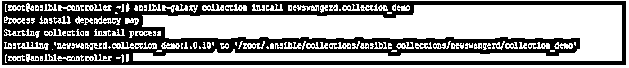
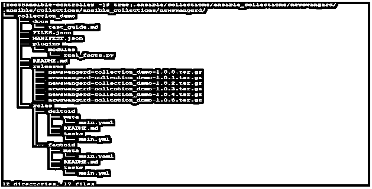

# 可变集合

> 原文：<https://www.educba.com/ansible-collections/>

## Ansible 集合简介

可变集合是可变内容的格式，例如模块、角色、剧本和插件等。可以跨 Ansible 社区和 Ansible 用户分发给 Ansible 用户。一个可行的集合可以包括一个角色，模块，剧本，插件。这个发布由 Ansible Galaxy 执行，这是一个你可以安装或获取其他开发者共享内容的地方。此外，您可以将您的代码/内容上传到 Ansible Galaxy 以进一步分享。Ansible Galaxy 服务器有一个全球位置，但是如果你有其他的 Galaxy 服务器，比如 RedHat Automation Hub，那么你可以在你的 Ansible 设置中配置相同的位置。

### 解释可变集合

从 Ansible Galaxy 中收集 Ansible 集合的方式与我们导入任何角色的方式相同。在运行命令和使用行动手册中的任何集合时，只需要注意一些语法变化。

<small>网页开发、编程语言、软件测试&其他</small>

因此，以下是你在收藏时必须记住的几点。

*   要安装集合，您可以使用下面的命令。但是请注意，我们在这里使用了-p 来指定 Ansible 集合的位置，这是由 Ansible 配置文件中的 COLLECTIONS _ PATHSin 设置的，默认情况下为~/。ansi ble/collections:/usr/share/ansi ble/collections。

`ansible-galaxy collection install<collection_name> -p <collection_local_location>`

*   除了收藏的默认位置，您还可以将您的收藏放在与您的剧本相邻的名为 collections/ansi ble _ collections/的目录中。这将遵循下面的目录结构。

`my_playbook.yaml
├── collections/
│   └── ansible_collections/
│               └── our_Ansible_namespace/
│                   └── our_Ansible_collection/< a playbook relevant collection's structure>`

*   默认情况下，银河服务器将被用作 https://galaxy.ansible.com，如果你想改变它，那么你需要修改你的工作 cfg 文件，并将你的银河服务器列在银河服务器列表下。此外，您可以在命令行中使用–server 来限制您的集合的搜索。如果你想默认使用 Ansible 服务器而不是全球 Ansible Galaxy location。您可以修改 ansible.cfg 文件并使用名为[galaxy]的部分。然后在 server_list 后面放一个集合列表。

下面是这样一个部分的例子，我们列出了两个集合，一个是 RedHat Automation Hub，另一个是样本，可以由我们手动准备:-

`[galaxy] server_list = automation_hub, sample_galaxy_collection
[galaxy_server.automation_hub] url=https://cloud.redhat.com/api/automation-hub/
auth_url=https://sso.redhat.com/auth/realms/redhat-external/protocol/openid-connect/token
token=automation_hub_token
[galaxy_server.sample_galaxy_collection] url=https://galaxy-dev.ansible.com/
token=sample_token`

正如你在上面看到的，Ansible 为 Ansible 集合接受了某些参数。

以下是相同的列表:–

*   **url** :一个可转换集合的位置。
*   **令牌**:与用户名互斥。这是用来验证银河服务器。
*   **用户名**:与 token 互斥，用于 Galaxy Server 的基本认证。
*   **密码**:这是上面用户名的密码。
*   **auth_url** :这与用户名互斥。auth_url 需要一个令牌。所以这提供了令牌端点的位置

当从 Ansible Galaxy 安装任何集合时，默认情况下将安装最新版本。但是如果你需要一个特定的版本，你可以使用下面的操作符来指定一个版本。

*   :*对于任何版本，这是默认设置，将查找最新版本。
*   :!=对于不等于指定版本的任何版本。
*   :==对于指定的版本。
*   :> =对于大于等于此处指定版本的任何版本。
*   :>对于任何高于规定的版本。
*   :< =对于低于或等于此处指定版本的任何版本。
*   :

除了在命令行上安装，还可以设置一个类似 yaml 的文件，在这里可以在关键字 collections 下给出需要安装的集合列表。当您在同一个文件中定义了您的角色时，这也是可行的。示例文件如下所示:–

`---
collections:
# Installing collection from Ansible_Galaxy.
- name: <namespace_name.collection_name>
source: https://galaxy.ansible.com
roles:
# Installing role from Ansible_Galaxy.
- name: <role_name>`**T2】**

如果在这些情况下，为了方便起见，在同一个文件中定义了不同的角色和集合

简单和整合。您可以简单地使用下面的命令只从这个文件安装集合。

`ansible-galaxy collection install -r requirements.yml -p ./<file_location>`

安装后，要在行动手册中使用一个 Ansible 集合，您应该通过使用它 FQCN(完全限定的集合名称)来引用它。这种引用适用于模块、插件以及角色。下面是一个代码示例。

`---
- hosts: all
collections:
- customized_namespace.customized_collection
tasks:
- import_role:
name: <role_name>
- my_module:
key: value`

同样，其他选择也很少。

### Ansible Collections 如何工作？

在这一节中，我们将看到如何使用 Ansible 集合。我们将从 Ansible Galaxy 下载并安装一个集合，然后使用其中的一个模块在本地主机上做一些事情。我们将安装一个名为 newswangerd.collection_demo 的 Ansible 集合示例，这是我刚刚在 Ansible galaxy 网站(https://galaxy.ansible.com/)上通过搜索找到的。

我们将使用下面的命令来安装这个 Ansible 集合，这里我们没有给出任何到 galaxy 服务器的路径，所以默认情况下，它将重定向到全局 Ansible Galaxy 服务器以获取源代码。

`ansible-galaxy collection install newswangerd.collection_demo`

在输出中，我们可以看到，安装过程开始并在我的工作区下创建了一个目录结构。

如果我们研究由此创建的目录结构，那么我们有以下内容:-

`tree .ansible/collections/ansible_collections/newswangerd/`

现在，使用这个 Ansible 集合中的一个模块可以如下完成，我们可以在上面的图片中看到，我们有一个名为 real_facts 的模块，它基本上会在显示器上打印一些行:-

`ansible localhost -m newswangerd.collection_demo.real_facts`

现在，通过运行它，我们将得到如下输出:-

请注意，以上只是一个向您展示其工作原理的示例。您可以在 Ansible Galaxy 中浏览所需的集合，也可以使用 Python 脚本自己开发一个集合。

### 结论

正如我们在本文中看到的，集合是将内容分发给用户或从开发人员分发给管理员的好方法。这有助于巩固和简化相似或相同类型的剧本、角色、模块和插件。将这种能力添加到你的技能组合中会让你变得更强。所以，先学了再用。

### 推荐文章

这是一个关于 Ansible 集合的指南。在这里，我们讨论了一个关于 Ansible 集合的介绍，以及它的详细解释和例子。您也可以看看以下文章，了解更多信息–

1.  [可变动态库存](https://www.educba.com/ansible-dynamic-inventory/)
2.  [易变的 Apt](https://www.educba.com/ansible-apt/)
3.  可变防火墙
4.  [易受攻击的主机文件](https://www.educba.com/ansible-hosts-file/)

