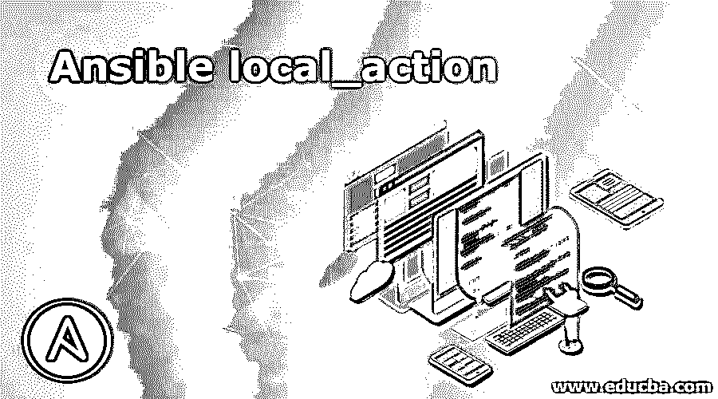
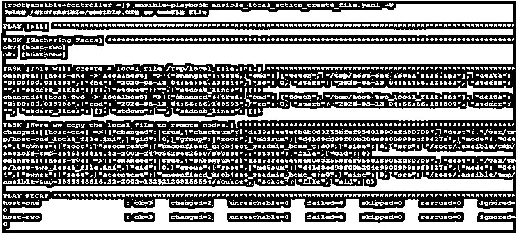
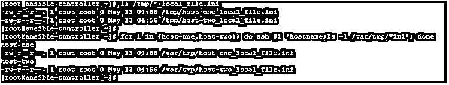
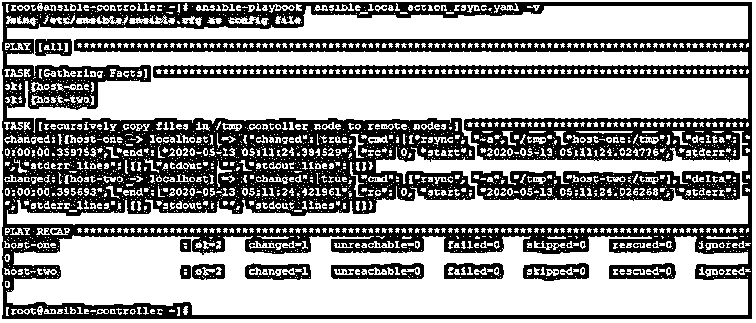
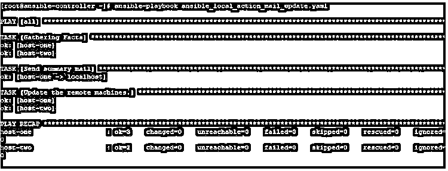
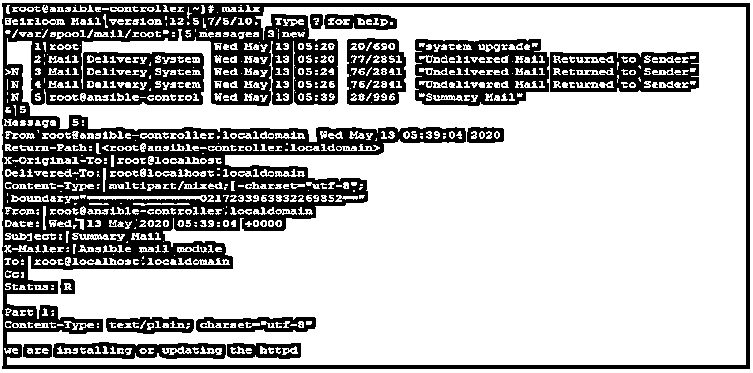

# 易变局部 _ 动作

> 原文：<https://www.educba.com/ansible-local_action/>

## Ansible local_action 简介

在 Ansible 中，我们总是倾向于在远程目标节点上工作，为此我们编写剧本、任务。这是一个普遍的理解，除非另有说明，否则在游戏和任务中编写的任何东西都将在远程目标主机上执行。但是很多时候你会遇到这样的情况，在剧本之间或者在一部戏的两个任务中间，你需要在本地或者控制器机器上工作来生成一些数据或者做一些修改。在这种情况下，我们需要像 local_action、delegate_to、run_once 这样的特性参数，这些参数非常有用。在这篇文章中，我们将学习 Ansible local_action 以及使用它的方法。

### 解释 Ansible local_action

Ansible 有许多特性参数，在您需要将任务委派给目标远程主机之外的其他主机时非常有用。这些参数包括 local_action、delegate_to。当 delegate_to 用于使用主机名 localhost 或 IP 127.0.0.1 在本地机器上委托任务时，它与使用 local_action 参数相同。我们可以使用这两个中的任何一个。

<small>网页开发、编程语言、软件测试&其他</small>

这是很有用的，因为我们可以在更新包和修改相关配置文件的两个任务之间发送邮件，以及在将文件发送到远程节点之前在本地创建或修改文件。

### Ansible local_action 是如何工作的？

在 Ansible 剧本中，当使用 local_action 时，Ansible 将在控制器节点上运行它下面提到的模块工作。与 local_action 一起使用的主要模块是 shell 和 command。因为您可以在控制器节点上使用这些模块完成几乎所有的任务。

`---
# ...
tasks:
- name: a sample module
local_action: command <command to execute>`

但是，即使您想使用 Ansible 模块在本地工作，您也可以像下面这样使用它:–

`---
# ...
tasks:
- name: sample module local_action:
module: <module name>
<....module parameter...>
<....other feature parameters   >`

在下一节中，我们将通过一些例子来了解使用它的一些可能的方法。但是您必须注意要使用的语法和缩进。

### 例子

现在，通过使用示例，我们将尝试了解一个可行的特性参数 local_action 以及其他一些有用的参数，这些参数在日常操作中可能会用到。我们将举一些例子，但在去那里之前，我们首先了解我们的实验室，我们用于测试目的。

这里我们有一个名为 ansible-controller 的 Ansible controller 服务器和两个名为 host-1 和 host-2 的远程主机。我们将创建剧本，在 ansible-controller 节点上运行 Ansible 命令，并在远程主机上查看结果。

在本例中，我们创建了一个剧本，内容如下，我们试图实现当我们使用 local_action 时，将在控制器节点中创建一个文件，然后，该文件将被复制到远程目标

`---
hosts: all tasks:
name: This will create a local file /tmp/local_file.ini.
local_action: command touch /tmp/"{{ ansible_hostname }}"_local_file.ini
name: Here we copy the local file to remote copy:
src: /tmp/{{ ansible_hostname }}_local_file.ini dest: /var/tmp/`

使用以下命令执行行动手册:–

`ansible-playbook ansible_local_action_create_file.yaml -v`

输出如下所示:-

这里我们可以看到，当 playbook 运行时，在远程目标节点上复制了一个文件，这个文件是在提到 local_action 的任务中创建的，并且是在本地机器上执行的。可变控制器节点。

`ll /tmp/*_local_file.ini`

在本例中，我们创建了一个剧本，内容如下，在这里，我们试图实现在远程控制器节点上执行 Rsync directory /tmp

`---
hosts: all tasks:
name: recursively copy files in /tmp contoller node to remote local_action: command rsync -a /tmp {{ ansible_hostname }}:/tmp`

使用以下命令执行行动手册:–

`ansible-playbook ansible_local_action_rsync.yaml -v`

输出如下所示:-

在这里我们可以看到，当 playbook 运行时，它在远程目标节点上与任务中的控制器节点进行了 rsync，其中提到了 local_action，并在本地机器上执行。可变控制器节点。

在这个例子中，我们创建了一个内容如下的剧本，在这里我们试图实现当我们在远程机器上更新一个包时，一封邮件应该被发送到一个电子邮件帐户，带有邮件正文和主题，以便邮件所有者被通知这些变化。还要注意 run_once 的使用，它只执行发送邮件

`---
hosts: all tasks:
name: Send summary mail local_action:
module: mail
subject: "Summary Mail" to: root@localhost
body: we are installing or updating the httpd run_once: True
name: Update the remote machines. yum:
name: httpd state: latest`

使用以下命令执行行动手册:–

`ansible-playbook ansible_local_action_mail_update.yaml`

输出如下所示:-

在这里，我们可以看到，当 playbook 运行时，它确实尝试在远程目标节点上升级 httpd 包，并且提到 local_action 的邮件任务是在本地机器上执行的。可变控制器节点。此外，它只执行了一次，因为我们已经使用了 run_once。

我们可以检查邮件是否被创建和发送，检查我们是否有 mailx 工具。使用它我们可以阅读如下邮件:-

`mailx`

在本例中，我们创建了一个行动手册，内容如下，我们试图在负载均衡器后面的服务器集群中实现这一点。为了避免停机，我们从群集中取出一台服务器，对其进行更新，然后将其添加回群集

`---
hosts: web_servers tasks:
name: make a server out of LB pool
local_action: command: /script_to_take_out {{ inventory_hostname }}
name: update the relevant package yum:
name: package to update state: latest
deleagte_to: {{ inventory_hostname }}
name: add back the server to LB pool
local_action: command: /script_to_add {{ inventory_hostname }}`

我们可以用现实生活中的值替换上面的样本并使用它们。具有 delegate_to 的任务将在后面提到的机器上运行。

### 结论

正如我们所看到的，使用 local_action 有点棘手，但是它可以帮助您克服为涉及本地主机或控制器机器以及目标远程机器的简单任务运行多个剧本的问题。此外，正如您在示例中看到的，将它与 run_once 等其他特性参数一起使用会使它更易于使用。所以先学了再用。

### 推荐文章

这是一个关于 Ansible local_action 的指南。这里我们讨论 Ansible local_action 如何与命令和相应的例子一起工作。您也可以阅读以下文章，了解更多信息——

1.  [可承担的角色](https://www.educba.com/ansible-roles/)
2.  [可翻译版本](https://www.educba.com/ansible-versions/)
3.  [如何安装 Ansible？](https://www.educba.com/install-ansible/)
4.  [可执行的命令](https://www.educba.com/ansible-commands/)

