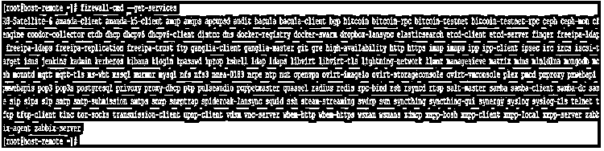
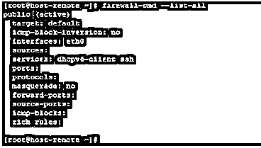
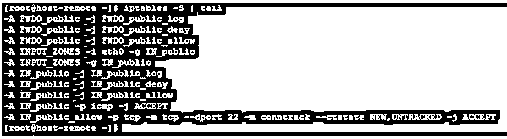
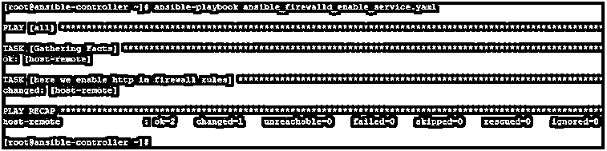
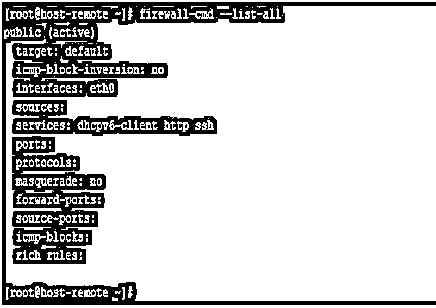
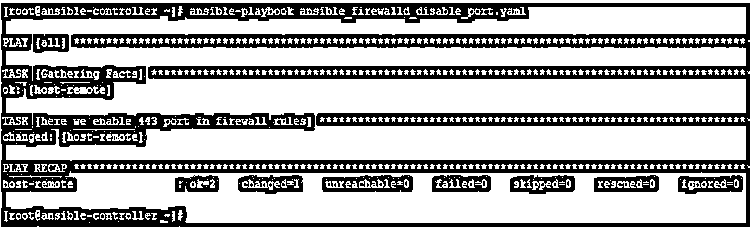
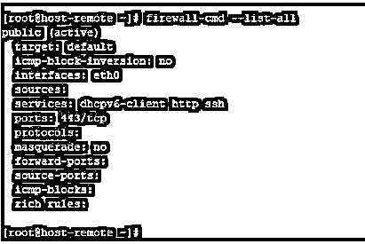
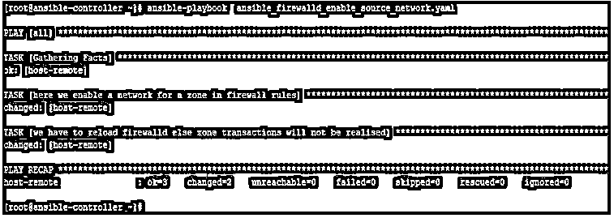
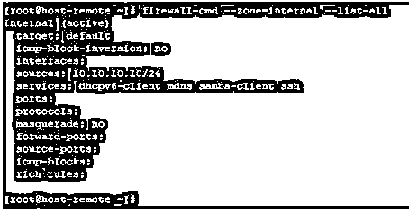

# 易变防火墙

> 原文：<https://www.educba.com/ansible-firewalld/>

## Ansible 防火墙简介

在 Ansible 中，我们有许多模块为我们提供了在远程主机上执行操作工作的能力。尤其是要在 Linux 远程主机上完成的操作。其中一个模块叫做 firewalld，用于管理 Linux 系统的防火墙规则。在这个主题中，我们将学习 Ansible Firewalld。

正如我们所知，Linux 系统可以有一个 firewalld 守护程序，它通过 firewall-cmd 实用程序更新机器上运行的或永久的防火墙规则，从而允许/阻止对服务、网络和端口的访问。Ansible 使用 firewalld 模块对其进行管理。

<small>网页开发、编程语言、软件测试&其他</small>

### 解释易受攻击的防火墙

Ansible firewalld 是用于更新远程主机上的防火墙规则的模块。这里的远程主机是 Linux 机器。端口可以是 TCP 或 UDP，可以启用或禁用。同样，可以允许或阻止服务。

在使用 Ansible firewalld 模块时，我们应该注意以下几点:-

*   根据最新的 Ansible firewalld 模块，将修改防火墙规则的主机上的 firewalld 版本应等于或高于 2.11。
*   这个模块没有在基于 Debian 的
*   需要 firewalld 的 python2 绑定。在 python2 绑定不可用的地方，可以使用 python3 绑定，但是我们必须将 ansible_python_interpreter 设置为 python3 解释器路径并安装 python3
*   Ansible firewalld 中有一个已知的限制，即哪些区域事务必须显式地是永久的。这也意味着，当我们添加一个区域并希望对其执行即时操作时，我们需要重新加载 firewalld 服务。但是这样做的时候要小心，因为重新加载防火墙将会撤销所有非永久性的操作
*   此模块不保证有向后

除了以上几点，我们还应该知道以下在防火墙中大量使用的术语。

*   **Zone** : Zone 是一个逻辑网络位置，它可以是任意的，但可以根据流量将从哪个网络发出，或者本地网络接口连接到哪个位置来定义。
*   **服务**:服务是作为套接字工作的一系列端口和协议组合，我们的主机监听这些端口和协议组合，然后可以将它们放在一个或多个
*   **端口**:这些是代表服务端点的逻辑结构

### Ansible Firewalld 是如何工作的？

Ansible Firewall 具有以下可用参数及其各自的可接受值。使用这些方法的组合，我们可以满足关于修改远程主机上的防火墙规则的要求，但是在对目标系统进行任何更改之前，我们应该始终考虑规划和上一节中讨论的所有要点，还建议在进行任何更改之前备份规则。

因为以特别的方式处理规则会导致混乱，我们需要花费数小时和网络支持来识别防火墙规则中有问题的部分。

*   **icmp_block:** 我们希望从防火墙规则的区域中删除或添加的 icmp 块
*   **立即:**如果使用永久参数，是否应该应用
*   **接口:**我们希望从防火墙规则中的区域移除或添加的接口
*   **permanent:** 配置是否应该处于永久规则中，该规则在重启后持续存在，或者处于临时运行配置中。如果为“否”，则默认情况下立即为“是”。

可接受的值为“是”或“否”。

**1。port:** 要从防火墙中删除或添加的名称或端口或端口范围。给定范围时，必须采用端口/协议或端口-端口/协议的形式

**2。rich_rule:** 要添加或删除的丰富规则

**3。服务:**需要添加到防火墙或从防火墙中删除的服务。该服务必须在远程的“firewall-cmd–get-services”命令的输出中列出

**4。source:** 您希望在防火墙规则中删除或添加的源网络。

**5。状态:**启用或禁用一项设置。以下是存在和不存在的可接受值

用于区域级操作的情况。

*   **缺席**
*   **出席**
*   **使能**
*   **禁用**

**6。超时:**当设置为非永久时，规则应该有效的时间

**7。zone:** 要添加或删除的防火墙区域。公共区域是上游的默认区域，但这是可以配置的。一些现成的默认值包括数据块、隔离区、外部、内部、可信、工作。该列表可以基于每个系统进行扩展

### 易受攻击的防火墙示例

现在，通过使用示例，我们将尝试了解 Ansible firewalld，您可能需要在日常操作中使用它。我们将举一些例子，但在去那里之前，我们首先了解我们的实验室，我们用于测试目的。

这里我们有一个名为 ansible-controller 的 Ansible 控制服务器和一个名为 host- remote 的远程主机。我们将创建剧本并在 ansible-controller 节点上运行 Ansible 命令，然后在远程主机上查看结果。

此外，在远程主机上，下面是 firewalld 的当前状态。

`firewall-cmd --state`

`firewall-cmd --get-services`

`firewall-cmd --get-zone`

`firewall-cmd --get-zones`

`firewall-cmd --list-all`

`iptable –S | tail`

*   在本例中，我们将在远程主机上永久启用 https 服务。
*   我们将使用包含以下内容的行动手册:-

`---
- hosts: all tasks:
- name: here we enable http in firewall rules firewalld:
service: http state: enabled permanent: yes`

当我们像下面这样执行它时，我们得到的输出如下:-

`ansible-playbook ansible_firewalld_enable_service.yaml`

当检查远程主机时，哪个服务在开放列表中。我们可以看到，在“服务”下面，我们现在列出了 http。

`firewall-cmd --list-all`

*   在本例中，我们将了解如何在远程主机中启用端口，为此，我们有一个类似以下内容的行动手册:–

`---
- hosts: all tasks:
- name: here we enable 443 port in firewall rules firewalld:
port: 443/tcp state: enabled`

执行之后，我们得到下面的输出:-

`ansible-playbook ansible_firewalld_disable_port.yaml`

现在检查远程主机，我们将看到该端口列在---------------------------------------------------------------------------------------------------------------------------------------------------------------------

`firewall-cmd --list-all`

*   在本例中，我们将为一个区域启用一个 ip 范围，为此，我们有一个如下所示的行动手册，请注意，由于我们正在执行一个与区域相关的事务，因此为了使其生效，我们需要将其永久化，并立即在远程主机上重新加载 firewalld，如下所示:-

`---
hosts: all tasks:
name: here we enable a network for a zone in firewall rules firewalld:
source: 10.10.10.10/24 zone: internal
state: enabled permanent: yes
name: we have to reload firewalld else zone transactions will not be realised command: firewall-cmd --reload`

在执行这个剧本之后，我们得到下面的输出:-

`ansible-playbook ansible_firewalld_enable_source_network.yaml`

在远程主机上，我们可以看到上述网络列在相关区域的允许列表中

`firewall-cmd --zone=internal --list-all`

### 结论

正如我们所看到的，Ansible firewalld 是一个非常强大的模块，如果您支持网络并且您的远程主机在所有方面都受支持，它将非常有用。但是需要注意的是，要跟踪所有的防火墙规则并不是一件容易的事情，尤其是当我们有永久和非常规规则的时候。所以需要提前做好准备。

### 推荐文章

这是一份关于 Ansible 防火墙的指南。在这里，我们讨论 Ansible Firewalld 的介绍，以及详细的解释和相应的例子。您也可以阅读以下文章，了解更多信息——

1.  [可翻译版本](https://www.educba.com/ansible-versions/)
2.  [可变循环](https://www.educba.com/ansible-loop/)
3.  什么是 Ansible？
4.  [可行的架构](https://www.educba.com/ansible-architecture/)

