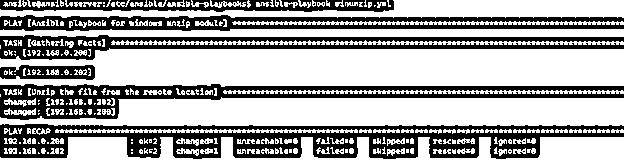
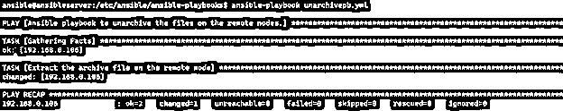

# Ansible untar

> 原文：<https://www.educba.com/ansible-untar/>

## Ansible untar 简介

Ansible untar module(对于 Unix OS 也称为 unarchive，对于 windows 操作系统也称为 win_zip)用于提取或解压缩远程目标上的归档文件或文件夹，默认情况下，首先在远程服务器上复制归档文件，它还支持许多参数来处理 unarchive 或 win_zip 功能，如 owner、dest、exclude 等。

### 句法

对于非 windows 目标，unarchive 或 ansible.builtin.unarchive 命令使用以下语法。我们已经展示了基本参数

<small>网页开发、编程语言、软件测试&其他</small>

*   **参数:**
    *   复制:否/是(默认)
        *   默认选项是 yes，如果指定 Yes 或不指定任何内容，它会将文件从本地控制器复制到远程主机。要使用远程源，需要指定 remote_src，这个 copy 参数在这里没有帮助。
    *   **src(必需):**
        *   文件的源路径。如果 remote_src 为“yes ”,则源路径将位于远程位置，否则源路径将位于本地控制器节点。
    *   **目的地(必填):**
        *   存档文件要提取到的远程服务器绝对路径。
    *   **remote_src:** 否(默认)/是
        *   如果设置为“是”,则指定源归档路径位于远程计算机上。对于“否”值，该路径位于本地控制器节点上。
    *   **所有者:**
        *   在解包和相同的复制(添加)到 chown 后，应该拥有文件/目录的用户的名称。
    *   **组:**
        *   应该拥有文件/目录和添加到 chown 的相同副本的组的名称。
    *   **排除:**
        *   需要从解包中排除的文件或目录列表。
    *   **包括:**
        *   需要包含在解包过程中的文件或目录列表。
    *   **保持更新:**否(默认)/是
        *   如果设置为“是”，它将替换比归档中的文件更新的现有文件。
    *   **模式:**
        *   文件或目录解包后应该拥有的权限(如 644、777 等)。

还有其他附加参数，如 creates、seuser、serole、setype、selevel、unsafe_writes、validate_certs。

对于 windows 目标 src，dest，creates 参数与 unarchive 模块相同，其他参数如下。

*   **参数:**
    *   **删除 _ 存档:**否(默认)/是
        *   解压缩后删除 zip 文件。
    *   **密码**
        *   如果 Zip 文件是密码加密的，那么这个参数是有用的，它需要安装 PSCX 模块。
    *   **递归:**否(默认)/是
        *   递归展开 src 目录中的 zip 文件。
        *   将值设置为“是”需要安装 PSCX 模块。

**请注意:**win _ unzip 模块不使用 remote_src 参数。

### 在 Ansible 中 untar 是如何工作的？

ansible-base 附带了用于非 windows 目标的 Ansible unarchive 模块，因此它包含在 Ansible 安装中。对于 windows 目标，我们需要使用 win_unzip 模块。如果没有这个模块，你可以从 galaxy 下载。

`ansible-galaxy collection install community.windows`

下面是 windows untar (unzip)的简单剧本。

`---
- name: Ansible playbook for windows unzip module
hosts: winservers
tasks:
- name: Unzip the file from the remote location
win_unzip:
src: \\ad\shared\7zipModule.zip
dest: c:\temp\7zipInstaller`

**输出:**

上面的剧本将文件从源位置解压缩到目的地远程服务器。如果目标路径不存在，它会创建目标路径。

您一定注意到了，虽然源路径是远程的，但是我们不需要使用 remote_src，因为 win_unzip 模块不支持它，并且当我们为非目标 windows 服务器使用远程源路径时，我们必须指定 remote_src。举个例子，

`tasks:
- name: unarchive for from the remote source on the non-windows target
win_unzip:
src: /tmp/myfiles/7zipmodule.tar.gz
dest: /tmp/7zipmodule
remote_src: yes`

### 例子

下面举几个例子

#### 示例 1–UNIX 操作系统的解归档模块任务。

**代码:**

`---
- name: Ansible playbook to unarchive the files on the remote nodes.
hosts: linuxservers
tasks:
- name: Extract the archive file on the remote node
unarchive:
src: /etc/installers/phayes-geoPHP-1.2-20-g6855624.tar.gz
dest: /tmp/phyes`

在本行动手册中，它将把. tar.gz 文件检索到目标远程主机/tmp/phyes。与 win_unzip 模块不同，在运行这个任务之前，您需要确保目标路径存在，否则它将抛出一个错误。

**输出:**

#### 示例 2–从归档中排除文件。

要从解包中排除某个文件，我们可以使用 h

**代码:**

`---
- name: Ansible playbook to unarchive the files on the remote nodes.
hosts: linuxservers
tasks:
- name: Extract the archive file with exluding text document
unarchive:
src: /etc/installers/phayes-geoPHP-1.2-20-g6855624.tar
dest: /tmp/phyes
exclude: 'Test1 document.txt'`

如果要排除多个文件，您可以提供如下列表。

`unarchive:
src: /etc/installers/phayes-geoPHP-1.2-20-g6855624.tar
dest: /tmp/phyes
exclude:
- 'Test1 document.txt'
- 'Test2 document.txt'
- 'sourcefile.py'`

#### 示例# 3–包括归档中的文件

请注意:要使用 include 参数，我们需要 ansi ble . builtin 2.11 版。

**代码:**

`tasks:
- name: Extract the archive file with including text document
unarchive:
src: /etc/installers/phayes-geoPHP-1.2-20-g6855624.tar
dest: /tmp/phyes
include: 'Test1 document.txt'`

上面的剧本将只包括 test1 文本文件，要包括多个文档，使用下面的命令。

`unarchive:
src: /etc/installers/phayes-geoPHP-1.2-20-g6855624.tar
dest: /tmp/phyes
include:
- 'Test1 document.txt'
- 'Test2 document.txt'
- 'sourcefile.py'`

#### 示例# 4–同时使用多个参数。

**代码:**

`---
- name: Ansible playbook to unarchive the files on the remote nodes.
hosts: linuxservers
tasks:
- name: Extract the archive file with including text document
unarchive:
src: /etc/installers/phayes-geoPHP-1.2-20-g6855624.tar
dest: /tmp/phyes
include:
- 'Test1 document.txt'
- 'Test2 document.txt'
keep_newer: no
mode: 0644
remote_src: yes
owner: ansibleadmin`

在上面的行动手册中，它将只包括 2 个文件，keep_newer 参数不会替换比存档文件更新的现有文件，remote_src 表示远程源，它将设置文件的所有者权限，并将保持文件权限 0644。

### 结论

当我们写剧本时，解压缩模块是非常有用的。它使得在不使用任何第三方软件的情况下提取目标服务器上的文件或文件夹变得更容易，此外，它使用各种参数，如我们不需要在提取前复制文件，在提取后添加权限等。

### 推荐文章

这是一个 Ansible untar 的指南。这里我们讨论了 untar 在 Ansible 中是如何工作的，并给出了代码和输出的例子。您也可以阅读以下文章，了解更多信息——

1.  [易变库存](https://www.educba.com/ansible-inventory/)
2.  [可变变量](https://www.educba.com/ansible-variables/)
3.  [可以等待的时间](https://www.educba.com/ansible-wait_for/)
4.  [易变的数独](https://www.educba.com/ansible-sudo/)

