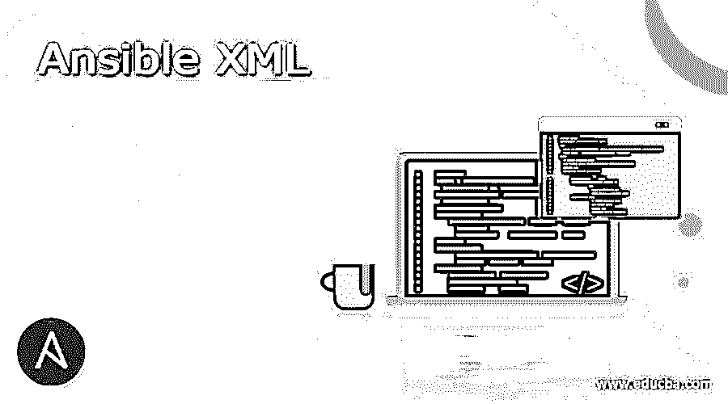
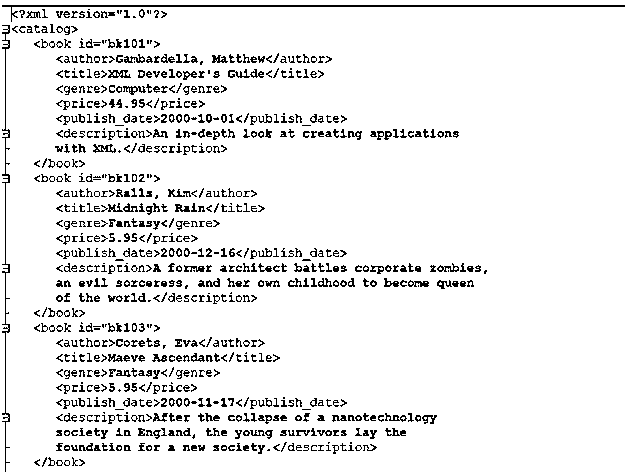
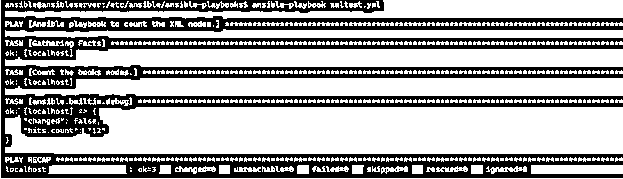
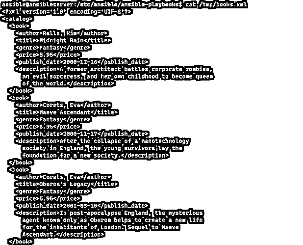
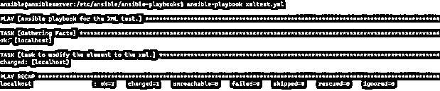
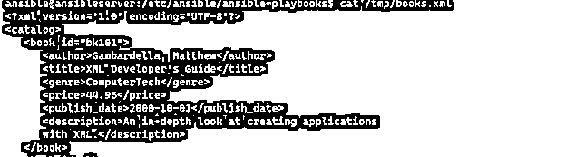
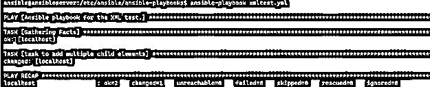
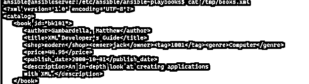

# 可转换的 XML

> 原文：<https://www.educba.com/ansible-xml/>

## 定义

Ansible XML 模块，是通用 Ansible 集合模块的一部分，它支持各种参数(在语法部分中描述)来读取 XML 文件的内容、添加或删除子元素或值、打印特定的子属性或节点、更改属性值等。通过提供正确的 xpath 语法。

**语法；**

<small>网页开发、编程语言、软件测试&其他</small>

对于非 windows 目标，ansible 使用模块语法 **community.general.xml、**，对于 windows 目标，ansible 使用 **win_xml** 模块**。**

**community.general.xml** 模块支持的参数。

**参数:**

*   **添加 _ 孩子:**

在 XML 文件中添加其他子节点。该参数需要设置 **XPath** 。要添加子元素，我们必须提供一个字符串，每一项都可能是一个类似< ansible/ >的字符串来添加一个空元素或带有键名和值的 hash。

*   **属性:**

1.  使用参数值时要选择的属性。
2.  这是一个字符串，不能用@来伪装。

*   **备份:**

1.  选项:否(默认)/是

创建备份文件，包括备份的时间戳。此模块不会自动进行备份；我们需要将备份参数设置为 **yes** 。

*   **内容:属性/文本**

1.  选择:属性/文本

搜索给定的 **XPath** 并获取或读取内容。

*   **计数:**

1.  选项:否(默认)/是

搜索给定的 **XPath** ，并提供任何匹配的计数。

*   **输入 _ 类型:**

1.  选择 **: xml** / **yaml** (默认)

**add_children** 和 **set_children** 的输入类型。

*   **插入后:**

1.  选项:否(默认)/是

它在 Xpath 中给定的最后一个元素之后添加额外的子元素。

*   **插入之前:**

1.  选项:否(默认)/是

它在 Xpath 中给出的第一个元素之前添加额外的子元素。

*   **漂亮 _ 打印:**

1.  选项:否(默认)/是

漂亮的打印 xml 输出。

*   **打印 _ 匹配:**

1.  选择:否(默认)/是

搜索给定的 Xpath 并打印任何匹配的输出。

*   **路径:**

1.  别名:目标/文件

作为输入的 XML 文件的路径。如果没有指定 **XML 字符串**，则需要路径。

*   **set_children:**

从给定的 xpath 中设置选定元素的子元素。

*   **状态:**

1.  选择:缺席/出席

别名:确保

设置或删除 xpath 选择(节点，属性)。

*   **值:**

所选属性的期望状态。

*   **xmlstring:**

包含要操作的 xml 的字符串。如果未提供路径，则此参数是必需的。

*   **xpath:**

描述要操作的项目的有效 xpath 表达式，默认情况下，它在文档根(/)上操作。

### XML 在 Ansible 中是如何工作的？

为了处理 XML 文件，我们需要 ansible XML 模块，ansible 默认安装中没有这个模块，但是我们需要安装它。它是 Ansible 社区的一部分。

要安装 XML 模块，我们可以使用下面的命令。这将为 Unix 和 Windows 操作系统安装 XML。

ansible-galaxy collection 安装社区. general

对于 windows 操作系统，可以使用 **win_xml** 模块，对于非 Windows 目标，可以使用 **community.general.xml** 模块

当处理 XML 文件时，需要提供 xPath 来处理 XML 属性和值。您可以从下面的网站了解关于 xPath 符号的更多信息。

[https://www.w3schools.com/xml/xpath_intro.asp](https://www.w3schools.com/xml/xpath_intro.asp)

[https://developer.mozilla.org/en-US/docs/Web/XPath](https://developer.mozilla.org/en-US/docs/Web/XPath)

还有很多其他网站可以参考。对于这个例子，我们将使用微软的样本 XML 文件。

[https://docs . Microsoft . com/en-us/previous-versions/windows/desktop/ms 762271(v = vs . 85)](https://docs.microsoft.com/en-us/previous-versions/windows/desktop/ms762271(v=vs.85))

行动手册示例:

### 例子

让我们讨论一下可转换 XML 的例子。

#### 示例 1:计算属性节点数量的 Ansible XML 模块

在本剧本中，我们将计算**作者**节点的总数。

`---
- name: Ansible playbook to count the XML nodes.
hosts: localhost
tasks:
- name: Count the books nodes.
xml:
path: /tmp/books.xml
xpath: /catalog/book/author
count: yes
register: hits
- ansible.builtin.debug:
var: hits.count`

**输出:**

共有 12 个“**作者**节点。

#### 示例 2:删除带有属性值的特定节点

该剧本将删除所有具有书 id 属性 **bk101** 的节点。

`- name: task to remove the book id
xml:
path: /tmp/books.xml
xpath: /catalog/book[@id='bk101'] state: absent`

**输出:**

#### 示例 3:删除属性的剧本

该行动手册将删除所有匹配的属性。在这种情况下，它将删除 ID 属性。

`- name: task to remove the all the id attributes.
xml:
path: /tmp/books.xml
xpath: /catalog/book/@id
state: absent`

**输出:**

一旦检查了 XML 输出，所有的 id 都将被删除。

#### 示例#4:添加带有值的新元素

该剧本将添加新元素“ **Newbook** ”，值为“**虚构”。**

`- name: task to add the element to the xml.
xml:
path: /tmp/books.xml
xpath: /catalog/book[@id='bk101']/newbook
value: 'Fiction'`

**输出:**

#### 示例 5:改变属性值的剧本

该剧本将把流派属性的内容从**计算机**修改为**计算机技术**。

`- name: task to add the element to the xml.
xml:
path: /tmp/books.xml
xpath: /catalog/book[@id='bk101']/genre
value: 'ComputerTech'`

**输出:**

**XML 文件输出:**

#### 示例 6:添加多个子元素的可行剧本

这个剧本将把多个子元素添加到 book 节点的指定属性中。

`- name: task to add multiple child elements
xml:
path: /tmp/books.xml
xpath: /catalog/book[@id='bk101'] add_children:
- shop: modern
- owner: jack
- tag: '1001'`

**输出:**

**XML 文件输出:**

如果需要在特定元素之前插入，那么使用 **insertbefore** 参数。举个例子，

`- name: task to add multiple child elements
xml:
path: /tmp/books.xml
xpath: /catalog/book[@id='bk101']/genre[text() = "Computer"] insertbefore: yes
add_children:
- shop: modern
- owner: jack
- tag: '1001'`

**XML 输出:**

而对于 insert after 的一些属性，需要指定 **insertafter** 参数。

`- name: task to add multiple child elements
xml:
path: /tmp/books.xml
xpath: /catalog/book[@id='bk101']/genre
insertafter: yes
add_children:
- shop: modern
- owner: jack
- tag: '1001'`

### 结论

XML 文件被各种网站、软件、配置等使用。ansible 使用各种参数来读取内容，复制 XML 文件，根据需要操作 XML 文件，这有助于您使用 XML 配置任何网站或软件，然后您可以使用内置插件来处理 XML 文件。

### 推荐文章

这是一个关于 Ansible XML 的指南。这里我们讨论定义，语法，参数，XML 在 Ansible 中是如何工作的？并附有代码实现的示例。您也可以看看以下文章，了解更多信息–

1.  [易变库存](https://www.educba.com/ansible-inventory/)
2.  [易受攻击的库存 _ 主机名](https://www.educba.com/ansible-inventory_hostname/)
3.  [可变变量](https://www.educba.com/ansible-variables/)
4.  [Ansible add_host](https://www.educba.com/ansible-add_host/)

