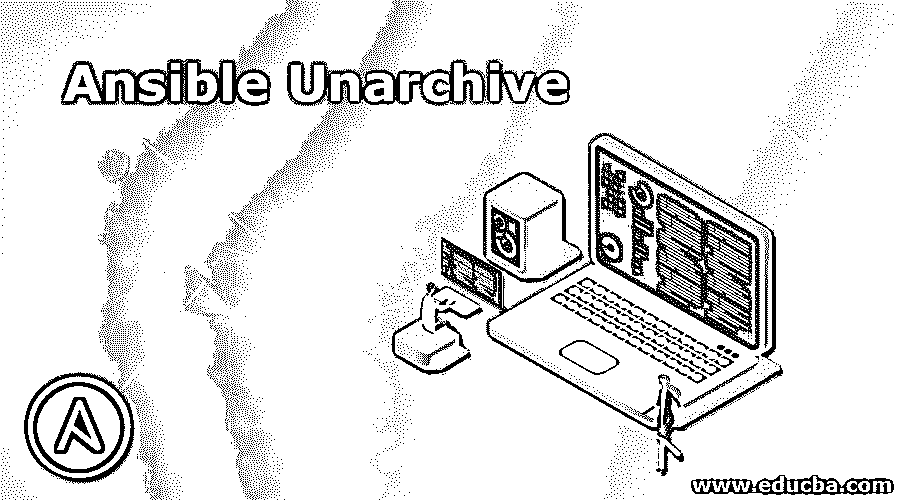
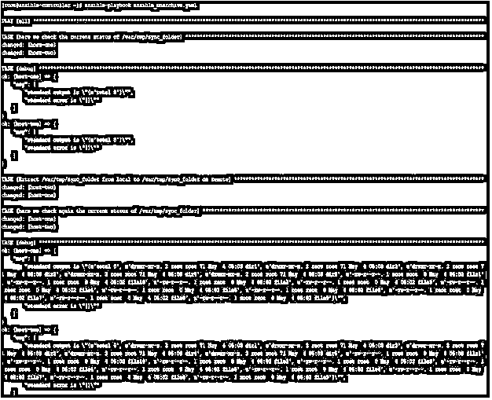

# 不可撤销的不归档

> 原文：<https://www.educba.com/ansible-unarchive/>

## Ansible Unarchive 简介

Ansible 提供了非常有用的模块，可以用来提高工作效率，节省时间。Ansible unarchive 就是这样一个模块，它用于在目标远程机器上解包归档文件。如果您希望使用 tar.gz 软件包文件在远程目标机器上安装软件，将归档文件从本地控制器机器发送到远程目标机器并解包，这将非常有用。

存档文件的来源可以是远程目标机器、本地控制器机器或互联网上可通过 URL 访问的位置。在本文中，我们将看到使用它的可能方法和一些实际例子。

<small>网页开发、编程语言、软件测试&其他</small>

### 什么是可撤销的未归档？

Ansible unarchive 是一个模块，它可以在将存档文件从本地控制器机器复制到远程机器或者从同一机器上的一个位置复制到同一机器上的其他位置之后，在远程目标机器上解压缩存档文件。在使用本模块之前，我们必须考虑以下几点:-

*   该模块用于对归档文件进行解归档，归档文件可以被压缩，但是如果文件仅被压缩而没有被内外归档，则该模块将不会按预期工作。
*   默认情况下，该模块将存档文件复制到目标远程机器，然后在那里解存档。在这种情况下，归档文件只在远程机器上，那么我们可以使用参数 remote_src 来表明源文件也在远程
*   在远程机器上，我们必须有 zipinfo、gtar 或用于 zip 文件的 unzip 命令。tar，. tar.gz，tar.xz，tar.bz2，它用了 gtar。
*   目标位置上的现有目录和文件被忽略，这与正常情况相同
*   对于 windows 系统，Ansible 提供了一个类似的模块，名为 Use this module 而不是 unarchive module，因为这仅适用于类似 Linux 的系统。

### Ansible UnarchiveWork 是如何工作的？

与任何其他可转换模块一样，未存档模块有一组参数和相关的可接受值。我们可以使用这些参数的组合来获得可接受的结果。下面是一些重要参数的列表，如果不是全部的话。

*   **copy–**此参数与互斥，因此不推荐使用。当这个被使用时，它将把文件从本地控制器机器复制到远程机器，否则插件将在远程机器上搜索存档文件。可接受的值为“是”和“否”。默认值为“是”。
*   **创建-**该参数将创建目录或文件(如果尚不存在)。如果文件或目录已经存在，那么它将
*   **解密-**该选项用于控制源文件的自动解密，使用可接受的值“是”和“否”。默认值为“是”。
*   **src–**src 文件的路径，默认情况下是控制器机器的本地路径，但是当使用 remote_src 时，则认为是远程路径
*   **dest–**远程目标机器上的绝对路径，打包的位置
*   **排除–**这是您要从中排除的文件和目录的列表
*   **owner—**与 chown 相同，用于设置文件/目录的所有权。
*   **remote _ src–**用于设置文件的源何时在远程目标上
*   **selevel，serole，setype，seuser–**这些用于更新 selinux 文件
*   **组—**设置未打包的组的所有者
*   **keep _ owner–**这用于控制解压缩文件的行为，以便较新的文件不会替换存档中的现有文件。可接受的值为“是”和“否”。默认为“否”。
*   **list _ files—**设置为“是”时。将返回 tarball 中的文件列表。可接受的值为“是”和“否”。默认为“否”。
*   **模式—**设置目标文件或目录的权限。更好的做法是在单引号中使用 4 个八进制数字来表示权限，如“0777”或“0644”。
*   **validate _ certs–**当我们使用 https URL 作为文件的源时，会用到这一点。这里可接受的值是“是”和“否”。默认值为“是”。

### 可转换的未归档示例

现在，通过使用示例，我们将尝试了解 Ansible unarchive 模块，您可能需要在日常操作中使用它。

我们将举一些例子，但在去那里之前，我们首先了解我们的实验室，我们用于测试目的。这里我们有一个名为 ansible-controller 的 Ansible 控制服务器和两个名为 host-1 和 host-2 的远程主机。我们将创建剧本，在 ansible-controller 节点上运行 Ansible 命令，并在远程主机上查看结果。

在本例中，我们将使用类似以下内容的行动手册，并尝试在远程上解压缩 tar.gz 文件

`---
hosts: all gather_facts: no tasks:
name: here we check the current status of /var/tmp/sync_folder command: ls -l /var/tmp/sync_folder
register: remote_output ignore_errors: yes
debug:
msg:
standard output is "{{ remote_output.stdout_lines }}"
standard error is "{{ remote_output.stderr_lines }}"
name: Extract /var/tmp/sync_folder from local to /var/tmp/sync_folder on remote unarchive:
src: /var/tmp/sync_folder/file_dir.tar.gz dest: /var/tmp/sync_folder
name: here we check again the current status of /var/tmp/sync_folder
command: ls -l /var/tmp/sync_folder register: remote_output_1 ignore_errors: yes
debug:
msg:
standard output is "{{ remote_output_1.stdout_lines }}"
standard error is "{{ remote_output_1.stderr_lines }}"`

我们按如下方式运行这个行动手册:-

`# ansible-playbook ansible_unarchive.yaml`

输出将在下面，我们可以看到以前没有文件在文件夹中

/var/tmp/sync _ 文件夹。但是解压缩后，我们在同一个文件夹中有许多文件。

在本例中，我们将使用类似以下内容的行动手册，并尝试

`---
hosts: all gather_facts: no tasks:
name: here we check the current status of /var/tmp/vlc command: ls -l /var/tmp/vlc
register: remote_output ignore_errors: yes
debug:
msg:
standard output is "{{ remote_output.stdout_lines }}"
standard error is "{{ remote_output.stderr_lines }}"
name: Here we download a file from internet and unarchive on remote unarchive:
src:             http://download.videolan.org/pub/videolan/vlma/0.2.0/vlma-0.2.0- bin.tar.gz
dest: /var/tmp/vlc remote_src: yes
name: here we check the current status of /var/tmp/vlc command: ls -l /var/tmp/vlc
register: remote_output ignore_errors: yes
debug:
msg:
standard output is "{{ remote_output.stdout_lines }}"
standard error is "{{ remote_output.stderr_lines }}"`

我们按如下方式运行这个行动手册:-

`# ansible-playbook ansible_unarchive_internet_tarball.yaml`

输出如下所示:-

### 结论

正如我们在本文中看到的，Ansible unarchive 模块是 Ansible skillset 中的一个有用工具，使用起来非常方便。此外，在 Linux 环境中，软件文件大多是. tar.gz 格式，因此有必要了解他的模块并在操作任务中使用它。所以先学，再用。

### 推荐文章

这是一个可转换的非归档指南。这里我们讨论 Ansible UnarchiveWork 是如何工作的，并给出了代码和输出的例子。您也可以阅读以下文章，了解更多信息——

1.  [可变滤波器](https://www.educba.com/ansible-filters/)
2.  [可翻译版本](https://www.educba.com/ansible-versions/)
3.  [可行的架构](https://www.educba.com/ansible-architecture/)
4.  [如何安装 Ansible？](https://www.educba.com/install-ansible/)

