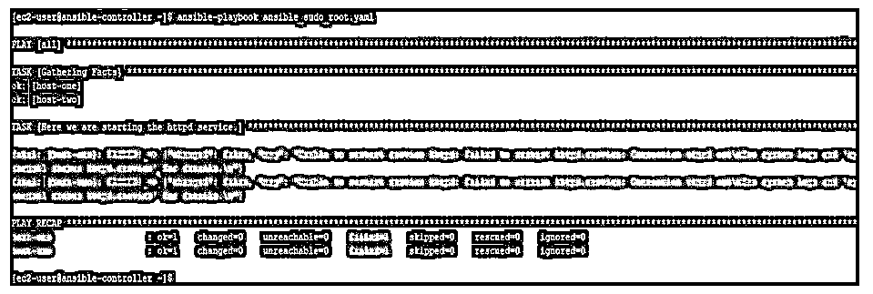
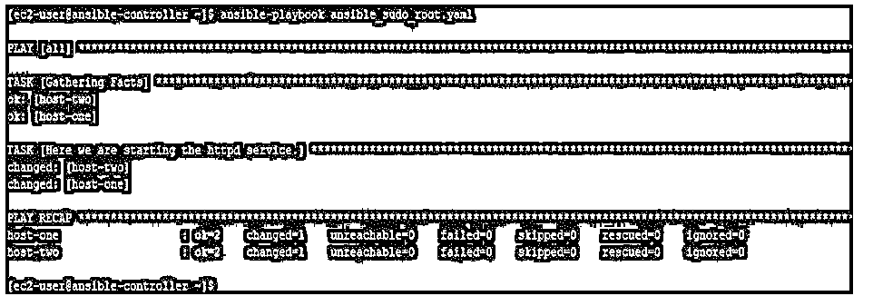
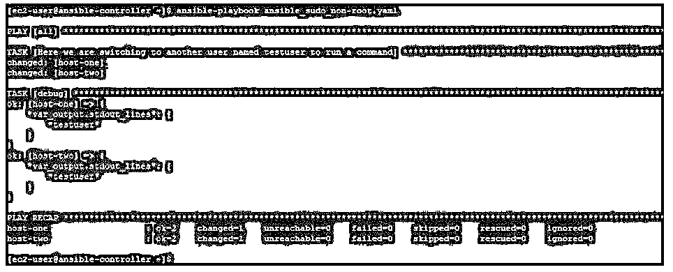
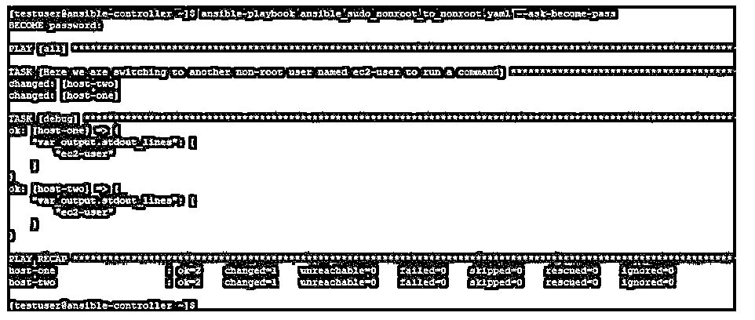

# 焦急的须藤

> 原文：<https://www.educba.com/ansible-sudo/>

## Ansible Sudo 简介

下面的文章提供了 Ansible Sudo 的概要。在 Ansible 中，我们通过使用包含剧本和任务的剧本在远程目标机器上工作。除非另有说明，本行动手册将在远程目标机器上运行，运行用户与在 Ansible controller 机器上运行的用户相同。但是，有时需要在远程目标节点上以其他用户的身份运行任务。在这种情况下，我们需要成为像 sudo 这样的插件，sudo 代表替代用户 do。这使得远程用户能够以另一个用户或特权用户的身份执行命令。这个插件中几乎没有其他选项，这使得它使用起来更加灵活。

### 什么是 Ansible Sudo？

在 Ansible 中，我们可以使用 begin 来利用 Linux 系统的 sudo 特性。这使得一个用户在命令执行的瞬间以另一个用户的身份在系统上执行命令。有各种方法可以告诉 Ansible 特权用户、密码和其他相关选项。这些方法包括定义变量、在库存文件或导入文件中创建条目。

<small>网页开发、编程语言、软件测试&其他</small>

Ansible 使用诸如 begin _ exe、begin _ flag、begin _ pass、begin _ user 之类的参数来实现相同的功能。

下面给出了这些参数的详细信息:

**1。成为 _exe:** 来设置 sudo。

**可能的 ini 条目:**

*   [权限提升]可执行文件= sudo
*   [sudo _ become _ plugin]become _ exe = sudo
*   env:ANSIBLE_SUDO
*   env:ANSIBLE_BECOME_EXE
*   var:ansi _ sudo _ exe
*   var:ansible_become_exe

**2。become_flag:** 设置选项传入 sudo。

**ini 条目:**

*   [特权升级]成为标志= -H -S -n
*   [sudo _ begin _ plugin]flags =-H-S-n
*   env:ANSIBLE_BECOME_FLAGS
*   env:SUDO 旗帜
*   var:ansible_become_flags
*   var:ansible_sudo_flags

**3。become_pass:** 为 sudo 用户设置传递给 sudo 的密码。

**ini 条目:**

*   [sudo_become_plugin]密码=值
*   env:ansi ble _ been _ PASS
*   SUDO 通行证
*   var:ansible_become_pass
*   var:ansible_become_password
*   var:ansible_sudo_pass

**4。变成 _ 用户:**设置 sudo 用户。

**ini 条目:**

*   [权限提升]成为用户=超级用户
*   用户=root
*   环境:SUDO 用户
*   env:ANSIBLE_BECOME_USER
*   var:ansi _ sudo _ user
*   var: ansible_become_user

### Ansible Sudo 是如何工作的？

要使用 become 方法，我们可以在剧本、静态库存文件或导入的文件中提到具体的参数。

**语法:**

当我们在剧本中使用它时，语法如下:

`---
-tasks:
....
....
-name: Run a command as nobody command: somecommand become: yes
become_method: su become_user: nobody become_flags: '-s /bin/sh'
....
....`

类似地，可以在库存文件中向定义的 sudo 用户提及“成为”变量。这可以针对一组主机或一台特殊主机来完成。这样，在特殊的主机或主机组上工作就变得容易了。

### Ansible Sudo 示例

下面是提到的例子:

这里我们有一个名为 ansible-controller 的 Ansible 控制服务器和两个名为 host-1 和 host-2 的远程主机。我们将创建剧本，在 ansible-controller 节点上运行 Ansible 命令，并在远程主机上查看结果。

#### 示例#1

在本例中，我们有一个内容如下的行动手册，我们以 root 用户身份运行该行动手册，但正如我们提到的，它成为行动手册中的参数。我们正在尝试以 ec2 用户的身份运行命令。在输出中，我们将看到该命令作为 ec2-user 运行。

请注意，该用户必须存在于目标机器上，否则剧本将失败。

**代码:**

`---
-hosts: all
become:
yes
become_user: ec2-user
become_method:
sudo tasks:
-name: here we are chekcing the user id by which command is shell: id
register: id_var
-debug
var: id_var['stdout_lines']`

**如下运行本行动手册:**

`ansible-playbook ansible_sudo.yaml`

**输出:**

在这里，我们可以在输出中看到，尽管我们以 root 用户的身份运行这个剧本，但还是显示了 ec2-user 的 id。当我们从根用户切换到非根用户时，它没有询问密码。

#### 实施例 2

在本例中，我们有一个内容如下的行动手册，这里我们使用 Ansible service module 和用户 ec2-user 重新启动一个服务，但是该用户在目标机器的 sudoer 文件中有条目，因此我们不需要输入 root 用户的密码。

**代码:**

`---
-hosts:
all
tasks:
-name: Here we are starting the httpd
service.service:
name: httpd
state: restarted`

使用名为 ec2-user 的非根用户运行本行动手册，如下所示:

`ansible-playbook ansible_sudo_root.yaml`

我们得到如下所示的输出，其中失败了，因为用户没有权限执行该任务。

**输出:**

现在，如果我们像下面这样更新剧本，并提到“成为:是的”。我们给这个用户 sudo 力量。

**代码:**

`---
-hosts:
all
tasks:
-name: Here we are starting the httpd
service.service:
name: httpd
state: restarted
become: yes`

现在像下面这样运行这个行动手册，我们可以看到它运行成功。

`ansible-playbook ansible_sudo_root.yaml`

**输出:**

#### 实施例 3

在本例中，我们有一个脚本，其内容如下，当我们以 ec2-user 的身份运行该脚本时，使用了 begin 参数，实际上我们在切换到远程目标机器后，以另一个名为 testuser 的非 root 用户的身份运行简单命令。此外，这个用户 ec2-user 在目标机器的 sudoer 文件中有条目，所以我们不需要输入 testuser 用户的密码来切换到它。

**代码:**

`---
-hosts: all
gather_facts:
no tasks:
-name: Here we are switching to another user named testuser to run a command shell: whoami
become: yes
become_user:
testuser register:
var_output
-debug:
var: var_output.stdout_lines`

运行本行动手册，如下所示:

`ansible-playbook ansible_sudo_non-root.yaml`

我们得到如下所示的输出，我们可以看到用户标识为 testuser，因为我们使用了 become 参数来作为 testuser 运行命令。

**输出:**

#### 实施例 4

在本例中，我们有一个行动手册，内容如下。这里，我们从一个名为 testuser 的用户那里运行一个简单的命令，他在 sudoer 中没有任何 sudo 条目。我们将使用 passing 选项运行剧本，要求成为 ec2 用户的密码。

**代码:**

`---
-hosts: all
gather_facts:
no tasks:
-name: Here we are switching to another non-root user to run a command shell: whoami
become: yes
become_user: ec2-user register:
var_output
become_method:
su
-debug:
var: var_output.stdout_lines`

如下运行本行动手册，注意命令中使用的–ask-been-pass 选项。

`ansible-playbook ansible_sudo_nonroot_to_nonroot.yaml --ask-become-pass`

**输出:**

在这里，我们可以看到该命令作为 ec2-user 运行，因为我们使用了 become 参数切换到它，并在 ask by-ask-become-pass 选项上传递了密码。

### 结论

正如我们在本文中看到的，在您的环境中使用 Ansible 的一个非常重要的方面是使用 become，因为在目标远程服务器上，我们总是对非根用户有一些限制。为了克服这一点，我们暂时需要提升特权，这只能通过 sudo 方法来实现。

### 推荐文章

这是一本关于 Ansible Sudo 的指南。这里我们分别讨论什么是 ansible sudo，ansible sudo 是如何工作的，以及例子。您也可以看看以下文章，了解更多信息–

1.  [可同步](https://www.educba.com/ansible-synchronize/)
2.  [可行的特别命令](https://www.educba.com/ansible-ad-hoc-commands/)
3.  [Ansible 将用户添加到组](https://www.educba.com/ansible-add-user-to-group/)
4.  [可回答的处理程序](https://www.educba.com/ansible-handlers/)

