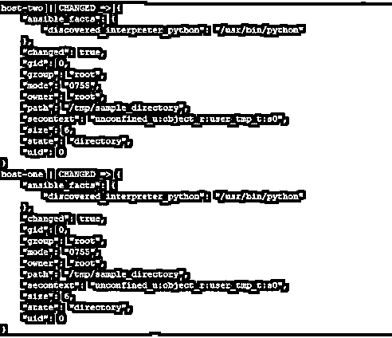
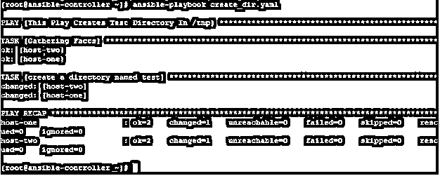
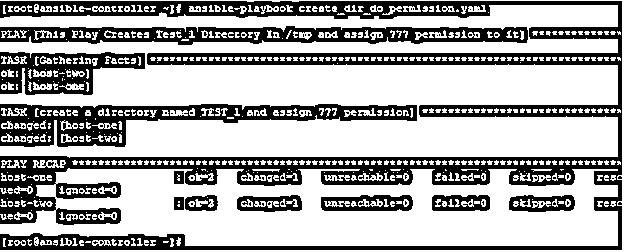
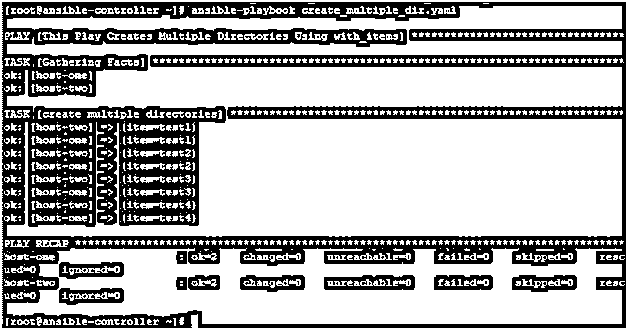
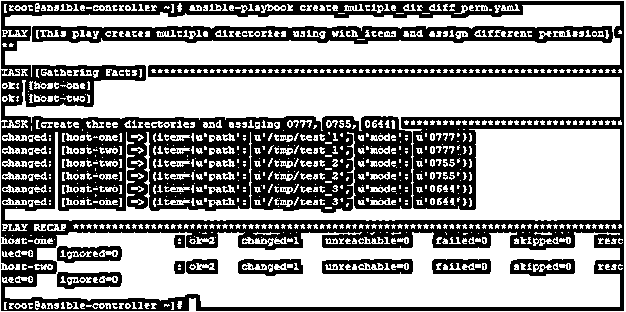
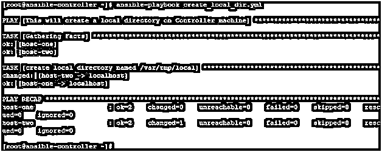

# 可行的创建目录

> 原文：<https://www.educba.com/ansible-create-directory/>

## Ansible 创建目录简介

在 Ansible 中，我们有几个用于不同目的的模块。我们可以根据自己的需要使用它们的各种参数。此外，我们可以用 python 这样的脚本语言创建一个模块，并相应地使用它。在这个主题中，我们将学习 Ansible 创建目录。

文件模块是最基本也是最重要的模块之一，用于在远程主机上创建、删除和更新文件和目录的权限。此外，通过将命令作为参数给出，可以使用命令模块完成相同的任务。在本文中，我们将了解它并使用它在远程主机上创建目录。

<small>网页开发、编程语言、软件测试&其他</small>

### Ansible 创建的目录

创建目录是一项日常操作。在执行安装应用程序、备份和恢复、管理用户的主目录、为特定目的的文件夹分配配额等工作时，需要执行此操作。因此，使用 Ansible 并理解它的不同方式、可用的参数和可接受的参数来很好地掌握它是非常重要的。

### 如何创建 Ansible 目录？

在 Ansible 中，我们可以使用以下两种方法在远程主机上创建一个或多个目录:-

*   使用命令模块并给出命令来创建一个目录
*   使用文件模块并给出目录作为状态，作为其

以上两者都可以通过两种方式实现:

*   使用 ansible 命令并在命令行上给出所有参数。但是输出是全面的，而且当您有管理多个目录的任务并且您将使用不同的可用目录时，输出也是复杂的
*   使用 ansible-playbook 命令并给它一个 YAML 文件，以便在远程主机上解释和执行。在这个 YAML 文件中，您给出了创建和管理目录的所有参数和选项。一旦你理解了，这将更有条理，更容易使用

### Ansible 创建目录的示例

现在我们用几个例子来理解一些可用的参数，您可以在创建目录时使用这些参数。

但首先，让我告诉你我们将使用的实验室环境，我们有一个名为 ansible-controller 的 ansible 控制服务器和两个名为 host-1 和 host-2 的远程主机，所有这些都是作为操作系统的 Red Hat Enterprise Linux 版本 7。

*   使用命令模块在远程主机上创建一个目录，并传递命令来创建如下所示的目录——使用 ansi ble:–

`ansible all -m command -a "mkdir /tmp/sample_dir_1"`

在输出中，您可能会得到一个建议作为警告，提示您有一个文件模块可以用于相同的目的。

*   用于在远程主机上创建目录，在 ansible 命令行上使用 file 模块。使用以下命令

`ansible all -m file -a 'path=/tmp/sample_directory state=directory'`

如果在参数给定的路径上成功创建了目录，您将得到如下输出。

*   要在远程主机上创建目录，请创建一个 YAML 文件，其内容如下

`---
name: This Play Creates Test Directory In /tmp hosts: all
tasks:
name: create a directory named test file:
path: /tmp/test state: directory`

然后使用 ansible-playbook 命令执行该文件中的行动和任务。

`ansible-playbook create_dir.yaml`

成功运行后，您将得到如下输出

*   为了在创建时创建目录和分配权限，创建一个 YAML 文件，内容如下

`---
name: This Play Creates Test_1 Directory In /tmp and assign 777 permission to it hosts: all
tasks:
name: create a directory named TEST_1 and assign 777 permission file:
path: /tmp/test_1 state: directory
mode: "u=rwx,g=rwx,o=rwx"`

然后使用 ansible-playbook 命令执行该文件中的行动和任务。

`ansible-playbook create_dir_do_permission.yaml`

输出如下所示:-

*   使用 with_items 创建多个目录，创建一个 YAML 文件，内容如下

`---
name: This Play Creates Multiple Directories Using with_items hosts: all
tasks:
name: create multiple directories file:
path: /tmp/{{ item }} state: directory with_items:
test1
test2
test3
test4`

然后使用 ansible-playbook 命令执行该文件中的行动和任务。

`ansible-playbook create_multiple_dir.yaml`

输出如下所示:-

*   使用 with_items 创建多个目录并给它们分配不同的权限，创建一个 YAML 文件，内容如下

`---
- name: This play creates multiple directories using with_items and assign different permission hosts: all
tasks:
- name: create three directories and assiging 0777, 0755, 0644 file:
path: /tmp/{{ item.path }} mode: “{{ item.mode }}” state: directory with_items:
- { path: '/tmp/test_1', mode: '0777'}
- { path: '/tmp/test_2', mode: '0755'}
- { path: '/tmp/test_3', mode: '0644'}`

然后使用 ansible-playbook 命令执行该文件中的行动和任务。

`ansible-playbook create_multiple_dir_diff_perm.yaml`

输出如下所示:-

您可以检查主机一和主机二，如下所示:

登录到每台主机，检查目录是否存在以及权限:

`ls –ld /tmp/tmp/test_*`

*   可以使用 local_action 在剧本中的控制器节点上创建一个本地目录。

为此，创建一个行动手册，内容如下:

`---
name: This will create a local directory on Controller machine hosts: all
tasks:
name: create local directory named /var/tmp/local local_action:
module: file
path:
/var/tmp/local
state: directory`

然后使用 ansible-playbook 命令行运行这个 YAML 文件。

`ansible-playbook create_local_dir.yml`

输出如下所示:

您可以检查是否创建了目录。

`ls -ld /var/tmp/local`

*   创建名称具有可变内容的目录，例如，如果您想要创建名称以当前时间戳结尾的目录。您可以使用可回答的事实，否则默认情况下会提取这些事实

首先，准备一个如下所示的文件:–

`- hosts:
all tasks:
name: create a directory with using a fact file:
path: "/tmp/sample{{ansible_date_time.date}}" state: directory
mode: "u=rw,g=wx,o=rwx"`

如下所示执行时

`ansible-playbook create_dir_with_var_name.yml`

可以在远程节点上查看创建的目录

`ls -ld /tmp/sample*`

`ls -ld /tmp/sample*`

### 结论

您可能已经注意到，使用 Ansible 文件模块并不是一项复杂的任务。此外，使用它来创建、更新权限(如对目录的操作)更加简单。但是因为这是一个基本模块，你应该吸收它以便在 Linux/UNIX 系统上顺利工作。此外，在运行行动手册之前，请务必检查语法和使用的选项。

### 推荐文章

这是一个 Ansible 创建目录的指南。这里我们讨论如何创建 Ansible 目录以及相应的例子。您也可以浏览我们推荐的其他文章，了解更多信息——

1.  [可翻译版本](https://www.educba.com/ansible-versions/)
2.  [可变循环](https://www.educba.com/ansible-loop/)
3.  [可旋转拱顶](https://www.educba.com/ansible-vault/)
4.  YAML

