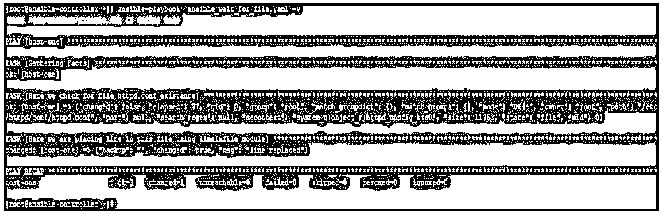

# 可能的等待

> 原文：<https://www.educba.com/ansible-wait_for/>

## Ansible wait_for 简介

在 Ansible 中，我们面临许多任务依赖于服务、端口或系统状态的情况。但是，由于连接重置、服务器重启、代码执行时间或启动服务时间等原因，该状态预计会在一段时间后出现。所以我们需要等待它发生。现在 Ansible 的模块宝库非常丰富，它有一个名为 wait_for 的模块，使我们的剧本能够在远程目标机器上等待状态或任务完成。使用本模块，我们将等待条件出现，然后继续我们行动手册中的下一个任务。

### Ansible wait_for 是什么？

Ansible wait_for 模块实际上可以在有或没有条件的情况下在远程目标主机上使用，它在以秒为单位的指定时间后检查该条件的状态。

<small>网页开发、编程语言、软件测试&其他</small>

使用模块时，必须记住以下几点:

*   如果您只需要等待，而不检查任何条件，那么只使用超时参数，以秒为单位的等待时间。这完全基于您对所需等待时间的假设。
*   这个模块可以用于像用 virt 模块启动一个来宾操作系统，文件退出，匹配文件中的正则表达式这样的情况。
*   对于 Microsoft Windows 远程目标计算机，使用名为 win_wait_for 的模块。
*   这个模块由 Ansible 核心团队在下一个版本中提供向后兼容支持。

### Ansible 如何等待工作？

要使用 Ansible wait_for 模块，我们必须了解可接受的参数及其可接受的选项。有些参数设置了默认值，因此也必须注意这一点。

下面给出了参数列表:

**1。超时:**默认为 300 秒。等待的最大秒数。这个不应该和其他条件一起用，因为那样会失效。

**2。状态:**以下是可接受的状态:

*   **启动:**端口是否打开。
*   **停止:**端口是否关闭。
*   **耗尽:**连接是否激活。
*   **present:** 文件或字符串中是否存在字符串。
*   **缺席:**文件是否被删除或缺席。

**3。睡眠:**默认为 1 秒。这是在检查之间睡觉。

**4。search_regex:** 检查文件中的字符串或套接字连接。

**5。端口:**要检查的端口号。

**6。路径:**在继续之前必须存在的文件的路径。

**7。msg:** 这是在出现故障时打印的消息，而不是正常的错误消息。

**8。host:** 要等待的 IP 或主机名。

**9。exclude_hosts:** 查找活动连接(TCP)时不检查的主机列表。

10。延迟:默认为 0。这表示等待下一轮轮询的秒数。

**11。connect_timeout:** 默认为 5 秒。这是为了指定在关闭并重试之前等待连接建立的时间。

**12。active_connection_states:** 这是可以算作活动会话的连接(TCP)列表。默认值为“时间等待”、“鳍等待 2”、“鳍等待 1”、“已建立”、“同步发送”、“同步接收”。

这个模块返回的唯一值，这将使我们能够知道在远程目标系统上发生的实际执行。

下面给出了这样的唯一返回值:

**1。经过的时间:**等待时经过的秒数。

**2。match_groupdict:** 这是一个字典，包含所有与给定关键字匹配的子组名称。

**3。match_groups:** 包含所有匹配的子组的元组。

### 可行等待的示例

下面是提到的例子:

这里我们有一个名为 ansible-controller 的 Ansible 控制器节点。作为目标节点，我们有两台远程机器。第一台机器是名为 host-one 的 Red Hat Enterprise Linux 机器，第二台机器是名为 host-two 的 Ubuntu 机器。我们将在 Ansible controller 机器上运行我们的剧本，并在远程目标机器上进行修改。

#### 示例 **#1**

在本例中，我们有一个如下所示的剧本，使用它我们将尝试重启远程机器，并使用 wait_for 模块等待 30 秒，然后我们检查相同机器上的正常运行时间。

**代码:**

`---
-hosts:
all
tasks:
-name: Here we are rebooting the remote machines using Ansible reboot module reboot:
-name: Here we will wait for 30 seconds and then continue with next wait_for:
timeout: 30
-name: Here we are checking the uptime on shell: uptime
register: var_uptime
-name: Here we are printing the output of debug:
var: var_uptime.stdout_lines`

现在像下面这样运行这个行动手册，我们有下面的输出，我们可以看到服务器重新启动，然后我们等待 30 秒，然后显示正常运行时间。

`ansible-playbook ansible_wait_for_reboot.yaml -v`

**输出:**

#### 实施例 2

在本例中，我们有一个如下所示的行动手册，我们在其中检查 httpd.conf 文件，如果该文件存在，则在该文件中进行修改。如果这个文件不存在，那么等待它。为此，我们有一个如下的剧本。

**代码:**

`---
-hosts: host-one tasks:
-name: Here we check for file httpd.conf
existance wait_for:
path: /etc/httpd/conf/httpd.conf
state: present
name: Here we are placing line in this file using lineinfile
module lineinfile:
path: /etc/httpd/conf/httpd.conf regexp: '^Listen '
insertafter: '^#Listen ' line: Listen 8443`

这里，最初我们没有在 host-one 上安装 httpd 包，所以 playbook 在等待 httpd.conf 文件，因为这个文件是由 httpd 包提供的。然后，当它等待安装 httpd 和创建文件时，我们转到 host-one 并在后台安装 httpd 包。现在在输出中，您可以看到运行时间是 77 秒，这表明它等待了 77 秒。

`ansible-playbook ansible_wait_for_file.yaml -v`

**输出:**

### 结论

正如我们在本文中看到的，该模块在实际或实时场景中非常有用，在这些场景中，您必须等待一段时间，以便在远程目标系统上完成某个条件。诸如修补、资源调配等操作很好地利用了它。但是正如你所知道的，在使用它之前，我们应该非常清楚它的可用选项。所以先学了再用。

### 推荐文章

这是一个 Ansible wait_for 的指南。这里我们讨论什么是可行的等待？ansible wait_for 如何与相应的示例一起工作。您也可以看看以下文章，了解更多信息–

1.  [可变组变量](https://www.educba.com/ansible-group_vars/)
2.  [可转换的 lineinfile](https://www.educba.com/ansible-lineinfile/)
3.  [可行的特别命令](https://www.educba.com/ansible-ad-hoc-commands/)
4.  [可同步](https://www.educba.com/ansible-synchronize/)

