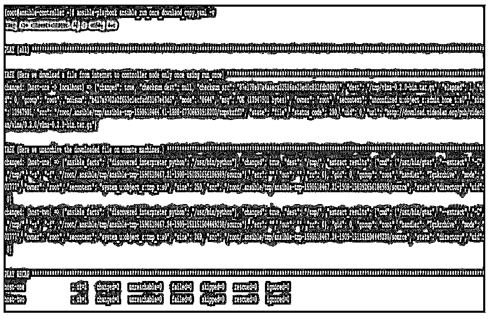
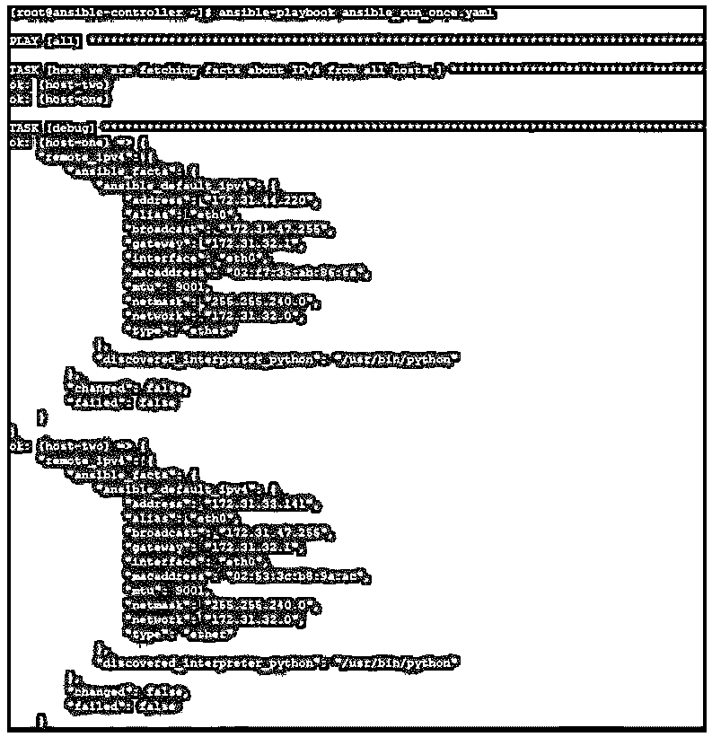
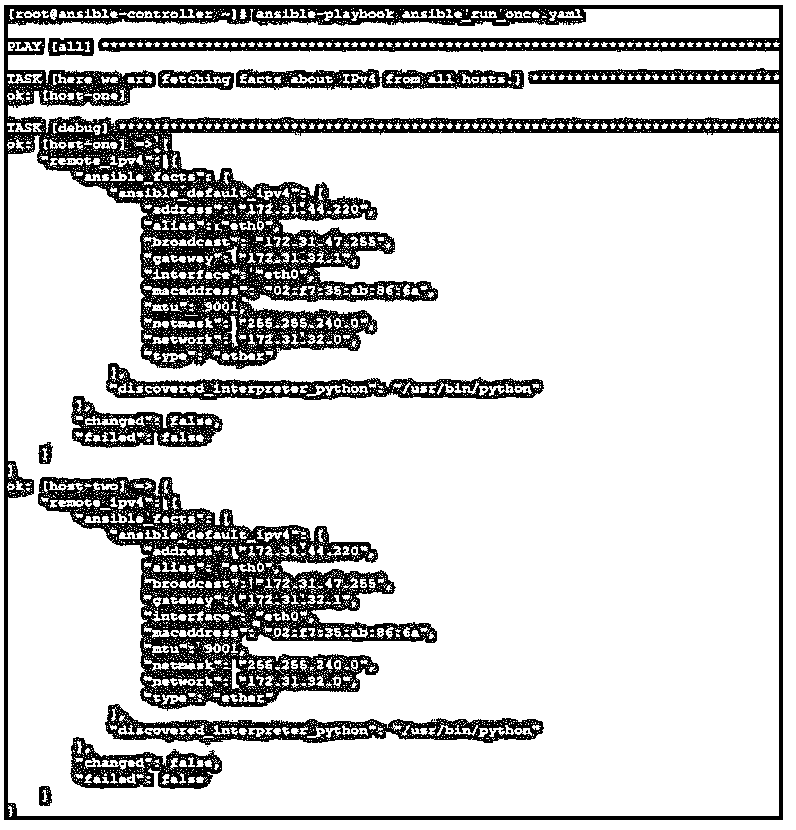

# Ansible run_once

> 原文：<https://www.educba.com/ansible-run_once/>

## Ansible run_once 简介

以下文章提供了 Ansible run_once 的概要。在 Ansible 中，我们总是倾向于在远程目标节点上工作，为此我们编写剧本和任务。众所周知，除非另有说明，否则在游戏或任务中编写的任何内容都将在所有远程目标主机上执行。但是很多时候，您会遇到这样的情况:在剧本之间或一部戏中的两个任务之间，您只需要在特定的机器上运行一次任务，以生成一些数据或进行一些修改。在这种情况下，我们需要像 local_action、delegate_to、run_once 这样的特性参数。run_once，用于为行动手册中提到的一组主机只运行一次任务。

### 什么是 Ansible run_once？

Ansible 设计用于多层环境。当需要在一台主机上代表另一台主机运行任务时，这非常有用。对于这样的需求，我们需要一个任务在一批主机上只运行一次，并且我们将从 Ansible 控制器节点运行它，我们有一个名为 run_once 的特性参数。当我们在任务中提到这个参数时，该任务将只在它找到的第一个主机上运行一次，而不管主机批处理。这在一些情况下很有用，例如在开始之前向所有系统用户发送一次性电子邮件通知的环境中打补丁。

<small>网页开发、编程语言、软件测试&其他</small>

### Ansible run_once 是如何工作的？

Ansible run_once 参数用于您希望在第一台主机上运行一次的任务。使用时，这将强制 Ansible controller 尝试在当前主机批中的第一台主机上执行，然后将结果应用于当前批中的其他主机。它的最佳用法是与 delegate_to 参数一起使用，该参数使我们能够在委派的主机上运行一次任务，然后在剩余的主机上继续其余的任务。

下面给出了语法，显示了如何在剧本中使用它。

`---
# ...
tasks:
# ...
- shell: some_command run_once: true
# ...`

### Ansible run_once 的示例

以下是 Ansible run_once 的示例:

这里我们将看到一个 Ansible 参数 run_once，您可能需要在日常操作中使用它。我们将首先看到我们的实验室，我们用于测试目的。这里我们有一个名为 ansible-controller 的 Ansible 控制服务器和两个名为 host-1 和 host-2 的远程主机。我们将创建剧本，在 ansible-controller 节点上运行 Ansible 命令，并在远程主机上查看结果。

#### 示例#1

在这个例子中，我们创建了一个剧本，内容如下，在这里，我们试图从互联网下载一个 tarball 文件到 Ansible 控制节点。因为这个下载只需要一次，所以我们将在这个任务中使用 run_once。此外，由于这只能在本地机器上完成，我们需要提到 delegate_to 并将 localhost 传递给它。

然后，我们将这个 tarball 解归档到远程计算机，这将在两台主机上分别完成:

**代码:**

`---
- hosts: all
gather_facts:
no tasks:
- name: Here we download a file from internet to controller node only once using run_once
get_url:
url: http://download.videolan.org/pub/videolan/vlma/0.2.0/vlma-0.2.0-bin.tar.gz
dest: /tmp/
run_once: true
delegate_to:
localhost
- name: Here we unarchive the downloaded file on remote machines.
unarchive:
src: /tmp/vlma-0.2.0-bin.tar.gz
dest: /tmp/`

运行这个剧本，如下图所示，有些冗长，得到一些详细的输出:

`ansible-playbook ansible_run_once_downlaod_copy.yaml -v`

我们得到如下所示的输出，我们可以看到 tarball 首先被下载到本地主机，因为我们使用 delegate_to，然后使用 unarchive 模块，我们将这个 tarball 解归档到两个远程目标机器。

**输出:**

#### 实施例 2

在本例中，我们创建了一个包含如下内容的行动手册，在这里，我们尝试在不使用 run_once 的情况下从所有主机获取 IPv4 详细信息，然后我们将从每个主机获取不同的详细信息。但是如果我们使用 run_once，那么从主机批处理中的第一台主机获取的 IPv4 细节将被存储，并显示另一台主机的输出。

**代码:**

`---
-hosts: all
gather_facts:
no tasks:
-name: here we are fetching facts about IPv4 from all setup:
filter: ansible_default_ipv4 register: remote_ipv4
-debug:
var: remote_ipv4`

运行此行动手册时，我们得到如下输出，从中我们可以看到不同主机的输出是不同的:

`ansible-playbook ansible_run_once.yaml`

**输出:**

现在更新剧本如下，我们在任务中提到了 run_once。

**代码:**

`---
-hosts: all
gather_facts:
no tasks:
-name: here we are fetching facts about IPv4 from all setup:
filter:
ansible_default_ipv4
register: remote_ipv4
run_once: true
-debug:
var: remote_ipv4`

现在运行它之后，在输出中我们可以看到从第一台主机获取的数据也显示在第二台主机的输出中。

`ansible-playbook ansible_run_once.yaml`

**输出:**

#### 实施例 3

在这个例子中，我们创建了一个内容如下的剧本，在这里我们试图实现当我们在远程机器上更新一个包时，一封邮件应该被发送到一个电子邮件帐户，带有邮件正文和主题，以便邮件所有者被通知这些变化。还要注意 run_once 的使用，它使得发送邮件只执行一次。

**代码:**

`---
-hosts:
all
tasks:
-name: Send summary mail local_action:
module: mail
subject: "Summary
Mail" to:
root@localhost
body: we are installing or updating the httpd
run_once: True
-name: Update the remote
machines. yum:
name:
httpd
state:
latest`

使用以下命令执行行动手册:

`ansible-playbook ansible_local_action_mail_update.yaml`

**输出:**

在这里，我们可以看到，当 playbook 运行时，它确实尝试在远程目标节点上升级 httpd 包，并且提到 local_action 的邮件任务是在本地机器上执行的。可变控制器节点。此外，它只执行了一次，因为我们已经使用了 run_once。

我们可以检查邮件是否被创建和发送，检查我们是否有 mailx 工具。

使用这个我们可以阅读邮件如下。

**mailx**

**输出:**

### 结论

正如我们所看到的，使用 local_action 有点棘手，但在使用它时，您不需要使用运行一次任务的条件，就像一个操作需要运行一次，并且依赖于所有其他主机需要执行其他操作一样。

### 推荐文章

这是一个 Ansible run_once 的指南。这里我们讨论一下什么是 ansible run_once？ansible run_once 是如何工作的？和示例。您也可以看看以下文章，了解更多信息–

1.  [可转换的 lineinfile](https://www.educba.com/ansible-lineinfile/)
2.  [可同步](https://www.educba.com/ansible-synchronize/)
3.  [易受攻击的主机文件](https://www.educba.com/ansible-hosts-file/)
4.  [可行的特别命令](https://www.educba.com/ansible-ad-hoc-commands/)

