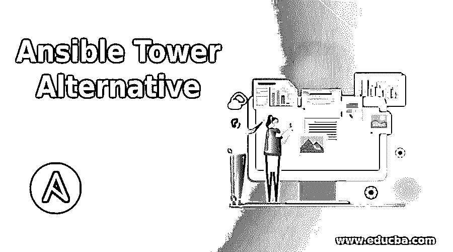

# 可选的塔式建筑

> 原文：<https://www.educba.com/ansible-tower-alternative/>

## Ansible 塔式方案简介

您可能知道 Ansible Tower 是 RedHat 的商业产品，它提供了一个图形用户界面来顺利地对您的环境进行配置管理。但我们也知道这是一个许可产品，我们需要向 Red Hat 支付订阅和更新 RedHat Ansible Tower 的费用。如果您没有太多需要通过 Ansible 管理的内容，并且承担许可成本是一个约束条件，那么这并不是真正需要的。我们可以探索 Ansible Tower 的替代产品，包括开源社区支持的产品，其他公司成本更低的产品，或者免费使用但由某个组织根据许可证注册的产品。

### 替代品。可旋转的塔

首先，你必须决定你或你的团队在寻找什么样的特性。如果您的团队有在 Ansible 的命令行上使用和编写行动手册的技能。那么你可能根本不需要任何图形用户界面工具。因为拥有它，只会添加到您的任务列表中，以管理它对您的团队成员的可用性，否则他们可以在命令行上以相同的效率完成相同的任务。

<small>网页开发、编程语言、软件测试&其他</small>

如果您的组织有这样的需求，其中有多个重复的任务，而只有少数开发人员或管理员可以创建这样的管理自动化。然后，您应该寻找一个易于使用的图形用户界面来进行配置管理自动化。这个工具将提供一个前端，从你或一个时间表输入，然后通过后端运行的核心 Ansible 推动这些变化。

Ansible Tower 就是这样一款产品，但它最多可以免费管理 10 个客户端节点。这对于测试环境来说很好，但是当您在生产环境中或者在需要管理多种节点的环境中时，您需要更多的容量。

此外，价格是一个高度关注的问题，因为 Red Hat Ansible Tower 是一个有点贵的产品。它是按节点收费的，大约一百个节点可能要花费一万多美元。它有两种类型的许可，即标准许可和高级许可。

因此，我们可以在这里探索一些免费使用的替代方案，或者 Ansible Tower 的替代方案。在所有可用的替代方案中，我认为 AWX 更有用的是 RedHat Ansible Tower 的上游项目，如果您不能拥有 Red Hat Ansible Tower，它在生产环境中是最强大和最适合的。除了 AWX，我们还将讨论一些其他的解决方案，这些方案可以用来获得 Ansible 的 UI，并通过基于浏览器的 GUI 来管理 Ansible。

#### 1.AWX

*   这是一个由 Red Hat 和 Ansible 社区运营的开源项目。这是 RedHat 的 Ansible Tower 背后的项目。所以，你可以称之为安思贝塔的上游工程。Ansible 需要注意的几点
*   AWX 提供了基于 Web 的用户界面、作业调度器、凭证管理器和委托。有一个非常强大的 RESTFUL API，它通过 API 工作
*   有了 API 控件，你可以将 AWX 与许多其他应用程序集成，比如你的票务工具、持续集成系统、源代码管理
*   这是在模板的基础上工作的，所以当您创建行动手册时，您还需要创建一个模板来作为
*   要在您的系统上安装 AWX，您必须在系统中执行以下操作:-
    *   装有 RHEL、Fedora 等操作系统的 Linux 机器。查看最新文档了解最低支持
    *   高于 8 的可翻译版本
    *   码头工人
    *   Docker Python 模块
    *   GNU Make
    *   Git 版本高于 8.4。
    *   Node 10.x LTS 版本
    *   NPM 6.x LTS
    *   最低 4 GB 内存
    *   最少 2 个 CPU 内核
    *   最小 20 GB 磁盘
    *   PostgreSQL 数据库，最低版本 9.6，如果您只需要外部

否则，默认情况下，AWX 会在您的系统上创建一个 PostgreSQL 数据库。

*   作为 RedHat Tower 的社区版本，您应该知道它不支持关键任务
*   一次发布多个版本是可能的，所以准备在一年内多次升级它。

#### 2.旗语

*   Ansible Semaphore 是 Ansible Tower 的开源替代方案，为创建和启动 Ansible 提供图形用户界面和 API
*   这是由
*   它支持 LDAP 认证、电报和电子邮件
*   它的后端是用 GO 写的，前端是用
*   以及 Python、Ansible 包等基本需求。具体要求如下:-
*   MySQL 版本大于等于 5.6.4 或 MariaDB 版本大于等于 3

#### 3.男工头

*   如果你使用的是 Puppet 和 Chef，而不是 Ansible，那么你会意识到这些工具以前没有自己的 GUI，所以 Foreman 出现了。
*   强大的集成能力，可以集成 Chef、puppet 和用 Ruby (Rails)编写的。
*   它有能力把不同的工具拉到同一个底下。
*   它具有智能代理架构，因此在非常基础的层面上，REST API 支持与多个。
*   这不仅是配置管理自动化，而且是完整的服务器生命周期管理
*   它基于插件工作，因为它有各种各样的插件，跨越 Puppet、Ansible 和许多其他相关的服务器管理特性

### 结论

Ansible 是一个非常强大和广泛的工具，得到了一个非常强大的社区的支持。在您的生产环境中高效地使用 Ansible 和它的整体使用一样重要。对于这一点，如果你买不起 Ansible Tower，一个像 Ansible AWX，Semaphore has 这样的 GUI 是非常有用的，有助于提高生产率。

### 推荐文章

这是一个可行的塔选择指南。在这里，我们讨论了像 AWX 和旗语，他们是非常有用的，提高生产力的可互换塔的替代品。您也可以看看以下文章，了解更多信息–

1.  [可旋转拱顶](https://www.educba.com/ansible-vault/)
2.  什么是 Ansible？
3.  [可回答的面试问题](https://www.educba.com/ansible-interview-questions/)
4.  [可行的架构](https://www.educba.com/ansible-architecture/)

