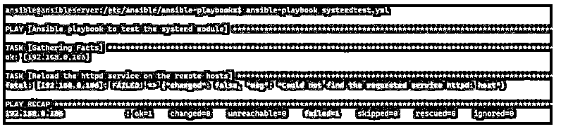

# 可扩展的系统

> 原文：<https://www.educba.com/ansible-systemd/>

## ansible 系统简介

Ansible systemd 模块，它是 Ansible-base 的一部分，默认情况下包含在 Ansible 安装中，systemd 模块控制服务管理(启动、停止、重新加载、重启)、计时器(启用/禁用)等系统单元。该模块支持基于 Unix / Linux 的操作系统。

### 可转换系统 d 的语法

该模块的语法是:

<small>网页开发、编程语言、软件测试&其他</small>

`systemd`

该模块支持的参数:

*   **参数:** daemon_reload
    **别名:** daemon-reload
    **选项:**是/否
    **默认:**否
    **注释:**在任何其他操作之前运行 daemon-reload，确保 systemd read 在操作之前已经读取了所有的更改。
*   **参数:** enabled
    **选项:**是/否
    **备注:** Enabled 参数使服务在引导时启动，启动时至少需要启用一个服务。
*   **参数:**强制
    **选项:**是/否
    **备注:**是否覆盖已有的符号链接。
*   **参数:**名称
    **别名:**服务，单位
    **备注:**要操作的服务的名称。使用 chroot 环境时，需要提供完整的服务名。
*   **参数:** no_block
    **选项:**是/否
    **默认:**否
    **备注:**指定时，异步运行操作，不等待作业完成，执行队列中的其他作业。
*   **参数:**状态
    **选项:**重装/重启/启动/停止。
    **注释:**
    **-reloaded:** 它会一直重新加载服务。
    **-重启:**总是会重启(弹跳)服务。
    –**启动/停止:**它们是幂等的，除非必要，否则不会运行命令。
*   **参数:**范围
    **选项:**系统/用户/全局
    **默认:**系统
    **备注:**用当前服务范围运行 systemctl 命令。默认范围(系统)、当前用户范围(用户)或所有用户范围(全局)。
*   **参数:**屏蔽
    **选项:**否/是
    **默认:**否
    **备注:**是否屏蔽该单元/服务。一个被屏蔽的单位是不可能启动的。

### Ansible 中的 systemd 模块是如何工作的？

systemd 模块处理与系统相关的单元，如服务、时间等。该模块专门设计用于 Unix / Linux 操作系统，不支持 windows 操作系统。

下面是使用 systemd 模块在 windows 操作系统组上启动后台打印程序服务的示例。

**代码:**

`---
- name: Ansible playbook to test the systemd module on windows host
hosts: winservers
tasks:
- name: make sure service is running
systemd:
name: spooler
state: started
ansible-playbook systemdtest.yml`

**输出:**

您可以看到生成的错误，因为 systemd 模块不能处理 windows 服务器。

### 可行系统的例子

以下是 Ansible systemd 的示例:

#### 示例#1

使用 systemd 确保服务正在运行。

我们将使用这个例子来确保 Apache 服务正在远程主机上运行。

**代码:**

`---
- name: Ansible playbook to test the systemd process
hosts: linuxservers
tasks:
- name: make sure service is running
systemd:
name: apache2
state: started
ansible-playbook systemdtest.yml`

**输出:**

如果服务名不存在，它将抛出一个错误；例如，远程服务器没有安装 httpd 服务。

**代码:**

`tasks:
- name: Reload the httpd service on the remote hosts
systemd:
name: httpd
state: reloaded
ansible-playbook systemdtest.yml`

**输出:**

要忽略该警报，我们可以使用 ignore_errors，这样它就不会停止进一步的任务或整个剧本。

**代码:**

`tasks:
- name: Reload the httpd service on the remote hosts
systemd:
name: httpd
state: reloaded
ignore_errors: yes
- name: This task will continue
debug:
msg: "Task continued"
ansible-playbook systemdtest.yml`

**输出:**

#### 实施例 2

如果正在运行，请停止该服务。

如果 apache 服务正在运行，此剧本将停止该服务；否则，没有变化，因为它是幂等的。

**代码:**

`tasks:
- name: Stop the apache service if running
systemd:
name: apache2
state: stopped`

#### 实施例 3

使用 systemd 选择配置更改并重新启动服务。

要在操作之前选择新的配置更改，我们可以使用参数 daemon_reload 或 daemon-reload (alias ),然后我们可以对任何服务执行操作。

**代码:**

`---
- name: Ansible playbook to test the systemd module
hosts: linuxservers
tasks:
- name: Restart the cron service on the server and issue the daemon-reload to pick config-related changes.
systemd:
state: restarted
daemon-reload: yes
name: cron`

#### 实施例 4

不同的服务操作相关任务。

**代码:**

`---
- name: Ansible playbook to test the systemd module
hosts: linuxservers
tasks:
- name: Task to read the system related configuration before proceeding for the other tasks.
systemd:
daemon-reload: yes
- name: Read the system configuration changes forcefully.
systemd:
daemon-reload: yes
force: yes
- name: Reload the Apache service in all cases.
systemd:
name: apache2
state: reloaded
- name: Start the apache service if not started already.
systemd:
name: apache2
state: started
- name: Restart the apache service in all cases.
systemd:
name: apache2
state: restarted
- name: Enable the apache2 service and ensure it is not masked
systemd:
name: apache2
enabled: yes
masked: no
- name: Force the systemd to execute itself
systemd:
daemon_reexec: yes`

在上面的例子中，daemon_reexec 参数是在 ansible 2.8 以后版本中添加的，force 参数是在 2.6 版本中添加的。

#### 实施例 5

为所有用户模式重新启动服务。

下面的行动手册将为所有用户重新启动服务，因为我们已经指定了全局范围。

**代码:**

`---
- name: Ansible playbook to test the systemd module
hosts: linuxservers
tasks:
- name: Restart the service for all users.
systemd:
name: apache2
state: restarted
scope: global`

#### 实施例 6

正在收集 systemd 模块生成的输出。

我们可以收集并显示 systemd 模块为服务生成的输出。

**代码:**

`---
- name: Ansible playbook to test the systemd module
hosts: linuxservers
tasks:
- name: Restart the apache service and gather output
systemd:
name: apache2
state: started
register: serout
- name: dispaly the output from variable.
debug:
msg: "{{ serout }}"
ansible-playbook systemdtest.yml`

**输出:**

### 结论

当我们使用 Ansible 的 systemd 模块时，它使用不同的系统模块，如服务、定时器等。更改与服务相关的设置，如重新加载、重新启动、停止、启动或启用或禁用远程主机上的计时器，而无需单独使用额外的模块，因此该模块直接处理操作系统及其内核。

### 推荐文章

这是一个关于 Ansible systemd 的指南。在这里，我们讨论 ansible 中的 systemd 模块的介绍和工作原理。分别是。您也可以看看以下文章，了解更多信息–

1.  [易变库存](https://www.educba.com/ansible-inventory/)
2.  [易受攻击的库存 _ 主机名](https://www.educba.com/ansible-inventory_hostname/)
3.  [可变变量](https://www.educba.com/ansible-variables/)
4.  [可以等待的时间](https://www.educba.com/ansible-wait_for/)

