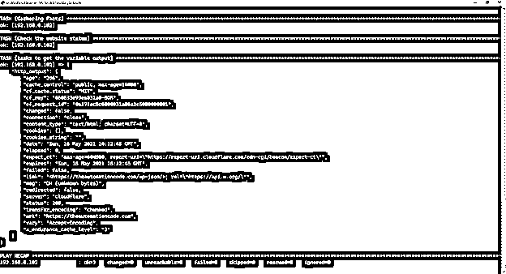
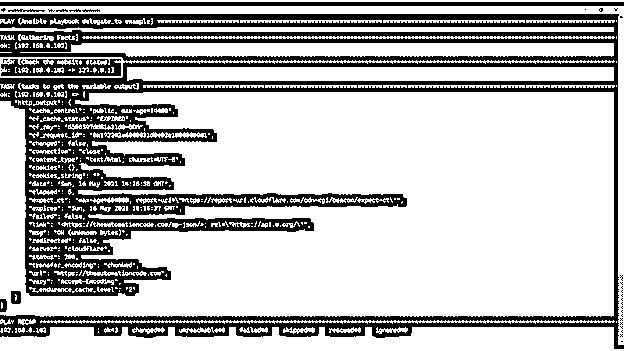

# 可接受的委托 _to

> 原文：<https://www.educba.com/ansible-delegate_to/>

## Ansible delegate_to 简介

Ansible delegate_to 属性或 ansible-playbook 中指定的关键字用于提供控制，以便在本地或其他不同的主机上运行任务，而不是在库存服务器列表上指定的远程主机上运行，这可以是几个任务或在本地运行整个 play-book，并且还将事实委托给本地机器或特定的一组组组。

### Ansible delegate_to 是如何工作的？

项目中有许多行动手册，有时需要在托管清单文件或行动手册的本地计算机上运行任务或整个行动手册，或者我们可以说，在不同于清单列表中提到的远程主机的不同远程主机上运行任务。在这种情况下，我们可以使用 delegate_to 参数，以便任务可以在本地运行。

<small>网页开发、编程语言、软件测试&其他</small>

举个例子，

假设您有一个要在一堆应用服务器上运行的修补任务，其中有几个数据库服务器，您需要在应用修补程序之前首先关闭数据库，但它们不属于清单组。在这种情况下，您需要在远程数据库服务器或本地 ansible 主机(如果需要)上本地运行该命令，并且必须将运行该任务的权限委托给远程数据库主机，因此对于该特定任务，我们将使用 delegate_to 参数，以便它可以远程执行这些命令。

一旦您为特定的任务运行 delegate_to 命令，控制器机器就会解除控制，并将其授予上述机器在本地运行，然后控制返回到剧本的下一个任务。

我们将使用下面的例子来理解命令的功能。我们区分了下面的例子/

不使用 delegate_to 参数(在远程服务器上–Linux servers 组)。

`---
- name: Ansible playbook without delegate_to example
hosts: linuxservers
tasks:
- name: Check the website status
uri:
url: https://theautomationcode.com
method: GET
register: http_output
- name: tasks to get the variable output
debug: var=http_output`

**输出:**

使用 Delegate_to 关键字。

`---
- name: Ansible playbook delegate_to example
hosts: linuxservers
tasks:
- name: Check the website status
uri:
url: https://theautomationcode.com
method: GET
delegate_to: 127.0.0.1
register: http_output
- name: tasks to get the variable output
debug: var=http_output`

在上面的例子中，我们从本地主机(127.0.0.1)委托运行任务的权限。

**输出:**

如果您注意到两个输出之间的差异，在第二个输出中，您可以看到任务被委托给 localhost(192 . 168 . 0 . 102 = > 127 . 0 . 0 . 1)，它是控制器节点。

您也可以使用本地主机来代替 127.0.0.1

一旦使用 delegate_to，默认情况下，由任何委派任务收集的事实将被分配给 inventory_hostName(当前主机)，而不是产生这些事实的主机(委派任务服务器)。为了设置委托服务器收集的事实，我们需要使用 delegated_facts，并且它的值应该为 true。

`---
- name: Example of the delegate facts
hosts: dbservers
tasks:
- name: test playbook for delegate facts
setup:
delegate_to: {{ items }}
delegate_facts: True
loop: "{{ groups['appservers'] }}"`

在上面的示例中，我们正在为数据库服务器编写剧本，任务将被委托给存储在 items 变量中的几个服务器，任务收集事实将只在 app servers 组上运行，而不是在列出的所有数据库服务器上运行。

我们还可以使用 local_action 代替 delegate_to 命令，如下所示。

`---
- name: Ansible playbook local_action example
hosts: linuxservers
tasks:
- name: Check the website status
local_action: command touch /tmp/local_file.ini`

**输出:**

上述命令将在本地主机上运行，而不是在远程计算机上运行。因此，当您检查控制器机器时，它将在位于 **/** tmp 位置的 ansible 主机上创建 local_file。

您也可以将 local_action 命令作为，

`local_action: command touch /tmp/local_file.ini {{ inventory_hostname }}`

### Ansible delegate_to 示例

以下是 Ansible delegate_to 的示例:

**例子**

了解委托任务流。

在下面的例子中，我们有四个任务，将文件从 ansible 控制器复制到远程目的地；在第二个任务中，我们将使用 delegate_to 参数仅从本地或委托服务器获取 URL 状态，在第三个任务中，我们将获取委托任务产生的输出，在第四个任务中，ansible 将重新启动远程机器。

通过这个例子，我们将看到控制流是如何工作的。

`---
- name: Ansible playbook delegate_to Workflow Example
hosts: linuxservers
tasks:
- name: Copy the file from the Source to the destiantion
copy:
src: /tmp/myfiles/
dest: /tmp
mode: 0644
- name: Check the website status
uri:
url: https://theautomationcode.com
method: GET
delegate_to: localhost
register: http_output
- name: tasks to get the variable output
debug: var=http_output
- name: Reboot servers after update
reboot:
reboot_timeout: 300`

在此示例中，第一个、第三个和第四个任务将从控制器主机运行到文件中提到的服务器，而委派主机将运行第二个任务。在本例中，它是 localhost。一旦执行了第一个任务，第二个任务将被委派给本地主机或指定的提到的委派主机，因此控制权被分配给委派主机，当第二个任务完成时，控制权被重新分配给控制器节点(即 ansible 主机),以便在未指定 delegate_to 的情况下在远程清单主机上再次运行该任务。所以这是一个双向的过程。

### 结论

在设计 play-book 的工作流时，任务委派非常有用，因为有时我们需要在清单文件组中未考虑的主机上运行命令，以便它可以运行委派的任务，并在稍后移回控制器主机，例如在修补之前从负载平衡器中移除服务器，这在清单文件中未提及。

### 推荐文章

这是一个关于 Ansible delegate_to 的指南。这里我们讨论 Ansible delegate_to 如何与示例和输出一起工作。您也可以阅读以下文章，了解更多信息——

1.  [可回答的乒声](https://www.educba.com/ansible-ping/)
2.  [可重启](https://www.educba.com/ansible-reboot/)
3.  [可变变量](https://www.educba.com/ansible-variables/)
4.  [Ansible with_items](https://www.educba.com/ansible-with_items/)

