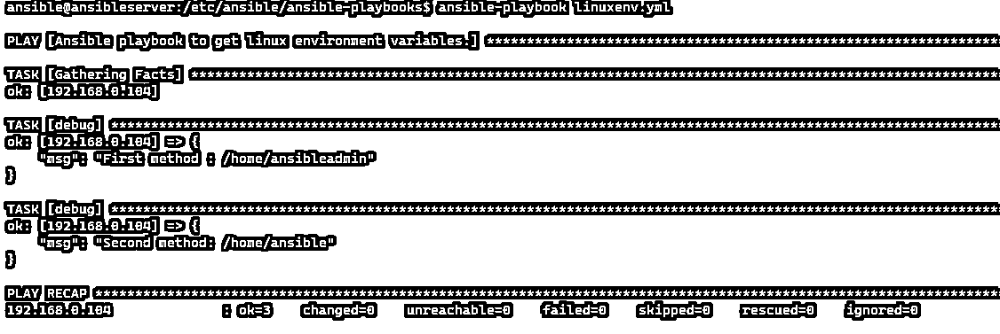

# 可变环境变量

> 原文：<https://www.educba.com/ansible-environment-variables/>

## Ansible 环境变量简介

Ansible 环境变量用于设置使用 Environment 关键字在远程主机上执行操作的环境变量，可以在剧本级或任务级设置，不会影响 ansible 配置文件或为用户设置的环境，并且不会自动包含到 gather_facts 收集的事实中，但需要在剧本中显式包含 gather_facts，然后需要设置环境以使其能够收集到事实中。

**语法**

<small>网页开发、编程语言、软件测试&其他</small>

为了处理环境变量，我们可以使用一些语法。

*   要设置远程环境:

**环境:**

*   要检索远程服务器的环境变量，

**ansible_env**

*   使用环境变量的 Windows 模块

**win_environment**

*   内置模块，

**ansible.builtin.env**

win_environment 模块级支持的参数–字符串(必需)

1.  **machine** :用于为所有用户设置一个环境变量。
2.  **用户**:用于为执行剧本的当前用户设置环境变量。
3.  **进程**:用于设置当前进程的环境变量。没有其他两个有用。

*   **名称**–字符串(必填)

环境变量的名称。

*   **状态**–字符串(可选)

1.  缺席的
2.  礼物

*   **值**–字符串(可选)

当状态=存在时，这是必须的，当状态=不存在时，可以省略。

### Ansible 中的环境变量是如何工作的？

如语法部分所述，每种语法都有不同的方式来设置、删除和检索远程主机上的环境变量。

举个例子，

假设我们需要从远程主机检索环境变量，那么我们可以使用 **ansible_env** 内置变量来检索远程操作系统上存储的环境变量。

`---
- name: Ansible playbook to retrieve environment variables on windows servers.
hosts: winservers
tasks:
- debug:
msg: "{{ansible_env}}"`

`ansible-playbook envtest1.yml`

**输出:**

对于 Linux 操作系统:

`---
- name: Ansible playbook to retrieve environment variables on linux servers.
hosts: linuxservers
tasks:
- debug:
msg: "{{ansible_env}}"`

`ansible-playbook envtest1.yml`

**输出:**

您可以在行动手册中使用这些变量，我们将在后面的示例中解释这些变量。

使用默认 ansible 模块检索变量的另一种方法: **ansible.builtin.env.** 我们需要使用如下所示的查找操作来获取变量值。

`---
- name: Ansible playbook to retrieve environment variables on linux servers.
hosts: linuxservers
tasks:
- debug:
msg: "{{ lookup('env','HOME') }}"`

`ansible-playbook envtest1.yml`

**输出:**

### 可变环境变量的示例

下面举几个例子

#### 示例#1

使用环境变量将安装程序复制到 Windows 用户临时驱动器。

本行动手册将 7-zip 安装程序复制到用户的临时驱动器，安装 7-zip 并从临时驱动器中删除安装程序。

`---
- name: Ansible playbook to install 7zip using environment variable
hosts: winservers
tasks:
- name: Copy 7zip file to the destination path
win_copy:
src: 'https://cdn.educba.com/etc/installers/7z1900-x64.msi'
dest: '{{ ansible_env.TEMP }}\7z1900-x64.msi'
- name: Install the 7zip
win_package:
path: '{{ansible_env.TEMP}}\7z1900-x64.msi'
product_id: "{23170F69-40C1-2702-1900-000001000000}"
- name: Delete the installer
win_file:
path: '{{ansible_env.TEMP}}\7z1900-x64.msi'
state: absent`

`ansible-playbook envtest1.yml`

`cat envtest1.yml`

**输出:**

在此示例中，我们使用{ { ansi ble _ env }检索 windows 环境临时目录。Temp}}。

#### 实施例 2

检索 Unix 环境变量的行动手册。

我们可以使用 **ansible_env** 和 **lookup** 函数来检索存储的环境变量。

`---
- name: Ansible playbook to get linux environment variables.
hosts: linuxservers
tasks:
- debug:
msg: "{{ ansible_env }}"`

上面的剧本检索了 unix 操作系统中的所有环境变量。

`ansible-playbook linuxenv.yml`

现在我们需要检索用户 env 变量。同样，我们可以使用这两种方法。

`---
- name: Ansible playbook to get linux environment variables.
hosts: linuxservers
tasks:
- debug:
msg: "First method : {{ ansible_env.HOME}}"
- debug:
msg: "Second method: {{(lookup('env','HOME'))}}"`

`ansible-playbook linuxenv.yml`

**输出:**

如果您注意到不同之处，就会发现两者有不同的输出，因为 **lookup** 方法检索我们已经设置的本地服务器环境变量细节，而 **ansible_env** 检索远程服务器环境变量细节。

如果变量值没有定义，那么我们可以设置它的默认值，如下所示。

`---
- name: Ansible playbook to get linux environment variables.
hosts: linuxservers
tasks:
- debug:
msg: "Undefined variable: {{ lookup('env','USR') }}"`

`ansible-playbook linuxenv.yml`

**输出:**

输出是空字符串。因此，我们可以设置如下所示的值。

`tasks:
- debug:
msg: "Explicit defined variable: {{ lookup('env','USR') | default('USERVAL',True) }}"`

`ansible-playbook linuxenv.yml`

**输出:**

#### 实施例 3

在 windows 系统中设置(添加/删除)环境变量。

要使用 windows servers 环境变量集，简单的方法是使用其可用的名为 win _ enviornment 的 windows 模块。

本行动手册在系统级别(计算机级别)添加了环境变量，并删除了 windows 服务器上的用户环境变量。

`---
- name: Set windows environment variables
hosts: winservers
tasks:
- name: Adding environment variable at the machine level
win_environment:
state: present
name: ScriptDir
value: 'D:\prod\scripts'
level: machine
- name: Removing environment variable at the user level
win_environment:
state: absent
name: Testvar
level: user`

#### 实施例 4

在任务中设置远程环境。

在这个例子中，我们准备远程服务器的环境来使用环境变量，但是这是在任务级别上特定的。其他任务看不到他们的价值。因此，我们设置了两个环境值供任务使用。

`---
- name: Setting up the remote environment to use an environment variable.
hosts: linuxservers
vars:
destpath: '/tmp/userdir'
tasks:
- name: Install cobbler
ansible.builtin.package:
name: cobbler
state: present
environment:
http_proxy: http://proxy.example.com:8080
PATH: "{{ destpath }}"`

运行此任务后，当您运行 ansible_env 时，您将找不到环境变量。

要在播放级别设置环境变量，

`---
- name: Setting up the remote environment to use an environment variable.
hosts: linuxservers
vars:
destpath: '/tmp/userdir'
environment:
http_proxy: http://proxy.example.com:8080
PATH: "{{ destpath }}"
tasks:
- name: task1
- name: task2`

它可以用于多种任务。

### 结论

在 ansible 中使用环境变量既简单又有用。然而，我们经常需要向剧本提供环境变量值，以便它可以在整个部署过程中保持一致。例如，如果我们需要将文件复制到 windows 服务器的用户主驱动器中，那么我们可以使用环境变量直接访问主驱动器路径。

### 推荐文章

这是一个关于 Ansible 环境变量的指南。在这里，我们讨论环境变量如何在 Ansible 中工作，以及示例和输出。您也可以看看以下文章，了解更多信息–

1.  [可变变量](https://www.educba.com/ansible-variables/)
2.  [易变库存](https://www.educba.com/ansible-inventory/)
3.  [可变变量](https://www.educba.com/ansible-variables/)
4.  [可回答的乒声](https://www.educba.com/ansible-ping/)

