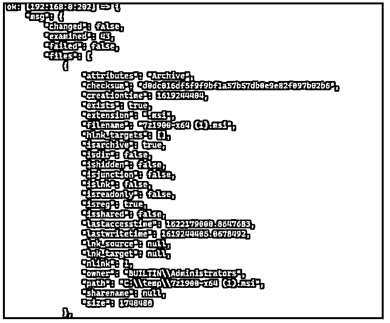
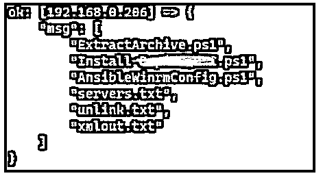

# 可行的查找

> 原文：<https://www.educba.com/ansible-find/>

## Ansible find 简介

Ansible find 模块或命令，顾名思义，用于递归搜索文件、目录或链接(如果指定的话),并基于单个或多个标准，如年龄、正则表达式或模式，此模块是 ansible-base 的一部分，默认包含在 Ansible 安装中，通常与 Unix 系统一起工作，要在 Windows 系统中使用此模块，我们需要使用 ansible windows 模块 ansible.windows.win_find。

### 可解析查找的语法

此模块的语法:

<small>网页开发、编程语言、软件测试&其他</small>

`“find:”`

它们可以与单个或多个参数一起使用，如下所示。并不是所有的参数都包括在内，只是常规搜索操作中需要的那些参数。

**1。路径:**要搜索的路径列表。所有路径都应该是完全限定的。

**2。年龄:**

*   选择等于或大于时间中指定期限的文件。
*   负期限搜索等于或小于时间中指定期限的文件。
*   年龄可以是秒、分、小时、天或周(例如 1w–1 周、2d–2 天)。

**3。递归:**默认否

*   如果指定 yes，则目录递归搜索文件。

**4。file_type:** 根据以下选择搜索类型:

*   文件(默认)
*   目录
*   环
*   任何的

**5。excludes:** 根据字符串或指定模式排除项目。

**6。深度:**要搜索的深度的最大级别。默认情况下是无限制的，如果指定的递归参数值为 no，则深度为 1。

**7。包含:**仅与 file_type=file 一起使用，根据文件内容搜索文件。

**8。pattern:** 根据正则表达式模式搜索项目。

**9。尺寸:**

*   基于等于或大于指定大小的大小选择文件。
*   如果大小为负，则查找等于或小于指定大小的文件。
*   默认大小以字节为单位。但是，你可以明确提到(b =字节，k =千字节，m =兆字节，g =千兆字节，t =太字节)。

10。隐藏:默认值为否，如果指定为是，则包含隐藏文件。

**11。read_whole_file:** 默认值为 no。如果指定 yes，则整个文件被读入内存，而不是逐行模式，如果文件很大，这会影响服务器性能。

### Ansible 中的 find 模块是如何工作的？

ansible-base 附带了 find 模块，这意味着在 ansible 安装中默认包含该模块，并且如上面的语法所述，我们可以使用各种参数来搜索文件、目录或链接。

当我们使用 windows 搜索项目时，我们需要使用 ansible.windows.win_find 模块，该模块使用与上面指定的几乎相同的参数。

以下行动手册将搜索 Windows 服务器 c:\temp 文件夹中的文件。

**代码:**

`---
- name: Ansible playbook to use the find module for Windows OS
hosts: winservers
tasks:
- name: Search the file from the C:\temp directories
ansible.windows.win_find:
paths: c:\temp`

**输出:**

当您运行上面的剧本时，您不会得到任何输出，因为输出没有存储在任何地方。为了存储检索到的输出，我们需要使用如下所示的寄存器变量。

**代码:**

`tasks:
- name: Search the file from the C:\temp directories
ansible.windows.win_find:
paths: c:\temp
register: myfiles
- debug:
msg: "{{ myfiles }}"`

**输出:**

为了进一步挖掘输出并只检索文件名，我们可以修改下面的 JSON 查询。

**代码:**

`tasks:
- name: Search the file from the C:\temp directories
ansible.windows.win_find:
paths: c:\temp
register: myfiles
- debug:
msg: "{{ myfiles | json_query('files[*].filename') }}"`

现在，您可以在输出中看到文件名。

**输出:**

### 可能的查找示例

以下是 Ansible find 的示例:

#### 示例#1

递归搜索/etc。超过 1 周且大于 1kb 的文件夹文件。

**代码:**

`---
- name: Ansible playbook to use the find files on the Unix servers
hosts: linuxservers
tasks:
- name: Search the file from the /tmp directories
find:
paths: /etc
recurse: yes
age: 1w
size: 1k
register: myfiles
- debug:
msg: "{{ myfiles | json_query('files[*].path') }}"`

**输出:**

#### 实施例 2

搜索*.ps1，*。txt 文件。

下面的剧本将搜索多个具有特定扩展名(ps1 和 txt)且大小小于 1mb 的文件夹中的文件，将输出存储在变量中，并通过 JSON 查询操作输出。

**代码:**

`---
- name: Ansible playbook to use the find module for Windows OS
hosts: winservers
tasks:
- name: Search the file from the directories
ansible.windows.win_find:
paths:
- c:\temp
- c:\scripts
size: -1m
patterns: '*.ps1,*.txt'
register: myfiles
- debug:
msg: "{{ myfiles | json_query('files[*].filename')}}"`

另一种方法是，您可以使用 regex 模式来搜索文件，如下所示。

**代码:**

`tasks:
- name: Search the file from the C:\temp directories
ansible.windows.win_find:
paths:
- c:\temp
- c:\scripts
size: -1m
patterns: "^.*?\\.(?:ps1|txt)$"
use_regex: yes`

**输出:**

#### 实施例 3

搜索根文件夹中的所有目录，包括隐藏目录。

**代码:**

`---
- name: Ansible playbook to use the find folders on the Unix servers
hosts: linuxservers
tasks:
- name: Search the directories from the root folder
find:
paths: /
file_type: directory
hidden: yes
register: myfiles
- debug:
msg: "{{ myfiles | json_query('files[*].path') }}"`

上面的剧本搜索根文件夹目录，包括隐藏的目录。

#### 实施例 4

排除文件夹。

下面的剧本将搜索/etc 中的所有目录。文件夹，并将排除 3 个目录(python3、selinux 和 lvm)。

**代码:**

`---
- name: Ansible playbook to use the find files on the Unix servers
hosts: linuxservers
tasks:
- name: Search the directories
find:
paths: /etc
file_type: directory
excludes: 'python3,selinux,lvm'
register: myfiles
- debug:
msg: "{{ myfiles | json_query('files[*].path') }}"`

### 结论

Ansible 内置模块 find 和 windows 模块 win_find 的工作方式类似于我们用来搜索文件或目录的 shell、batch 或 PowerShell 语言，但我们不需要在 ansible 中操作命令来获得所需的搜索结果；相反，我们可以使用直接帮助我们搜索文件和文件夹的参数，如文件年龄、大小等。

### 推荐文章

这是一个 Ansible find 的指南。这里我们讨论引言；ansible 中的 find 模块是如何工作的？和示例。您也可以看看以下文章，了解更多信息–

1.  [易变库存](https://www.educba.com/ansible-inventory/)
2.  [易受攻击的库存 _ 主机名](https://www.educba.com/ansible-inventory_hostname/)
3.  [可变变量](https://www.educba.com/ansible-variables/)
4.  [可以等待的时间](https://www.educba.com/ansible-wait_for/)

