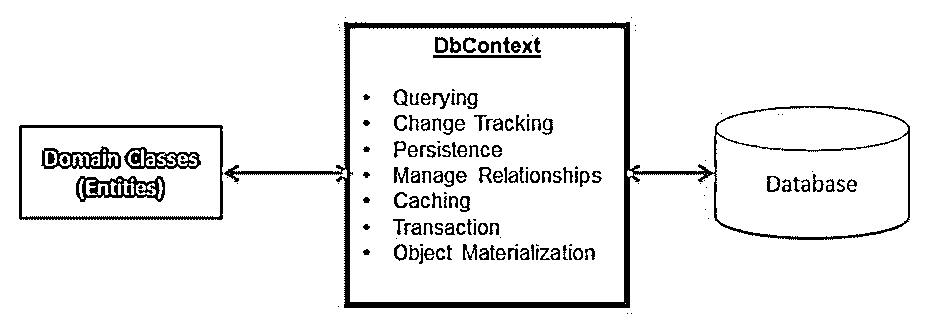

# 实体框架 DbContext

> 原文：<https://www.educba.com/entity-framework-dbcontext/>


## 实体框架 DbContext 简介

实体框架 DbContext 是一个类，它是实体类和数据库之间的桥梁。DbContext 是实体框架不可或缺的一部分，是与数据库交互的主要依赖类。DbContext 的实例表示与数据库的会话，用于查询和存储数据库中实体的实例。实体框架 DbContext 是存储库模式和工作单元的组合。

### 实体框架 DbContext 概述

DbContext 是 EF 的大脑，它完成与数据库的全部通信，并且是 EF 代码优先方法的主干。该类继承自命名空间系统。Data.Entity.DbContext 和 DbContext 是 EntityFramework.dll 程序集的一部分，它们分别安装在 NuGet 包管理器中。实体框架 DbContext 是一个类，它是域或实体类与数据库之间的桥梁。

<small>网页开发、编程语言、软件测试&其他</small>




负责与数据对象交互的主要类称为 System.Data.Entity.DbContext，DbContext API 更加频繁和灵活，向 DbContext 和代码优先 API 释放创新特性；EF 团队通过 MS NuGet 功能分发 EntityFramework.dll。

*   NuGet 允许包含对。NET 项目，方法是将 dll 直接从 web 拖动到项目中。
*   DbContext API 简化了与 EF 的交互，减少了访问常用任务所需的方法和属性。
*   Context 类在执行过程中控制实体对象，包括具有来自数据库的数据的对象、将数据保存到 db 以及更改跟踪。

### 实体框架 DbContext 类

DbContext 类是 EF API 中的一个介绍性类，它是实体类或域和数据库之间的桥梁。实体框架 DbContext 是存储库模式和工作单元的组合。

它负责以下活动:

*   **查询:**查询活动只不过是将 LINQ 到实体的查询转换成 SQL 查询，并将它们发送回数据库。
*   **变更跟踪:**变更跟踪活动一旦从数据库中查询，就跟踪实体上的变更。
*   **持久化数据:**该活动基于实体状态执行 CRUD 操作，如插入、删除、更新数据库。
*   **缓存:**该活动默认提供缓存级别，并存储在上下文类的整个时间内检索到的实体。
*   **对象物化:**该活动将数据库中的原始数据转换成实体的对象。
*   **管理关系:**该活动使用代码优先方法中的 Fluent API 配置，在数据库优先或模型优先方法中管理 SSDL、CSDL 和 MSL 之间的关系。

### 添加实体框架 DbContext

要在应用程序中添加实体框架 DbContext 类，我们必须构建派生 Microsoft 中可用的 DbContext 类的类。EntityFramework 命名空间。创建类文件名”并从 DbContext 类继承该类，如下所示，您希望可以在这里为 DbContext 类指定任何名称。我提供了名称 CompanyDbContext。

**代码:**

```
public class CompanyDbContext : DbContext
{
}
```

我们必须通过 DbContext 类执行任务，我们需要一个实例 DbContextOptions 类。该实例包含所需的信息，如连接字符串、数据库提供者等。为了传递 ContextOptions 实例，我们使用了 CompanyDbContext 类的构造函数，如下所示，

**代码:**

```
public CompanyDbContext (DbContextOptions< CompanyDbContext > options)
: base(options)
{
}
```

让我们看看实体框架 DbContext 类，它包含用于应用程序中每个实体的属性 DbSet <tentity>。</tentity>

只需创建两个实体作为公司和订单，如下所示:

**公司:**

**代码:**

```
public class CompanyTable
{
public int CompId { get; set; }
public string CmName { get; set; }
public string CmAddress { get; set; }
public string Cm_ContactNo { get; set; }
public Nullable<System.DateTime> Curr_date { get; set; }
}
```

**订单:**

**代码:**

```
public class Order
{
public int O_Id { get; set; }
public int OrderNo { get; set; }
public Nullable<int> CompId { get; set; }
}
```

该应用程序包含两个实体，因此 CompanyDbContext 类和我们有两个 DbSet 属性，如下所示:

**代码:**

```
public partial class CompanyDbContext : DbContext
{
public CompanyDbContext (DbContextOptions< CompanyDbContext > options)
: base(options)
{
}
public DbSet<CompanyTable> CompanyTables { get; set; }
public DbSet<Order> cmOrders { get; set; }
}
```

CompanyTable 和 Orders 等 DbSet 属性将执行整个操作。

让我们看看下面的 DbContext 类；该类从 DbContext 派生，通过使用实体框架添加公司的详细信息，如下所示:

**代码:**

```
using System;
using System.Data.Entity;
using System.Data.Entity.Infrastructure;
public partial class CompanyDbContext: DbContext
{
public CompanyDbContext ()
: base("name= CompanyDbContext ")
{
}
protected override void OnModelCreating(DbModelBuilder modelBuilder)
{
throw new UnintentionalCodeFirstException();
}
public DbSet<CompanyTable> CompanyTables { get; set; }
public DbSet<Order> cmOrders { get; set; }
}
```

向数据库添加详细信息，包括以下代码:

**代码:**

```
using (CompanyDbContext context = new CompanyDbContext ())
{
//to add new company to the database
var addCompany = new CompanyTable
{
CmName ="GlassWorkApplications",
CmAddress ="Chennai",
Cm_ContactNo ="9908876510"
};
context.CompanyTables.Add(addCompany);
context.SaveChanges();
}
```

**输出:**


### 实体框架 DbContext 数据操作

DbContext 是 EF 的大脑，它完成与数据库的全部通信，并且是 EF 代码优先方法的主干。DbContext 是 EntityFramework.dll 程序集的一部分，它单独安装在 NuGet 包管理器中。实体框架 DbContext 是一个类，它是实体或类型与数据库之间的桥梁。

DbContext 类中有几种操作方法，如下所示:

*   **添加:**添加状态为已添加的新实体。
*   **AddRange:** 添加状态为 added 的新实体集合。
*   **Attach:** 这个方法附加新的或者已经存在的实体，状态不变。
*   **AttachRange:** 这个方法连接一个新的或已有实体的集合，其状态不变。
*   **Remove:** 附加删除状态的实体。
*   **RemoveRange:** 这个方法保护具有删除状态的实体的集合。
*   **Update:** 该方法将断开连接的数据实体与修改后的状态连接起来。
*   **UpdateRange:** 该方法确保收集具有修改状态的断开连接的实体。
*   **SaveChanges:** 该方法对状态为已修改、已添加或已删除的实体执行对数据库的插入、更新和删除命令。
*   **OnModelCreating:** 这个操作覆盖了方法配置模型，该方法配置模型是根据派生上下文的 DbSet < TEntity >属性中的实体类型的约定发现的。

### 结论

本文已经看到了 DbContext，EF 的大脑，以及实体类和数据库之间的桥梁。EF DbContext 通过添加记录以编程方式进行解释，以便更好地理解。

### 推荐文章

这是一个实体框架 DbContext 的指南。这里我们讨论简介、概述、添加实体框架 DbContext 和数据操作。您也可以看看以下文章，了解更多信息–

1.  [实体框架核心](https://www.educba.com/entity-framework-core/)
2.  [ASP.NET 核心实体框架](https://www.educba.com/asp-dot-net-core-entity-framework/)
3.  [实体框架 NuGet](https://www.educba.com/entity-framework-nuget/)
4.  [实体框架加入](https://www.educba.com/entity-framework-join/)


