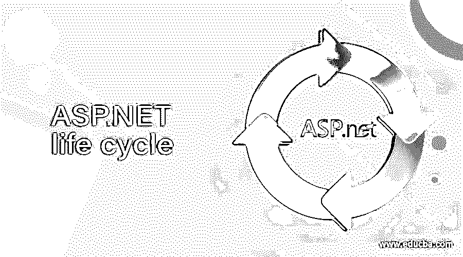

# ASP.NET 生命周期

> 原文：<https://www.educba.com/asp-dot-net-life-cycle/>

## ASP.NET 生命周期简介

ASP.Net 是一个软件框架，它通过提供可重用的组件来支持任何类型的软件应用程序的快速开发。它可以安装在运行 Microsoft windows 操作系统的计算机上。ASP.net 框架有两个主要组件，一个是 CLR(公共语言运行时)和 FCL(框架基础类库)。CLR 用于定位、加载和管理。网络类型。CLR 还负责许多底层细节，如内存管理、线程、对象上下文边界和异常处理。在本主题中，我们将了解 ASP.NET 的生命周期。

### Asp.net 生命周期

我们可以将 ASP.NET 的生命周期分为应用程序生命周期和页面生命周期。这个我们一个一个来讨论吧。

<small>网页开发、编程语言、软件测试&其他</small>

Asp.net 应用程序的生命周期如下

*   用户首先在网站上请求一个页面。
*   请求被路由到处理管道，处理管道将请求转发到 ASP.NET 运行时。
*   net 运行库创建 ApplicationManager 类的一个实例。ApplicationManager 实例表示。将用于执行应用程序请求的. net framework 域。称谓域将全局变量与其他应用程序隔离开来，并允许每个应用程序根据需要单独加载和卸载。
*   创建应用程序域后，将创建宿主环境类的实例。该类提供对宿主环境内部项目的访问，如目录文件夹。
*   net 创建一个核心对象的实例，用于处理请求。这包括 HttpContext、HttpRequest 和 HTtpResponse 对象。
*   net 创建 HttpApplication 类的一个实例。该类也是站点的 global.asax 文件的基类。这个类用于捕获应用程序启动或停止时发生的事件。当 ASP.NET 创建 HttpApplication 的实例时，它也创建了为应用程序配置的模块，如 SessionStateModule。
*   最后，ASP.NET 通过 HttpApplication 管道处理请求。这个管道还包括一系列用于验证请求、映射 URL、访问缓存等的事件。希望扩展应用程序类的开发人员会对这些事件感兴趣。

### 响应应用程序事件

HttpApplication 类提供了几个事件，您可以处理这些事件来执行操作。当 ASP.NET 在应用程序级别引发某些事件时，这些事件在预用户级别不起作用。以下是开发人员最常使用的事件。

*   **Application_Start:** 当你的应用被 IIS 启动时引发。
*   **Application_End:** 当 tour 应用程序停止或关闭时引发。
*   **Application_Error:** 发生未处理的错误，上升到应用范围时引发。
*   **Application_LogRequest:** 当向应用程序发出请求时引发。
*   **Application _ PostLogRequest:**在请求的日志记录完成后引发。

### 页面的 Asp.net 生命周期

除了应用程序生命周期之外，网站上每个页面还有页面生命周期。

*   第一个用户请求网页。
*   在 web 服务器上，asp net 编译页面或从缓存中提取页面。
*   **开始:**设置请求和响应对象。确定 IsPostBack。
*   初始化页面控件，但不初始化它们的属性。应用页面主题。
*   **Load:** 如果回发，从视图状态加载控件属性。
*   **验证:**验证页面和验证器控件。
*   回发请求的调用控制事件处理程序。
*   **渲染:**保存视图状态。呈现控件并显示页面。
*   **卸载:**卸载请求和响应对象。执行清理。该页面已准备好被丢弃。向用户返回响应。

### 响应页面事件

以下是开发人员最常使用的事件

*   Int: 它在每个控件初始化后被引发
*   **PreInt:** 该事件仅在需要设置母版页或主题等值时使用。
*   InitComplete: 在页面及其控件的所有初始化完成后引发。
*   **PreLoad:** 在为页面及其控件加载视图状态之前，回发处理之前引发。
*   **Load:** 首先调用页面加载事件。然后依次调用每个子控件的 load 事件。
*   **控件事件:**Asp.net 调用页面或其控件上导致回发发生的任何事件。这可能是按钮点击事件或下拉列表。
*   **LoadComplete:** 此时，所有控件都被加载。如果此时需要做额外的处理，可以在这里做。
*   PreRender: 它允许对其控制的页面进行最终修改。它发生在所有常规回发事件发生之后。
*   **SaveStateComplete:** 如果您需要编写需要设置视图状态的处理，这很有用。
*   **Render:**ASP.NET 在页面的每个控件上调用这个方法来获得它的输出。
*   **Unload:** 该事件用于清理代码。我们可以使用它来手动释放资源，这是一个很少需要的过程。

### 推荐文章

这是一本 ASP.NET 生命周期指南。在这里，我们将 ASP.NET 生命周期分为两个阶段:应用程序生命周期和页面生命周期。我们也讨论了这些事件。您也可以阅读以下文章，了解更多信息——

1.  [ASP.NET 网格视图](https://www.educba.com/asp-dot-net-gridview/)
2.  [ASP.NET 更新面板](https://www.educba.com/asp-dot-net-updatepanel/)
3.  [ASP.NET 版本](https://www.educba.com/asp-dot-net-versions/)
4.  [ASP.NET 图像](https://www.educba.com/asp-dot-net-image/)