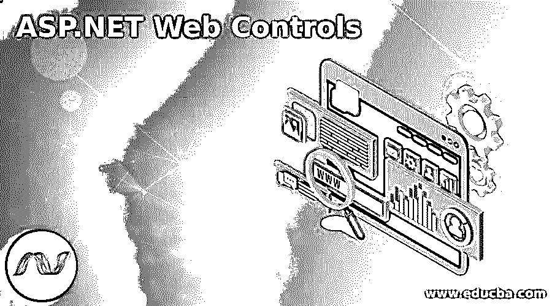

# ASP.NET Web 控件

> 原文：<https://www.educba.com/asp-net-web-controls/>

## ASP.NET Web 控件简介

ASP.NET 页面框架包括许多内置控件，旨在为 web 提供更结构化的编程模型。这些控件提供了许多功能，如自动状态管理、构建网页用户界面的通用方法、无需使用请求对象即可简单访问对象值、基于浏览器功能自动定制输出、对服务器端代码中的事件做出反应以创建结构更好的应用程序的能力。这些控件是放置在 ASP.NET 页面中的对象，由 ASP.NET 运行时处理。

### 不同的 ASP.NET Web 控件

ASP.NET web 控件用于显示网页中的数据。

<small>网页开发、编程语言、软件测试&其他</small>

下面逐一给出了控件:

#### 1.GridView 控件

GridView 控件用于在网页中显示多条记录。它还可以让您添加，更新和删除数据库中的记录，而无需编写一行代码。在 GridView control x 中，每一列代表一个字段，而每一行代表记录的。若要使用 GridView 控件，DataSource 控件必须附加到 GridView 控件。

GridView 控件的属性 DataSource 将 GridView 控件绑定到 DataSource 控件，并允许对 DataSource 进行分页、排序和数据库操作。ID、DataSource ID、DataKeyNames、AllowSorting、AllowPaging、Pagesize、AutoGenerateColumns、AutoGenerateEditButton、BackColor、BorderColor、BorderWidth、Caption、Width、Visible、SelectedIndex 和 Runat 是 GridView 控件的一些属性。

#### 2.详细视图控件

DetailsView 控件用于创建显示单个数据库记录内容的 HTML 表。DetailsView 控件有三种模式，即编辑、读取和只读。编辑模式允许用户更新记录的值。插入模式允许用户向数据源添加新记录，只读模式用于显示模式。

DetailsView 控件的属性如下:

*   **ID:** 用于指定控制标识。
*   **Runat:** 必须是对等服务器。
*   **DataSourceID:** 是绑定 DetailsView 控件的数据源的 ID。
*   **DefaultMode:** 用于设置编辑、插入、只读等控件的初始模式。
*   **DataKeyNames:** 它是作为数据源主键的列名列表。
*   **允许寻呼:**等于 true 时创建寻呼号码。

Databinding、DataBound、ItemCommand、ItemCreated、ItemDeleted、ItemInserting、ItemUpdating、ItemUpdated、ModeChanging、ModeChanged、PageIndexChanging、PageIndexChanged 是由 DetailsView 控件生成的一些事件。

#### 3.FormView 控件

FormView 控件用于显示数据库中的单个记录。它类似于 DetailsView 控件，只是它显示用户定义的模板而不是行字段。您可以创建自己的模板。它在控制数据显示方式方面提供了更大的灵活性。它正在绑定数据源控件，如 SqlDataSource 和 ObjectDataSource。

它内置了插入功能、更新和删除功能以及分页功能。你可以通过模板，主题和风格来定制它。EditItem template 在编辑模式下控制 FormView 控件。它包括 textbox 数据源中的每个可编辑列。textbox，text 属性使用绑定表达式将数据源字段数据绑定到 textbox。InsertItem template 在插入模式下控制 FormView 控件。它类似于 EditItem 模板。

#### 4.ListView 控件

ListView 控件是一个非常灵活的 web 控件，它基于您定义的模板呈现其内容。与 repeater 控件不同，ListView 添加了更高级别的功能，如选择和编辑，这与 GridView 控件中的工作方式相同。ListView 控件可以取代 ASP.NET 所有其他数据绑定控件。它使得数据绑定更加容易。它包含了 CSS 样式、灵活的分页、插入、删除、排序和更新功能。

使用 ListView 控件最常见的原因是为了创建一个不寻常的布局。ListView 控件包括一些按钮，如取消编辑或插入操作的取消按钮、将 SelectedIndex 属性设置为该项的 DisplayIndex 属性值的选择按钮、从数据源中删除当前记录的删除按钮、将 ListView 控件置于编辑模式的编辑按钮、使用绑定值更新数据源中的当前记录的更新按钮以及将绑定值插入数据源的插入按钮。

#### 5.数据管理器控制

ListView 控件不直接支持分页，因此 DataPager 控件充当外部控件，为 ListView 控件提供分页功能。单独控制的优点是，它在页面外观和页面上放置位的位置方面提供了更大的灵活性。DataPager 控件可以通过使用 PagedControlID 属性与数据绑定控件链接。通过更改 PageSize 属性，可以修改每页数据显示的项数。PagedControlID、PageSize、MaximumRow、StartRowIndex 和 TotalRowCount 是 DataPager 控件的属性。

### 结论

在本文中，我们已经看到了各种 ASP.NET web 控件的工作、属性和特性。为了创建网页和处理网页上的数据，这些控件起着重要的作用。根据需求，我们可以在 web 上使用这些控件进行数据绑定。

### 推荐文章

这是 ASP.NET Web 控件的指南。这里我们分别讨论介绍和不同的 ASP.NET web 控件。您也可以看看以下文章，了解更多信息–

1.  [ASP.NET 版本](https://www.educba.com/asp-dot-net-versions/)
2.  [ASP.NET 会话 ID](https://www.educba.com/asp-net-sessionid/)
3.  [ASP.NET 网格视图](https://www.educba.com/asp-dot-net-gridview/)
4.  [ASP.NET 认证](https://www.educba.com/authentication-in-asp-dot-net/)