# ASP.NET MVC 4

> 原文：<https://www.educba.com/asp-dot-net-mvc-4/>

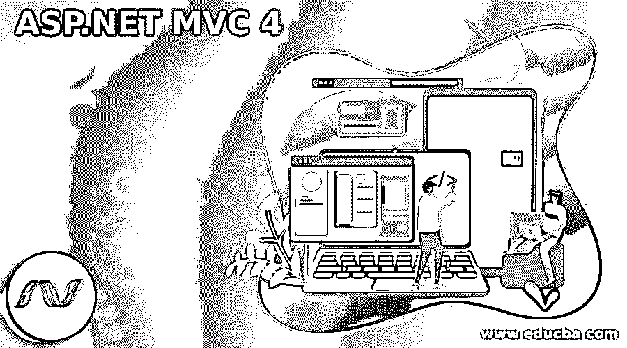

## ASP.NET MVC 4 简介

ASP.NET MVC 4 是一个开源软件框架，用于创建遵循模型-视图-控制器(MVC)模式的高度可伸缩、可测试、基于标准和可控的 Web 应用程序。它支持清晰的关注点分离，如 UI 视图、处理用户数据的控制器和逻辑域的模型。通过使用这一点，开发人员可以使用各种功能轻松构建 web 应用程序，从而实现快速应用程序开发和代码的清晰分离。

### 什么是 ASP.NET MVC？

ASP.NET MVC 是一个框架，它将 MVC(模型-视图-控制器)模式的特性与一个更新的系统相结合。MVC 框架通过使用以下三个组件来创建 Web 应用程序

<small>网页开发、编程语言、软件测试&其他</small>

*   模型——表示称为业务层的数据访问
*   视图-表示应用程序的用户界面部分
*   控制器处理用户请求；它控制整个应用程序。

### 创建新的 ASP.NET MVC 4 项目

ASP.NET MVC 通过将应用程序分成三个部分来控制应用程序问题:模型、视图和控制器。让我们看看 MVC 应用程序的创建，如下所示，

首先，转到文件新建项目。在 Web 模板下打开对话框后，选择 ASP.NET MVC 4 Web 应用程序，给出项目的正确名称，然后单击 ok。

接下来，为您的项目选择模板；在这里，我选择了空模板和视图引擎作为 Razor，如下所示，

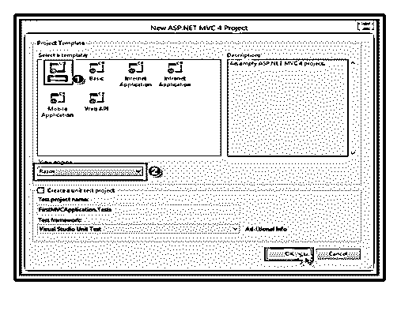

一旦选择了空模板，项目的文件夹结构如下所示，将有三个架构组件，如模型、视图、控制器，

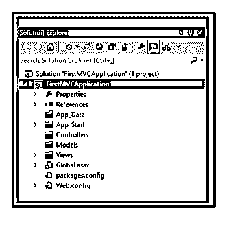

接下来，为了在项目中包含控制器，用户的整个请求都由控制器处理。要添加控制器，右键单击控制器文件夹并添加控制器。

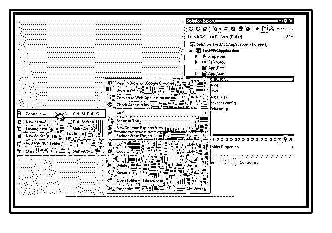

添加控制器后，给出控制器的名称；每个控制器名称都必须以 controller 结尾。这里控制器的名称是 HomeController，

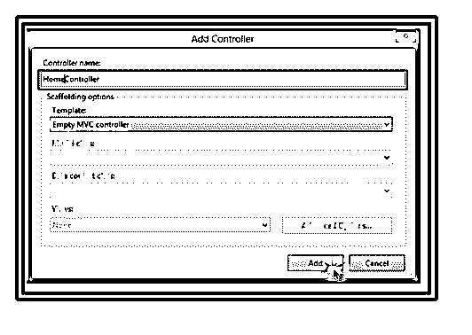

HomeController 包含如下默认索引方法，

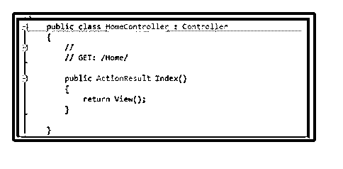

我们可以改变索引操作方法，因为我们希望返回一个字符串；给出类似“欢迎来到 ASP.NET MVC-4”的返回消息。

`public class HomeController : Controller
{
public string Index()
{
return "Welcome to ASP.NET MVC-4";
}
public string About()
{
return "Welcome to ASP.NET MVC-4 – About Page";
}
}`

要执行该应用程序，结果将如下所示，

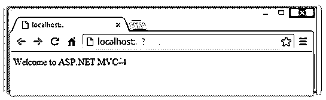

我们也可以通过输入控制器和方法名来直接给出 url，

例如 http://39393/home/index，我们在输入它时得到相同的结果。如果我们想进入特定的页面，我们也可以输入 http://39393/home/about。将显示以下结果，

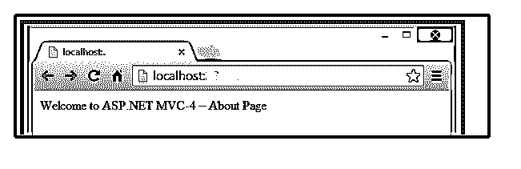

通过在项目本身的 RouteConfig.cs 文件中指定，我们可以直接获得特定的页面，而无需进入网站。App_Start 目录中用于 URL 映射的类；让我们看看 RouteConfig.cs 文件

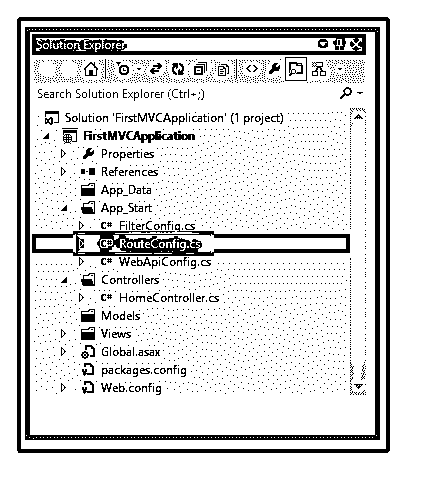

RouteConfig.cs 包含的 url 模式类似于给定的 URL:“{ controller }/{ action }/{ id }”，它最初定义了要传递的控制器和 action 方法的名称，后跟斜杠(/)，最后是可选参数。RouteConfig.cs 代码如下所示，

`public class RouteConfig
{
public static void RegisterRoutes(RouteCollection routes)
{
routes.IgnoreRoute("{resource}.axd/{*pathInfo}");
routes.MapRoute(
name: "Default",
url: "{controller}/{action}/{id}",
defaults: new { controller = "Home", action = "Index", id = UrlParameter.Optional     }
);
}
}`

### ASP.NET MVC 4 在服务器上安装

要安装 ASP.NET MVC 4，请下载并安装 Visual Studio 2010 Service Pack 1，它需要在 VS 2010 中使用 MVC 4。只需从微软下载中心下载或点击下面的链接，

http://www.microsoft.com/en-in/download/details.aspx?id=23691

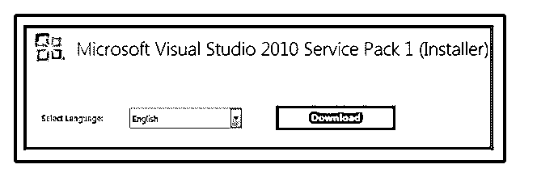

将下载“VS10sp1-KB983509.exe”。一旦安装 VS 2010 SP 1，继续安装 MVC，http://www.microsoft.com/en-us/download/details.aspx?id=30683

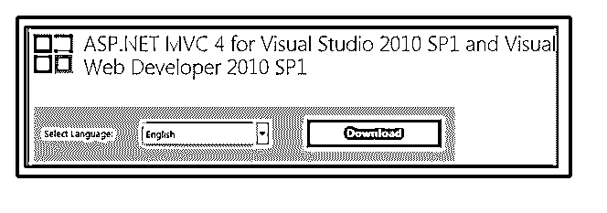

下载安装文件“aspnetmvc 4 setup . exe”MVC 4 安装完成后，双击执行。

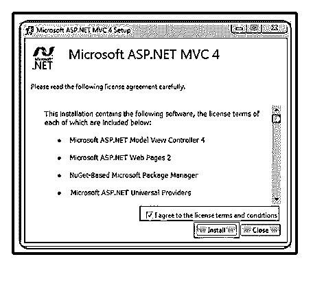

安装完成后，下面的屏幕出现了。

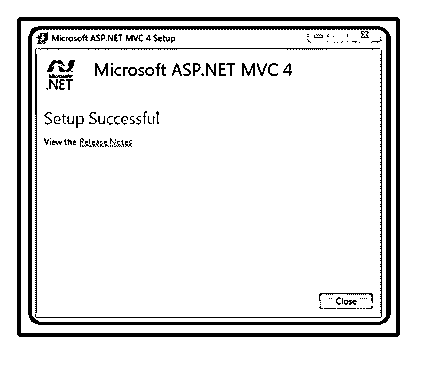

### ASP.NET MVC 4 项目模板

ASP.NET MVC 支持清晰的关注点分离，比如 UI 视图、处理用户数据的控制器和逻辑域的模型。通过使用这一点，开发人员可以使用各种功能轻松构建 web 应用程序，从而实现快速应用程序开发和代码的清晰分离。让我们看看这个项目中可用的各种模板，如下所示:

**空模板**–包含基本的空 MVC 文件夹结构，带有全局。asax 文件和顶部的 App_Start 文件夹。它将包含脚本和内容文件夹。该模板如下所示，

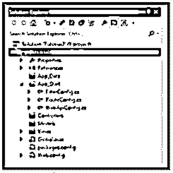

**基本模板**附带的 MVC 文件夹是空的，但是视图文件夹包含了 Layouts.cshtml 和 Error.cshtml 的共享文件夹，它包含了默认的脚本文件，内容文件夹包含了主题和样式表。选择基本模板时，文件夹结构如下所示，

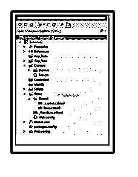

**互联网应用模板**自带文件夹结构 HomeController，默认视图的 AccountController 和 AccountModels 需要注册。它默认带有内置的基本登录和注册机制。文件夹结构如下所示，

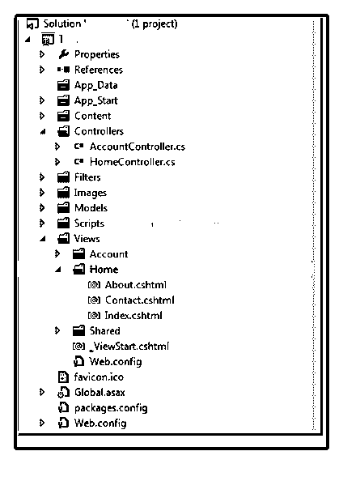

**内部网应用程序模板–**它类似于互联网应用程序模板。它包含默认的 HomeController with View，并带有基于 Windows 的身份验证机制。该模板如下所示，

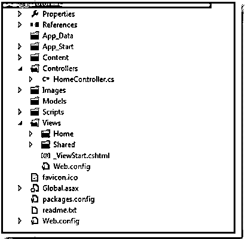

**移动应用程序模板**类似于互联网应用程序模板，带有默认视图的家庭和账户控制器。该模板附带了注册和登录机制。我们可以删除外部日志函数的 DotNetOpenAuth 引用。该模板如下所示，

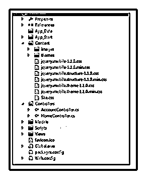

**Web API 模板**是互联网应用模板的另一个版本；它带有 HomeController 的默认视图 Home 和 ValueController，Value Controller 继承自 ApiController。它主要用于创建 HTTP RESTful Web 服务。模板文件夹结构如下所示，

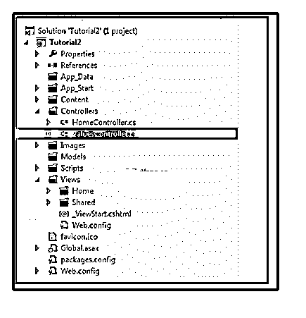

**ASP.NET MVC 4 新特性**

在 ASP.NET MVC 4 中，将会有一个新的特性。让我们来看看 ASP.NET MVC 的特点，

**捆绑**–用于改善请求加载时间。它包含以下代码，这些代码位于“App_Start\BundleConfig.cs”文件中。

`public static void RegisterBundles(BundleCollection bundles)
{
bundles.Add(new ScriptBundle("~/bundles/jquery").Include(
"~/Scripts/jquery-{version}.js"));
}`

我们可以向文件中添加多个 RegisterBundle 方法，如下所示，

`bundles.Add(new StyleBundle("~/Content/themes/base/css").Include(
"~/Content/themes/base/jquery.ui.core.css",
"~/Content/themes/base/jquery.ui.resizable.css",
"~/Content/themes/base/jquery.ui.selectable.css",
"~/Content/themes/base/jquery.ui.accordion.css",
"~/Content/themes/base/jquery.ui.autocomplete.css",
"~/Content/themes/base/jquery.ui.button.css",
"~/Content/themes/base/jquery.ui.dialog.css",
"~/Content/themes/base/jquery.ui.slider.css",
"~/Content/themes/base/jquery.ui.tabs.css",
"~/Content/themes/base/jquery.ui.datepicker.css",
"~/Content/themes/base/jquery.ui.progressbar.css",
"~/Content/themes/base/jquery.ui.theme.css"));`

**移动开发**–我们可以使用移动 jQuery 和 HTML 5 在 MVC 中创建移动页面。

**Oauth 提供者**–ASP.NET MVC 为用户提供外部提供者的登录凭证。将会有各种 OAuth 提供商，如脸书、Twitter 等。

### 结论

这篇文章向我们介绍了 ASP.NET MVC 4，以及用不同的项目模板文件夹结构创建新的 MVC 4 项目。希望文章能帮助你理解。

推荐文章

这是一个 ASP.NET MVC 4 的指南。这里我们讨论 ASP.NET MVC 4 的安装过程和新 MVC 4 项目的创建。您也可以阅读以下文章，了解更多信息——

1.  [ASP.NET 核心 JWT](https://www.educba.com/asp-dot-net-core-jwt/)
2.  [ASP.NET 网格视图](https://www.educba.com/asp-dot-net-gridview/)
3.  [ASP.NET 核心会议](https://www.educba.com/asp-dot-net-core-session/)
4.  [ASP.NET 视图状态](https://www.educba.com/asp-dot-net-viewstate/)