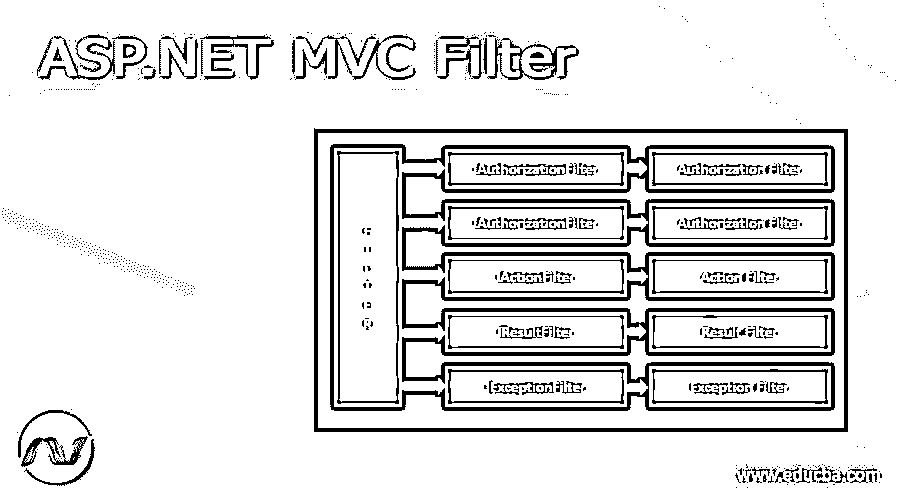
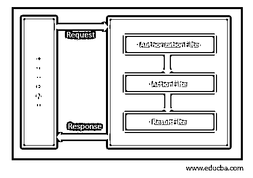
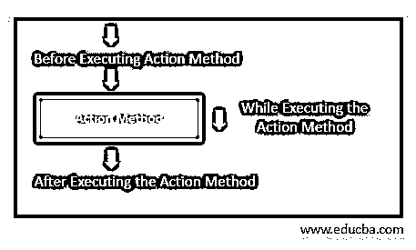
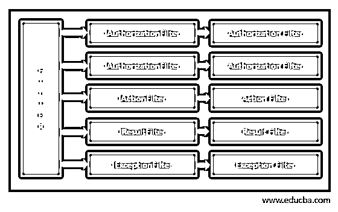
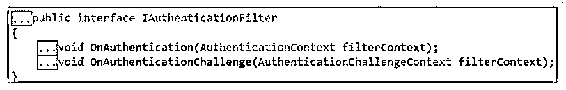
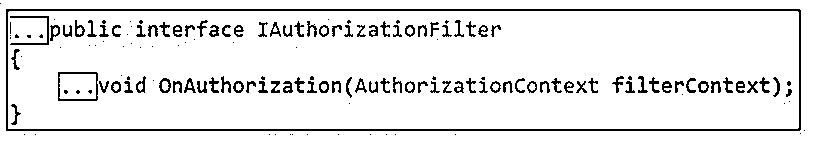
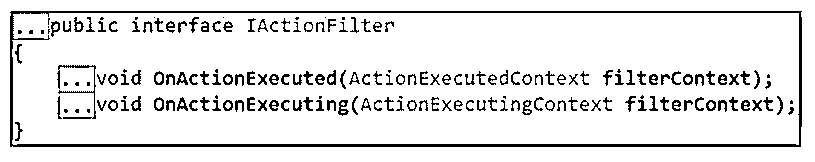
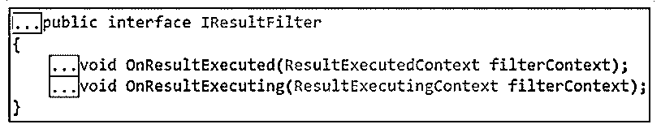
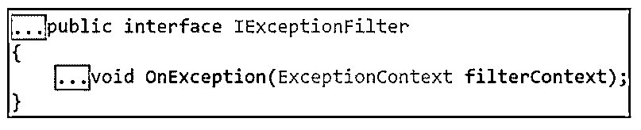

# ASP.NET MVC 滤波器

> 原文：<https://www.educba.com/asp-dot-net-mvc-filter/>

## ASP.NET MVC 过滤器介绍

ASP.NET MVC 过滤器是一个自定义类，在一些动作或控制器方法之前或之后执行。它被路由到基于用户请求的合适的控制器或动作方法。当我们需要在动作方法执行之前或之后执行逻辑时，ASP.NET MVC 过滤器使用户给出的适当请求变得可用。这些过滤器应用于编程方法中的控制器或动作方法。

### ASP.NET MVC 过滤器概述

ASP.NET MVC 过滤器主要用于在一些动作方法执行之前或之后执行自定义逻辑，在这里我们可以编写任何自定义逻辑来执行特定的执行。

<small>网页开发、编程语言、软件测试&其他</small>

正如我们前面讨论的，用户将发出请求，根据请求，它会在某个动作或控制器方法之前/之后执行。一旦客户端发出请求，它就会到达路由器的引擎，并将该请求导航到控制器。控制器选择适当的动作方法来执行。控制器动作方法处理返回给客户机的请求和响应。让我们看看下面的流程，

为了在执行动作方法之前或之后执行一些逻辑，让我们遵循下面的流程。

ASP.NET MVC 过滤器是使一些逻辑能够在一个动作方法被调用之前或之后被执行的属性。

### ASP.NET MVC 过滤器的类型

过滤器通过编程或声明的方法来应用。声明性方法意味着将过滤器属性应用于控制器类或动作方法。编程方法包括应用或实现所需接口的接口。在 ASP.NET MVC 过滤器中，有如下各种类型的过滤器:

*   认证过滤器
*   授权过滤器
*   动作过滤器
*   结果过滤器
*   异常过滤器

让我们看看每个过滤器的概述

#### 1.认证过滤器

在执行其他过滤器/动作方法之前，执行初始过滤器。身份验证过滤器检查请求是否来自有效用户。它实现了 IAuthenticationFilter 接口，这个接口用来构建用于自定义认证的过滤器。让我们看看 IAuthenticationFilter 接口的定义，

#### 2.授权过滤器

它将在执行身份验证过滤器后执行一次。授权过滤器用于验证用户是否拥有访问特定页面或资源的所有权限。它实现了 IAuthorizationFilter 接口，内置授权过滤器的例子有 AuthorizeAttribute 和 RequestHttpsAttribute。让我们看看这个过滤器的定义，

#### 3.动作过滤器

它在操作方法开始之前或操作执行之后执行。它实现了 IActionFilter 接口，并有两个方法:OnActionExecuting 和 OnActionExecuted。我们可以在 action 方法开始之前使用自定义逻辑，然后我们需要实现 OnActionExecuting 方法，我们需要创建自定义逻辑；在 action 方法之后，我们需要实现 OnActionExecuted 方法。让我们看看动作过滤器的定义，如下所示，

#### 4.结果过滤器

它们在为操作方法生成结果之后或之前执行。有各种操作结果类型，它们是 FileResult、ViewResult、JsonResult、RedirectResult、PartialViewResult、ContentResult、RedirectToRouteResult 和 EmptyResult。这些结果类型是从 ActionResult 抽象类派生的。结果过滤器仅在操作过滤器之后调用。结果过滤器的一个例子是内置的 OutputCacheAttribute。它实现了 IResultFilter 接口。让我们看看 IResultFilter 接口的定义。

IResultFilter 接口包含两个方法，OnResultExecuting 和 OnResultExecuted。要在生成结果之前执行定制逻辑，我们必须实现 OnResultExecuting 方法。为了在生成结果后编写定制逻辑，我们需要实现 OnResultExecuted 方法。因此，我们需要实现 IResultFilter 接口来创建定制的结果过滤器。将会有一些顺序列表来执行过滤器，就像在执行操作方法之前授权过滤器将执行一样，在执行方法之后异常将执行。

#### 5.异常过滤器

当在操作或过滤器的执行过程中发生未处理的异常时，它们被执行。异常过滤器的一个例子是内置的 HandleErrorAttribute。接口 IExceptionFilter 用于构建自定义异常筛选器，该筛选器提供了一个在执行操作或筛选器时发生未处理异常时执行的 OnException 方法。我们来看看 IExceptioFilter 的定义，

MVC 框架已经构建了一些预定义的过滤器，可以随时使用；他们是，

*   批准
*   验证输入
*   HandleError
*   要求 Https
*   输出缓存

### 注册过滤器

寄存器过滤器应用于三个级别；他们是

1.  全局级别过滤器
2.  控制器级过滤器
3.  行动方法过滤器

**1。全局级过滤器:**我们可以借助 FilterConfig 在 Global.asax.cs 文件的初始级 Application_Start 事件中应用全局级的过滤器。RegisterGlobalFilters()方法。这一级别的全局过滤器应用于控制器和动作方法。我们可以在 MVC 应用程序中全局应用 HandleError。让我们看看注册全局过滤器的示例代码，

`// the class contains in Global.asax.cs file
public class MvcFilterApplication : System.Web.HttpApplication
{
protected void Application_Start()
{
FilterConfig.RegisterGlobalFilters(GlobalFilters.Filters);
}
}
// App_Start folder contains the FilterConfig.cs
public class FilterConfig
{
public static void RegisterGlobalFilters(GlobalFilterCollection filters)
{
filters.Add(new HandleErrorAttribute());
}
}`

**2。控制器级过滤器:**该过滤器应用于控制器类；这一级过滤器允许整个行动方法。让我们看看控制器上的示例代码动作过滤器；应用家庭控制器的方法，

`[HandleError] public class HomeController : Controller
{
public ActionResult Index()
{
return View();
}
public ActionResult About()
{
return View();
}
public ActionResult Contact()
{
return View();
}
}`

**3。动作方法过滤器:**对于该过滤器，一个或多个过滤器可以应用于特定的动作方法。它应用于 Index()操作方法；让我们看看动作方法的示例代码，

`public class HomeController : Controller
{
[HandleError] public ActionResult Index()
{
return View();
}
public ActionResult About()
{
return View();
}
public ActionResult Contact()
{
return View();
}
}`

### 结论

MVC 过滤器是一个自定义类，用于在一些动作或控制器方法执行之前或之后执行。在本文中，我们看到了各种类型的过滤器及其定义，在 ASP.NET MVC 中，在全局级别注册过滤器是很容易的。希望文章能帮助你理解。

### 推荐文章

这是一个 ASP.NET MVC 过滤器的指南。在这里，我们讨论了 ASP.NET MVC 过滤器的定义，概述和类型的详细解释。您也可以阅读以下文章，了解更多信息——

1.  [ASP.NET 核心会议](https://www.educba.com/asp-dot-net-core-session/)
2.  [ASP.NET 核心 JWT](https://www.educba.com/asp-dot-net-core-jwt/)
3.  [ASP.NET 更新面板](https://www.educba.com/asp-dot-net-updatepanel/)
4.  [ASP.NET 视图状态](https://www.educba.com/asp-dot-net-viewstate/)

