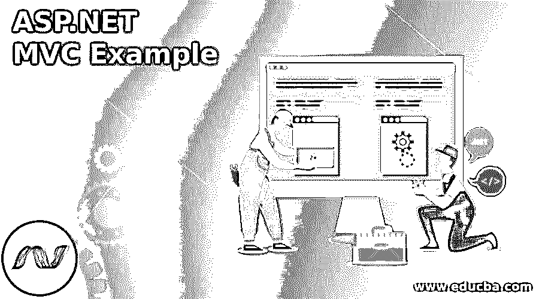
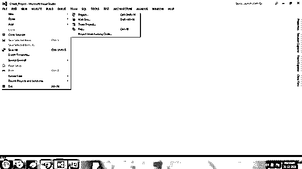
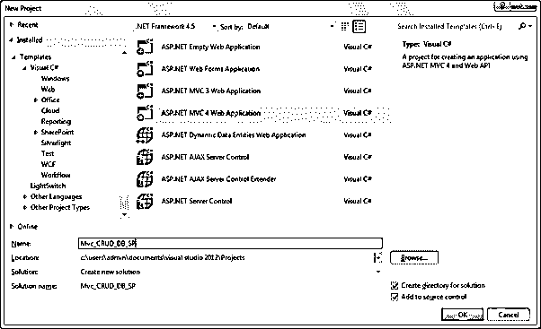
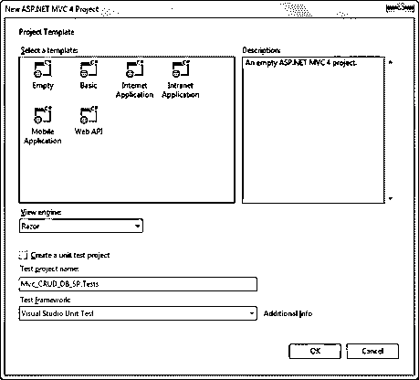
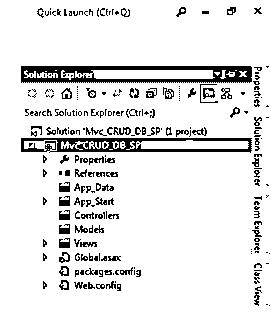
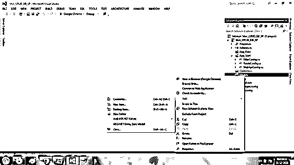
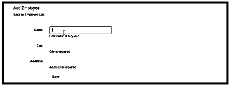
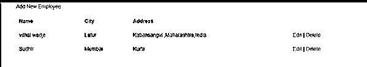

# ASP.NET MVC 示例

> 原文：<https://www.educba.com/asp-dot-net-mvc-example/>

## ASP.NET MVC 范例介绍

ASP.NET MVC 是一个可控的 Web 应用程序，它描述了被称为模型-视图-控制器的 MVC 模式。它描述了代码或关注点的分离，比如视图用于 UI，控制器用于处理请求，模型用于逻辑设计。ASP.NET MVC 是一个开源软件。

### ASP.NET MVC 示例

让我们创建一个 MVC 应用程序。从 MVC 应用程序的创建开始一步一步的方法，

<small>网页开发、编程语言、软件测试&其他</small>

要选择 FileàNewà Project，请选择 ASP.NET Web 应用程序模板，为项目指定正确的名称，然后单击 OK。

在此对话框中选择空模板，将视图引擎设置为 Razor，然后单击确定。

一旦给定所有的项目解决方案看起来像下面所示的文件夹结构，

然后，在模型文件夹中添加新的类，创建一个新的模型类，并将其命名为 EmployeeClassModel.cs，如下所示。

**EmployeeClassModel.cs**

`public class EmployeeClassModel
{
[Display(Name = "Id")] public int Empid { get; set; }
[Required(ErrorMessage = " First name is Required ")] public string Name { get; set; }
[Required(ErrorMessage = " City Name is Required ")] public string City { get; set; }
[Required(ErrorMessage = "Address is Required ")] public string Address { get; set; }
}`

然后通过单击 Addà Newà Controller 添加控制器，并为其指定合适的名称，

**创建表员工表**

`CREATE TABLE [dbo].[Employee] (
[Id] INT NOT NULL PRIMARY KEY,
Name varchar(50) null,
City varchar(50) null,
Address varchar(50)
)
Stored Procedures as follows,
Create procedure [dbo].[AddNewEmpDetails] (
@Name varchar (50),
@City varchar (50),
@Address varchar (50)
)
as
begin
Insert into Employee values(@Name,@City,@Address)
End
go
Create Procedure [dbo].[GetEmployees] as
begin
select *from Employee
End
go
Create procedure [dbo].[UpdateEmpDetails] (
@EmpId int,
@Name varchar (50),
@City varchar (50),
@Address varchar (50)
)
as
begin
Update Employee
set Name=@Name,
City=@City,
Address=@Address
where Id=@EmpId
End
go
Create procedure [dbo].[DeleteEmpById] (
@EmpId int
)
as
begin
Delete from Employee where Id=@EmpId
End`

要创建新的存储库文件夹，请创建名为 EmpRepository.cs 的方法来执行 CRUD 操作。

**EmpRepository.cs**

`using System;
using System.Collections.Generic;
using System.Configuration;
using System.Data;
using System.Data.SqlClient;
using System.Linq;
using System.Web;
using Mvc_CRUD_DB_SP.Models;
namespace Mvc_CRUD_DB_SP.Repository
{
public class EmpRepository
{
private SqlConnection con;
//Connection_String
private void connection()
{
string constr = ConfigurationManager.ConnectionStrings["db_conn"].ToString();
con = new SqlConnection(constr);
}
//adding emp_details
public bool AddEmployee(EmployeeClassModel obj)
{
connection();
SqlCommand com = new SqlCommand("AddNewEmpDetails", con);
com.CommandType = CommandType.StoredProcedure;
com.Parameters.AddWithValue("@Name", obj.Name);
com.Parameters.AddWithValue("@City", obj.City);
com.Parameters.AddWithValue("@Address", obj.Address);
con.Open();
int i = com.ExecuteNonQuery();
con.Close();
if (i >= 1)
{
return true;
}
else
{
return false;
}
}
//displaying emp_details in list
public List<EmployeeClassModel> GetAllEmployees()
{
connection();
List<EmployeeClassModel> EmpList = new List<EmployeeClassModel>();
SqlCommand com = new SqlCommand("GetEmployees", con);
com.CommandType = CommandType.StoredProcedure;
SqlDataAdapter da = new SqlDataAdapter(com);
DataTable dt = new DataTable();
con.Open();
da.Fill(dt);
con.Close();
//binding list items
EmpList = (from DataRow dr in dt.Rows
select new EmployeeClassModel()
{
Empid = Convert.ToInt32(dr["Id"]),
Name = Convert.ToString(dr["Name"]),
City = Convert.ToString(dr["City"]),
Address = Convert.ToString(dr["Address"])
}).ToList();
return EmpList;
}
//updating emp_details
public bool UpdateEmployee(EmployeeClassModel obj)
{
connection();
SqlCommand com = new SqlCommand("UpdateEmpDetails", con);
com.CommandType = CommandType.StoredProcedure;
com.Parameters.AddWithValue("@EmpId", obj.Empid);
com.Parameters.AddWithValue("@Name", obj.Name);
com.Parameters.AddWithValue("@City", obj.City);
com.Parameters.AddWithValue("@Address", obj.Address);
con.Open();
int i = com.ExecuteNonQuery();
con.Close();
if (i >= 1)
{
return true;
}
else
{
return false;
}
}
//deleting emp_details
public bool DeleteEmployee(int Id)
{
connection();
SqlCommand com = new SqlCommand("DeleteEmpById", con);
com.CommandType = CommandType.StoredProcedure;
com.Parameters.AddWithValue("@EmpId", Id);
con.Open();
int i = com.ExecuteNonQuery();
con.Close();
if (i >= 1)
{
return true;
}
else
{
return false;
}
}
}
}`

**雇员总监** **。cs**

`using System;
using System.Collections.Generic;
using System.Linq;
using System.Web;
using System.Web.Mvc;
using Mvc_CRUD_DB_SP.Models;
using Mvc_CRUD_DB_SP.Repository;
namespace Mvc_CRUD_DB_SP.Controllers
{
public class EmployeeController : Controller
{
// GET: Employee/GetAllEmpDetails
public ActionResult GetAllEmpDetails()
{
EmpRepository EmpRepo = new EmpRepository();
ModelState.Clear();
return View(EmpRepo.GetAllEmployees());
}
// GET: Employee/AddEmployee
public ActionResult AddEmployee()
{
return View();
}
// POST: Employee/AddEmployee
[HttpPost] public ActionResult AddEmployee(EmployeeClassModel Emp)
{
try
{
if (ModelState.IsValid)
{
EmpRepository EmpRepo = new EmpRepository();
if (EmpRepo.AddEmployee(Emp))
{
ViewBag.Message = "Employee details added successfully";
}
}
return View();
}
catch
{
return View();
}
}
// GET: Employee/EditEmpDetails/5
public ActionResult EditEmpDetails(int id)
{
EmpRepository EmpRepo = new EmpRepository();
return View(EmpRepo.GetAllEmployees().Find(Emp => Emp.Empid == id));
}
// POST: Employee/EditEmpDetails/5
[HttpPost] public ActionResult EditEmpDetails(int id, EmployeeClassModel obj)
{
try
{
EmpRepository EmpRepo = new EmpRepository();
EmpRepo.UpdateEmployee(obj);
return RedirectToAction("GetAllEmpDetails");
}
catch
{
return View();
}
}
// GET: Employee/DeleteEmp/5
public ActionResult DeleteEmp(int id)
{
try
{
EmpRepository EmpRepo = new EmpRepository();
if (EmpRepo.DeleteEmployee(id))
{
ViewBag.AlertMsg = "Employee details deleted successfully";
}
return RedirectToAction("GetAllEmpDetails");
}
catch
{
return View();
}
}
}
}`

一旦创建了所有主要的编码方法，然后创建视图，

**AddEmployee.cshtml**

`@model Mvc_CRUD_DB_SP.Models.EmployeeClassModel
@using (Html.BeginForm())
{
@Html.AntiForgeryToken()

<h4>Add Employee</h4>

@Html.ActionLink("Back to Employee List", "GetAllEmpDetails")

@Html.ValidationSummary(true, "", new { @class = "text-danger" })

@Html.LabelFor(model => model.Name, htmlAttributes: new { @class = "control-label col-md-2" })

@Html.EditorFor(model => model.Name, new { htmlAttributes = new { @class = "form-control" } })
@Html.ValidationMessageFor(model => model.Name, "", new { @class = "text-danger" })

@Html.LabelFor(model => model.City, htmlAttributes: new { @class = "control-label col-md-2" })

@Html.EditorFor(model => model.City, new { htmlAttributes = new { @class = "form-control" } })
@Html.ValidationMessageFor(model => model.City, "", new { @class = "text-danger" })

@Html.LabelFor(model => model.Address, htmlAttributes: new { @class = "control-label col-md-2" })

@Html.EditorFor(model => model.Address, new { htmlAttributes = new { @class = "form-control" } })
@Html.ValidationMessageFor(model => model.Address, "", new { @class = "text-danger" })

<input type="submit" value="Save" class="btn btn-default" />

@ViewBag.Message

}

`

**数字详细信息. cshtml**

`@model IEnumerable<Mvc_CRUD_DB_SP.Models.EmployeeClassModel>

@Html.ActionLink("Add New Employee", "AddEmployee")

<table class="table">
<tr>
<th>
@Html.DisplayNameFor(model => model.Name)
</th>
<th>
@Html.DisplayNameFor(model => model.City)
</th>
<th>
@Html.DisplayNameFor(model => model.Address)
</th>
<th></th>
</tr>
@foreach (var item in Model)
{
@Html.HiddenFor(model => item.Empid)
<tr>
<td>
@Html.DisplayFor(modelItem => item.Name)
</td>
<td>
@Html.DisplayFor(modelItem => item.City)
</td>
<td>
@Html.DisplayFor(modelItem => item.Address)
</td>
<td>
@Html.ActionLink("Edit", "EditEmpDetails", new { id = item.Empid }) |
@Html.ActionLink("Delete", "DeleteEmp", new { id = item.Empid }, new { onclick = "return confirm('Are sure wants to delete?');" })
</td>
</tr>
}
</table>`

同样，对更新后的模型执行与在 EditEmpDetails 中创建相同的过程，以查看和更新/编辑雇员的详细信息。

RouteConfig.cs 文件将如下所示，这表示默认的操作方法将是 AddEmployee。这意味着一旦应用程序执行，将首先执行 AddEmployee 视图，

`public class RouteConfig
{
public static void RegisterRoutes(RouteCollection routes)
{
routes.IgnoreRoute("{resource}.axd/{*pathInfo}");
routes.MapRoute(
name: "Default",
url: "{controller}/{action}/{id}",
defaults: new { controller = "Employee", action = "AddEmployee", id = UrlParameter.Optional }
);
}
}`

**输出**

### 结论

在本文中，我解释了 ASP.NET MVC 的样本应用程序，它由模型-视图-控制器三个文件夹组成。然后，我使用 CRUD 操作解释了基本的员工详细信息，比如添加新的员工详细信息、更新或删除现有的员工详细信息等等。希望文章能帮助你创建简单的 CRUD 应用程序。

### 推荐文章

这是一个引导 ASP.NET MVC 的例子。这里我们讨论 ASP.NET MVC 的样例应用程序，它由模型-视图-控制器三个文件夹组成。您也可以阅读以下文章，了解更多信息——

1.  [ASP.NET 核心会议](https://www.educba.com/asp-dot-net-core-session/)
2.  [ASP.NET 核心 JWT](https://www.educba.com/asp-dot-net-core-jwt/)
3.  [ASP.NET 更新面板](https://www.educba.com/asp-dot-net-updatepanel/)
4.  [ASP.NET 视图状态](https://www.educba.com/asp-dot-net-viewstate/)