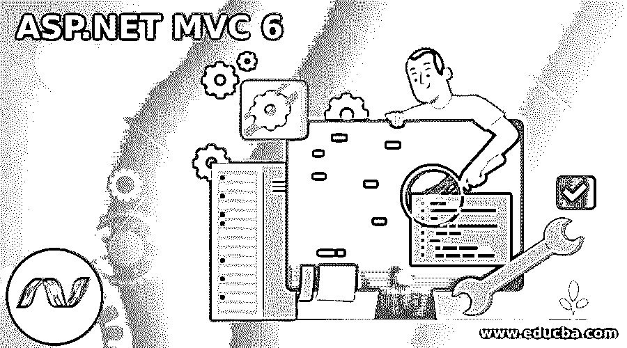
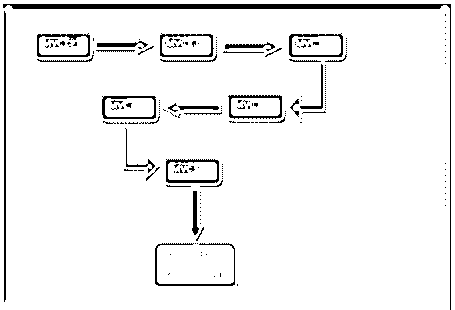
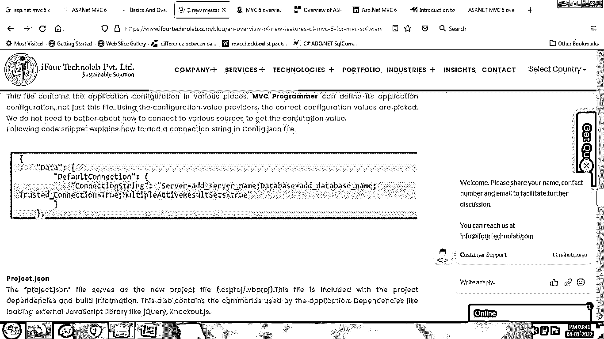
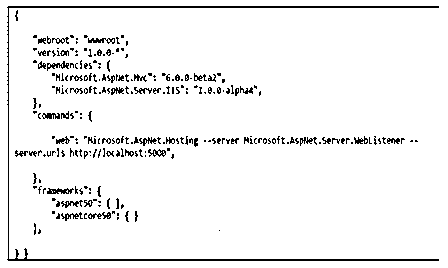
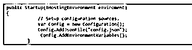
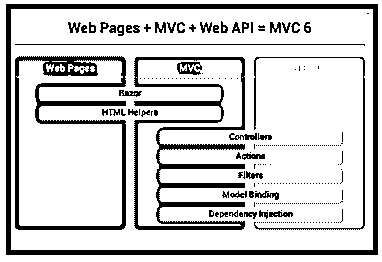

# ASP.NET MVC 6

> 原文：<https://www.educba.com/asp-dot-net-mvc-6/>




## ASP.NET MVC 6 简介

ASP.NET MVC 6 主要是为云优化的应用程序设计的，在使用模型-视图-控制器设计模式开发 Web 应用程序和 API 方面非常丰富。MVC 应用程序被部署到云中，运行时自动选择库的确切版本。使用罗斯林编译器不需要编译应用程序；它会自动选择应用程序的代码。

### ASP.NET MVC 6 概述

ASP.NET MVC 6 是开源的。Net Framework 这个框架中最重要的事情是，它通过合并网页、MVC 和 Web API 的框架，将这些框架构建成一个单一的框架。而且，ASP.NET MVC 6 是一个跨平台、兼容的框架；它支持 Mac、Linux 等等。因此，它增加了许多杰出人物的声誉。

<small>网页开发、编程语言、软件测试&其他</small>

ASP.NET MVC 6 在使用模型-视图-控制器设计模式开发 Web 应用和 API 方面非常丰富。




### ASP.NET MVC 6 的新特性

*   **移除 System.Web.Dll 依赖性**–在 MVC 6 中，移除了 System.Web.Dll 的依赖性，因为它每个请求和响应消耗 30k 内存，而 MVC 6 每个请求和响应只需要 2k 内存。
*   **Web API 和 MVC 的单个控制器-** 在 MVC 中——Web API 和 MVC 只会有一个控制器基类，像 Microsoft . aspnet . MVC . Controller . MVC 的控制器类(System。Web.MVC.Controller)和 Web API(系统。Web.Http.ApiController)合并成一个类。
*   MVC 6 返回一个 IActionResult。同一个控制器有返回数据和视图的动作。相比之下，在 Web API 控制器中，IActionResult 是像员工列表这样的数据，而在 MVC 控制器中，IActionResult 是视图。MVC 6 在一个控制器中包含了这两者。在 MVC 6 中，相同的路由器用于 Web API 和 MVC 控制器。
*   **支持 IIS 之外的主机-** 在 MVC 5 中，我们可以在 IIS 服务器上托管，在 ASP.NET 管道上执行。相比之下，MVC 6 是自托管的，是一个灵活的管道，可以完全由管道的组件控制。
*   **基于配置系统环境-** 在 MVC 6 中，配置系统环境使得应用可以轻松部署在云上；应用程序作为配置提供者工作。MVC 6 消除了对 Web 的依赖。配置文件从不同的配置源(如 XML 文件)中检索值。
*   **编译器 Roslyn-** 是自动编译应用代码的新编译器 Roslyn Compiler。使用 Roslyn 编译器，任何 MVC 开发人员都可以修改代码文件，并通过刷新浏览器来观察变化，而无需重新构建或停止项目。
*   **云优化应用-** MVC 6 主要是针对云优化而设计的。当 MVC 应用程序被部署到云中时，它会自动动态地选择库的确切版本。此外，会话和缓存的状态会根据宿主环境而改变。
*   依赖注入- NET 开发者可以使用 **IServiceProvider** 接口添加他们的依赖注入，并且可以用他们的容器改变默认实现。
*   **OWIN 支持-** 在 MVC 6 中，会有 OWIN 抽象；我们有 MVC 6 应用程序控制可堆肥管道。
*   **NuGet 打包-** 在 MVC 6 应用中，会有 NuGet 包完全打包；没有像以前版本那样的程序集。相反，开发人员需要添加 NuGet 包，整个依赖包将由框架自动添加。
*   **并行部署—**在 MVC 6 中，开发人员可以将依赖关系上传到 bin 目录，而不会影响同一服务器上的其他应用程序。
*   **基于 JSON 的项目结构-** MVC 6 包含各种配置的 global.json、Config.json、project.json。

### ASP.NET MVC 6 模式

ASP.NET MVC 6 是一个跨平台、兼容的框架；这个框架中最重要的事情是，它通过合并网页、MVC 和 Web API 的框架，将这些框架构建成一个单一的框架。此外，它在使用模型-视图-控制器设计模式开发 Web 应用程序和 API 方面也很丰富。

MVC 6 和 ASP.NET 5 中会有完全的依赖注入，Web API 和 MVC 在同一个请求管道上可用。我们来看看 MVC 6 中的模态绑定，如下图所示，

```
public class MemberDetails
{
[FromHeader]
public int MemberId { get; set; }
public string Member_FirstName { get; set; }
public string  Member_LastName { get; set; }
public string Member_Address { get; set; }
}
```

我们从 Http 头到 post 得到模态绑定。我们还可以利用 FromServices 属性。Web API 中的模式绑定也是如此。

### 重要的 ASP.NET MVC 6

**global . JSON**–这是一个项目到项目的解决方案级设置和引用。

**Scr 文件夹**–该源文件夹是 web 应用程序的源代码。

**wwwroot**–这个文件夹由静态文件和 Web 应用程序直接提供给用户的其他文件组成，包括 HTML、JavaScript 文件、CSS、图像等等。

**Config.json-** 包含了各个地方的应用配置；MVC 开发人员定义应用程序配置；通过使用配置值提供程序，我们可以选择准确的配置值。无需担心连接不同的源来获取配置值。让我们看看代码片段，它展示了如何在 Config.json 文件中连接字符串，




**Project.json-** 这个文件服务于新的项目文件(。csproj/。vbproj)。这包括项目依赖性和构建信息。它包含应用程序使用的命令。它包含一些依赖项，比如加载外部 JavaScript 库，比如 knockout.js、jQuery 等。




当开发人员添加或编辑依赖项时，这些文件提供了 intellect 包的可用性。当移除包时，它会自动从其他项目引用中移除。

**startup . cs—**它是应用程序的入口点。它用于定义应用程序的环境。主机用一个 configure 方法查看启动类，该方法将 **IApplicationBuilder** 作为参数。

**定义请求管道-**startup . cs 包含启动方法




上面的代码为配置类构建了一个对象。我们可以将环境变量和 config.json 作为值的来源包含在配置中。在 MVC 6 应用中，我们可以迁移到云端。

### ASP.NET MVC 6 属性

这个 ASP.NET MVC-6 有几个属性；让我们看看下面的属性，

*   **Asp-Controller-** 它提供控制器的名称
*   **Asp-Action**–提供控制器类的动作名称
*   **Asp-对于**–该属性主要用于模型绑定
*   **Asp-Validation-for**-该属性用于模型中的验证
*   **Asp-validation-summary**–该属性用于显示汇总失效

### 例子

ASP.NET MVC 6 本质上是为云优化的应用程序设计的，在使用模型-视图-控制器设计模式开发 Web 应用程序和 API 方面非常丰富。使用罗斯林编译器不需要编译应用程序；它会自动选择应用程序的代码。




### 结论

在本文中，我们已经了解了 MVC-6 的属性和新特性，并解释了 ASP.NET MVC-6 的概述，也称为 MVC 核心 1.0。希望文章能帮助你理解。

### 推荐文章

这是一个 ASP.NET MVC 6 的指南。在这里，我们讨论 MVC-6 的属性和新特性，并解释 ASP.NET MVC-6 的概述。您也可以看看以下文章，了解更多信息–

1.  [ASP.NET 核心 JWT](https://www.educba.com/asp-dot-net-core-jwt/)
2.  [ASP.NET 核心会议](https://www.educba.com/asp-dot-net-core-session/)
3.  [ASP.NET 核心剃刀页](https://www.educba.com/asp-dot-net-core-razor-pages/)
4.  [ASP.NET 生命周期](https://www.educba.com/asp-dot-net-life-cycle/)