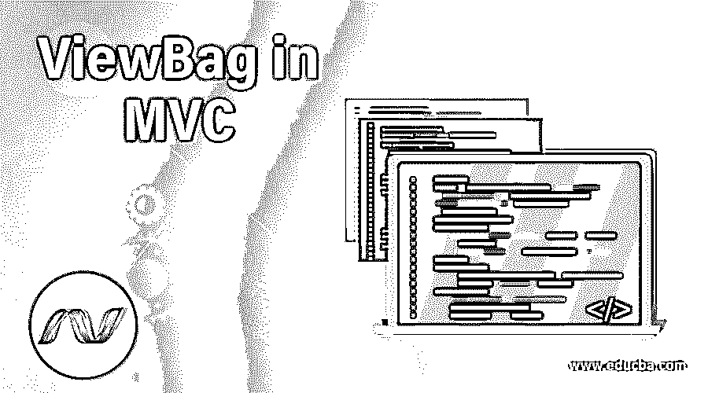

# MVC 中的视图包

> 原文：<https://www.educba.com/viewbag-in-mvc/>

## MVC 中的 ViewBag 介绍

在 MVC 应用程序中，我们觉得有必要从控制器传递值和数据来查看部分代码，这是非常常见的事情。在这些情况下，如果我们使用 ASP.Net MVC，那么我们可以使用四种可能性来实现我们的目标。我们可以通过使用 ViewData、ViewBag、TempData 或强类型模型将数据从控制器的 action 方法传递到视图。ViewData 和 ViewBag 的工作方式相似，但在处理和使用时有所不同。它们都提供了相同的功能来将数据从控制器传递到视图，但是 ViewData 需要类型转换，而使用 ViewBags 则不是这种情况。动态性是 ViewBag 的优势。在这篇文章中，我们为什么以及如何在 MVC 架构中使用视图包。

ViewBag 是 ViewData 的包装器，它使用 C# 4.0 的动态功能，本身就是一个动态属性。在使用 ViewBag 的时候，如果 ViewBag 是用来从控制器的 action 方法发送数据来查看部分代码的，那么我们在检索 view 中的值时就不需要担心类型转换了。ViewBag 只对当前请求起作用，并在代码流重定向时被销毁。

<small>网页开发、编程语言、软件测试&其他</small>

**语法**:

下面是语法:

`[Dynamic] public dynamic ViewBag { get; }`

从它的签名可以看出，它返回动态对象，可以在其中存储任何格式的数据。这就是为什么我们在使用类型转换将数据从控制器传输到视图时不需要它的原因。现在，让我们借助一个示例来看看如何在控制器中使用不同的数据类型来传递和查看数据。

#### 1.ASP.NET MVC 中带有字符串类型的视图包:

**在 ViewBag 中存储数据**

`ViewBag.HeaderString = “EDUCBA - Platform For Learning”;`

**从视图包中检索数据**

`@ViewBag. HeaderString`

#### 2.ASP.NET MVC 中具有复杂类型的视图包:

**在 ViewBag 中存储数据**

`ViewBag.Details = details;`

**从视图包中检索数据**

`@{
var details = ViewBag.Details
}`

从上面的代码片段可以看出，在视图中收集字符串或任何复杂数据时，不需要进行类型转换。其他数据类型也是类似的情况。现在，让我们看看这个例子和完整的代码。

### 在 MVC 中实现视图包的例子

现在我们将有一个例子，我们将存储学习技术的平台细节，然后将细节返回到视图，如上面的抽象中所示。标题字符串将在控制器中分配，并将为我们要传递的详细信息对象构建一个单独的实体或模型。谁的值将从代码的另一个业务层或服务部分收集，我们将编写方法来分配并返回详细信息对象及其指定值。我们将首先开始编写模型细节的代码。我们将存储平台 Id，名称，成立日期，技术，团队规模，总部，地址和平台的联系方式，并在视图部分显示所有的细节。

#### 1.细节模型

**代码:**

`public class Details
{
public int PlatformId { get; set; }
public string Name { get; set; }
public string EstablishDate { get; set; }
public string Technologies { get; set; }
public int TeamSize { get; set; }
public string HeadQuarter { get; set; }
public string Address { get; set; }
public int ContactNo { get; set; }
}`

现在，我们将为获取细节对象并将其返回给控制器的方法编写代码。现在，我们将静态数据添加到 Details 对象的属性中，并从 GetPlatformDetails 方法返回该对象。下面是名为 PlatformBusinessLayer 的服务或业务层文件的代码，它将由我们的方法组成。

#### 2.服务层文件

**代码:**

`public class PlatformBusinessLayer
{
public Details GetPlatformDetails(int PlatformId){
Details demo=new Details()
{
demo.PlatformId = 1 ,
demo.Name = "EDUCBA" ,
demo.EstablishDate = "XX/YY/ZZZZ" ,
demo.Technologies = "Javascript, ASP.Net MVC, Maven, Hibernate and many more" ,
demo.TeamSize = 1000 ,
demo.HeadQuarter = "Mumbai" ,
demo.Address = "A- 406, Boomerang, Chandivali Rd, Powai, Mumbai, Maharashtra 400072" ,
demo.ContactNo = 1234567890
};
return demo;
}
}`

所以现在我们已经准备好处理代码的关键部分，也就是我们的控制器文件。在这里，我们将创建服务文件的对象，并从方法中获取详细的对象值，分配头字符串对象值，并在 ViewBag 的帮助下将这两个属性返回到代码的视图部分。

#### 3.控制器文件

**代码:**

`using FirstMVCDemo.Models;
using System.Web.Mvc;
namespace FirstMVCDemo.Controllers
{
public class MyDemoController : Controller
{
public ActionResult Index()
{
PlatformBusinessLayer PlatformServiceObj = new PlatformBusinessLayer();
Details details = PlatformServiceObj.GetPlatformDetails(1);
ViewBag.Details = details;
ViewBag.HeaderString = "EDUCBA Details";
return View();
}
}
}`

最后，现在我们将在代码的视图部分检索存储在 ViewBag 对象中的值。在我们的示例演示的 GUI 中，我们将检索标题字符串并将其显示在标题部分。此外，我们将创建一个变量来存储 details 对象，并将检索它的每个属性并以表格格式显示它。

#### 4.视图文件

**代码:**

`@{
Layout = null;
}
<!DOCTYPE html>
<html>
<head>
<meta name="viewport" content="width=device-width" />
<title>Sample ASP.Net ViewBag Demonstration</title>
</head>
<body>
@{
var details = ViewBag.Details;
}
<h2>@ViewBag.HeaderString</h2>
<table style="font-family:Arial">
<tr>
<td>Platform ID:</td>
<td>@details.PlatformId </td>
</tr>
<tr>
<td>Name:</td>
<td>@details.Name</td>
</tr>
<tr>
<td>EstablishDate:</td>
<td>@details.EstablishDate</td>
</tr>
<tr>
<td>Technologies:</td>
<td>@details.Technologies</td>
</tr>
<tr>
<td>TeamSize:</td>
<td>@details.TeamSize</td>
</tr>
<tr>
<td>HeadQuarter:</td>
<td>@details.HeadQuarter</td>
</tr>
<tr>
<td>Address:</td>
<td>@details.Address</td>
</tr>
<tr>
<td>ContactNo:</td>
<td>@details.ContactNo</td>
</tr>
</table>
</body>
</html>`

给你。我们正在访问 ViewBag 的动态属性，它们分别是 HeaderString 和 Details，并以表格格式显示。现在我们准备在“/Home/Index”URL 上运行我们的代码。然后将显示我们的预期输出，如下所示

浏览器呈现的最终代码如下所示

#### 5.浏览器呈现的代码

**代码:**

`<!DOCTYPE html>
<html>
<body>
<h2>Sample ASP.Net ViewBag Demonstration</h2>
<h2>EDUCBA Details</h2>
<table style="font-family:Arial">
<tr>
<td>Platform ID:</td>
<td>1 </td>
</tr>
<tr>
<td>Name:</td>
<td>EDUCBA</td>
</tr>
<tr>
<td>EstablishDate:</td>
<td>XX/YY/ZZZZ</td>
</tr>
<tr>
<td>Technologies:</td>
<td>Javascript, ASP.Net MVC, Maven, Hibernate and many more</td>
</tr>
<tr>
<td>TeamSize:</td>
<td>1000</td>
</tr>
<tr>
<td>HeadQuarter:</td>
<td>Mumbai</td>
</tr>
<tr>
<td>Address:</td>
<td>A- 406, Boomerang, Chandivali Rd, Powai, Mumbai, Maharashtra 400072</td>
</tr>
<tr>
<td>ContactNo:</td>
<td>1234567890</td>
</tr>
</table>
</body>
</html>`

ViewBag 是在运行时检测和呈现的动态属性。因此，即使您的代码中有任何拼写错误或其他类似的错误，您也不会在编译时被告知。您只有在运行代码并检查运行情况后才能了解这一点。这也是用 ViewBags 编码时无法提供智力支持的原因。使用 ViewData 时也是如此。由于 ViewBag 是 ViewData 的包装器，如果在两者中使用了同名的属性，那么如果 ViewData 的键与 ViewBag 的属性相同，它将引发运行时异常。

### 结论

请务必注意 ViewData 和 ViewBag 用法的异同。ViewData 是使用字符串作为键来存储对象数据的字典对象，而 ViewBag 是使用动态属性来存储和返回对象数据的动态属性。两者都用于将数据从控制器的动作方法返回到视图，以供进一步呈现，并在编码中出现任何错误时给出运行时错误和异常。当使用 ViewData 时，需要在代码的视图部分对传递的对象进行类型转换。ViewBag 不需要对象的类型转换。这两种方法都不支持编译时错误支持和智能，因此在将数据从控制器发送到视图时并不是首选方法。但是，如有必要，请始终优先选择 ViewBag 而不是 ViewData。将数据从控制器传输到视图的最佳方式是使用强类型模型，因为它们提供编译时错误检查和智能支持。

### 推荐文章

这是一个在 MVC 中使用 ViewBag 的指南。在这里，我们讨论一个介绍，签名代码，和例子，以实现适当的代码和例子。您也可以浏览我们的其他相关文章，了解更多信息——

1.  [ASP.NET MVC 视图包](https://www.educba.com/asp-net-mvc-viewbag/)
2.  [ASP.NET MVC 路由](https://www.educba.com/asp-dot-net-mvc-routing/)
3.  [JavaScript MVC 框架](https://www.educba.com/javascript-mvc-frameworks/)
4.  [什么是 MVC 设计模式](https://www.educba.com/what-is-mvc-design-pattern/)

