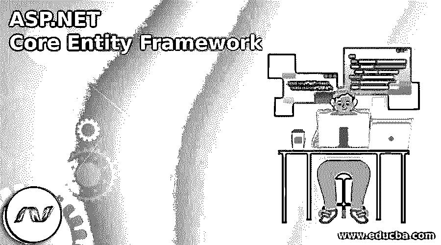
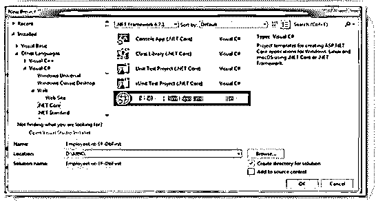
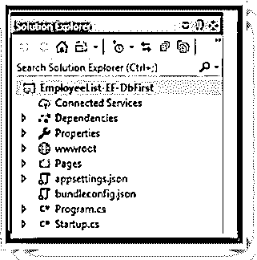
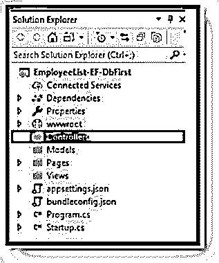
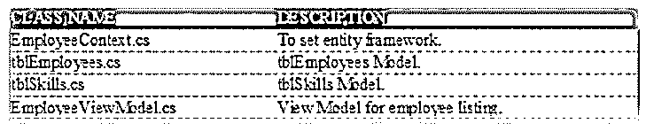
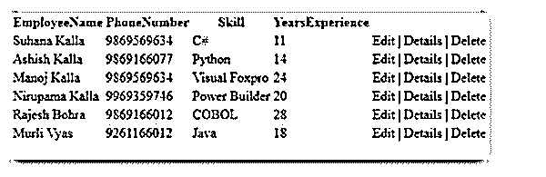
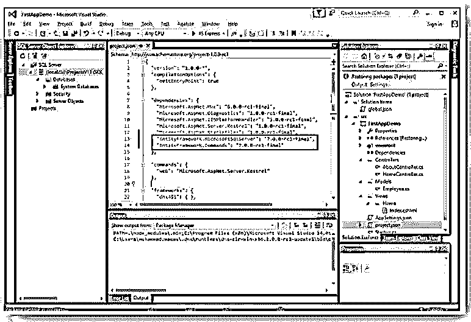
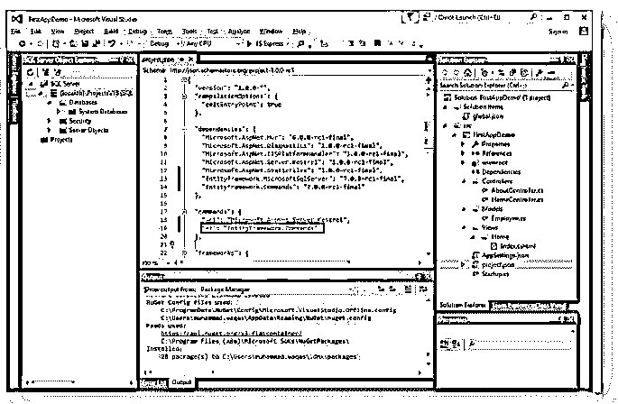

# ASP.NET 核心实体框架

> 原文：<https://www.educba.com/asp-dot-net-core-entity-framework/>

## ASP.NET 核心实体框架介绍

ASP.NET 核心实体框架是一个依赖于 ORM(对象关系映射)模型的开源框架。实体框架是 ADO.NET 的增强版本，它使开发人员在存储和检索数据库中的数据的自动化系统上减少了工作量。实体框架核心是最新的对象数据库映射器。NET 框架。它完全维护模式迁移、LINQ 查询、变更跟踪和任何更新。实体框架与不同的数据库协同工作，包括 SQL 数据库(Azure 和内部部署)、PostgreSQL、Azure Cosmos DB、SQLite 和 MySQL。建议使用实体框架。NET 核心应用程序。

### ASP.NET 核心实体框架概述

*   实体框架核心是一种开源的、可扩展的、跨平台的、轻量级的数据访问方法。EF 允许开发人员以特定领域属性和对象的形式处理数据。实体框架核心充当对象关系映射器，它允许。NET 开发人员使用。NET 对象；它减少了数据访问对代码行的需求。此外，它支持多种数据库引擎。
*   实体框架(EF)核心是微软 ORM 框架的实现。Web 应用程序由 EF 开发，不直接与数据库一起工作。相反，这些应用程序使用实体框架的 API 在相关数据库中进行操作。EF 是一个依赖 ORM(对象关系映射)模型的开源框架。这个框架自动消除了程序员在数据库中建立连接、从数据库中检索数据、存储数据库的工作。

### 创建 ASP.NET 核心实体框架

最初，创建数据库，然后在 Visual Studio 中创建一个新的 ASP.NET 核心应用程序；一旦选择了应用程序模板，只要给出合适的名称，项目的位置；给出适当的名称后，单击如下所示的 ok 按钮。

<small>网页开发、编程语言、软件测试&其他</small>

然后查看项目结构和文件夹创建，项目的默认视图如下所示。

之后，让我们添加三个名为模型、视图、控制器的文件夹来支持 MVC 架构；要添加文件夹，右键单击项目名称，选择添加–新文件夹。

之后，在 ASP.NET 核心中设置连接字符串，以在 appsettings.json 文件中设置连接字符串。

**代码:**

`{
"Logging": {
"IncludeScopes": false,
"LogLevel": {
"Default": "Warning"
}
},
"ConnectionStrings": {
"MbkDbConstr": "Data Source=(localdb)\\MBK;Database=MbkTest;"
}
}`

为了创建模型，我们将创建以下模型。

让我们看看 EmployeeViewModel.cs 的代码。

**代码:**

`using System;
using System.Collections.Generic;
using System.Linq;
using System.Threading.Tasks;
using System.ComponentModel.DataAnnotations;
namespace EmployeeList_EF_DbFirst.Models
{
public class EmployeeViewModel
{
[Key] public int EmployeeID { get; set; }
public string EmployeeName { get; set; }
public string PhoneNumber { get; set; }
public string Skill { get; set; }
public int YearsExperience { get; set; }
}
}`

**EmployeeContext.cs:**

**代码:**

`using System;
using System.Collections.Generic;
using System.Linq;
using System.Threading.Tasks;
using Microsoft.EntityFrameworkCore;
namespace EmployeeList_EF_DbFirst.Models
{
public class EmployeeContext : DbContext
{
public EmployeeContext(DbContextOptions<EmployeeContext> options)
: base(options)
{
}
public DbSet<tblSkill> tblSkills { get; set; }
public DbSet<tblEmployee> tblEmployees { get; set; }
}
}`

同样，为上表中给出的其余模型编写代码，并添加 HomeController 类，如下所示:

**代码:**

`public HomeController(EmployeeContext dbContext)
{
_dbContext = dbContext;
}
public IActionResult Index()
{
var _emplst = _dbContext.tblEmployees.
Join(_dbContext.tblSkills, e => e.SkillID, s => s.SkillID,
(e, s) => new EmployeeViewModel
{ EmployeeID = e.EmployeeID, EmployeeName = e.EmployeeName,
PhoneNumber = e.PhoneNumber, Skill = s.Title,
YearsExperience = e.YearsExperience }).ToList();
IList<EmployeeViewModel> emplst = _emplst;
return View(emplst);
}`

应用程序开发完成后，执行项目，结果如下所示:

**输出:**

### 设置 ASP.NET 核心实体框架

当使用数据库时，我们使用实体框架，它用最新的来重写工作。NET 框架。

在 EF 工作时，需要注意各种事项，包括:

*   对于应用程序，我们使用 SQL Server LocalDB 我们也可以使用其他数据库；从远程访问数据库，我们还可以在实例上创建一个新的数据库。
*   LocalDB 是 SQL Server 面向开发人员的独特版本。
*   Visual Studio 2015 及其社区版默认安装 LocalDB。
*   要检查 LocalDB，只需转到 VS 中的 View–SQL Server Object Explorer 选项。

现在让我们通过添加以下两个包来直接编辑 project.json 文件:

**设置实体框架:**

最初使用 EF 时，我们需要从 NuGet 包管理器或直接通过 project.json 安装实体框架 NuGet 包。

让我们通过包含以下两个包来了解 project.json 文件:

EF 命令包，帮助用 EF 执行任务，包括创建 DB 模式；这些任务可以在命令行工具中获得，其中的逻辑存在于 EF 命令包中。

实体框架。命令包帮助我们使用实体框架执行任务，比如基于我们的 C#实体类创建数据库模式，这些任务可以从命令行工具中获得，其中逻辑位于实体框架内。命令包。使用这个命令行工具在 project.json 的命令部分添加一个条目，如下所示。

看看下面 project.json 文件的实现。

**代码:**

`{
"version": "1.0.0-*",
"compilationOptions": {
"emitEntryPoint": true
},
"dependencies": {
"Microsoft.AspNet.Mvc": "6.0.0-rc1-final",
"Microsoft.AspNet.Diagnostics": "1.0.0-rc1-final",
"Microsoft.AspNet.IISPlatformHandler": "1.0.0-rc1-final",
"Microsoft.AspNet.Server.Kestrel": "1.0.0-rc1-final",
"Microsoft.AspNet.StaticFiles": "1.0.0-rc1-final",
"EntityFramework.MicrosoftSqlServer": "7.0.0-rc1-final",
"EntityFramework.Commands": "7.0.0-rc1-final"
}
"commands": {
"web": "Microsoft.AspNet.Server.Kestrel"
},
"frameworks": {
"dnx451": { },
"dnxcore50": { }
},
"exclude": [
"wwwroot",
"node_modules"
],
"publishExclude": [
"**.user",
"**.vspscc"
] }`

### 安装实体框架

对于安装实体框架，将有各种选项，如下所示:

#### 1.Visual Studio NuGet 包管理器对话框

*   在这种情况下，只需转到 Visual Studio 菜单，选择“项目”-“管理器”-“获取软件包”。
*   然后点击浏览更新选项卡。
*   若要更新或安装 SQL Server 提供程序，请选择 Microsoft。EntityFrameworkCore.SqlServer 包并确认它。

#### 2.Visual Studio NuGet 包管理器控制台

在菜单项中，选择工具–获取软件包管理器–软件包管理器控制台。

要安装 SQL Server 提供程序，请在包管理器控制台中执行以下命令。

*   安装-打包 Microsoft . entityframeworkcore . SQL server。
*   要更新提供程序，请使用 Update–Package 命令。
*   要使用特定版本，请使用版本修饰符。

### 结论

在本文中，我们看到了 ASP.NET 核心实体框架，它是微软 EF 的一个轻量级版本。实体框架核心与各种平台一起工作，如 Linux、Windows 或 iOS。

### 推荐文章

这是 ASP.NET 核心实体框架指南。在这里，我们讨论介绍，概述，创建 ASP.NET 核心实体框架。您也可以看看以下文章，了解更多信息–

1.  [在 ASP.NET 验证](https://www.educba.com/validation-in-asp-net/)
2.  [ASP.NET 安全](https://www.educba.com/asp-dot-net-security/)
3.  [ASP.NET 生命周期](https://www.educba.com/asp-dot-net-life-cycle/)
4.  [ASP.NET 网络控件](https://www.educba.com/asp-net-web-controls/)