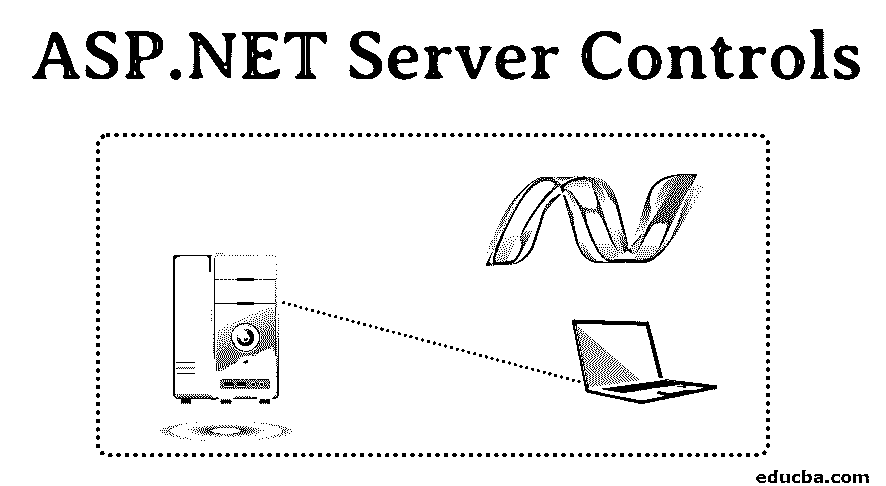
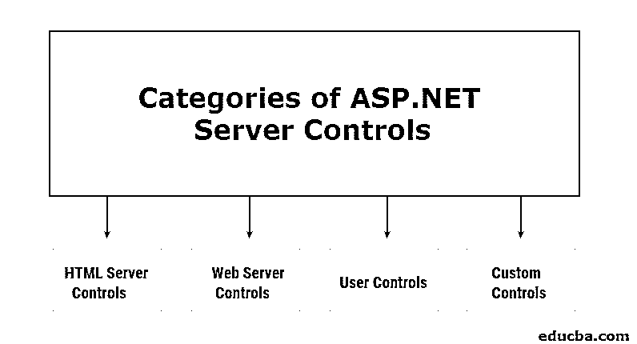

# ASP.NET 服务器控件

> 原文：<https://www.educba.com/asp-dot-net-server-controls/>

## ASP.NET 服务器控件概述

在开始学习 ASP.Net 服务器控件之前，让我们先了解一下什么是控件。控件是可以在网页上用来执行预期任务的小代码块。例如，您希望用户输入密码，请使用密码控件。它预先打包了自己的样式和验证。

同样，ASP.Net 服务器控件也是在服务器上运行的控件。[它们只是类似 HTML 的标签](https://www.educba.com/html-format-tags/)，可以被服务器理解。一旦服务器遇到任何这样的标签，它就知道显示什么、如何显示以及触发什么活动和事件。当然，作为开发人员，您可以覆盖默认的样式、事件和动作。

<small>网页开发、编程语言、软件测试&其他</small>

### ASP.NET 服务器控件的功能

下面是提到的特性:

*   **自动状态管理**–控件的值在到服务器的往返过程中保留。
*   **简单的对象值访问**–通过控件访问对象值相当简单，而不是使用请求对象的传统方法。
*   **事件**–控件对服务器端代码中的事件做出反应，这有助于以结构化的方式处理特定的用户操作。
*   **简化的复杂性**–复杂的用户界面由简单的控件创建，这些控件预先配置为执行最常见的操作。
*   **一次编写随处呈现**–通过控件创建的网页经过优化，可在任何类型的设备或浏览器上呈现。输出中的布局和标记是基于浏览器的功能自动创建的。

### ASP.NET 服务器控件的类别

ASP.Net 页面框架支持多种控件。ASP.NET 服务器控件大致分为 4 类:

#### 1.HTML 服务器控件

HTML 服务器控件是指示在服务器端处理的 HTML 属性。这实质上意味着控件具有与它们相应的传统 HTML 属性相同的输出和属性，但是对于要在服务器端处理的事件具有额外的计算能力。

总的来说，传统的 HTML 标签在服务器端被增强为 HTML 服务器控件。

##### 一个 HTML 服务器控件的例子

*   **传统 HTML 标签**

`<input id=”hw_text” type="text" value="Hello World" />`

*   **HTML 服务器控件**

`<input id=”hw_text” type="text" value="Hello World" runat=”server” />`

现在您可能想知道 runat=" server "属性如何将传统的 HTML 标记转换成 HTML 服务器控件？嗯，ASP.Net 把所有的 HTML 元素都视为纯文本。run at 属性表示该元素应被视为一个控件，从而使其在服务器上可编程。服务器端脚本也可以访问具有该属性的元素。

当 ASP.Net 代码编译时，具有 runat=" server "属性的元素也被编译到程序集中。对于那些不具有该属性的元素，它们被作为通用 HTML 控件添加到程序集中。

**Note:** All HTML Server Controls must be enclosed within <form> … </form> tags.

##### HTML 服务器控件的优势

HTML 服务器控件具有以下优点:

*   控件与其对应的 HTML 标记一一对应。
*   大多数控件都有一个 OnServer 事件触发器，用于该控件最常见的事件。例如，按钮有一个 OnServerClick，开发人员只需在触发器函数中编写代码。
*   所有 HTML 服务器控件都派生自 Web。HtmlControl 基类。因此，它们继承了所有基本的 HTML 控件特性和方法。
*   控件的标记类似于本机 HTML 标记，从而使它们易于使用和理解。
*   这些控件在 Visual Studio 工具箱中组合在一起，便于在应用程序中使用。

#### 2.Web 服务器控件

就生成的输出而言，Web 服务器控件类似于 HTML 服务器控件。但是，Web 服务器控件是标准化的 ASP 标记。它们也在服务器端编译，并且需要类似的 runat=" server "属性。

##### Web 服务器控件的示例

*   **网络服务器控制**

`<asp:textbox id=”hw_text” text="Hello World" runat=”server” /> HTML Server Control
<input id=”hw_text” type="text" value="Hello World" runat=”server” />`

**Note:** Not all Web Controls necessarily map to a corresponding HTML Control. Sometimes, Web Controls are more complex than native HTML Controls.

##### Web 服务器控件的优势

Web 服务器控件具有以下优点:

*   控件映射(大部分，但不总是)到它们对应的 HTML 元素。这使得开发人员更容易自动生成用户界面。
*   由于控件预装了交互式 HTML 元素，因此创建 web 表单的过程不容易出错，并且更加一致。
*   所有 Web 服务器控件都派生自 Web。UI.WebControls.WebControl 基类。因此，它们继承了所有基本的 Web 控件功能和方法。

##### Web 服务器控件的类别

Web 服务器控件分为四类:

**a .基本网络控件**

基本 Web 控件类似于 HTML 服务器控件。它们为相同的功能提供了额外的方法、事件和属性，开发人员可以利用它们来编写自己的代码。

基本 Web ASP.NET 服务器控件的示例:

*   **按钮控制**

`<asp:Button id="submitBtn" text="Submit" OnClick="submitForm" runat="server"/> HyperLink Control
<asp:HyperLink id="link1" NavigateURL="www.google.com" Text="Go to Google" Target="window" runat="server"/> Label Control
<asp:Label id="headerLabel" Text="Welcome to EduCBA" runat="server"/>`

**b .验证控制**

ASP.Net 中的验证控件用于验证用户的输入。这些控件可以执行预定义和自定义验证。根据浏览器的兼容性，可以在客户端或服务器端执行验证。这个决定是由控制器自动执行的。客户端验证在客户端浏览器中执行，即在向服务器触发回发调用之前。在表单提交到服务器后，执行服务器端验证。

[验证控件不是独立的](https://www.educba.com/asp-dot-net-validation-controls/)控件。相反，它们与网页或 web 窗体中的其他控件相关联。多个验证控件可以与每个要验证的控件相关联。当用户提交页面或表单时，将执行验证。

验证控制的示例:

*   **必填字段验证器**

`<asp:TextBox id="tb_name" runat="server"/><asp:RequiredFieldValidator id="RFV_tb" ControlToValidate="tb_name" ErrorMessage="This field is required!" runat="server"/> Compare Validator
<asp:TextBox id="tb_pwd" TextMode=”Password” runat="server"/><asp:TextBox id="tb_re_pwd" TextMode=”Password” runat="server"/><asp:CompareValidator id="CV_pwd" ControlToValidate="tb_re_pwd" ControlToCompare="tb_pwd" Type=”String” runat="server"/>`

**c .列表控件**

列表控件是生成预格式化列表布局的特殊控件。这些控件绑定到集合，并以自定义或模板化格式的行显示收集的数据。因此，列表控件只绑定到实现 IEnumerable、ICollection 或 IListSource 接口的集合。要绑定到列表控件的数据由 DataSource 和 DataMember 属性定义。

`<html>  <body>           <asp:repeater id=count_rptr runat="server">                   <itemtemplate><%# Container.DataItem %> </itemtemplate>           </asp:repeater>  </body></html>`

上面的代码将输出 Uno，Due，Tre，作为一个跨越三行的列表。

**d .富控制**

富 Web 控件是复杂的 HTML 控件，旨在提供丰富的用户体验。这些是特定于任务的控件。与简单的 web 窗体本机 HTML 控件不同，富控件执行复杂的任务。这可以是几个简单的 HTML 控件的编织套件，也可以是更加增强的布局。丰富控件的例子有日历控件、XML 控件、AdRotator 控件等。

Calendar 控件负责显示一个日期选择器元素，用户可以非常方便地使用它来选择日期。

XML 控件为给定数据生成 XML 布局。XML 布局是一种标记控制的布局，其中数据包含在标记中。这些标签充当键，而其中的数据充当值。

AdRotator 控件负责在网页上显示广告横幅。

#### 3.用户控件

ASP.Net 也方便了开发者创建他们自己的可以重用的内置控件包。当开发人员希望在另一个页面中重用当前页面的界面时，这将极大地帮助他们。ASP.Net 允许我们将 web 表单转换成用户控件。为了达到这个目的，ASP.Net 用。ascx 扩展。这些。ascx 文件可以在单个 Web 表单中多次使用。

创建您自己的用户控件的步骤:

1.  删除任何、、和
2.  将@Page 指令更改为@Control
3.  [可选]在@Control 指令中包含 className 属性，以使用该类强类型化您的指令。
4.  用保存控件。ascx

#### 4.自定义控件

除了大量的内置控件，[ASP.Net 还允许你定义自己的自定义控件。自定义控件是以下三种控件之一:](https://www.educba.com/what-is-asp-dot-net/)

*   两个或多个内置控件的组合。
*   内置控件的扩展。
*   一个全新的代码，作为一个特定的控制功能。

### 推荐文章

这是 ASP.NET 服务器控件的指南。在这里，我们讨论 ASP.NET 服务器控件的特性和不同类别，以及优点和示例。您也可以阅读以下文章，了解更多信息——

1.  [ASP.NET 框架](https://www.educba.com/asp-dot-net-framework/)
2.  [ASP.Net 验证控制](https://www.educba.com/asp-dot-net-validation-controls/)
3.  [在 ASP.NET 的职业生涯](https://www.educba.com/career-in-asp-dot-net/)
4.  什么是 ASP.Net 网络服务？

