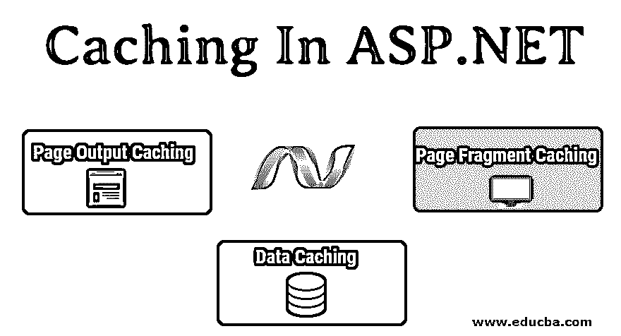

# ASP.NET 的缓存

> 原文：<https://www.educba.com/caching-in-asp-dot-net/>

## ASP.NET 缓存介绍

在 ASP.NET，缓存是指在内存中存储网页或数据以便快速访问的能力。在 ASP.NET，你不需要一次又一次地点击服务器来获得相同的响应。把它存储在计算机内存中，然后更快地获取它。当然，这只适用于静态数据，因为动态数据会随着对服务器的每个请求而变化。

### ASP.Net 的缓存是什么？

的。Net framework 还提供了缓存功能，因此可以提高应用程序的性能。现在你问，ASP。Net 用于创建依赖于用户的动态网页，那么它如何缓存内容呢？

<small>网页开发、编程语言、软件测试&其他</small>

让我们通过两个场景来理解这一点——首先，页面是用户的仪表板，其次，它有产品列表。场景二是独立于用户的，对于服务器的每个请求，产品都是相同的，因此整个页面都可以被缓存。同样，产品的价格和可用性是可变的，这可以通过及时更新缓存来处理。场景一取决于用户；一个用户的仪表板可能与另一个用户的不同。但仍然有一些组件，如图像、图例、页眉和页脚，可以缓存以提高 performance.ASP.Net，使开发人员能够在他们的应用程序中有效地处理这两种情况。

### 缓存在 ASP.Net 是如何工作的？

了解 ASP.Net 缓存网页或数据的过程是非常重要的。为了理解这一点，我们需要理解。Net 编译过程，这样我们就可以清楚地了解何时何地缓存页面以获得最佳性能。ASP.Net 页面代码分两个阶段编译——MSIL 阶段和 JIT 阶段。在 MSIL 阶段，用高级语言编写的页面代码被编译成微软中间语言。每当我们构建项目时都会发生这种情况。我们每次构建时，整个网站或项目都会编译到 MSIL 中。在 JIT 阶段，MSIL 代码被实时编译器转换成本机代码。这发生在页面执行期间。然而，并不是整个项目一直都被转换成本机代码。在执行过程中，只有用户请求的页面才会从 MSIL 代码转换为本机代码。这可以节省大量网络带宽并提高性能。

现在，我们应该缓存哪些代码，何时缓存，在哪里缓存？

ASP.Net 有一个专用于缓存的全功能引擎。它具有时间依赖性、文件和密钥依赖性、过期、数据清理等特性。我们不会在这篇文章中深入讨论这些细节。我们需要明白，我们可以在两个位置缓存页面和数据，以提高 ASP.Net 应用程序的性能。第一个位置是位于 ASP.Net 服务器中的页面缓存部分。这个存储页面输出缓存和页面片段缓存，基本上是 ASPX 页面。每当请求一个主要是静态的页面时，生成的本机代码的副本就会存储在页面缓存部分。这节省了后续页面请求期间的 JIT 编译时间。第二个位置是数据缓存。它存储从数据服务器或其他服务器获取的数据。存储这些数据的副本有助于保存将来对数据库服务器或其他第三方服务器的网络调用。缓存数据的几个例子是 SQL Server 数据、XML 数据、JSON 数据、第三方 API 响应等。

### 类型

下面详细介绍了不同类型的缓存:

#### 1.页面输出缓存

页面输出缓存意味着缓存所请求页面的完整输出。每当用户请求 ASP.Net 页面时，JIT 编译器都会编译相关的 MSIL 代码，并生成本机代码输出作为响应发送给客户端。这意味着每次请求页面时，JIT 编译器都必须生成本机代码。如果页面本质上是静态的呢？如果每次编译后页面输出都一样怎么办？如果将生成的本机代码存储在页面缓存中，我们可以节省大量的编译时间和资源。对同一页面的后续请求可以改为从缓存中提取。这被称为页面输出缓存。为了实现页面输出缓存，我们需要在 ASP.Net 代码中指定 OuputCache 指令，持续时间以秒为单位。

`<%@ Page Language="C#" %>
<%@ OutputCache Duration='1000' VaryByParam='none' %>
<html>
<!-- Your Page Code Here -->
<html>`

#### 2.页面片段缓存

我们已经看到了如何缓存静态页面。页面是动态的，随用户变化怎么办？页面片段缓存来了。它使开发人员能够缓存页面的特定部分。当您希望缓存页眉和页脚时，这很有帮助，因为对于每个用户来说，页眉和页脚大多是静态的。要在 ASP.Net 中实现页面片段缓存，必须将片段代码封装在单独的用户控件中。然后在用户控件中添加相同的 OuputCache 指令。当用户控件随页面一起加载时，它的一个副本会保存在缓存中。因此，对同一页或不同页上同一用户控件的所有后续引用都将从缓存中提取。

`<%@ Control Language="C#" %>
<%@ OutputCache Duration='1000' VaryByParam='none' %>
`

#### 3.数据缓存

数据缓存是将经常访问的所需数据存储在缓存中的机制。这可以显著提高应用程序的性能。这是因为数据缓存节省了数据库往返调用，这是众所周知的消耗大部分时间。当频繁访问且很少更改的数据被缓存时，服务器从缓存中提取数据，而不是进行数据库调用。这也可以为您节省一些钱，因为对云托管的数据服务器的数据库调用是按请求收费的。ASP.Net 的数据缓存本身就是一个成熟的引擎。为了在我们的 ASP 网页中实现数据缓存，我们需要使用 Cache 对象。

`Cache["ProductName"]="My Product";
Label1.Text= Cache["ProductName"].ToString();`

### 为什么我们需要在 ASP.Net 缓存？

理解了 ASP.Net 的缓存过程之后，让我们看一些在实时场景中实现缓存的实际例子。

*   有一个信息页面，它根据数据库中的数据生成报告。数据库表每隔几个小时刷新一次。在这种情况下，可以使用页面输出缓存，缓存的持续时间设置为与数据刷新作业的频率相匹配。
*   有一个页面显示了几个不断变化的表格和数据。然而，数据的图例和解释保持不变。
    页面片段缓存只能用于缓存静态图例和解释数据。
*   有一个用户定制的用户仪表板，可以根据用户请求生成图形和图表。用于生成图形和图表的数据很少改变。
    数据缓存可以用来缓存数据，动态生成用户需要的图表和图形。

### 结论

因此，我们了解到缓存在提高 ASP.Net 应用程序的性能方面有很大的进步。这是一篇关于 ASP.Net 缓存的入门文章。它还有更多值得探索的地方。建议学习更多关于缓存的知识，以进一步提高应用程序的性能。

### 推荐文章

这是 ASP.NET 的缓存指南。这里我们讨论基本概念；它分别与不同类型的缓存一起工作。您也可以浏览我们推荐的其他文章，了解更多信息——

1.  [ASP.NET 框架](https://www.educba.com/asp-dot-net-framework/)
2.  [ASP.Net 验证控制](https://www.educba.com/asp-dot-net-validation-controls/)
3.  [在 ASP.NET 的职业生涯](https://www.educba.com/career-in-asp-dot-net/)
4.  [。网络面试问题](https://www.educba.com/dot-net-interview-questions/)

