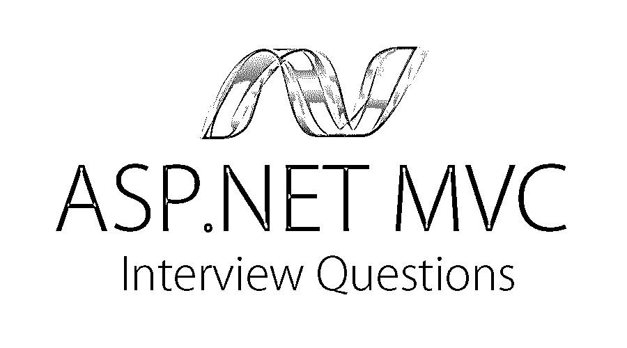

# Asp.Net MVC 面试问题

> 原文：<https://www.educba.com/asp-dor-net-mvc-interview-questions/>




## Asp.Net MVC 面试问答介绍

ASP.Net 是一个分散的发展模式；它被称为开源软件。使用 ASP.NET 无需购买任何许可证密钥。在我跳转到 Asp.Net MVC 面试问题和答案之前，它必须是，读者必须知道什么是必须具备的，好有技能，为这个配置文件。必须具备——精通 C#，ASP.NET，HTML5。值得拥有的——jQuery 和 JavaScript

现在，如果你正在寻找一份与 Asp.Net MVC 相关的工作，那么你需要准备 2022 年 Asp.Net MVC 的面试问题。的确，每个面试都因不同的职位而不同。在这里，我们准备了重要的 Asp.Net MVC 面试问题和答案，这将有助于你在面试中取得成功。

<small>网页开发、编程语言、软件测试&其他</small>

以下是 2022 年 Asp.Net MVC 面试中经常被问到的 10 个重要问题和答案。这些问题分为以下两部分:

### 第 1 部分-Asp.Net MVC 面试问题(基础)

这第一部分包括基本的面试问题和答案。

#### Q1。框架是什么意思？

**回答:**
一个框架，在我看来，就是防止它的用户一次又一次执行同样任务的东西。从同一个任务，我的意思是说重复性的任务。为了解释我的理解，我们假设一个场景，有一张纸，A 先生让 B 先生把它剪成 100 张(假设任意数量)大小为 5*5 sq 的纸。厘米。在某种程度上对 A 先生来说是容易的，但是 100 块更小，而且尺寸相等不是一件容易的事。于是，B 先生做了一个 5*5 的 sq。厘米见方的刀片，然后他有效地执行了 a 先生要求的切割任务。

因此，结论是 B 先生的工作变得很容易，因为他开发了一个框架，使他的工作变得更容易。这是一个重复的任务(同样的工作重复 100 次)。这就是框架为开发者做的事情；这节省了他们一次又一次重复做同样的工作的时间。这些框架承载了一组给定开发所需的所有要素(就像一个完整的包)。

#### Q2。给我解释一下，当我说 ASP.Net 的时候你明白什么？我不需要任何书本上的定义。

**答案:**
这是 Asp.Net MVC 面试中问的基本问题。感谢这个问题。在我定义什么之前，我的理解是关于 ASP.Net 的。我需要更多的相关概念来讨论。首先，ASP(动态服务器页面)是一个 HTML 页面，其中包含或保存了一个或一组脚本。在这些页面被发布到服务器之前，这些脚本通常在 Microsoft web 服务器上被验证或处理。

.Net 是一个框架，包含了开发所需的一系列要素。这是微软开发的，在微软视窗系统上运行。

ASP.Net 作为一个整体可以被认为是微软提供的一个网络开发工具。

#### Q3。在 ASP.NET MVC 中，模型、视图和控制器是如何相互通信的？

**回答:**
在 ASP.NET MVC 中，这个过程的发生是有一些准则的。

*   首先，是用户通过与控制器交互来启动流程。
*   同样，控制器和视图之间可能有太多的关系。这仅仅意味着视图和控制器之间可以有不同的映射方式。
*   控制器和视图可以引用模型。
*   这个控制器和视图可以相互通信。
*   模型和视图之间存在限制，因为它们不能直接相互通信。他们需要一个控制器来相互通信。

#### Q4。出来一些 ASP.NET 形式和 ASP.NET MVC 的区别？

**答案:**

| **ASP.NET 网页表单** | **ASP.NET MVC** |
| 这些遵循更传统的事件驱动的开发模型。 | 这些都是轻量级的，并遵循 MVC 模式进行开发。 |
| 他们有服务器控制。 | 这些都有 HTML 助手。 |
| 不是开源的 | 开源软件 |
| 这些都有母版页，外观和感觉一致。 | 这些布局具有一致的外观和感觉。 |
| 这些遵循 Web 表单语法。 | 这些遵循可定制的语法。 |
| 这些都有基于文件的网址。这意味着 URL 中存在的文件名必须是实际存在的。 | 这些都是基于路径的 URL。这意味着 URL 被分为控制器和动作。这里它不基于任何物理位置，不像 ASP.NET 的 Webforms。 |

#### Q5。什么是视图引擎，它有哪些组件？

**答案:**
视图引擎是一个 MVC 子系统。它有自己的标记语法。每个发动机都有下列 3 个部件:

*   **查看引擎类–**这个类在实现接口时很有用。
*   **视图类–**负责将模板与数据结合起来，并将其转换为输出 HTML 标记。
*   **模板解析引擎—**解析模板并将视图编译成代码(意味着可执行)。

### 第 2 部分-Asp.Net MVC 面试问题(高级)

现在让我们来看看高级面试问题。

#### Q6。ASP.NET MVC 中的布局是什么？

**答:**
布局用于保持 ASP.NET MVC 应用程序中各种视图的外观和感觉的一致性。下面是布局的基本结构:

```
<!DOCTYPE html>
<html>
<head>
<meta charset="utf-8" />
<meta name="viewport" content="width=device-width" />
<title>@ViewBag.Title</title>
@Styles.Render("~/Content/css")
@Scripts.Render("~/bundles/modernizr")
</head>
<body>
@RenderBody()
@Scripts.Render("~/bundles/jquery")
@RenderSection("scripts", required: false)
</body>
</html>
```

#### Q7。按照过滤器的工作顺序对其进行排序？

**答案:**
按顺序，过滤器将我们如下所述:

*   授权过滤器
*   动作过滤器
*   响应过滤器
*   异常过滤器

#### Q8。我看到了你在简历中提到的 AJAX 细节。告诉我如何在 MVC 中实现 AJAX？

**答案:**
两种方式:

*   [通过 AJAX 库](https://www.educba.com/ajax-interview-questions/)
*   [通过 Jquery](https://www.educba.com/jquery-interview-questions/)

#### Q9。在实现一个 MVC 项目时，执行需要哪些步骤？说出他们的名字。

**答案:**
这是 asked 高级 MVC 面试时问 i9n 的一个面试问题。执行 MVC 项目所需的步骤如下:

*   接收来自应用程序的第一个请求。
*   执行路由。
*   创建 MVC 请求处理程序。
*   控制器的创建。
*   控制器的执行。
*   调用动作。
*   执行结果。

#### Q10。有超链接，所以只要告诉我如何从一个视图导航到其他视图？

**答:**
可以使用“ActionLink”方法。下面提到的代码将创建一个简单的 URL，帮助从 Home 选项卡导航到所需的路径。

下面的代码将创建一个简单的 URL，帮助导航到“Home”控制器并调用“GotoHome”操作。

折叠/复制代码

```
<%= Html.ActionLink("Home", "Gotohome") %>
```

### 推荐文章

这是 Asp.Net MVC 面试问题和答案列表的指南，以便候选人可以轻松地解决这些面试问题。您也可以阅读以下文章，了解更多信息——

1.  [ADO.NET 面试问题](https://www.educba.com/ado-net-interview-questions/) s
2.  [VB.NET 面试问题](https://www.educba.com/vb-net-interview-questions/)
3.  [Java Servlet 面试问题](https://www.educba.com/java-servlet-interview-questions/)
4.  [JSON 面试问题](https://www.educba.com/json-interview-questions/)


