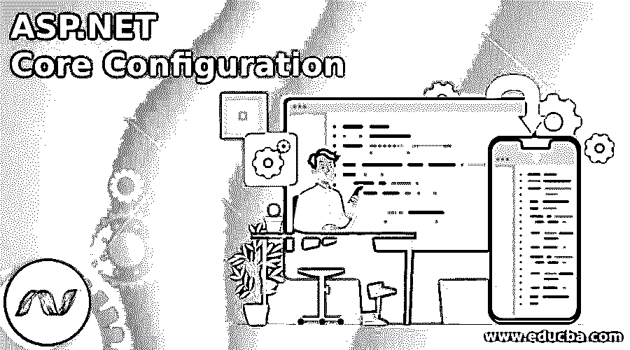
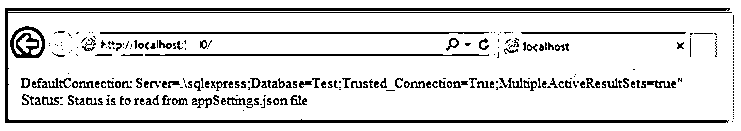
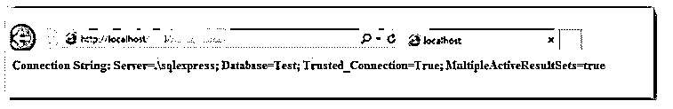

# ASP.NET 核心配置

> 原文：<https://www.educba.com/asp-dot-net-core-configuration/>

## ASP.NET 核心配置简介

ASP.NET 核心配置以名称-值对的格式存储，它将在运行时从应用程序的不同部分读取。这些名称-值对被组合成一个多级层次结构。ASP.NET 核心支持各种配置方法。配置数据来自各种来源，如 JSON、XML、INI、环境变量、命令行参数、自定义提供程序和内存收集。ASP.NET 核心中的配置系统是从旧版本的 ASP.NET 简化而来的。

### 什么是 ASP.NET 核心配置？

*   ASP.NET 核心配置是使用配置提供程序执行的。
*   配置提供程序通过选择各种配置源(如应用程序设置等)从键值对中读取配置数据。
*   ASP.NET 核心支持各种配置，它存储在名称-值对中，可以在运行时从应用程序中读取；这些名称-值对被组合成一个多级层次结构。

### 创建了 ASP.NET 核心网络应用程序

旧版本使用的名称空间是“System”。Configuration”它可以读取像 web.config 这样的 XML 配置文件。最近访问的基于键/值的配置模型将从不同的来源检索。在这个 ASP.NET 核心解决方案资源管理器中，我们可以看到 Startup.cs 文件。就像我们使用以前版本的 ASP.NET 核心一样，我们可以看到一个 global.asax 文件；这是一个在 web 应用程序启动时可以执行代码的地方。

<small>网页开发、编程语言、软件测试&其他</small>

*   网络。Config 文件包含应用程序执行所需的全部配置参数。
*   在 ASP.NET 核心中，配置和启动代码是从 Startup.cs 加载的
*   该文件包含启动类，在这个类中，您可以配置配置源，也可以配置应用程序。

Startup.cs 文件中的默认实现:

**代码:**

`using System;
using System.Collections.Generic;
using System.Linq;
using System.Threading.Tasks;
using Microsoft.AspNetCore.Builder;
using Microsoft.AspNetCore.Hosting;
using Microsoft.AspNetCore.Http;
using Microsoft.Extensions.DependencyInjection;
using Microsoft.Extensions.Logging;
namespace SampleProgram
{
public class Startup
{
//this method is called during the runtime, by using the method we add the services to the container
public void ConfigureServices(IServiceCollection services)
{
}
//this method is called during the runtime, by using the method to configure the HTTP request pipeline.
public void Configure(IApplicationBuilder app, IHostingEnvironment env,ILoggerFactory loggerFactory)
{
loggerFactory.AddConsole();
if (env.IsDevelopment())
{
app.UseDeveloperExceptionPage();
}
app.Run(async (context) =>
{
await context.Response.WriteAsync("WELCOME !");
});
}
}
}`

在这个启动课程中，我们主要研究两种方法；Configure 方法类是您可以构建 HTTP 处理管道的地方。

*   它定义了应用程序如何响应请求。例如，在上面的代码中，它说“欢迎”，如果我们需要应用程序有不同的行为，我们需要通过在 Configure 方法中包含附加代码来改变管道。
*   如果我们想要像 index.html 文件一样提供静态文件，我们必须将代码添加到 Configure 方法中。我们还可以通过添加代码来配置方法，从而将路由请求或错误页面包含到 ASP.NET 控制器中。
*   在 Startup 类中，会有 ConfigureService()方法，它帮助你配置应用程序的组件。

### 使用文件进行 ASP.NET 核心配置

*   ASP.NET 核心配置的使用文件是 Web。这是一个文件，ASP.NET 核心模块和 IIS 读取该文件以配置 IIS 托管的应用程序。
*   微软。NET 框架和 ASP.NET 使用 XML 格式。配置文件来配置应用程序。
*   配置数据来自各种来源，如 JSON、XML、INI、环境变量、命令行参数、自定义提供程序和内存收集。
*   ASP.NET 核心中的配置系统是从旧版本的 ASP.NET 简化而来的。

### ASP.NET 核心配置示例

下面提到了不同的例子:

ASP.NET 核心支持各种配置方法。它以名称-值对的格式存储，在运行时将从应用程序的不同部分读取。这些名称-值对被组合成一个多级层次结构。

让我们看看使用 JSON 提供者读取配置的例子。

ASP.NET 核心配置是使用配置提供程序执行的。配置提供程序通过选择各种配置源(如应用程序设置)从键值对中读取配置数据。

appsetting.json 文件示例。

**代码:**

`appsetting.json
{
"status" : "Status is to read from appSettings.json file", "ConnectionStrings":
{
"DefaultConnection": "Server=.\\sqlexpress;Database=Test;Trusted_Connection=True;MultipleActiveResultSets=true"
}
}`

我们需要包含库作为读取 JSON 配置文件的依赖项；他们是“微软。Extensions.Configuration”和“Microsoft . extensions . Configuration . JSON”

依赖部分包括以下两个 package.json:

*   “微软。扩展。配置":" 1.0.0 "
*   “微软。extensions . configuration . JSON ":" 1 . 0 . 0 "

“JsonConfigurationExtensions”类的 AddJsonFile 方法用于构建 JSON 文件。为了通过使用键名来获取配置值，我们可以从层次结构的根使用“:”(分隔键)来检索层次结构中的配置值。在这里，我们必须获得“DefaultConnection”的值，然后 key 变成“connection strings:default connection”。

以下启动示例程序:

**代码:**

**Startup.cs:**

`using Microsoft.AspNetCore.Builder;
using Microsoft.AspNetCore.Http;
using Microsoft.Extensions.Configuration;
using Microsoft.Extensions.DependencyInjection;
namespace SampleApplication
{
public class Startup
{
public IConfiguration Configuration { get; set; }
public Startup()
{
var builder = new ConfigurationBuilder()
.AddJsonFile("appSettings.json");
Configuration = builder.Build();
}
public void ConfigureServices(IServiceCollection services)
{
services.AddMvc();
}
public void Configure(IApplicationBuilder app)
{
app.UseMvc();
app.Run(context =>
{
var status = Configuration["status"];
var connectionString = Configuration["ConnectionStrings:DefaultConnection"];
context.Response.WriteAsync("Default Connection: " + connectionString);
context.Response.WriteAsync(" ");
return context.Response.WriteAsync("Status: " + status);
});
}
}
}`

**输出:**

在控制器上检索配置数据:

ASP.NET 的最新版本内置了对依赖注入的支持；使用 DI，我们将配置值注入控制器。例如，通过使用 servicecollectionserviceextensions 类的 AddSingleton 方法，将指定类型的 singleton 服务包含在服务实例中。

**代码:**

**Startup.cs:**

`public void ConfigureServices(IServiceCollection services)
{
services.AddMvc();
services.AddSingleton<IConfiguration>(Configuration);
}`

**HomeController.cs:**

`using Microsoft.AspNetCore.Mvc;
using Microsoft.Extensions.Configuration;
public class HomeController : Controller
{
IConfiguration _configuration;
public HomeController(IConfiguration configuration)
{
_configuration = configuration;
}
[Route("home/index")] public IActionResult Index()
{
ViewBag.connectionstring = _configuration["ConnectionStrings:DefaultConnection"];
return View();
}
}`

**输出:**

### 结论

在本文中，我们看到了 ASP.NET 核心中的配置，它提供了灵活的配置方法，支持各种配置方式，如内存中、环境变量、基于文件等。它还维护了选项模型，以便我们可以将设置强有力地注入到应用程序中。

### 推荐文章

这是 ASP.NET 核心配置指南。在这里，我们分别讨论简介、ASP.NET 核心 web 应用程序的创建和示例。您也可以看看以下文章，了解更多信息–

1.  [在 ASP.NET 验证](https://www.educba.com/validation-in-asp-net/)
2.  [ASP.NET 安全](https://www.educba.com/asp-dot-net-security/)
3.  [ASP.NET 生命周期](https://www.educba.com/asp-dot-net-life-cycle/)
4.  [ASP.NET 网络控件](https://www.educba.com/asp-net-web-controls/)