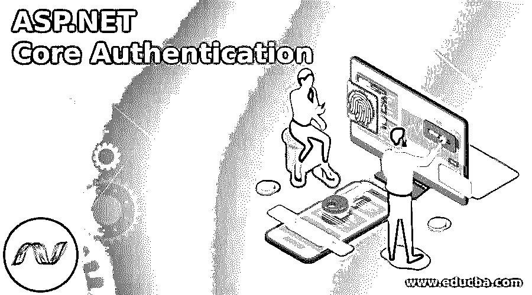

# ASP.NET 核心认证

> 原文：<https://www.educba.com/asp-dot-net-core-authentication/>

## ASP.NET 核心认证简介

ASP.NET 核心认证是确立用户个性的过程。ASP.NET 核心认证由认证中间件使用的服务 IAuthenticationService 管理。服务利用注册的身份验证处理程序来完成与身份验证相关的操作。认证相关动作的一个例子包括用户的认证。

### ASP.NET 核心认证概述

ASP.NET 核心认证是认证用户凭证的过程，而授权是确保用户有权使用应用程序中特定模块的过程。ASP.NET 核心认证是建立用户身份的过程。这是检查数据库中用户凭证的操作过程。如果用户提供了他们的基本信息或凭证，我们必须设置它们，或者我们的应用程序需要带有设置字段的登录页面来与之交互。ASP.NET 核心认证由认证中间件使用的服务 IAuthenticationService 管理。

<small>网页开发、编程语言、软件测试&其他</small>

让我们看看如何使用 ASP.NET 核心身份执行用户身份验证。在这个身份验证过程中，我们最重要的事情是创建用户登录页面，并设置验证凭证所需的操作。因此，认证是建立用户个性的过程。ASP.NET 核心认证由认证中间件使用的服务 IAuthenticationService 管理。

有一个验证连接操作的示例，包括:

*   认证用户。
*   如果有未经身份验证的用户试图未经许可访问资源，请采取措施。

安全配置选项和身份验证处理程序被称为方案。通过保护 startup.configureservices 中的身份验证服务来精确化身份验证方案，一旦使用特定于方案的扩展方法进行调用，则调用名为 services 的服务。AddAuthentication(类似于 AddJwtBearer 或 AddCookie)。这些扩展方法利用了 AuthenticationBuilder。用正确的设置添加注册方案。

### ASP.NET 核心认证服务

JWTbearer 身份验证方案和 cookies 的注册身份验证处理程序和服务的示例。

`Services . AddAuthentication (JwtBearerDefaults AuthenticationScheme)
AddJwtBearer (JwrBearerDefaults.AuthenticationScheme,
option=> Configuration.Bind("JwtSettings", options))
AddCookie ( CookieAuthenticationDefaults.AuthenticationScheme,
Options => Configuration.Bind ("CookieSettings",options));`

身份验证有多种类型，如下所示:

*   **无:**无认证。
*   **Windows:** Windows 认证。
*   **个人:**有个人认证。
*   **individual B2C:**Azure AD B2C 个人认证。
*   **SingleOrg:** 有一个组织认证的单租户。
*   **MultiOrg:** 组织认证有多个租户。

### 准备身份验证环境

*   最初，我们需要禁用未授权用户使用 Employees 操作方法的权利。

我们需要在 action 方法的顶部添加类似[Authorize]的属性。

`[Authorize] public async Task<IActionResult> EmployeeDetial()
{
var employees_obj = await _context.EmployeeDetial.ToListAsync();
return View(employees_obj);
}`

*   此外，我们需要在 app 上面的配置方法中添加认证中间件到 ASP.NET 核心。UseAuthorization()表达式。
*   当执行应用程序时，单击 EmployeeDetails 链接，我们将得到 Not Found 404 响应。
*   我们得到了找不到页面，因为在默认情况下，ASP.NET 核心创业试图重定向未授权用户的行动方法；它不存在。
*   此外，我们可以看到 ReturnUrl 字符串查询，它用于在用户被重定向到登录页面之前提供操作所需的路径。
*   为了解决这个问题(404 错误),我们主要需要做两件事。
*   首先在模型的文件夹中创建 UserLoginModel 类。

首先，让我们在 Models 文件夹中创建一个 UserLoginModel 类:

`public class UserLoginModel
{
[Required] [EmailAddress] public string User_Email { get; set; }
[Required] [DataType(DataType.Password)] public string User_Password { get; set; }
[Display(Name = "Remember me?")] public bool RememberMe { get; set; }
}`

一旦包含了用户模型，然后将这两个操作添加到帐户控制器中。

`[HttpGet] public IActionResult Login()
{
return View();
}
[HttpPost] [ValidateAntiForgeryToken] public async Task<IActionResult> Login(UserLoginModel user_Model)
{
return View();
}`

我们不需要通过权限导航登录页面来使用安全操作；我们可以设置单独的链接来使用它。让我们改变 _Login 视图。

`<ul class="navbar-nav">
<li class="nav-item">
<a class="nav-link text-dark" asp-controller="Account"
asp-action="Login">Login Module</a>
</li>
<li class="nav-item">
<a class="nav-link text-dark" asp-controller="Account"
asp-action="Register"> Click here to Register! </a>
</li>
</ul>`

最后，通过构建文本框、标签等来创建登录视图。一旦为登录视图创建了用户界面，只需为提交按钮编写页面代码。最后，实现用户身份的 ASP.NET 核心认证。单击 submit 按钮后，它将执行登录的 POST 操作。

`[HttpPost] [ValidateAntiForgeryToken] public async Task<IActionResult> Login(UserLoginModel userModel)
{
if (!ModelState.IsValid)
{
return View(userModel);
}
var user = await _userManager.FindByEmailAsync(userModel.User_Email);
if (user != null &&
await _userManager.CheckPasswordAsync(user, userModel.User_Password))
{
var identity = new ClaimsIdentity(IdentityConstants.ApplicationScheme);
identity.AddClaim(new Claim(ClaimTypes.NameIdentifier, user.Id));
identity.AddClaim(new Claim(ClaimTypes.Name, user.UserName));
await HttpContext.SignInAsync(IdentityConstants.ApplicationScheme,
new ClaimsPrincipal(identity));
return RedirectToAction(nameof(HomeController.Index), "Home");
}
else
{
ModelState.AddModelError("", "Wrong! Please Check Your Credentials");
return View();
}
}`

在上面的代码中，它描述了用户是一个有效的用户。最初，我们检查模型是否无效；如果是，那么返回带有模型的视图。之后，我们在 UserManager 中使用 FindByEmailAsync 方法，它通过电子邮件返回用户。输入用户名或电子邮件 id 后，它首先检查用户是否存在，并检查密码是否与数据库中的哈希密码匹配的特定用户匹配，然后我们使用声明(如 ID 和用户名)创建 ClaimsIdentity 对象。然后，它会自动使用 SignInAsyn 方法登录用户，方法是提供带有声明主体的 schema 属性。最后，它将建立身份。浏览器中的应用程序 cookie。一旦所有流程都正确通过，它会将用户重定向到相应的索引操作。

如果用户不是有效用户，或者数据库中不存在该用户，则返回失败消息。

### 结论

在本文中，我们已经了解了 ASP.NET 核心认证的内容；它是建立用户身份的过程。通过使用这一点，我们可以确保每个应用程序中的用户身份，以确保安全使用。

### 推荐文章

这是 ASP.NET 核心认证指南。在这里，我们讨论简介、概述、服务和准备身份验证环境。您也可以看看以下文章，了解更多信息–

1.  [在 ASP.NET 验证](https://www.educba.com/validation-in-asp-net/)
2.  [ASP.NET 更新面板](https://www.educba.com/asp-dot-net-updatepanel/)
3.  [ASP.NET 视图状态](https://www.educba.com/asp-dot-net-viewstate/)
4.  [ASP.NET 正则表达式验证器](https://www.educba.com/asp-dot-net-regularexpressionvalidator/)