# ASP.NET 回发

> 原文：<https://www.educba.com/asp-dot-net-postback/>

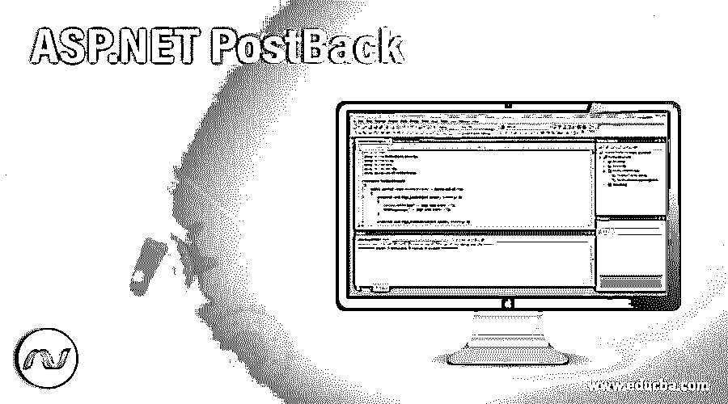

## ASP.NET 回发简介

回发是软件行业中常见的定义过程之一，其中服务器接收来自 web 应用程序的回发响应，并将通常的信息返回给浏览器，以在屏幕上显示或呈现给最终用户，假设是 web 应用程序；有一个屏幕，用户需要在浏览器中提供用户名和密码，然后这些值将发送到服务器进行验证，然后服务器端代码将执行逻辑并返回到 web 浏览器进行显示。在本主题中，我们将学习 ASP.NET 回发。

### 句法

ASP.net 回发可用于这种情况，在这种情况下，一些关键或安全任务无法从客户端浏览器处理；在这种情况下，我们需要服务器站点的关注，而回发实际上就进入了画面。如果一个网页中有多个 web 控件，则该 web 控制器必须定义自己的自动回发。ASP.net 有自己的自动回发配置，可以在 JavaScript 函数中定义。当调用特定的 Java 脚本函数时，它将自动推送回发，这意味着将所需的数据发送到相应的 web 服务器。

<small>网页开发、编程语言、软件测试&其他</small>

``

这个 JavaScript 函数主要在需要回发的时候触发，这个方法设置目标 URL 的值，需要 post 参数经过那个事件，然后提交相应的表单。

隐藏字段实际上也是保存一个网页的多个数据所必需的。例如，下面是两个主要用于回发和设置 javascript 值的字段。

`<input type="hidden" name="evenArgsField" id="evenArgsField" value="" />
<input type="hidden" name="targetField" id="targetField” value="" />`

此 doPostBack 方法通常由 ASP.net 应用程序自动创建；开发人员不需要手动创建这个方法。通过使用上述 javascript 方法作为中介，ASP.net web 应用程序可以很容易地将一个客户端程序与服务器端程序进行通信。

每个 ASP.net 网页通常都遵循一个特定的生命周期，如下所示:

*   从客户端浏览器调用 javascript doPostBack 函数，并将客户端浏览器页面提交给服务器端进行进一步处理。
*   ASP.net 在内部运行 ASPX 代码并重新生成页面。
*   然后，ASP.net ASPX 代码从隐藏字段值中读取所需信息或特定状态信息，执行相应的所需任务，并更新特定控件。
*   ASP.net 然后调用页面的加载过程。
*   则已经为变更事件触发了适当的或合适的控制。
*   在触发相应的 even 控制器后，页面将根据回发值进行填充。
*   最后，页面事件的卸载被触发。
*   现在创建一个新的页面，它已经被发送到客户端用于最终的演示。

### 实现 ASP.NET 回发的示例

可以有多个呈现 ASP.net 回发应用程序的示例。通过生成一个跟踪事件的应用程序来理解这一点的最好例子之一。该应用程序基于其适当的配置给出了触发事件的视图。

事件触发器应用程序通过调用一个特定的事件触发器来确保用户从屏幕上添加的任何数据，该特定的逻辑被写入相应的 ASPX 点网络类的日志方法中。所以现在，当他们向列表中添加多个数据时，每次它都返回并作为回发响应显示到屏幕上。所以现在，如果我们放置一些额外的单选按钮来捕获这些回发响应，它将在事件结束时出现，以正确理解这个回发在. net web 应用程序中实际上是如何工作的。

*   在 visual studio 中创建一个项目，用于创建事件跟踪器应用程序。

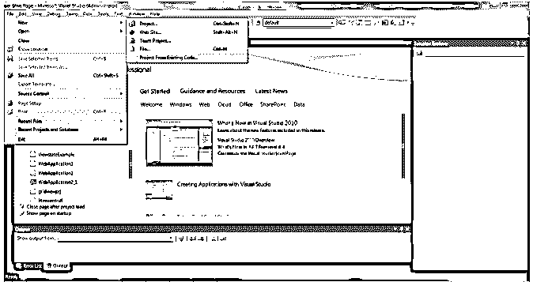

*   选择合适的点网版本进行进一步处理。

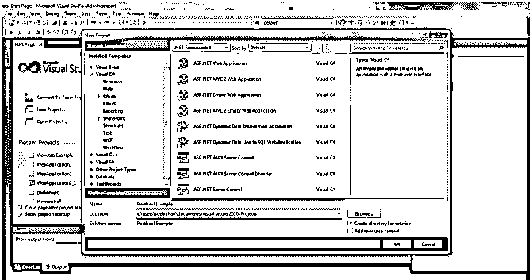

*   创建特定项目以映射特定对象。

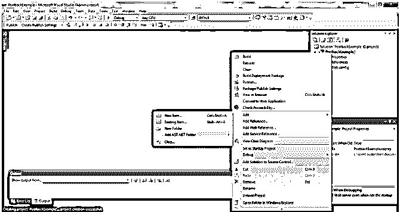

*   选择需要模板以便在 ASP.net 应用程序中进一步处理。

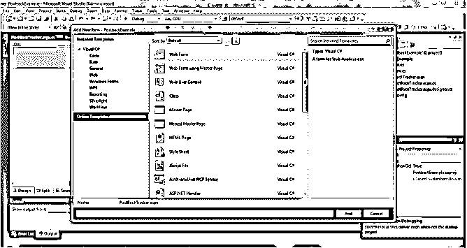

*   选择特定的文本框，以预期的方式设计页面。

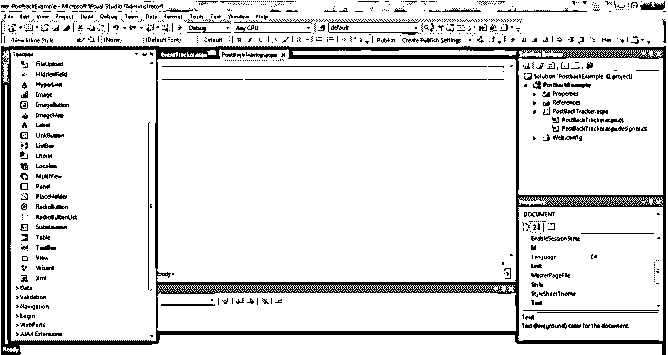

*   设计页面创建多选复选框以显示仪表板。

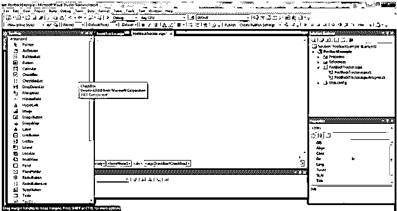

*   从 visual studio 工具控制仪表板设计预览的事件触发器。

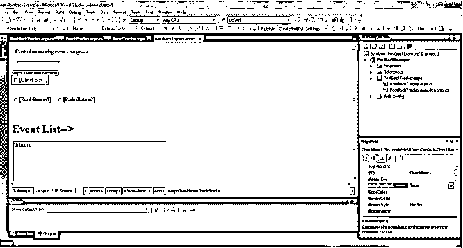

*   创建用于设计页面的特定单选按钮。

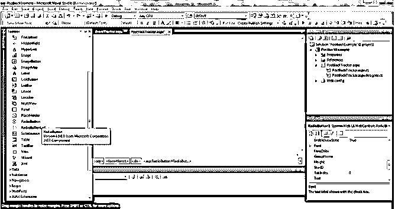

*   定义单选按钮单个事件处理程序类。

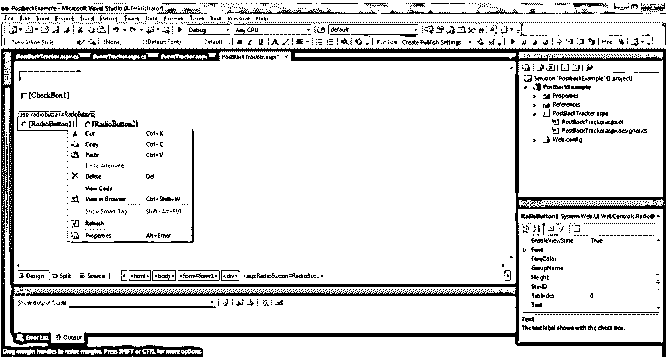

*   事件触发应用程序的设计已完成。

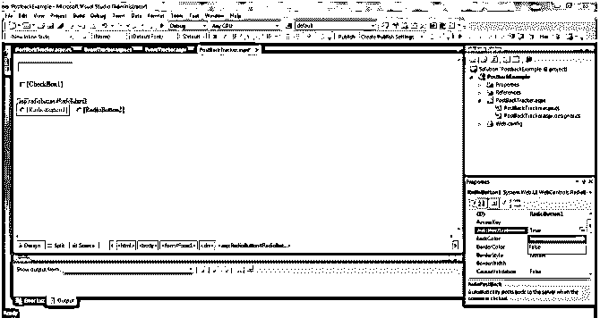

*   创建一个编辑框并定义相应的任务。

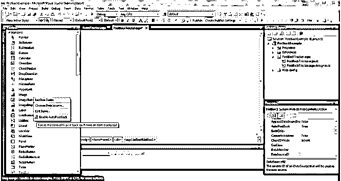

*   完成事件触发应用程序的设计后自动生成的 HTML 代码。

`<%@ Page Language="C#" AutoEventWireup="true" CodeFile="ETracker.aspx.cs" Inherits="ETracker" %>
<head>
<title>Event Tracker</title>
</head>
<body>
<form id="formE" >

<h1>Monitoring the control for every change event:</h1>
<asp:TextBox ID="txt1" runat="server" AutoPostBack="true" OnTextChanged="ControlChange" />
 
<asp:CheckBox ID="chk1" runat="server" AutoPostBack="true" OnCheckedChanged="ControlChange"/>
 
<asp:RadioButton ID="opt11" runat="server" GroupName="Example"
AutoPostBack="true" OnCheckedChanged="ControlChange"/>
<asp:RadioButton ID="opt21" runat="server" GroupName="Example"
AutoPostBack="true" OnCheckedChanged="ControlChange"/>
<h1>Require expected Events: </h1>
<asp:ListBox ID="listE" runat="server" Width="380px"
Height="160px" /> 
 

</form>
</body>
</html>`

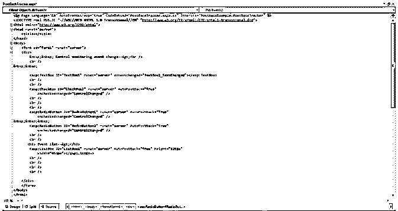

*   对应于 ASPX 代码库中用于处理这些事件的主要控制变更方法。

`protected void ControlChange(Object sender, EventArgs e)
{
string controlName = ((Control)sender).ID;
Log(controlName + " Triggered");
}
private void Log(string entry)
{
listE.Items.Add(entry);
listE.SelectedIndex = listE.Items.Count - 1;
}
}`

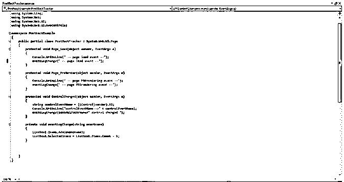

*   ASPX 类，其中已经编写了回发逻辑，用于根据事件触发器正确显示数据。

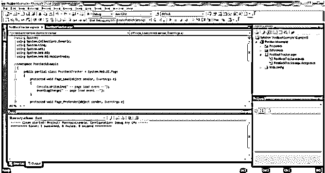

*   页面加载和预渲染事件的呈现。

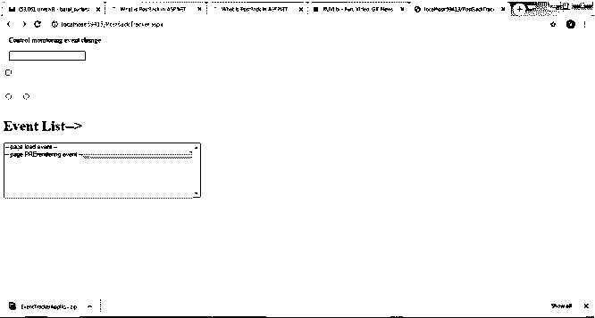

*   选中相应的复选框以进一步填充相应的事件。

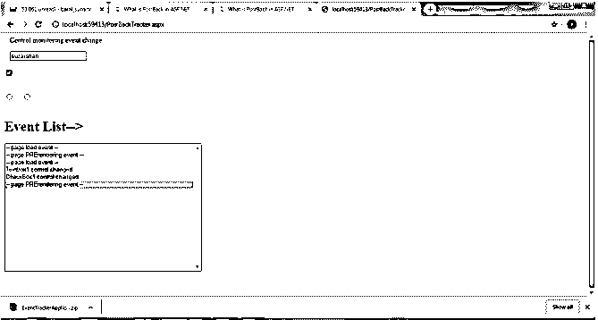

*   取消选中复选框将填充屏幕上的整个列表数据。

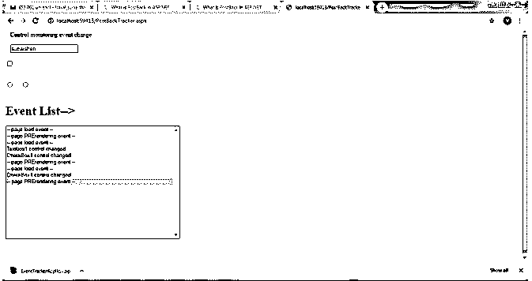

*   选择了 1 个 st 单选按钮，然后它在页面上填充相应的事件列表。

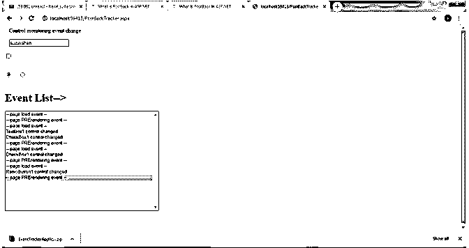

*   2 和单选按钮点击将被给予回发详细信息的列表，并在事件列表框中呈现。

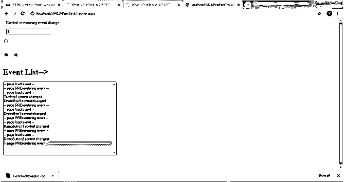

### 结论

ASP.net 回发是. net 服务器的默认特征。它必须要求客户端代码和服务器端代码之间的通信。客户端浏览器总是期望通过服务器端代码设计业务逻辑或数据库通信作为安全性。所以，任何关键的业务逻辑实现或数据库通信回发都是 ASP.net web 应用中必须要求的。

### 推荐文章

这是 ASP.NET 回发指南。这里我们讨论 ASP.NET 回发的实现以及语法和例子。您也可以看看以下文章，了解更多信息–

1.  [ASP.NET 版本](https://www.educba.com/asp-dot-net-versions/)
2.  [ASP.NET 的计时器](https://www.educba.com/timer-in-asp-dot-net/)
3.  [ASP.NET 会话 ID](https://www.educba.com/asp-net-sessionid/)
4.  [ASP.NET 隐藏场](https://www.educba.com/asp-dot-net-hidden-field/)