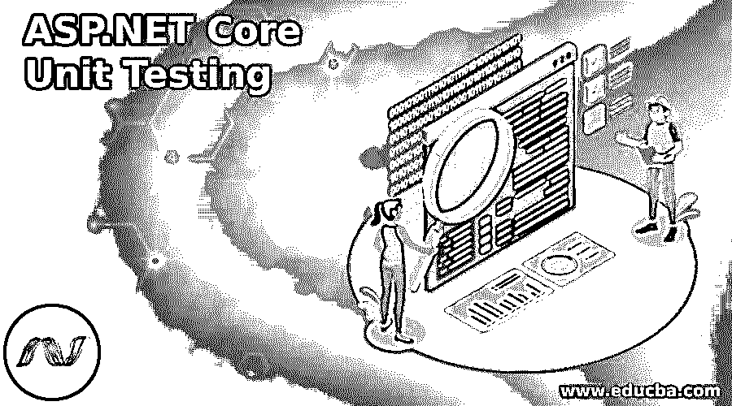
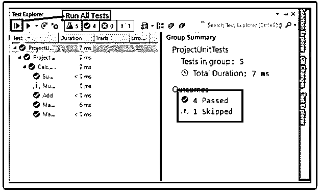

# ASP.NET 核心单元测试

> 原文：<https://www.educba.com/asp-dot-net-core-unit-testing/>

## ASP.NET 核心单元测试简介

ASP.NET 核心单元测试是应用程序的测试部分，我们需要对应用程序代码进行测试。名称单元本身定义了工作单元，所以它是我们代码中的一个单一方法测试。单元测试基本上涉及应用程序的测试部分，与它的依赖项和基础设施相隔离。单元测试控制器逻辑将只测试单个方法或动作的内容，而不是框架或依赖项的行为。

### 什么是 ASP.NET 核心单元测试？

单元测试是指对孤立的或单个独立单元中的组件进行精确测试的软件测试。这种单元测试将提高代码的质量，并且它还有助于在开发过程的初始阶段识别各种问题。命名单元本身定义了工作单元，所以要测试的软件的最小组件是我们代码中的单一测试方法。

<small>网页开发、编程语言、软件测试&其他</small>

### 我们应该如何编写单元测试用例？

基本上，单元测试是我们可以编写来测试我们的应用程序代码的代码；测试项目将需要对应用程序项目的依赖来进行测试。单元测试涉及到应用程序的测试部分，我们需要对应用程序代码编写测试。单元测试的控制器逻辑将只测试单个方法或动作的内容，而不测试框架的行为或方法的依赖性。

最新的一个叫做 xUnit.net，一个开源的单元测试工具，一个面向社区的工具。NET 框架。有各种各样的测试工具。NET 框架，但 xUnit.net 是流行的一个。xUnit 提供一组测试方法的属性，帮助编写代码来测试单元和组件；这些属性如下所示，

**事实**–它是我们希望一个方法成为单元测试的一部分的属性，并且它在测试执行期间必须用这些属性来修饰。

**Theory**–在这个属性中，如果我们想要将参数发送给测试方法，我们需要使用这个属性，它执行方法并提供参数来测试数据。

**inline data**–该属性提供测试数据的参数；它与理论属性一起使用。

在编写单元测试用例时，它应该易于维护并且组织良好；这是为单一功能编写测试的最佳方式。主要是单元测试，它不应该依赖于任何其他能够以我们需要的任何顺序运行我们的单元测试的单元测试。我们需要为我们编写的每一个单元测试遵循命名测试惯例。在单元测试中，我们需要遵循以下这些东西:

*   通过看到测试名称本身，单元测试应该是清楚的；没有人应该花时间去识别测试是什么，单元测试应该是可读的。
*   测试代码应该与生产代码相同；我们只需要对我们的测试进行微小的修改；它不应该影响我们所有的测试，单元测试必须是可维护的。
*   单元测试不应该花太多时间来执行，因为没有人喜欢长时间等待测试执行。因此，单元测试应该很快。
*   最重要的是，在不访问任何数据库或任何外部系统的情况下，执行测试不应该有任何依赖性。单元测试要求在完全隔离的情况下运行。
*   最终的测试必须给我们充分的保证；我们能够在错误出现在生产之前就发现它们。因此，单元测试必须给出可靠的测试。

### 创建 ASP.NET 核心单元测试

要创建 ASP.NET 核心 Web API 应用程序项目，让我们看看为计算器服务应用程序实现的示例，添加用于计算器操作的名为 ICalculator Service 的接口，并在服务文件夹中创建名为 CalculatorService 的具体类。

**icacalculatorservice . cs**

`public interface ICalculatorService
{
double Add_Calc(double val_1, double val_2);
double Subtract_Calc(double val_1, double val_2);
double Multiply_Calc(double val_1, double val_2);
double Divide_Calc(double val_1, double val_2);
}`

**CalculatorService.cs**

`public class CalculatorService : ICalculatorService
{
public double Add_Calc(double val_1, double val_2)
{
return (val_1 + val_2);
}
public double Divide_Calc (double val_1, double val_2)
{
if (val_2 == 0)
{
throw new DivideByZeroException("val_2 not be zero");
}
return (val_1 / val_2);
}
public double Multiply_Calc (double val_1, double val_2)
{
return (val_1 * val_2);
}
public double Subtract_Calc (double val_1, double val_2)
{
return (val_1 - val_2);
}
}`

let 将在 ConfigureService()方法的 startup.cs 文件中为 ICalculatorService 注册。

`public void ConfigureServices(IServiceCollection services)
{
//remaining code
services.AddTransient<ICalculatorService, CalculatorService>();
}`

要创建名为 CalculatorController 的控制器，让我们看看下面的代码。

**计算器控制器. cs**

`[Route("api/[controller]")] [ApiController] public class CalculatorController : ControllerBase
{
private ICalculatorService _calculatorService = null;
public CalculatorController(ICalculatorService calculatorServices)
{
_calculatorService = calculatorServices;
}
[HttpPost] [Route("Add")] public double Add_Calc(double val_1, double val_2)
{
return _calculatorService.Add(val_1, val_2);
}
[HttpPost] [Route("Divide")] public double Divide_Calc(double val_1, double val_2)
{
return _calculatorService.Divide(val_1, val_2);
}
[HttpPost] [Route("Multiply")] public double Multiply_Calc(double val_1, double val_2)
{
return _calculatorService.Multiply(val_1, val_2);
}
[HttpPost] [Route("Subtract")] public double Subtract_Calc(double val_1, double val_2)
{
return _calculatorService.Subtract(val_1, val_2);
}
}`

上面的代码是 API 项目应用程序的简单设置，现在将通过应用它来查看对该应用程序的单元测试。

### ASP.NET 核心单元测试 API 测试项目

让我们通过创建测试项目来创建 xUnit 项目；这是 xUnit，它是一个开源的单元测试工具，一个面向社区的工具。NET 框架。有各种各样的测试工具。NET 框架，但 xUnit.net 是流行的一个。xUnit 通过编写代码来测试单元和组件，为测试方法提供了一组属性。

在同一个解决方案中，创建 xUnit 项目，一旦创建；看起来，如下图所示，

这里的测试部分基本上由三个逻辑部分组成，

**安排**——为将要进行的测试做准备，例如用于预期结果测试的数据。

**Act**–用于调用 arrange 中准备好的被测方法，返回准确的结果。

**断言**–为了与实际和预期的结果进行比较，我们需要决定测试是通过还是失败。

**计算器控制器测试** **。cs**

`public class CalculatorControllerTest
{
private CalculatorService _unitTesting = null;
public CalculatorControllerTest()
{
if (_unitTesting == null)
{
_unitTesting = new CalculatorService();
}
}
[Fact] public void Add_Test()
{
//here is the arrange logic
double val_1 = 5;
double val_2 = 3;
double expected_result = 8;
//here is the act logic
var actual_result = _unitTesting.Add(a, b);
//here is the assert logic
Assert.Equal(expected_result, actual_result, 0);
}
}`

在带有[Fact]属性的 Add_Test()中，我们简单看一下上面的代码，它使测试运行器的一部分，Assert。Equal 用于将预期结果与精确结果进行比较，以确认测试是否成功。就像其他操作一样。

当执行测试时，“测试浏览器”喜欢，如下所示，测试像这样通过。

### 结论

本文解释了 ASP.NET 核心单元测试；在这个测试中，我们已经为上述应用程序创建了各种验证和逻辑测试。我希望这篇文章能帮助你理解创建单元测试过程。

### 推荐文章

这是 ASP.NET 核心单元测试指南。这里我们讨论 ASP.NET 核心单元测试；我们在这个测试中创建了各种验证测试。您也可以看看以下文章，了解更多信息–

1.  [ASP.NET 的数据集](https://www.educba.com/dataset-in-asp-dot-net/)
2.  [ASP.NET 网络控件](https://www.educba.com/asp-net-web-controls/)
3.  [Asp.net 的 global . asax](https://www.educba.com/global-dot-asax-in-asp-dot-net/)
4.  [ASP.NET 更新面板](https://www.educba.com/asp-dot-net-updatepanel/)