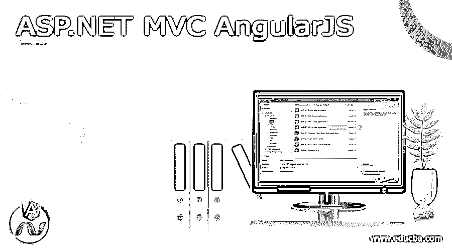
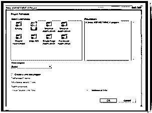
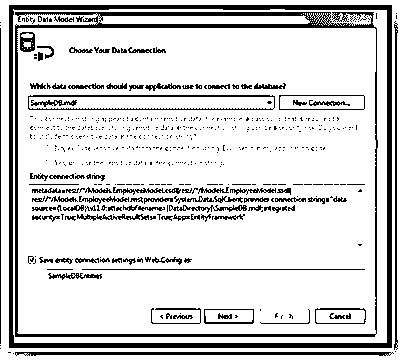
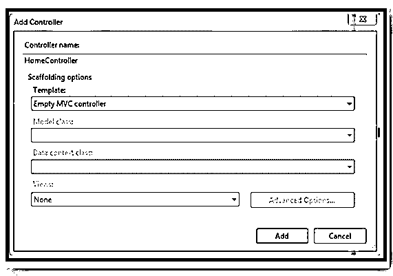
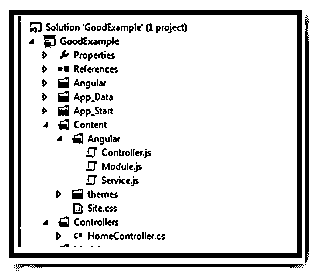
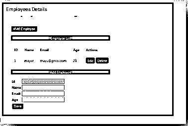

# ASP.NET MVC 安圭拉

> 原文：<https://www.educba.com/asp-net-mvc-angularjs/>

## ASP.NET MVC AngularJS 简介

ASP.NET MVC AngularJS 是前端 JavaScript，它是用于构建动态 web 应用程序的结构化 MVC 框架。MVC 框架让你使用 HTML 作为模板语言，并允许扩展 HTML 语法以清晰的方式与应用程序组件进行交流。AngularJS 让开发人员以 MVC 方式编写客户端应用程序。

### 安古拉吉斯的 ASP.NET MVC 是什么？

AngularJS 是定义动态 Web 应用程序的结构框架。通过使用 AngularJS，我们可以构建单页面应用程序。它还提供了 HTML 页面中的数据绑定功能，AngularJS 的代码是可测试的单元。通过使用 AngularJS 数据绑定和依赖注入，我们可以消除多余的编码。

<small>网页开发、编程语言、软件测试&其他</small>

### 如何用 AngularJS 使用 ASP.NET MVC？

利用 ASP.NET MVC 和 AngularJS 兼容 MVC 的模式，有这么多的项目，它工作得更好，因为你的 MVC 服务器端代码提供了 Angular 客户端调用的 JSON 结果。此外，我们可以利用 MVC 控制器来为应用程序创建 HTML Razor 视图。它提供了许多特性，如授权、错误处理、重定向等等。

### 用 AngularJS 建立 ASP.NET MVC

要用 AngularJS 设置 ASP.NET MVC，通过 NuGet 的包在项目中包含 Angular，我们可以从 Angular 网站下载。要将 AngularJS 包安装到项目应用程序中，请执行以下步骤:

从打开软件包管理器控制台

查看其他窗口软件包管理器控制台，然后使用以下代码安装 AngularJS 软件包。

`PM> Install-Package AngularJS`

在 AngularJS 中，我们必须为 AngularJS 路线安装一个单独的包，它不会与 AngularJS 一起出现，我们必须单独安装它。使用下面的命令安装 AngularJS 包，

PM >安装–打包 AngularJS。途径

### 创建 ASP.NET MVC 应用程序

要创建新的 MVC 项目，请选择“文件”“新建”“项目”,选择 MVC Web 应用程序并为项目指定合适的名称。

要选择基本的 ASP.NET 项目模板，

#### 步骤 1:在 MVC 应用程序中创建模型

在 MVC 项目中，我们有数据库记录的模型，所以我们将使用实体框架创建模型，让我们用模式创建雇员表，

然后通过使用模型文件夹结构中的 EF 来包含新的实体数据模型，从下拉列表中选择创建的数据库名称。一旦创建了它，我们就有了雇员的模型类。

#### 步骤 2:在 MVC 中创建控制器

要添加一个新的控制器并将其命名为 HomeController，

在 HomeController 中添加如下方法

*   get all()-该方法用于返回所有员工使用的 JSON 方法
*   getEmployeeBy _ No()–该方法用于根据员工的 ID 号返回特定员工的详细信息
*   add employee()–该方法用于向数据库中添加新员工的详细信息。
*   delete employee()–此方法用于删除现有的员工详细信息
*   updata employee()–该方法更新现有的雇员详细信息。

然后为控制器添加视图，

在 Index()中只需右键单击它，然后单击并查看，这样索引。将创建 cshtml，

在 AngularJS 中将有以下指令:

*   ng-click–它允许表示单击元素时的自定义行为。
*   ng-controller——它将控制器类附加到视图
*   ng-Repeat——它实例化集合中每个项目的模板。每个模板实例都有自己的作用域，比如给定的循环变量设置为当前集合，而$index 设置为项索引或键。
*   ng-model——他们的职责是将视图绑定到模型中，而其他指令如 textarea、input 或 selecting 需求。

**代码解释**

现在设计一个表格来接受用户在 CRUD 页面上的输入。将以下 HTML 添加到 index.cshtml

让我们看看代码解释，最初只需查看 CRUD 中接受用户输入的设计表，然后包括如下代码:

Index.cshtml
`

<link rel="stylesheet" href="http://maxcdn.bootstrapcdn.com/bootstrap/3.3.5/css/bootstrap.min.css">

<h1> Employee Details</h1>
 
<input type="button" class="btnAdd" value=" Add Employee" ng-click="AddEmployeeDiv()" />

Employee List

<table cellpadding="12" class="table table-bordered table-hover">
<tr>
<td><b>ID</b></td>
<td><b>Name</b></td>
<td><b>Email</b></td>
<td><b>Age</b></td>
<td><b>Actions</b></td>
</tr>
<tr ng-repeat="employee in employees">
<td>
{{employee.Id}}
</td>
<td>
{{employee.name}}
</td>
<td>
{{employee.email}}
</td>
<td>
{{employee.Age}}
</td>
<td>
Edit
Delete
</td>
</tr>
</table>

{{Action}} Employee

<table>
<tr>
<td><b>Id</b></td>
<td>
<input type="text" disabled="disabled" ng-model="employeeId" />
</td>
</tr>
<tr>
<td><b>Name</b></td>
<td>
<input type="text" ng-model="employeeName" />
</td>
</tr>
<tr>
<td><b>Email</b></td>
<td>
<input type="text" ng-model="employeeEmail" />
</td>
</tr>
<tr>
<td><b>Age</b></td>
<td>
<input type="text" ng-model="employeeAge" />
</td>
</tr>
<tr>
<td colspan="2">
<input type="button" class="btnAdd" value="Save" ng-click="AddUpdateEmployee()" />
</td>
</tr>
</table>

`

然后对 AngularJS MVC 编码进行编码

准备好模型视图和控制器来编码 AngularJS，并创建如下所示的 JavaScript 文件，

service . js
controller . js

*   #### Modeule.js

在角度上。用于配置$injector 的模块。模块是应用程序各个部分的容器，

#### 服务网

文件 Service.js 用于通过使用 http 调用服务器端代码。这个 Service.js 文件只是我们创建的 AngularJS 服务，称为 myservice。为了调用 HomeController 来插入、删除和更新相同的函数，我们在 Service.js 中创建了三个函数。

getEmployees()
添加雇员
更新雇员
删除雇员

`app.service("myService", function ($http) {
//to gets the entire Employee details
this.getEmployees = function () {
debugger;
return $http.get("Home/GetAll");
};
// to get the Employee detail by using employee Id
this.getEmployee = function (employeeID) {
var response = $http({
method: "post",
url: "Home/getEmployeeByNo",
params: {
id: JSON.stringify(employeeID)
}
});
return response;
}
// to Update Employee details
this.updateEmp = function (employee) {
var response = $http({
method: "post",
url: "Home/UpdateEmployee",
data: JSON.stringify(employee),
dataType: "json"
});
return response;
}
// to Add Employee details
this.AddEmp = function (employee) {
var response = $http({
method: "post",
url: "Home/AddEmployee",
data: JSON.stringify(employee),
dataType: "json"
});
return response;
}
//to Delete Employee details
this.DeleteEmp = function (employeeId) {
var response = $http({
method: "post",
url: "Home/DeleteEmployee",
params: {
employeeId: JSON.stringify(employeeId)
}
});
return response;
}`

**Controller.js**

在这里，我们创建了一个新的控制器，命名为 myCntrl，用于调用 controller.js 中 myservice 的方法

`app.controller("myCntrl", function ($scope, myService) {
$scope.divEmployee = false;
GetAllEmployee();
//getting all the records
function GetAllEmployee() {
debugger;
var getData = myService.getEmployees();
debugger;
getData.then(function (emp) {
$scope.employees = emp.data;
},function () {
alert('Error in getting records');
});
}
$scope.editEmployee = function (employee) {
debugger;
var getData = myService.getEmployee(employee.Id);
getData.then(function (emp) {
$scope.employee = emp.data;
$scope.employeeId = employee.Id;
$scope.employeeName = employee.name;
$scope.employeeEmail = employee.email;
$scope.employeeAge = employee.Age;
$scope.Action = "Update";
$scope.divEmployee = true;
},
function () {
alert('Error in getting records');
});
}
$scope.AddUpdateEmployee = function ()
{
debugger;
var Employee = {
Name: $scope.employeeName,
Email: $scope.employeeEmail,
Age: $scope.employeeAge
};
var getAction = $scope.Action;
if (getAction == "Update") {
Employee.Id = $scope.employeeId;
var getData = myService.updateEmp(Employee);
getData.then(function (msg) {
GetAllEmployee();
alert(msg.data);
$scope.divEmployee = false;
}, function () {
alert('Error in updating record');
});
} else {
var getData = myService.AddEmp(Employee);
getData.then(function (msg) {
GetAllEmployee();
alert(msg.data);
$scope.divEmployee = false;
}, function () {
alert('Error in adding record');
});
}
}
$scope.AddEmployeeDiv=function()
{
ClearFields();
$scope.Action = "Add";
$scope.divEmployee = true;
}
$scope.deleteEmployee = function (employee)
{
var getData = myService.DeleteEmp(employee.Id);
getData.then(function (msg) {
GetAllEmployee();
alert('Employee Deleted');
},function(){
alert('Error in Deleting Record');
});
}
function ClearFields() {
$scope.employeeId = "";
$scope.employeeName = "";
$scope.employeeEmail = "";
$scope.employeeAge = "";
}
});`

**呼叫 AngularJS**

`Finally we have to make a call on AngularJS, so we calling AngularJS in Layout.cshtml page
<!DOCTYPE html>
<html ng-app="myApp">
<head>
<meta charset="utf-8" />
<meta name="viewport" content="width=device-width" />
<title>@ViewBag.Title</title>

@Styles.Render("~/Content/css")

</head>
<body>
@RenderBody()
@Scripts.Render("~/bundles/jquery")
@RenderSection("scripts", required: false)
</body>
</html>`

一旦通过添加员工的详细信息进行编码，数据将被插入并显示如下:

### 结论

在本文中，我们学习了用 AngularJS 创建 MVC 应用程序。希望文章能帮助你理解。

### 推荐文章

这是一个 ASP.NET MVC 安古拉 JS 指南。在这里我们讨论定义，什么是 ASP.NET MVC 与 AngularJS，如何使用 ASP.NET MVC 与 AngularJS，代码实现的例子。您也可以看看以下文章，了解更多信息–

1.  [ASP.NET 核心 JWT](https://www.educba.com/asp-dot-net-core-jwt/)
2.  [ASP.NET 核心会议](https://www.educba.com/asp-dot-net-core-session/)
3.  [ASP.NET 的数据集](https://www.educba.com/dataset-in-asp-dot-net/)
4.  [JasperReports 备选方案](https://www.educba.com/jasperreports-alternative/)