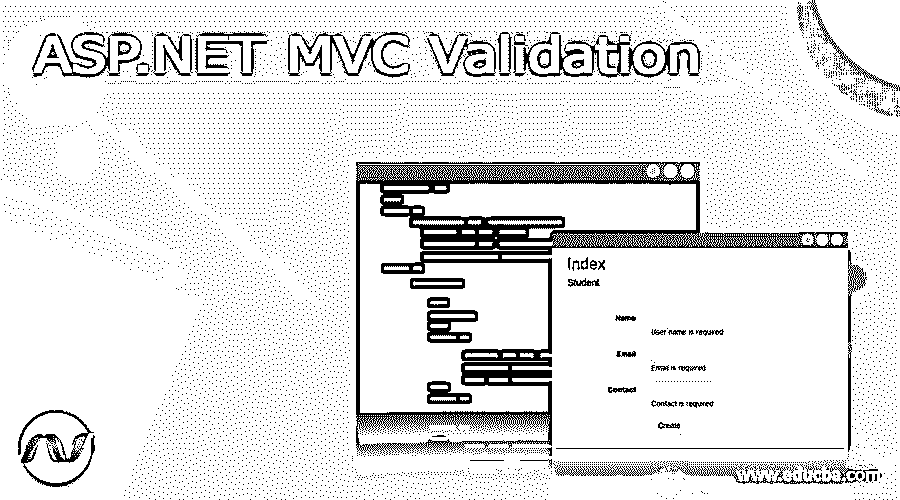
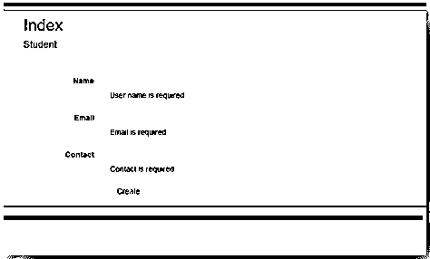

# ASP.NET MVC 验证

> 原文：<https://www.educba.com/asp-net-mvc-validation/>

## ASP.NET MVC 验证简介

ASP.NET MVC 验证是重要的方面；验证是 MVC 中必不可少的东西，它用来检查用户的输入是否有效。在 ASP.NET，MVC 提供了一套易于使用的验证方法，它还向用户显示错误信息，以便于理解。

### 使用属性 ASP.NET MVC 验证

在 ASP.NET MVC 验证中，将会有一个模型验证过程，用于检查给定的用户输入是否适合模型绑定，并且还会有一个错误消息显示。最初，它检查是否进行了有效的输入，在检查用户输入时，它检查合适的数据以通知用户无效数据，并通过显示消息来帮助输入具有预期形式的有效数据。在 ASP.NET 的 MVC 验证中会有各种各样的属性，让我们看看 MVC 验证中可用的属性，

<small>网页开发、编程语言、软件测试&其他</small>

在 ASP.NET MVC 模型验证中有不同类型的属性可用，该模型用于构建客户端验证，让我们看几个应用于属性模型的验证属性，示例如下。

必填–该属性用于设置必填字段。例如[Required(error message = " Required User first name ")]·DataType——该属性用于设置数据的类型
·string length——该属性用于设置字符限制。例如[StringLength(20，MinimumLength = 4，ErrorMessage = "必须是 4 个字符长")]Range(min，max)-该属性用于设置最大和最小数字
. Compare-该属性用于比较两个相同名称的属性，它主要用于确认密码。例如
[Compare ("ConfirmPassword "，ErrorMessage = "确认密码和密码必须相同")]public string Password { get；设置；}
·regular expression——该属性用于指定主要用于邮件地址的模式匹配。比如
【正则表达式(@"\w+([-+。]\w+)*@\w+([-。]\w+)*\。\w+([-。]\ w+)*))]公共字符串 E-mail _ ID { get；设置；}
·自定义验证——该属性用于程序员自己对模型属性的逻辑验证。

让我们看一个编程示例，

员工模型类

`using System;
using System.Collections.Generic;
using System.ComponentModel.DataAnnotations;
using System.Linq;
using System.Web;
using ValidationAttribute_Sample.Validation;
namespace Mvc_ValidationAttribute
{
public class Employee_Model
{
public int User_Id { get; set; }
[Required(ErrorMessage = "Name is must")] public string UserName { get; set; }
[Required(ErrorMessage = "Designation is must")] public string Position { get; set; }
[Required(ErrorMessage = "Office name must")] public string Office { get; set; }
[Required(ErrorMessage = "Hired-Date is must")] [Display(Name = "Hire Date")] [DisplayFormat(DataFormatString = "{0:d}", ApplyFormatInEditMode = true)] [CustomHireDate(ErrorMessage = "Date should be less than or equal to Today's Date")] public DateTime HireDate { get; set; }
[Required(ErrorMessage = "Salary is must")] public int Salary { get; set; }
}
}`

让我们来看一个自定义验证代码，只需右键单击该项目，包括新文件夹，并给出合适的名称，添加带有 HireDate_Customer 的类，并包括以下代码。

租用日期的自定义验证码

`using System;
using System.Collections.Generic;
using System.ComponentModel.DataAnnotations;
using System.Linq;
using System.Web;
using Mvc_CustomValidation_Demo.CustomValidation;
namespace Mvc_CustomValidation
{
public class HireDate_CustomValidation : ValidationAttribute
{
public override bool IsValid(object value)
{
DateTime dateTime = Convert.ToDateTime(value);
return dateTime <= DateTime.Now;
}
}
}`

### ASP.NET MVC 验证模型

模型验证是 MVC ASP.NET 中的一个过程，它用于检查指定的用户输入对于模型绑定是否准确，并且还会显示一个错误消息。在开始时，它检查输入的数据是否有效，在检查用户输入时，它检查合适的数据以通知用户无效数据，并且它还通过显示消息来帮助输入具有预期形式的有效数据。

**例子**

在这个验证模型中，让我们看一个示例程序，它在注释的帮助下验证用户输入。添加名为 StudentController 的控制器，然后添加 StudentModel 类。

**Student_Controller.cs**

`using System;
using System.Collections.Generic;
using System.Linq;
using System.Web;
using System.Web.Mvc;
namespace Mvc_Validations_App.Controllers
{
public class StudentController : Controller
{
// GET: Students
public ActionResult Index()
{
return View();
}
}
}`

**学生 _ 模型 _ 班级. cs**

`using System;
using System.Collections.Generic;
using System.ComponentModel.DataAnnotations;
using System.Linq;
using System.Web;
using MvcCustomValidationAttribute_Demo.CustomValidation;
namespace MvcValidationAttribute
{
public class Student
{
public int ID { get; set; }
[Required(ErrorMessage ="User Name is required")] [MaxLength(12)] public string Name { get; set; }
[Required(ErrorMessage ="Email is required")] [EmailAddress(ErrorMessage = "Please enter valid Email Address")] public string Email { get; set; }
[Required(ErrorMessage = "Contact is required")] [DataType(DataType.PhoneNumber)] [RegularExpression(@"^\(?([0-9]{3})\)?[-. ]?([0-9]{3})[-. ]?([0-9]{4})$", ErrorMessage = "Invalid Phone number")] public string Contact { get; set; }
}
}`

**Index.cshtml(查看页面)**

`@model MvcApplicationDemo.Models.Student
@{
ViewBag.Title = "Index";
}
<h2>Index</h2>
@using (Html.BeginForm())
{
@Html.AntiForgeryToken()

<h4>Student</h4>

@Html.ValidationSummary(true, "", new { @class = "text-danger" })

@Html.LabelFor(model => model.Name, htmlAttributes: new { @class = "control-label col-md-2" })

@Html.EditorFor(model => model.Name, new { htmlAttributes = new { @class = "form-control" } })
@Html.ValidationMessageFor(model => model.Name, "", new { @class = "text-danger" })

@Html.LabelFor(model => model.Email, htmlAttributes: new { @class = "control-label col-md-2" })

@Html.EditorFor(model => model.Email, new { htmlAttributes = new { @class = "form-control" } })
@Html.ValidationMessageFor(model => model.Email, "", new { @class = "text-danger" })

@Html.LabelFor(model => model.Contact, htmlAttributes: new { @class = "control-label col-md-2" })

@Html.EditorFor(model => model.Contact, new { htmlAttributes = new { @class = "form-control" } })
@Html.ValidationMessageFor(model => model.Contact, "", new { @class = "text-danger" })

<input type="submit" value="Create" class="btn btn-default" />

}

@Html.ActionLink("Back to List", "Index")

@section Scripts {
@Scripts.Render("~/bundles/jqueryval")
}`

让我们看看如下所示的输出

在这个验证表单中，我们可以看到它验证了表单字段，如果输入了任何无效数据，将会显示错误消息。

### 结论

在本文中，我们已经了解了 ASP.NET MVC 验证以及它们与模型验证的各种属性。在 MVC 验证模型中，数据完整性需要验证，以确保输入的用户数据有效。希望文章对理解有帮助。

### 推荐文章

这是 ASP.NET MVC 验证的指南。在这里，我们讨论的介绍，属性，ASP.NET MVC 验证模型的例子与代码实现。您也可以看看以下文章，了解更多信息–

1.  [ASP.NET 核心实体框架](https://www.educba.com/asp-dot-net-core-entity-framework/)
2.  [ASP.NET 核心 JWT](https://www.educba.com/asp-dot-net-core-jwt/)
3.  [ASP.NET 核心会议](https://www.educba.com/asp-dot-net-core-session/)
4.  [ASP.NET 的数据集](https://www.educba.com/dataset-in-asp-dot-net/)