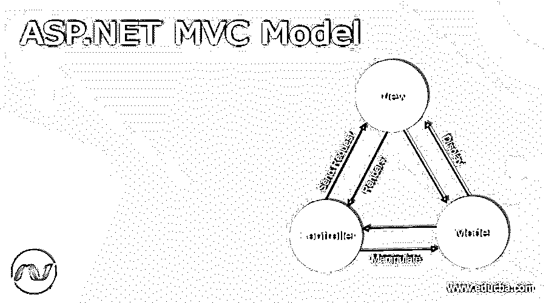
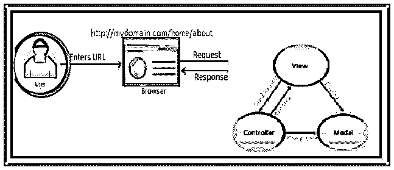
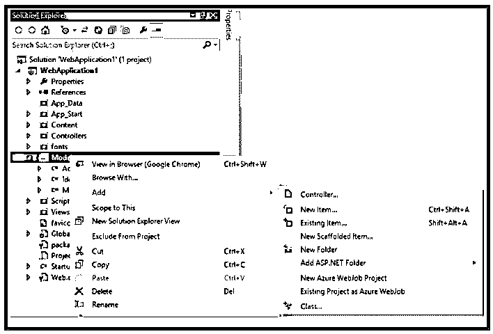
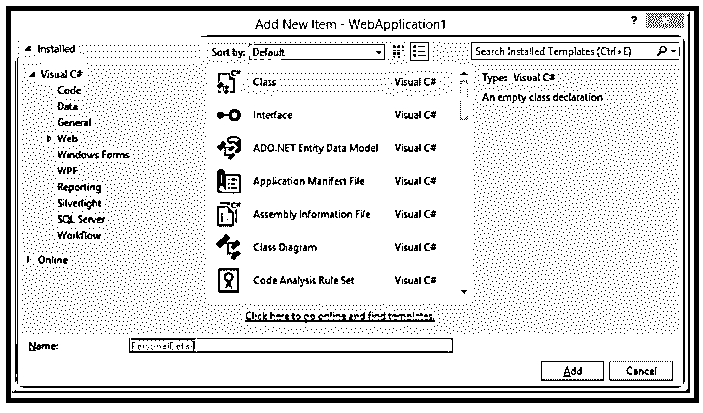
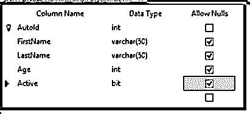
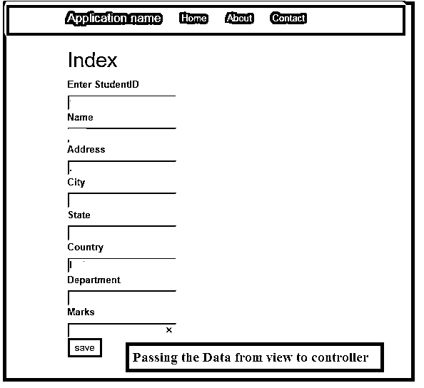

# ASP.NET MVC 模式

> 原文：<https://www.educba.com/asp-dot-net-mvc-model/>




## ASP.NET MVC 模式介绍

ASP.NET MVC 模型是包含应用程序业务逻辑的类。模型代表数据的形状，也称为用于实现应用程序逻辑的对象。控制器与模型交互，访问执行逻辑的数据，并将数据传递给视图。

### ASP.NET MVC 模式概述

ASP.NET MVC 是一个轻量级的、高度可测试的框架，它集成了 ASP.NET 的一些特性，比如基于成员身份的认证、母版页等等。ASP.NET MVC 代表模型、视图和控制器。MVC 将应用程序分成三个部分:模型、视图和控制器。ASP.NET MVC 模型代表了数据的形状；它指的是用于实现逻辑应用程序的对象。该类定义并描述用于存储从数据库中检索的数据的模型和对象。模型中最重要的是它代表了数据。

<small>网页开发、编程语言、软件测试&其他</small>




ASP.NET 模型是应用程序实体，它通常包含与数据库字段、验证属性和其他逻辑相对应的属性。

### 如何创建 ASP.NET MVC 模型类？

ASP.NET MVC 模型是包含应用程序业务逻辑的类。它代表数据的形状，也称为用于实现应用程序逻辑的对象。让我们如下创建模型类，

一旦创建了新的 MVC 项目解决方案，右键单击模型文件夹并添加一个新的类 Addà Class，如下所示。




一旦添加了新的类，给模型起一个合适的名字，然后点击 add。




为了创建模型，这对应于数据库表，

模型名 PersonDetails.cs，数据库表名为 PersonalDetail 让我们看看下面所示的数据库表，




模型类如下所示，

```
using System;
using System.Collections.Generic;
using System.Linq;
using System.Web;
using System.ComponentModel.DataAnnotations;
using System.ComponentModel.DataAnnotations.Schema;
namespace SampleApp.Models
{
public class PersonalDetailModel
{
[Key] [DatabaseGenerated(System.ComponentModel.DataAnnotations.Schema.DatabaseGeneratedOption.Identity)]
public int AutoId { get; set; }
[StringLength(20, MinimumLength = 4, ErrorMessage = "It should be 4-Character Long")]
public string FirstName { get; set; }
[Required(ErrorMessage = "Required Last-Name")]
public string LastName { get; set; }
public int Age { get; set; }
[Display(Name = "Is Active?")]
public bool Active { get; set; }
}
}
```

### 定制 ASP.NET MVC 模型

在定制模型中，让我们看看如何通过绑定 MVC 视图中的模型来将模型信息传递给控制器。见下图动作方法如下:

让我们看一个简单的动作。

```
public ActionResult Index()
{
return View();
}
```

为了定制模型，我们为学生提供了一个示例模型类，如下所示:

```
public class Student_ViewModel
{
public int Student_Id { get; set; }
public string Name { get; set; }
public string Address { get; set; }
public string City { get; set; }
public string State { get; set; }
public string Country { get; set; }
public string Department { get; set; }
public int Marks { get; set; }
}
```

index 视图类似于 Index.cshtml，它绑定了模型类，并包含带有 submit 按钮的用户界面视图，该视图将数据存储在数据库中。

```
@model CustomModelBinding.Models.Student_ViewModel
@{
ViewBag.Title = "Index";
}
<h2>Index</h2>
@using (Html.BeginForm())
{
@Html.EditorForModel("Student_ViewModel")
<input type="submit" value="save" />
}
@section Scripts {
@Scripts.Render("~/bundles/jqueryval")
}
```




在这种形式下，我们可以通过各种方法传递数据；一旦提交了按钮，我们就调用索引操作。下面我们来看看模型定制的各种方式:

#### 表单集合

通过使用表单集合，我们可以使用这种方法直接传递模型数据，

```
[HttpPost]
public ActionResult Index(FormCollection frm)
{
Var Student_Id = studentformcollection["Student_Id"].ToString();
var student_Name = studentformcollection["Name"].ToString();
var student_Address = studentformcollection["Address"].ToString();
var student_City = studentformcollection["City"].ToString();
var student_State = studentformcollection["State"].ToString();
var student_Country = studentformcollection["Country"].ToString();
var student_Department = studentformcollection["Department"].ToString();
var student_Marks = studentformcollection["Marks"].ToString();
return View();
}
```

#### 查询字符串

查询字符串只是将数据传递到 URL 中；这是通过 querystring 请求数据来获取数据的另一种方法，

```
var student_Name = Request.QueryString["StudentName"].ToString();
```

#### 直接传递参数

在这个方法中，我们将参数直接传递给方法；我们通过直接给出参数来直接传递数据，

```
[HttpPost]
public ActionResult Index(int Student_Id, string Name, string Address, string City, string State, string Country, string Department, int Marks)
{
return View();
}
```

### ASP.NET MVC 模式的属性

在这个属性 MVC 模型中，有各种各样的可用属性，

*   **Key—**用于将属性标记为主键。
*   **database generated–**用于将属性的值标记为从数据库中生成。
*   **Scaffold column—**用于设置视图是否作为脚手架查看

例如:

```
[ScaffoldColumn(false)]
public int User_ID { get; set; }
```

*   **显示(名称)–**用于呈现属性的用户友好标签。
*   **列(名称)–**用于指定数据库表中的各个字段来映射该属性。
*   **NotMapped-** 用于将属性设置为 Mapped，例如:

```
[NotMapped]
public DateTime? JoinDate { get; set; }
```

*   **Table(Name)–**用于应用类级别，将模型映射到各种数据库表名
*   **foreign key(property name)–**它指定外键属性名，该属性名将主键的一个表链接到外键。另一个验证属性被构建来在客户端的视图中验证自身；让我们看看下面应用于属性模式的 ASP.NET MVC 模型验证属性。
*   **必填—**用于设置必填字段。

```
[Required(ErrorMessage = "Required Last-Name")]·
```

*   **字符串长度****–**用于设置字符的限制。

```
[StringLength(20, MinimumLength = 4, ErrorMessage = "It should be 4-Character Long")]·
```

*   **数据类型—**用于设置数据的类型
*   **范围(最小，最大)–**用于设置最小和最大数量
*   **比较****–**用于比较同名的两个属性，主要用于确认密码。例如:

```
[Compare("ConfirmPassword", ErrorMessage = "must be same")]
public string Password { get; set; }
```

*   **ReqularExpression—**用于指定模式，主要用于邮件地址。

**例如:**

```
[RegularExpression(@"\w+([-+.']\w+)*@\w+([-.]\w+)*\.\w+([-.]\w+)*")]
public string Email_Address { get; set; }
```

*   **自定义验证—**用于将自定义逻辑验证编码到模型属性中。

### 结论

在这篇文章中，我解释了 ASP.NET MVC 模型解释了应用程序中使用的各种属性。希望文章能帮助你理解。

### 推荐文章

这是一个 ASP.NET MVC 模式的指南。这里我们讨论定义，概述，以及如何创建 ASP.NET MVC 模型类和不同的属性。您也可以阅读以下文章，了解更多信息——

1.  [ASP.NET 核心会议](https://www.educba.com/asp-dot-net-core-session/)
2.  [ASP.NET 核心 JWT](https://www.educba.com/asp-dot-net-core-jwt/)
3.  [ASP.NET 更新面板](https://www.educba.com/asp-dot-net-updatepanel/)
4.  [ASP.NET 视图状态](https://www.educba.com/asp-dot-net-viewstate/)