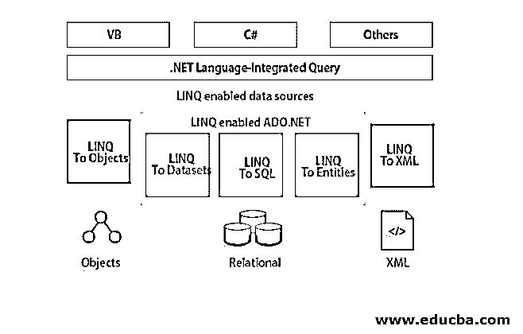

# 什么是 LINQ？

> 原文：<https://www.educba.com/what-is-linq/>


## 语言集成查询简介

语言集成查询为操作数据提出了一种紧凑的、有意义的和可理解的语法。语言集成查询是微软的一种编程策略和模型，它有效地将形式查询能力包含到微软中。NET 编程语言。它需要特定语言扩展的存在。语言集成查询的实际价值在于它能够将相同的查询应用于数据集、SQL 数据库、内存中的对象数组以及各种类型的数据。

LINQ 缩写为语言综合查询。它建立于。NET 3.5 和 Visual Studio 2008，LINQ 的主要概念是提供设施。NET 语言(如 C#、VB.NET 等。)来构建查询以从数据源获取数据。用 C#和 VB.NET 从各种格式和[源中检索数据](https://www.educba.com/c-vs-vb-net/)其统一的查询语法。它消除了数据库和编程语言之间的差异，因为它与 C#/VB 集成，并且还为各种类型的数据源提供了不同的查询接口。它允许在结果集上使用面向对象的方法；结果查询将结果作为对象返回。

<small>网页开发、编程语言、软件测试&其他</small>


SQL 和 LINQ 的区别在于，where(语言集成查询)是一种结构化查询语法，它内置了 VB.NET 和 C#来从各种类型的数据源中检索数据，这些数据源包括 MS SQL Server、ADO.Net 数据集、web 服务、集合、XML 文档和其他数据库。同样，SQL 是一种结构化查询语言，用于存储和检索数据库中的数据。

### 谅解

它由三层架构组成，其中上层具有语言扩展，最底层具有数据源，这些数据源是实现 IEnumerable <t>或 IQueryable <t>通用接口的通用对象。LINQ 建筑如下图所示。</t></t>




在 C#中，LINQ 出现在命名空间系统中。Linq。它定义了支持 LINQ 查询的各种类型的方法和类。在命名空间中，它由以下部分组成

*   可枚举类包含标准查询操作符，这些操作符作用于对象 execute IEnumerable <t>。</t>
*   Queryable 类包含标准查询操作符，这些操作符在对象上执行 IQueryable <t>。</t>

其中的核心组件是:

*   **使用系统。Linq:** 赋予类&接口来维护 Linq 查询
*   **使用系统。Collections.Generic :** (LINQ 到对象)允许用户构建强类型集合，以提供类型安全和性能
*   **使用系统。Data.Linq:** (LINQ 到 SQL)提供使用关系数据库的功能
*   **使用系统。XML.Linq:** (Linq 到 XML)通过 LINQ 提供了[使用 XML 文档](https://www.educba.com/what-is-xml/)的功能。
*   **使用系统。Data.Linq.Mapping:** 分配一个类作为与数据库连接的实体。

### LINQ 是如何让工作变得如此简单的？

当使用 LINQ 是如此容易，因为语言集成查询提供了一个语言集成和基于对象的方法来查询。通过使用语言集成查询，我们可以查询 XML、数据库以及集合。它会在编译时检查语法。在集成查询语言中，编写代码更快，因为开发时间也会自动减少。为了理解为什么我们应该使用语言集成查询，让我们看一些例子。假设您想从学生对象数组中定位年轻学生的列表。在 C# 2.0 之前，我们必须使用“for each”或“for”循环来遍历集合，以发现确切的对象。例如，编写代码列出 SAge 在 12 到 20 之间的学生数组中的所有学生对象。

#### 示例 1–使用 For 循环

**代码:**

```
class StudentDetails
{
public int SID { get; set; }
public String SName { get; set; }
public int SAge { get; set; }
}
class Program
{
static void Main(string[] args)
{
StudentDetails [] sArray = {
new StudentDetails () { SID = 1, SName = "Rio", SAge = 18 },
new StudentDetails () { SID = 2, SName = "Rock", SAge = 21 },
new StudentDetails () { SID = 3, SName = "Smith", SAge = 25 },
new StudentDetails () { SID = 4, SName = "Jack" , SAge = 20 },
new StudentDetails () { SID = 5, SName = "Remo" , SAge = 31 },
new StudentDetails () { SID = 6, SName = "Andre", SAge = 17 },
new StudentDetails () { SID = 7, SName = "Don",SAge = 19 },
};
StudentDetails [] students = new StudentDetails [10];
int i = 0;
foreach (StudentDetails std in sArray)
{
if (std.SAge > 12 && std.SAge < 20)
{
students[i] = std;
i++;
}
}
}
}
```

for 循环的使用很麻烦，在查找多个结果时不容易管理，而且不可读。因此，该团队继续使用 C# 3.0 中引入的下一版本，使用这种方法可以解决此类问题，因为语言集成查询是几种集合的查询元素的构建块，并且它通过单个语句获得结果。

#### 实施例 2

下面的例子解释了 lambda 表达式 LINQ 查询有助于从列表集合中找出特定的学生。

**代码:**

```
class ProgramLINQ
{
static void Main(string[] args)
{
StudentDetails [] sArray = {
new StudentDetails () { SID = 1, SName = "Rio", SAge = 18 },
new StudentDetails () { SID = 2, SName = "Rock", SAge = 21 },
new StudentDetails () { SID = 3, SName = "Smith", SAge = 25 },
new StudentDetails () { SID = 4, SName = "Jack" , SAge = 20 },
new StudentDetails () { SID = 5, SName = "Remo" , SAge = 31 },
new StudentDetails () { SID = 6, SName = "Andre", SAge = 17 },
new StudentDetails () { SID = 7, SName = "Don",SAge = 19 },
};
// to find young students in the list
StudentDetails [] tStudents = sArray.Where(s => s. SAge > 12 && s. SAge < 20).ToArray();
// to find first student whose name is Smith
StudentDetails f_Sname = sArray.Where(s => s. SName == "Smith ").FirstOrDefault();
// to find student whose StudentID is 5
StudentDetails f_SID = sArray.Where(s => s. SID == 5).FirstOrDefault();
}
}
```

因此，语言集成查询使代码得到额外的压缩和理解，它也可以用来查询几个数据源。

### LINQ 有什么用

*   知名语言
*   较少编码
*   可读代码
*   查询大量数据源的相同技术
*   查询的编译时保护
*   智能感知维护
*   确定数据

### 与 LINQ 合作

支持语言集成查询的数据源。LINQ 的类型简述如下。

*   LINQ 对物体
*   LINQ 到 XML(XLINQ)
*   linq to dataset
*   LINQ 到 SQL (DLINQ)
*   Linq 到实体

#### 1.LINQ 反对

对象的 LINQ 提供了对任何支持 IEnumerable <t>的 LINQ 查询的处理，用于访问内存中的数据集合和对象。Linq to Objects 中的返回变量将是 IEnumerable 类型<t>。</t></t>

#### 2.LINQ 到 XML (XLinq)

Linq 到 Xml 在名为 System.Xml.Linq 的名称空间中可用。为了查询 XML 数据源，我们使用 LINQ 到 XML。此外，Linq to XML 充分利用了。NET 框架的功能，如编译时检查、调试和强类型等等。当将 XML 文档加载到内存中时，文档修改和查询变得更加简单和容易。

#### 3.LINQ 到数据集

通过使用 ADO.NET 数据表和数据集维护查询的 LINQ 数据集。当从几个数据源整合数据时，我们将使用 LINQ 数据集进行查询。

#### 4.LINQ 到 SQL

LINQ 到 SQL 也叫 DLINQ，是语言集成查询的一部分；通过使用 LINQ 表达式，它允许查询 SQL Server 数据库中的[数据。](https://www.educba.com/database-in-sql/)

#### 5.LINQ 至实体

在 LINQ 中通过使用 C#来查询实体是一种简单易行的方法。查询是一个表达式，用于从数据存储中获取数据。通过使用 EF 6 中的 DBContext 或 EF 核心实体框架中的 DBContext，查询数据库就完成了。

### 优势

语言集成查询提供了大量的优势；下面给出了一些优点。

*   由于语法突出显示，它有助于在设计时找出错误。
*   它有助于更准确地编写查询。
*   在语言集成查询中，开发时间会减少，因为在语言集成查询中编写代码更快更容易。
*   它与 C#语言集成，因为它使调试变得容易。
*   由于查看两个表之间的关系更容易，并且使用多个连接创建查询花费的时间更少，所以它具有分层特性。
*   语言集成查询支持从一种数据类型转换到另一种数据类型的更简单的转换，如从 SQL 到 XML 数据的转换。
*   通过使用 LINQ，开发人员可以很容易地维护和理解，因为它的代码更具可读性。
*   在 LINQ，查询多个数据源将有统一的语法。
*   在编译时，LINQ 提供对象的类型检查。
*   它支持数据的整形，我们可以检索各种形状的数据。

### 我们为什么要用 LINQ？

让我们看看为什么开发语言集成查询或为什么我们使用 LINQ，有几点来定义我们为什么使用语言集成查询。

*   与 SQL 相比，LINQ 易于操作，是一种高级语言，面向对象性好。
*   构建 LINQ 背后的主要原则是，在 C# 3.0 之前的版本中，为了找到我们为每个 for 循环使用的特定对象，使用这些委托都有一个主要缺点，因为要找到一个对象，我们需要编写几行代码[和](https://www.educba.com/what-is-coding/)，这使得程序可读性更差，也更耗时。为了克服这些问题，引入了 LINQ，因为语言集成查询将在非常少的行中完成程序/编码，并且代码更加可读，一旦代码被标准化，我们可以在其他几个程序中使用相同的代码。
*   在运行时，它有助于找到错误，以便我们可以轻松地删除或纠正错误，并且它还提供了编译时检查。
*   LINQ 以一种有效的方式给我们提供了解决这类问题的新方向；此外，我们还可以使用语言集成查询与[集合和 C#数组](https://www.educba.com/c-sharp-array-vs-list/)。
*   它维护查询表达式、扩展方法、隐式类型变量、lambda 表达式、对象和集合。
*   在语言集成查询中，不需要学习各种类型的语言，因为不同的查询可以处理任何类型的数据库。它还支持任何类型的数据源，如对象、XML、实体、SQL 等等。

### 语言综合查询范围

它的创建是为了填补常规。NET，它提供了一种面向对象的方法和强类型方法。语言集成查询为修改和查询数据引入了一个简单易学的模型，它还支持包括 XML、内存数据结构和关系数据在内的数据源。集成了面向对象和关系方法的语言集成查询。这是一个强类型表达式。强类型表达式确保值在编译时和运行时是正确的类型，防止在编码时发现错误。

### 我们为什么需要 LINQ？

在去 LINQ 之前，有必要学习 SQL、C#和几个 API，它们结合在一起开发一个完整的应用程序。所以那些编程语言和数据源面临一些问题，编码也很困难。让我们看一个例子，在语言集成查询出现之前，程序员在查询数据时使用了几种技术。

**代码:**

```
SqlConnection conn= new SqlConnection(connString);
SqlConnection.Open();
System.Data.SqlClient.SqlCommand cmd=ne SqlCommand();
cmd.Connection = conn;
cmd.CommandText = "Select * from Employee";
return cmd.ExecuteReader (CommandBehavior.CloseConnection) ;
By using LINQ the above same query can be return in simple easy and readable form whereas the consuming time also very less.
Northwind db_ = new Northwind(@"C:\Data\Northwind.mdf");
var query_result = from e in db.Employee select e;
```

### 这项技术将如何帮助你的职业发展？

这是一个搜索引擎，有助于简化数据工作流程。这将有助于职业发展的良好导向。它支持整个团队轻松工作，减少返工，并保持项目在预定的时间和预算内。

### 结论

你已经很好地了解了 LINQ 如何不同于 ADO.NET，并在后者的基础上变得更好。此外，它有助于节省时间。最后，您已经了解了语言集成查询如何用于几种类型的数据源。在本文中，我们了解了语言集成查询的工作流程以及如何使用它。我希望这篇文章能帮到你。

### 推荐文章

这是一本关于什么是 LINQ 的指南？.在这里，我们将讨论它的定义、优点、用途以及示例程序和范围。您也可以浏览我们推荐的其他文章，了解更多信息——

1.  [MongoDB GUI 工具](https://www.educba.com/mongodb-gui-tools/)
2.  [Dropbox 是什么？](https://www.educba.com/what-is-dropbox/)
3.  [什么是 Laravel？](https://www.educba.com/what-is-laravel/)
4.  [什么是 C#中的 StringBuilder](https://www.educba.com/what-is-stringbuilder-in-c-sharp/)


