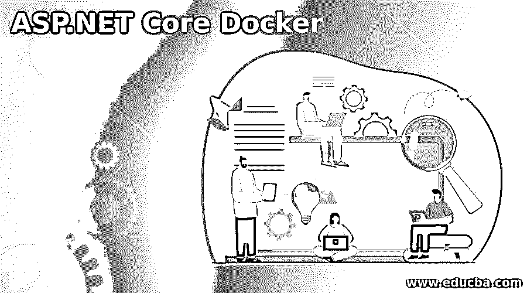
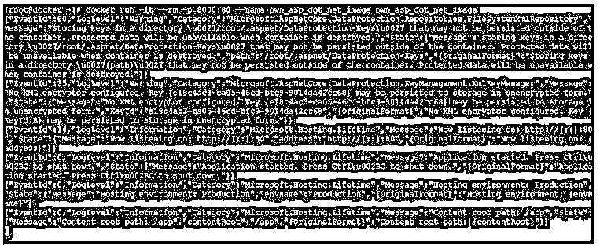
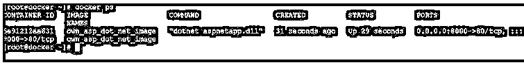
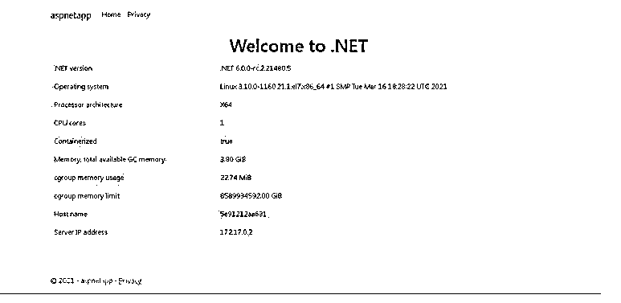

# ASP.NET 核心码头工人

> 原文：<https://www.educba.com/asp-dot-net-core-docker/>

## ASP.NET 核心码头简介

在网络技术中，我们有不同的技术来支持网络内容并在网络上交付任务。有不同的技术支持它，如 ASP.NET、react、JavaScript 等。根据需求或应用的需要，我们需要考虑哪种 web 技术适合这个项目，并相应地进行选择。例如，ASP.NET 是微软所有者的产品。如果我们需要将产品用于商业目的，那么我们需要获得 ASP.NET 产品许可证。但是，假设我们将部署或配置 ASP.NET 环境。在这种情况下，我们需要承担完整的环境责任，即管理整个环境、ASP.NET 环境的高可用性、数据冗余等。

为了避免这样的事情或者无缝地处理 ASP.NET 环境，我们需要在 docker 上部署 docker 环境。这将真正有助于管理整个 ASP.NET 环境。它将很容易适应 ASP.NET 的环境。它将使用硬件资源来管理 ASP.NET 环境，但会引用 Linux 进程 id。ASP.NET docker 环境独立于现有的硬件、库、配置等。与当前的硬件环境相比，docker 环境将独立工作。

<small>网页开发、编程语言、软件测试&其他</small>

### 如何创建 ASP.NET 核心码头？

ASP.NET 码头工人形象的创造是非常容易的。有不同的方法来创建它。根据需求或项目兼容性级别，我们需要确定如何构建 docker 映像。有不同的方法来构建 docker 映像。第一，可以考虑 docker hub 在这里，我们得到了不同的 ASP.NET 码头图片。根据兼容性，我们可以选择 Docker hub 存储库中可用的预定义图像。第二种方式，我们可以建立自己的形象。按照要求，我们需要定义我们需要选择哪个版本，不同类型的包，库等。按照必要的包，我们需要添加到 docker 基础映像。一旦必要的包被更新，那么我们需要提交 docker 映像。

在创建 docker 映像之前，我们需要理解基本的 docker 命令。

`[ DOCKER ] [ PULL ] [ INTERNAL OR EXTERNAL DOCKER IMAGE LOCATION ]`

或者

我们需要在基础映像的帮助下构建 ASP.NET docker 映像:

*   **DOCKER:** 我们可以在语法或者命令中使用 DOCKER 关键字。它将接受不同的参数，如拉、提交、图像位置等。根据所提供的输入，对接器将能够从内部或外部位置拉取或获取对接器图像，并保持拉取的对接器图像在当前或工作环境中可用。这里，不需要运行 bash 或 shell 作业。我们可以直接运行 docker 命令。它将在 Linux 环境下运行特定的进程。相同的进程 ID 将有助于运行或提供基本的 docker 环境。
*   **PULL:** 在 docker 环境中，我们可以使用相关或特定的关键字，即 PULL。这将有助于从外部或内部 docker 环境中采用 docker 映像。
*   **内部或外部 docker 映像位置:**我们需要提供 docker 映像路径，以便从内部或外部环境中提取 DOCKER 映像。

### 逐步 ASP.NET 核心码头工人

我们有不同的选择来建立 ASP.NET 码头工人的形象。根据需求，我们需要选择需要构建的 docker 映像的类型。我们在 docker hub 上提供了预定义的 Docker 图片。所以我们可以直接得到它并对它进行处理。如果我们需要建立我们自己的 ASP.NET 码头形象，那么我们也可以建立他们。但是在建立它之前，我们需要考虑它的先决条件。

请在下面找到 ASP.NET 的先决条件信息。

#### 1.操作系统支持

Windows 7 SP1 或更高版本、Windows 8.1、Windows 10 Ver 1607 或更高版本、Windows Server 2012 SP1(具有完整服务器/服务器核心)、Windows Server 2008 R2 SP1(具有完整服务器/服务器核心)、Windows Server 2012 SP1(具有完整服务器/服务器核心)、Red Hat Enterprise Linux 或 CentOS 7、Ubuntu 14.04、16.04、17、Windows Server 2012 R2(具有完整服务器/服务器核心、Windows Server 2016(具有 nano 服务器/完整服务器/服务器

#### 2.开发环境支持

*   微软 Visual Studio 2015 更新 3(最低)，2017 版最新(15.6.4)，2019，2022
*   .NET Framework:最低。NET 4.5.1 以上。NET 4.7
*   命令行(可选。命令行部署所必需的)
*   Visual Studio 代码(可选的文本编辑器)
*   SQL Server 2008 Express(可选)
*   .网络核心 3.1

#### 3.浏览器支持

*   最新版本的 Chrome
*   最新版本的火狐浏览器
*   最新版本的歌剧
*   13+版本的优势
*   11+版本的 IE
*   9+版本的 Safari
*   9+版本的 iOS
*   4.4+版本的 Android
*   带有 IE 11+版本的 Windows Mobile

我们需要安装相关的软件包，并按照上述信息创建 ASP.NET docker 镜像。

### ASP.NET 核心码头的例子

下面提到了不同的例子:

在 docker 上运行 ASP.NET 图像。

在 docker 环境中，我们能够运行 ASP.NET docker 映像。

**代码:**

`docker run -it --rm -p 8000:80 --name own_asp_dot_net_image own_asp_dot_net_image`

**说明:**

*   按照上面的命令，我们正在 Docker 平台上运行 ASP.NET 映像。

**输出:**

### ASP.NET 核心码头的应用

下面给出了提到的应用:

*   根据应用或项目需要，我们需要选择 ASP.NET 的核心组件。
*   运行 ASP.NET 映像时，我们需要确保组件在 docker 映像中可用。

### 结论

我们已经看到了“ASP。NET Core Docker ”,提供了正确的示例、解释和带有不同输出的命令。在 docker 上运行 ASP.NET 环境使用起来非常方便。如果我们需要迁移或升级 ASP.NET 环境，这将非常容易。

### 推荐文章

这是 ASP.NET 核心码头指南。在这里我们讨论一下入门，如何创建 ASP.NET 核心 docker？例子和应用。您也可以看看以下文章，了解更多信息–

1.  [在 ASP.NET 验证](https://www.educba.com/validation-in-asp-net/)
2.  [ASP.NET 安全](https://www.educba.com/asp-dot-net-security/)
3.  [ASP.NET 生命周期](https://www.educba.com/asp-dot-net-life-cycle/)
4.  [ASP.NET 网络控件](https://www.educba.com/asp-net-web-controls/)